==========================
 Pythonの現在とこれからと
==========================

Takanori Suzuki

<OSS X Users Meeting> #31 / 2021 Aug 25

今日話すこと 🗣
===============
* Pythonとは(5分)
* Pythonの旬なプロジェクト(5分)
* Python開発の歴史(5分)
* Python言語アップデート(10分)
* Pythonの未来(5分)

スクショ 📸 ツイート 🐦 👍
==========================
* ``#ossx`` / ``@takanory``

スライド 💻
===========
👉 `slides.takanory.net <https://slides.takanory.net>`_

最初に質問
==========

Python知ってる人🙋‍♂️
---------------------

Python使ったことある人🙋‍♀️
---------------------------

Python今使っている人🙋‍♂️
-------------------------

Who am I(お前誰よ) 👤
=====================
* 鈴木たかのり(`@takanory <https://twitter.com/takanory>`_)
* PyCon JP Association 副代表理事
* 株式会社BeProud 役員/Python Climber
* 好き：フェレット、🍺、LEGO／趣味：🎺、🧗

.. image:: /assets/images/sokidan-square.jpg

Pythonとは 🐍
==============

.. revealjs-break::

* 汎用のプログラミング言語

  * 動的型付け
* 1991年に0.9がリリース
* 最新バージョンは3.9.6
* Python 2系は2020年1月1日にEOL

読みやすい構文
--------------
* インデントが構文
* **PEP 8** というコーディング規約

  * https://www.python.org/dev/peps/pep-0008/

.. code-block:: python

   for num in range(1, 101):
       if num % 15 == 0:
           print('FizzBuzz')
       elif num % 5 == 0:
           print('Fizz')
       elif num % 3 == 0:
           print('Buzz')
       else:
           print(num)

後方互換性
----------
* 3.9で書いたプログラム→基本3.10で動く
* 利用するサードパーティライブラリ次第(後述)
* Python 2系→3系では後方互換性を犠牲に

  * 移行にかなりかかった

豊富な標準ライブラリ
--------------------
* 標準ライブラリでいろいろできる
* 「バッテリー同梱」とも言われる
* ただ多すぎて使われてなさそうなものも...
* https://docs.python.org/ja/3/library/

豊富なサードパーティライブラリ
--------------------------------
* PyPI(https://pypi.org/)からインストール

  * ``$ pip install パッケージ名``

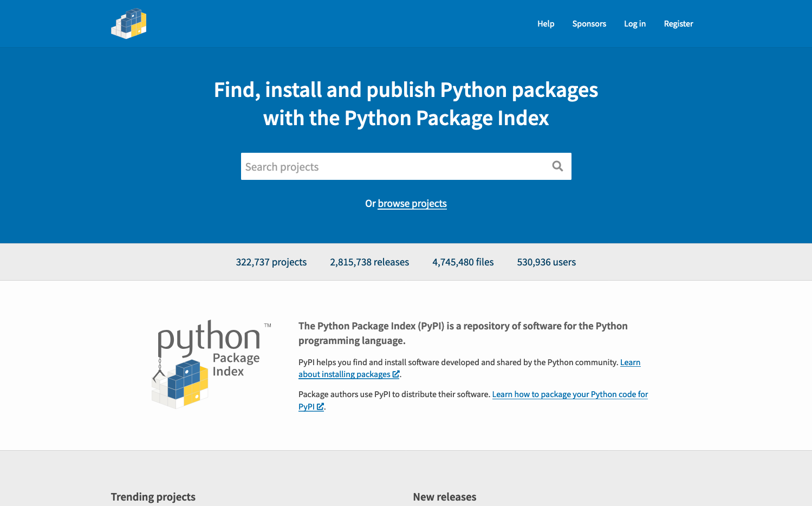

.. revealjs-break::

* Webフレームワーク、スクレイピング
* 行列計算、機械学習、深層学習
* コンピュータービジョン、画像処理
* データ分析、可視化
* などなど

.. revealjs-break::

* Awesome Python(https://awesome-python.com/)

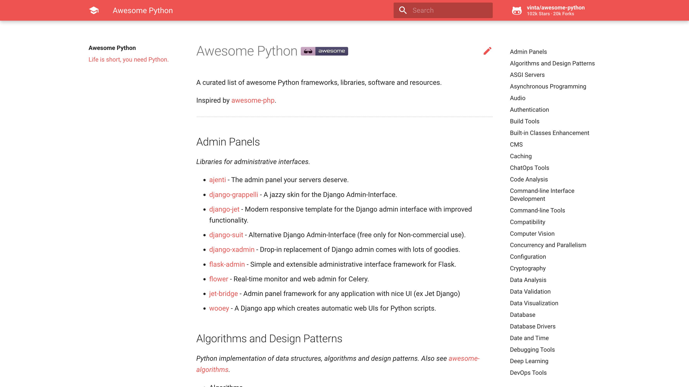

他のツールの組み込み言語
------------------------
* 3DCG

  * blender, Mayaなど
* ゲームエンジン

  * Unreal Engine

Pythonとは 🐍 - まとめ
----------------------
* 読みやすい構文
* 後方互換性を維持
* 豊富な標準ライブラリ、サードパーティ

Pythonの旬なプロジェクト 🔥
===========================
* 旬っぽいプロジェクトをいくつか紹介

FastAPI
-------
* API構築のための高速なWebフレームワーク
* URL: https://fastapi.tiangolo.com/ja/

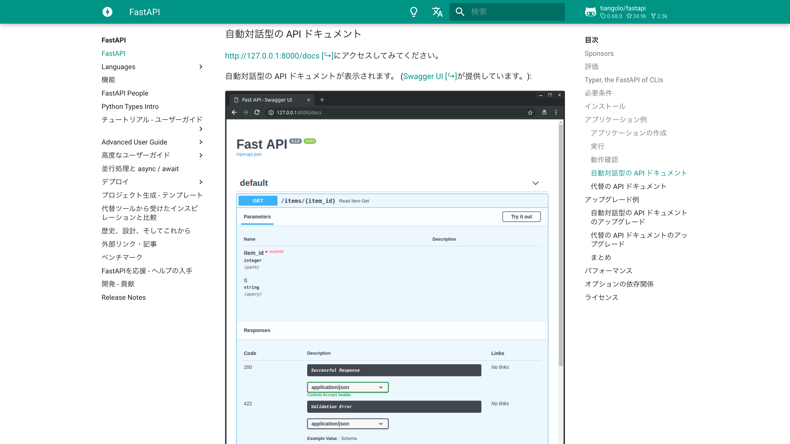

.. Pythonの標準である型ヒントに基づいてAPIを構築するための、モダンで、高速(高パフォーマンス)な、Web フレームワーク

JupyterLab
----------
* Webベースのプログラムの対話型実行環境
* https://jupyterlab.readthedocs.io/

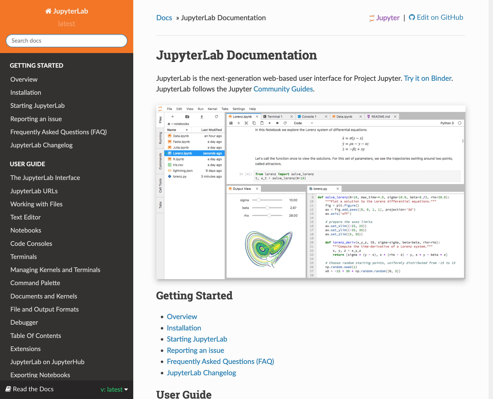

PyCaret
-------
* ローコードのMLライブラリ(AutoMLサポート)
* https://pycaret.org/

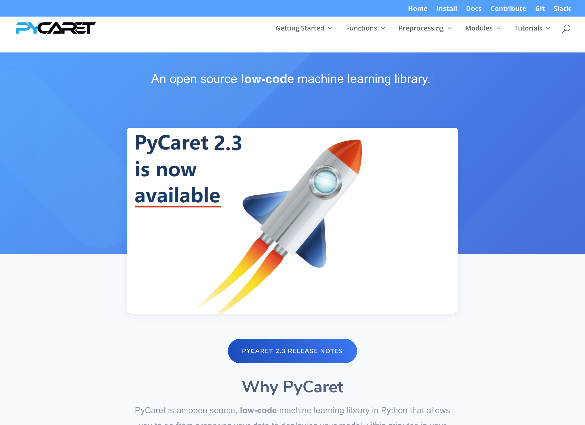

AWS CLI / Google Cloud SDK
--------------------------
* クラウドを管理するコマンド群
* https://aws.amazon.com/cli/
* https://cloud.google.com/sdk

Black
-----
* 妥協のないコードフォーマッター
* https://black.readthedocs.io/

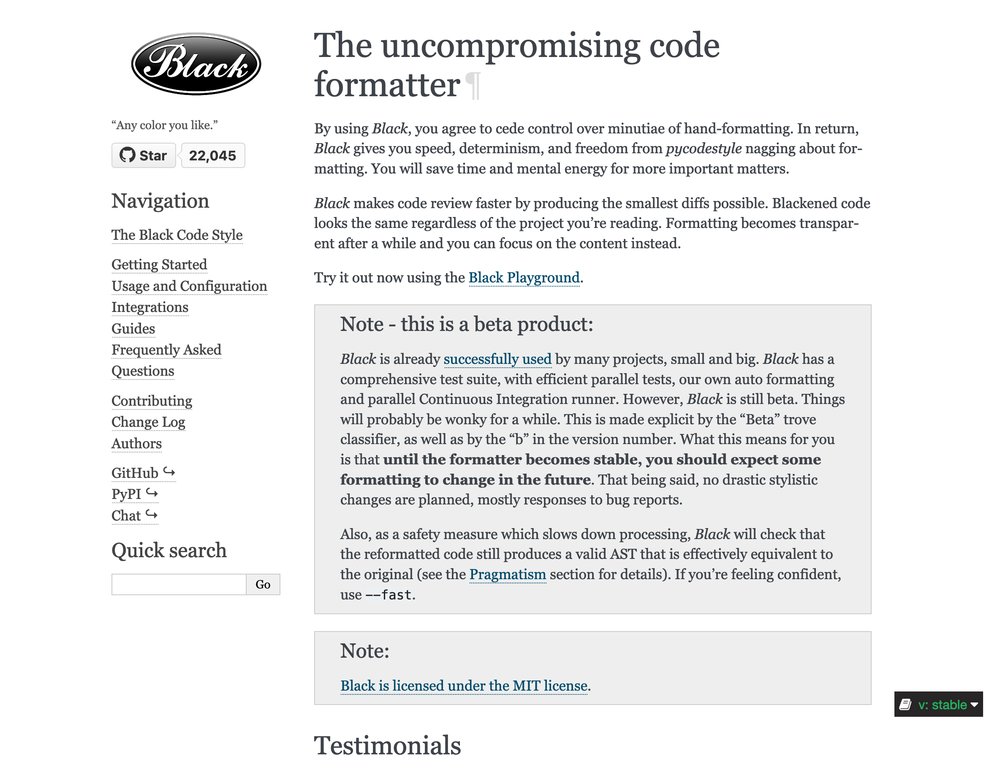

Poetry
------
* パッケージの依存関係の管理、構築
* https://python-poetry.org/

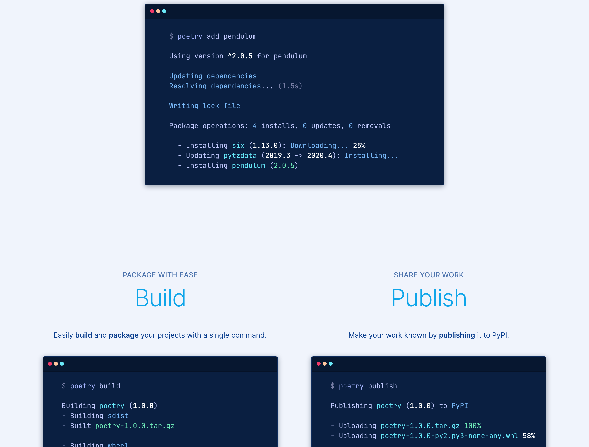

Pythonの旬なプロジェクト 🔥 - まとめ
------------------------------------
* 気になるものがあったら試してみて
* FastAPI
* JupyterLab
* PyCaret
* AWSCLI / Google Cloud SDK
* Black
* Poetry

Python開発の歴史 🕰
==================

Pythonの拡張はPEPで提案
-----------------------
* PEP: Python Enhancement Proposal
* 2000年頃から運用

  * PEPを書いて提案
  * メーリングリストで議論
  * 最後に採用/不採用を判断
* `PEP 1 -- PEP Purpose and Guidelines <https://www.python.org/dev/peps/pep-0001/>`_

BDFL: 優しい終身の独裁者
------------------------
* BDFLが採用不採用を最終決定

  * BDFL = Guido van Rossum
  * BDFL Delegateで他人に判断を委譲可能

BDFLの引退
----------
* セイウチ演算子ですごいもめたのがきっかけ?

  * `PEP 572 -- Assignment Expressions <https://www.python.org/dev/peps/pep-0572/>`_
* 2018年7月にBDFLを引退するというメールを送信

  * `[python-committers] Transfer of power <https://mail.python.org/pipermail/python-committers/2018-July/005664.html>`_

.. revealjs-break::

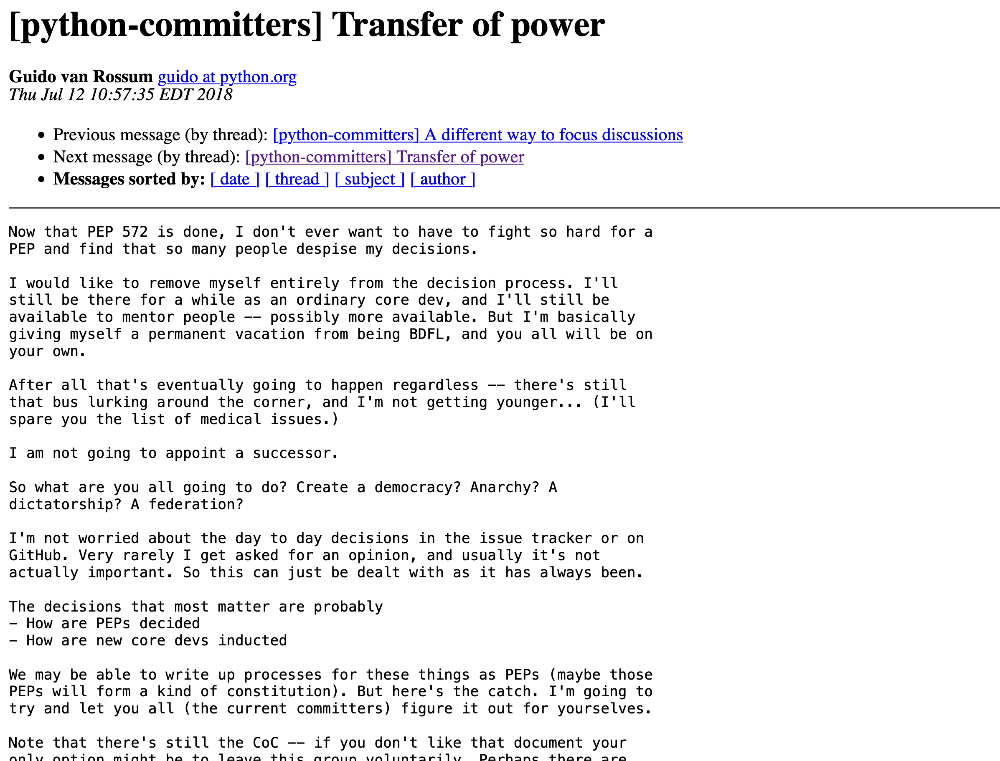

Pythonの新しい運営モデル
------------------------
* `PEP 8000 -- Python Language Governance Proposal Overview <https://www.python.org/dev/peps/pep-8000/>`_

  * 複数のガバナンスモデルが提案され投票
* `PEP 8016 -- The Steering Council Model <https://www.python.org/dev/peps/pep-8016/>`_

  * この案が採用された

The Steering Council Model
--------------------------
* 毎年5名のCouncilメンバーを投票で決める
* CouncilメンバーがPEPの採用不採用を決定
* 2019年はGuidoがいたが、2020以降は立候補していない
* 投票結果: `2019 <https://www.python.org/dev/peps/pep-8100/>`_, `2020 <https://www.python.org/dev/peps/pep-8101/>`_, `2021 <https://www.python.org/dev/peps/pep-8102/>`_

2021 Councilメンバー
--------------------
* C.Willing, T.Wouters, B.Cannon, P.Galindo Salgado, B.Warsaw

Python開発の歴史 🕰 - まとめ
---------------------------
* 2018年に大きく運営方針が変わった
* 今後も継続的に開発は続きそう
* Council Modelへの移行はいいタイミングだったかも

宣伝 📺
=======
* ここで休憩がてらコミュニティ活動の宣伝

PyCon JP
--------
* 国内最大のPythonイベント(`2021.pycon.jp <https://2021.pycon.jp/>`_)
* 2021年10月15日(金)、16日(土)

PyCon JP TV
-----------
* Pythonについて月1ライブ配信(`tv.pycon.jp <https://tv.pycon.jp/>`_)
* 次回は2021年9月3日(金)

.. image:: images/pyconjptv.png
   :width: 70%

Python Boot Camp
----------------
* 日本中で開催する初心者向けチュートリアル
* https://www.pycon.jp/support/bootcamp.html

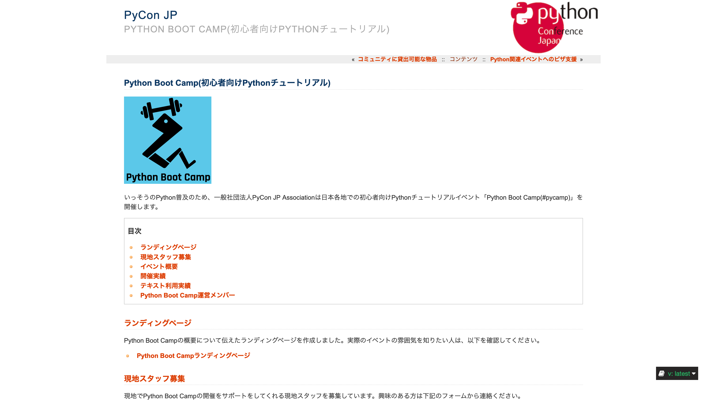

Python Charity Talks in Japan
-----------------------------
* 今回は地域コミュニティ祭り
* https://pyconjp.connpass.com/event/218154/
* 2021年9月11日(土)

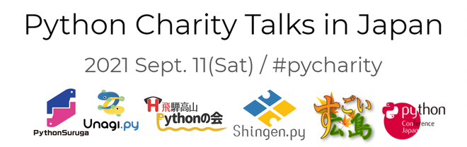

宣伝ここまで
------------
* 興味があるものに参加してみてください

Python言語アップデート 🆕
============================

.. revealjs-break::

* 現在はPython 3.9.6
* 2021年10月に3.10.0がリリース予定
* 今後は年1回マイナーバージョンが上がる

  * `PEP 602 -- Annual Release Cycle for Python <https://www.python.org/dev/peps/pep-0602/>`_
* 3.N.0リリースから5年間サポート

最近の主な新機能
----------------
* 3.6: フォーマット済み文字列リテラル
* 3.7: データクラス
* 3.8: 代入式
* 3.9: 辞書の和集合演算子

3.6: フォーマット済み文字列リテラル
-----------------------------------
* f-stringともいう
* ``f'{式}や{式:書式}'``

.. code-block:: python

   >>> name = 'たかのり'
   >>> power = 530000
   >>> f'{name}の戦闘力は{power:,}'  # f-string
   'たかのりの戦闘力は530,000'
   >>> '{}の戦闘力は{:,}'.format(name, power)  # それ以前

* `What's New In Python 3.6 <https://docs.python.org/ja/3.9/whatsnew/3.6.html>`_
* `2.4.3. フォーマット済み文字列リテラル <https://docs.python.org/ja/3.9/reference/lexical_analysis.html#f-strings>`_  

3.7: データクラス
-----------------
* ``@dataclass`` デコレータで作れる

.. code-block:: python

   @dataclass
   class Point:
       x: float
       y: float
       z: float = 0.0

   p = Point(1.5, 2.5)
   print(p)  # "Point(x=1.5, y=2.5, z=0.0)"

* `What's New In Python 3.7 <https://docs.python.org/ja/3.9/whatsnew/3.7.html>`_
* `dataclasses --- データクラス <https://docs.python.org/ja/3.9/library/dataclasses.html#module-dataclasses>`_

3.8: 代入式
-----------
* ``:=`` 演算子: 変数に値を入れて、その値を返す
* 別名「セイウチ演算子」

.. code-block:: python

   name = 'じゅげむじゅげむごこうのすりきれ'
   if (n := len(name)) > 10:
       print(f"名前が長すぎます({n}文字)")

   # それ以前
   if (len(name)) > 10:
       print(f"名前が長すぎます({len(name)}文字)")
    
* `What's New In Python 3.8 <https://docs.python.org/ja/3.9/whatsnew/3.8.html>`_

3.9: 辞書の和集合演算子
-----------------------
* 辞書のマージ(``|``)と更新(``|=``)演算子

.. code-block:: python

   >>> x = {"key1": "v1/x", "key2": "v2/x"}
   >>> y = {"key2": "v2/y", "key3": "v3/y"}
   >>> x | y
   {'key1': 'v1/x', 'key2': 'v2/y', 'key3': 'v3/y'}
   >>> y | x
   {'key2': 'v2/x', 'key3': 'v3/y', 'key1': 'v1/x'}
   >>> 
   >>> {**x, **y}  # それ以前
   {'key1': 'v1/x', 'key2': 'v2/y', 'key3': 'v3/y'}

* `What's New In Python 3.9 <https://docs.python.org/ja/3.9/whatsnew/3.9.html>`_
  
型ヒント
--------
* 動的型付け言語だが型ヒントが付けられる

  * Python 3.5から導入
  * `PEP 484 -- Type Hints <https://www.python.org/dev/peps/pep-0484/>`_
* `mypy <http://mypy-lang.org/>`_ などのツールで静的チェック
* ヒントなので実行時は評価されない

.. code-block:: python

   def greeting(name: str) -> str:
       # name: str で引数nameの型が文字列
       # -> str で返り値が文字列
       return 'Hello ' + name

型ヒント - なにが嬉しいの?
--------------------------
* 型安全なプログラムになる

  * 大規模プロジェクトなどで有効
* APIドキュメントに型情報が入る
* エディターが型ヒントをもとに教えてくれる

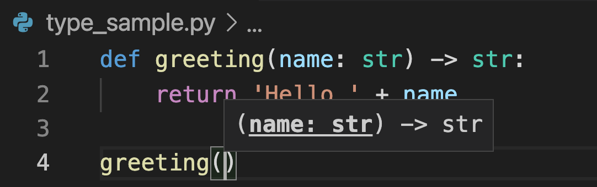
           
型ヒント - 発展中
-----------------
* 徐々に書き方が便利になってきている
* ``from __future__ import annotations`` で最新(3.10)の書き方ができる

.. code-block:: python  

   # Python 3.10からこう書ける
   def square(number: int | float) -> int | float:
       return number ** 2

   # それ以前
   from typing import Union

   def square(number: Union[int, float]) -> Union[int, float]:
       return number ** 2   

型ヒント - 参考資料
-------------------
* `Pythonではじめる今風な型プログラミング <https://speakerdeck.com/peacock0803sz/osc21do>`_

.. raw:: html

   <iframe width="560" height="315" src="https://www.youtube.com/embed/2sZ9U1iIscQ" title="YouTube video player" frameborder="0" allow="accelerometer; autoplay; clipboard-write; encrypted-media; gyroscope; picture-in-picture" allowfullscreen></iframe>

Python 3.10の主な新機能
-----------------------
* `What's New In Python 3.10 <https://docs.python.org/ja/3.10/whatsnew/3.10.html>`_

  * Better error messages
  * Structural Pattern Matching

Better error messages
---------------------
* エラーメッセージがわかりやすくなった

.. code-block:: python

   >>> if name = 'takanori':  # Python 3.9以前
     File "<stdin>", line 1
       if name = 'takanori':
               ^
   SyntaxError: invalid syntax

.. code-block:: python

   >>> if name = 'takanori':  # Python 3.10
     File "<stdin>", line 1
       if name = 'takanori':
          ^^^^^^^^^^^^^^^^^
   SyntaxError: invalid syntax. Maybe you meant '==' or ':=' instead of '='?

* もしかして '=' ではなく '==' や ':=' の意味では?

.. revealjs-break::

* IndentationErrorもわかりやすく

.. code-block:: python

   >>> for i in range(10):  # Python 3.9以前
   ... print(i)
     File "<stdin>", line 2
       print(i)
       ^
   IndentationError: expected an indented block
  
.. code-block:: python

   >>> for i in range(10):  # Python 3.10
   ... print(i)
     File "<stdin>", line 2
       print(i)
       ^
   IndentationError: expected an indented block after 'for' statement on line 1

* 1行目の 'for' 文のあとにインデントされたブロックが必要です

Structural Pattern Matching
---------------------------
* ``match`` 文と ``case`` 文でいずれかのパターンにマッチ

.. code-block:: python

   match subject:
       case <pattern_1>:
           <action_1>
       case <pattern_2>:
           <action_2>
       case <pattern_3>:
           <action_3>
       case _:
           <action_wildcard>

.. revealjs-break::

* シンプルなリテラルにマッチ

.. code-block:: python

   def http_error(status):
       match status:
           case 400:
               return "Bad request"
           case 401 | 403 | 404:  # or
               return "Not allowed"
           case 418:
               return "I'm a teapot"
           case _:  # ワイルドカード
               return "Something's wrong with the Internet"

.. revealjs-break::

* ``(x, y)`` のタプルの値でマッチ   

.. code-block:: python

   match point:
       case (0, 0):
           print("Origin")
       case (0, y):
           print(f"Y={y}")
       case (x, 0):
           print(f"X={x}")
       case (x, y):
           print(f"X={x}, Y={y}")
       case _:
           raise ValueError("Not a point")

Structural Pattern Matching - 参考情報
--------------------------------------
* `PEP 634 -- Specification <https://www.python.org/dev/peps/pep-0634/>`_
* `PEP 635 -- Motivation and Rationale <https://www.python.org/dev/peps/pep-0635/>`_
* `PEP 636 -- Tutorial <https://www.python.org/dev/peps/pep-0636/>`_
* `Python 3.10の新機能(その1） パターンマッチ <https://www.python.jp/news/wnpython310/index.html>`_  
* `PEP 634, 635, 636 を読んだよメモ <https://qiita.com/tk0miya/items/d9f816b14101ff83d5b7>`_
* `Pythonにmatch文がやってくる <https://qiita.com/ksato9700/items/3ce4c68c0d713874b693>`_  

Structural Pattern Matching - 参考情報
--------------------------------------
* ODC 2021 Online セミナープログラム

  * 2021年8月28日(土) 12:00 〜 12:45
  * `Language Update: Java&Python <https://event.ospn.jp/odc2021-online/session/431209>`_
* `PyCon JP 2021: 2日目のキーノートスピーカー <https://pyconjp.blogspot.com/2021/08/pycon-jp-2021-2-announcement-of-keynote.html>`_

  * 10月16日(土)のキーノート
  * Structural Pattern Matchingの中心人物

Python言語アップデート 🆕 - まとめ
----------------------------------
* 最近はあまり大きい変更はなかった
* Better error messagesで初心者に優しく
* Structural Pattern Matchingは注目の機能追加

Pythonの未来 🚀
===============

Python 4はいつ出るの?
---------------------
* 現在その計画はなく3.11, 3.12...と続く
* 3から4への移行は、2から3のようにはしない

.. raw:: html

   <blockquote class="twitter-tweet">
Python 4 FAQ. 1. The version after 3.9 is 3.10; in fact it already exists (in github master). 2. If there ever is a version 4, the transition from 3 to 4 will be more like that from 1 to 2 rather than 2 to 3.
&mdash; Guido van Rossum (@gvanrossum) <a href="https://twitter.com/gvanrossum/status/1306082472443084801?ref_src=twsrc%5Etfw">September 16, 2020</a></blockquote> 

Pythonの高速化
--------------
* PyCon US 2021のLanuguage Summitでの発表
* Making CPython faster, Guido van Rossum
* 発表資料: `FasterCPythonDark.pdf <https://raw.githubusercontent.com/faster-cpython/ideas/main/FasterCPythonDark.pdf>`_
* Blog記事: `The 2021 Python Language Summit: Making CPython Faster <https://pyfound.blogspot.com/2021/05/the-2021-python-language-summit-making.html>`_  

The "Shannon Plan"
------------------
* https://github.com/markshannon/faster-cpython
* 4年で5倍の高速化(1年で1.5倍)
* 資金調達を検討中

Microsoftのサポート
-------------------
* Guido氏はDropboxを去って引退

  * `Thank you, Guido | Dropbox Blog <https://blog.dropbox.com/topics/company/thank-you--guido>`_
* しかしコロナで家にいるのがつまらない
* Microsoftに応募して採用された
* 自由にプロジェクトが選べる  
* Pythonの高速化を進める

faster-cpythonリポジトリ
------------------------
* https://github.com/faster-cpython/cpython
* https://github.com/faster-cpython/ideas
* https://github.com/faster-cpython/tools

Pythonの未来 🚀 - まとめ
------------------------
* Python 3系がしばらく続きそう
* Pythonの高速化に注目  

まとめ
======
* Pythonリリースから30年ほど経過
* 色々あったが運営の体制は維持されている
* 現在も少しずつ改良されている
* 今後は高速化にも期待

Thank you 🙏
============

.. code-block:: python

   >>> import __hello__
   Hello world!

