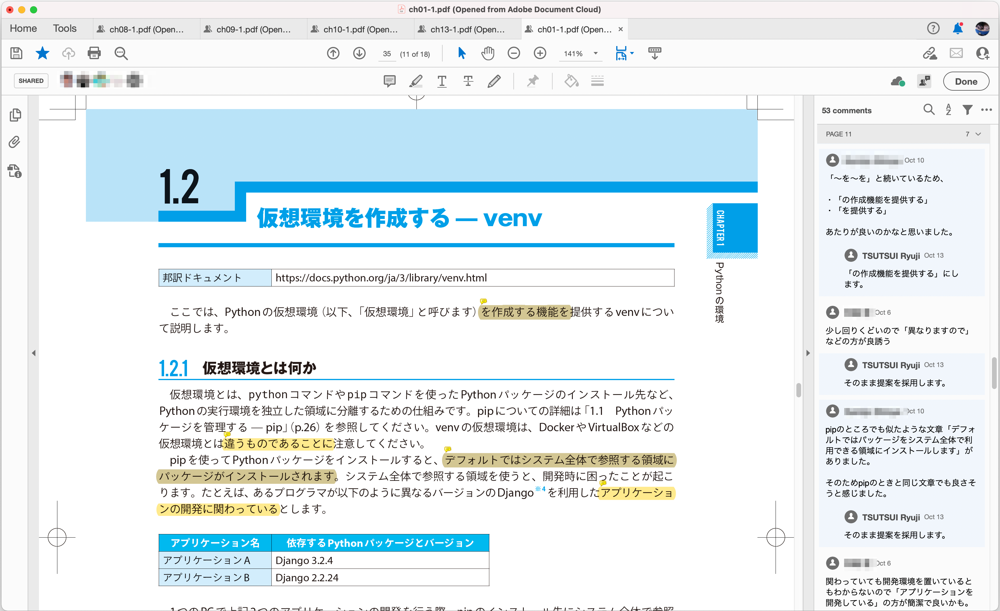

===============================
 What's New in Python 3.10 🚀
===============================

Takanori Suzuki

PyCon JP 2021 / 2021 Oct 15

Thanks to the Organizers 👏
=============================

Who am I / お前誰よ 👤
=======================
* Takanori Suzuki / 鈴木たかのり(`@takanory <https://twitter.com/takanory>`_)
* `PyCon JP Association <https://www.pycon.jp/>`_ 副代表理事
* `株式会社BeProud <https://www.beproud.jp/>`_ 役員/Python Climber
* 😍: Ferrets、🍺、LEGO／Hobby：🎺、🧗

.. image:: /assets/images/sokidan-square.jpg

Python 3.10.0
=============
Release Date: Oct. 4, 2021 🎉

Who knows 3.10 is released 🙋‍♂️
--------------------------------
3.10出たの知ってる人 🙋‍♀️

Anyone installed 3.10 🙋‍♀️
---------------------------
3.10インストールした人 🙋‍♂️

Who can say 6 new features in 3.10 🙋‍♂️
----------------------------------------
3.10の新機能6つ言える人 🙋‍♀️

What's New in Python 3.10 🆕
=============================
.. revealjs-break::

* https://docs.python.org/ja/3/whatsnew/3.10.html

.. image:: images/whatsnew310.png

Python Release Python 3.10.0
----------------------------
* https://www.python.org/downloads/release/python-3100/

.. image:: images/python3.10.0.png

Who are you? / お前誰だ? 🐍
----------------------------
.. image:: https://user-images.githubusercontent.com/11718525/135937807-fd3e0fd2-a31a-47a4-90c6-b0bb1d0704d4.png           

Parenthesized context managers
==============================
.. code-block:: python

   # 3.10
   with (
       open('craftbeer.txt') as f1,
       open('beer-in-kanda.txt') as f2,
   ):
       ...

.. code-block:: python

   with open('craftbeer.txt') as f1, \
        open('beer-in-kanda.txt') as f2
       ...

Better error messages
=====================

Better error messages
---------------------
.. literalinclude:: beer_styles.py

.. revealjs-code-block:: text
   :data-line-numbers: 1,3-5

   $ python3.10 beer_styles.py
     File ".../beer_styles.py", line 1
       beer_styles = ['Pilsner', 'Ale', 'IPA', 'Hazy IPA'
                    ^
   SyntaxError: '[' was never closed

.. revealjs-code-block:: text
   :data-line-numbers: 1,3-5

   $ python3.9 beer_styles.py
     File ".../beer_styles.py", line 2
       print(beer_styles)
       ^
   SyntaxError: invalid syntax

.. revealjs-break::

.. revealjs-code-block:: python
   :data-line-numbers: 2,4-8

   # 3.10
   >>> if beer_syle = 'IPA':
     File "<stdin>", line 1
       if beer_syle = 'IPA':
          ^^^^^^^^^^^^^^^^^
   SyntaxError: invalid syntax. \
     Maybe you meant '==' or ':=' instead of '='?   

.. revealjs-code-block:: python
   :data-line-numbers: 3-5

   >>> if beer_syle = 'IPA':
     File "<stdin>", line 1
       if beer_syle = 'IPA':
                    ^
   SyntaxError: invalid syntax

Better typing syntax
====================

PEP 604: New Type Union Operator
--------------------------------
* ``Union[X, Y]`` → ``X | Y``
* ``Optional[X]`` → ``X | None``

.. revealjs-code-block:: python
   :data-line-numbers: 2

   # 3.10
   def drink_beer(number: int | float) -> str | None
       if am_i_full(number):
           return 'I'm full'

.. revealjs-code-block:: python
   :data-line-numbers: 1

   def drink_beer(number: Union[int, float]) -> Optional[str]
       if am_i_full(number):
           return 'I'm full'

PEP 613: TypeAlias
------------------

.. code-block:: python

   # 3.10
   BeerStr: TypeAlias = 'Beer[str]'  # a type alias
   LOG_PREFIX = 'LOG[DEBUG]'  # a module constant

.. code-block:: python

   BeerStr = 'Beer[str]'  # a type alias
   LOG_PREFIX = 'LOG[DEBUG]'  # a module constant

Better typing syntax
--------------------
* Python 3.7 - 3.9

.. code-block:: python

   from __future__ import annotations

Advertise / 宣伝 📣
====================

『Python 実践レシピ』 📕
-------------------------
* **2022年1月** 発売予定 / 技術評論社
* 著者: 鈴木たかのり、筒井隆次、寺田学、杉田雅子、門脇諭、福田隼也
* ページ数、金額: 調整中
* 『Pythonライブラリ厳選レシピ』を **大加筆、大改訂!!!**

大絶賛レビュー中 🔥
--------------------

Structural Pattern Matching
===========================

Reference / 参考資料
====================
* `What's New In Python 3.10 <https://docs.python.org/ja/3.10/whatsnew/3.10.html>`_
* `Python Release Python 3.10.0 | Python.org <https://www.python.org/downloads/release/python-3100/>`_
* `プログラミング言語 Python 総合情報サイト - python.jp <https://www.python.jp/index.html>`_

Thank you !! 🙏
===============
Takanori Suzuki (`@takanory <https://twitter.com/takanory>`_)

`slides.takanory.net <https://slides.takanory.net/>`_

.. image:: /assets/images/sokidan-square.jpg
