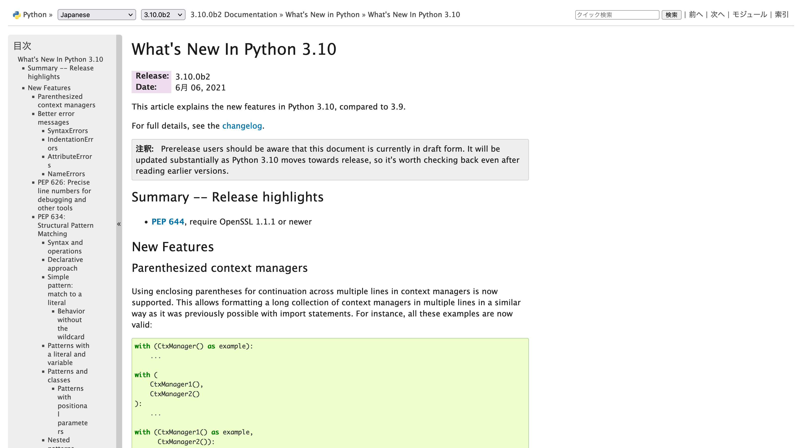
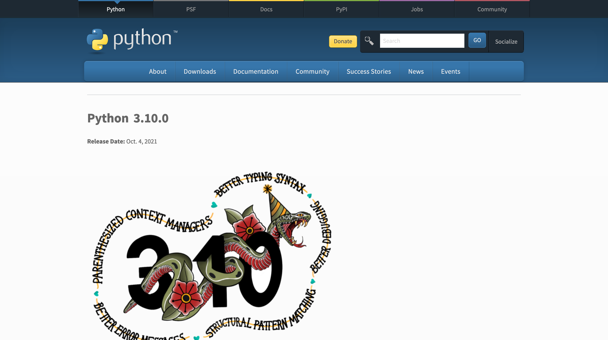

===============================
 What's New in Python 3.10 🚀
===============================

Takanori Suzuki

PyCon JP 2021 / 2021 Oct 15

Thanks to the Organizers 👏
=============================

Who am I / お前誰よ 👤
=======================
* Takanori Suzuki / 鈴木たかのり(`@takanory <https://twitter.com/takanory>`_)
* `PyCon JP Association <https://www.pycon.jp/>`_ 副代表理事
* `株式会社BeProud <https://www.beproud.jp/>`_ 役員/Python Climber
* 😍: Ferrets、🍺、LEGO／Hobby：🎺、🧗

.. image:: /assets/images/sokidan-square.jpg

Python 3.10.0
=============
Release Date: Oct. 4, 2021 🎉

Who knows 3.10 is released 🙋‍♂️
--------------------------------
3.10出たの知ってる人 🙋‍♀️

Anyone installed 3.10 🙋‍♀️
---------------------------
3.10インストールした人 🙋‍♂️

Who can say 6 new features in 3.10 🙋‍♂️
----------------------------------------
3.10の新機能6つ言える人 🙋‍♀️

What's New in Python 3.10 🆕
=============================
.. revealjs-break::

* https://docs.python.org/ja/3/whatsnew/3.10.html

Python Release Python 3.10.0
----------------------------
* https://www.python.org/downloads/release/python-3100/

Who are you? / お前誰だ? 🐍
----------------------------
.. image:: https://user-images.githubusercontent.com/11718525/135937807-fd3e0fd2-a31a-47a4-90c6-b0bb1d0704d4.png           

Parenthesized context managers
==============================

AD
==
* 書籍のこと
