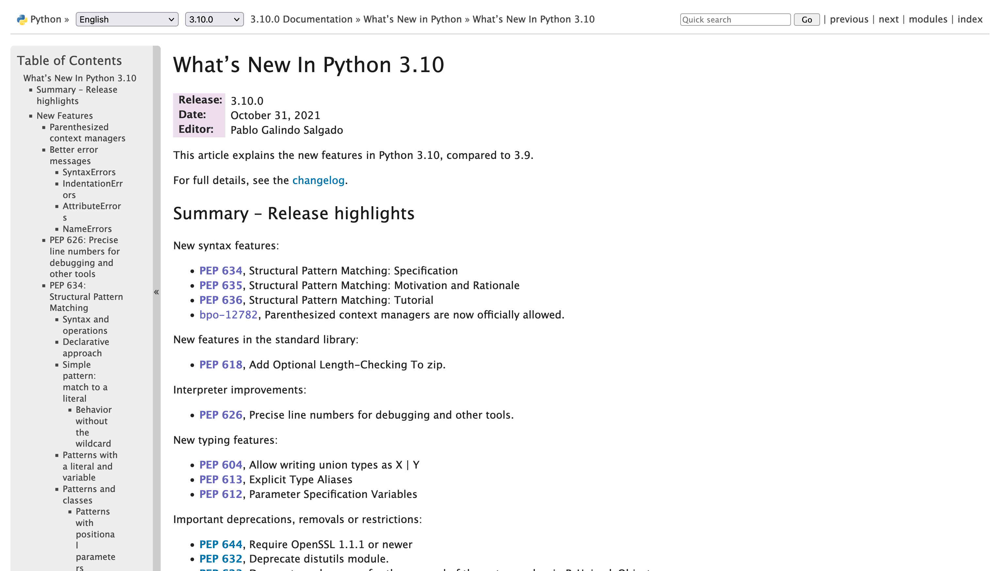
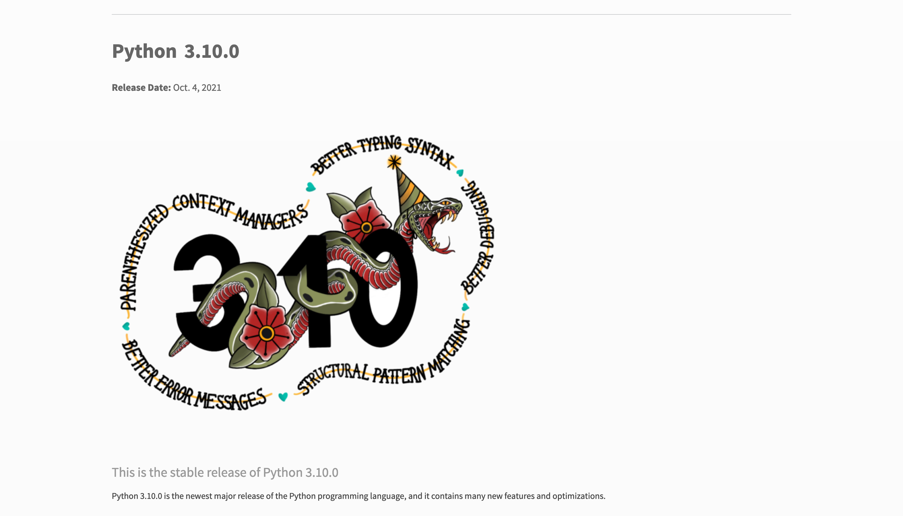

=============================================
 Introduction to Structural Pattern Matching
=============================================

Takanori Suzuki

PyCon APAC 2021 / 2021 Nov 20

.. 見てくれてありがとう。今日はこれについて話すよ的な

Agenda
======
* Motivation
* What's New
* Syntax
* Patterns

.. 今日話すことをざっくり説明

Photos 📷 Tweets 🐦 👍
========================
``#pyconapac`` / ``@takanory``

.. I'd be happy to take pictures and share them and give you feedback on Twitter, etc.
   Hashtag is #pyconapac

Slide 💻
---------
`slides.takanory.net <https://slides.takanory.net>`__

.. This slide available on slides.takanory.net.
   And I've already shared this slide on Twitter.
   Please check it out #pyconapac.

Who am I? 👤
=============
* Takanori Suzuki / 鈴木 たかのり (|twitter| `@takanory <https://twitter.com/takanory>`_)
* `PyCon JP Association <https://www.pycon.jp/>`_: Vice Chair
* `BeProud Inc. <https://www.beproud.jp/>`_: Director / Python Climber
* `Python Boot Camp <https://www.pycon.jp/support/bootcamp.html>`_, `Python mini Hack-a-thon <https://pyhack.connpass.com/>`_, `Python Bouldering Club <https://kabepy.connpass.com/>`_

.. image:: /assets/images/sokidan-square.jpg

.. Before the main topic,...I will introduce myself.
   I'm Takanori Suzuki. My twitter is "takanory", please follow me.
   I'm Vice-Chairperson of PyCon JP Association.
   And I'm director of BeProud Inc.
   I'm also active in several Python related communities

Motivation of this talk 💪
===========================
* Structural Pattern Matching looks **useful**
* You to **know** and **try** it  

.. There are a lat of new features in Python 3.10.
   I think Structural Pattern Matching looks pretty useful.
   I'd like to YOU to know about it and try it out.

.. このトークのモチベーション
   3.10で色々新機能が増えている
   Structural Pattern Matchingはかなり便利そう
   みんなに知って使ってみてほしい

Goal of this talk 🥅
---------------------
* Learn **syntax** and **basic usage**
* Learn **various patterns** and **how to use** them
* **Try it** tomorrow  

.. You will learn the syntax and basic usage of Structural Pattern Matching.
   And, you witll learn about the various patterns and how to use them.
   You'll be able to try it tomorrow.

.. Structural Pattern Matchingの基本的な使い方を知る
   色々なパターンがあることと、その使い方を知る
   明日から試せる

Prerequisites
-------------
* **Intermediate** level
* You should know **Python syntax**

  * tuple, list, dict, if, isinstance, dataclass and more

.. This talk is for interemediate level.
   You should have a basic understanding of Python syntax.

Questions
=========

.. First, I have questions

Have you used Python 3.10? 🙋‍♂️
--------------------------------

Do you know the new features? 🙋‍♀️
-----------------------------------
.. Do you know the new features in 3.10?

What's New in Python 3.10 🆕
=============================

.. First, I will introduce to the new features of Python 3.10.

.. Python 3.10の新機能について紹介します

.. revealjs-break::

* `docs.python.org/3/whatsnew/3.10.html <https://docs.python.org/3/whatsnew/3.10.html>`_

.. The new features are summarized in the "What's new" page of the Python official documentation.

Python Release Python 3.10.0
----------------------------
`www.python.org/downloads/release/python-3100/ <https://www.python.org/downloads/release/python-3100/>`_

.. Python 3.10 was released on October 4, 2021.
   3.10 has many new features...By the way...

Who are You? 🐍
----------------
.. image:: https://user-images.githubusercontent.com/11718525/135937807-fd3e0fd2-a31a-47a4-90c6-b0bb1d0704d4.png
   :width: 70%
   :alt: Python 3.10 release logo

.. This image is "Python 3.10 release logo".
   You can find the new features of 3.10 around this snake.

New features of Python 3.10
---------------------------
* Parenthesized Context Managers
* Better Typing Syntax
* Better Error Messages
* Structural Pattern Matching
* Better Debugging

.. There are five major new features written in the logo.
   Parenthesized...

New features of Python 3.10
---------------------------
* Parenthesized Context Managers
* Better Typing Syntax
* Better Error Messages
* **Structural Pattern Matching** 👈
* Better Debugging

.. In this talks, I will talk about Structural Pattern Matching.

Structural Pattern Matching 🏛
==============================

.. revealjs-break::

* PEPs for Structural Pattern Matching   

  * `PEP 634 – Specification <https://www.python.org/dev/peps/pep-0634/>`_
  * `PEP 635 – Motivation and Rationale <https://www.python.org/dev/peps/pep-0635/>`_
  * `PEP 636 – Tutorial <https://www.python.org/dev/peps/pep-0636/>`_

.. Because of the large function of Structural Patten Matching, it is diveded into 3 PEPs.
   Specification, Motivation and Rationale and Tutorial.
   If you are interested, please read PEPs.

.. パターンマッチングは大きな機能なので3つのPEPにわけて提案されています。

Motivation
----------
`www.python.org/dev/peps/pep-0635/#motivation <https://www.python.org/dev/peps/pep-0635/#motivation>`_

  (Structural) pattern matching syntax is found in many languages, from Haskell, Erlang and Scala to Elixir and Ruby. (A proposal for JavaScript is also under consideration.)

.. This sentence is the motivation for the Structural Pattern Matching written in PEP.

.. この文章はPEPに書いてあるパターンマッチングのモチベーションです

.. revealjs-break::

.. code-block:: python

   # check type or shape of an object
   if isinstance(x, tuple) and len(x) == 2:
       host, port = x
       mode = "http"
   elif isinstance(x, tuple) and len(x) == 3:
       host, port, mode = x

.. code-block:: python

   # Structural Pattern Matching
   match x:
       case host, port:
           mode = "http"
       case host, port, mode:
           pass

.. The if-elif-else idiom is often used to check type or share of an object.
   For example isinstance(), hasattr(), len(), key in dict.
   Use match statements to write more elegantly.
   This is the motivation for Structural Pattern Matching.
   Now that you know the motivation, let's talk about the syntax.

.. isinstance()で型をチェックして中身を見て、みたいなのをよくやるけど、それがもっとエレガントに書ける

Syntax |code|
=============
* Generic syntax of pattern matching

.. revealjs-code-block:: python
   :data-line-numbers: 1|2-9

   match subject:
       case <pattern_1>:
           <action_1>
       case <pattern_2>:
           <action_2>
       case <pattern_3>:
           <action_3>
       case _:
           <action_wildcard>

.. A match statement takes an expression ... and compares its value to successive patterns given as one or more case blocks.

Soft keywords
-------------
* New in Python 3.10
* ``match``, ``case`` and ``_``
* Can be used identifier names

.. code-block:: python

   >>> match = 'match'  # OK
   >>> class = 'class'  # NG
     File "<stdin>", line 1
       class = 'class'  # NG
             ^
   SyntaxError: invalid syntax

.. Soft keywords are a new language specification in 3.10.
   match, case and _ are soft keywords.
   Soft keywords can be used identifier names.
   Next, let's talk about patterns!!

.. 新しくソフトキーワードができた。
   match, case, _はソフトキーワード。
   ソフトキーワードは識別子に使用できる
   では、実際の書き方を説明していきます。

Patterns |random|
=================
.. revealjs-break::

.. code-block:: python

   match subject:
       case <pattern_1>:
           <action_1>
       case <pattern_2>:
           <action_2>
       case <pattern_3>:
           <action_3>
       case _:
           <action_wildcard>

.. This is the syntax I introduced before.
   You can specify various patterns after case.
   I will introduce patterns with code examples.
   
.. これはsyntaxですが、patternにはさまざまなpattensを指定できます。
   いくつかを紹介していきます。

**Literal** patterns
--------------------
.. revealjs-code-block:: python
   :data-line-numbers: 1-7|1,8-9

   match beer_style:
       case "Pilsner":
           result = "First drink"
       case "IPA":
           result = "I like it"
       case "Hazy IPA":
           result = "Cloudy and cloudy"
       case _:
           result = "I like most beers"

.. First, Literal patterns. Literal patterns are the simplest patterns.
   If the value of beer_style is "Pilsner", then "here" will be executed.
   (ページ送り)
   If the value doesn't match any of the patterns, it will match _.
   _ is wildcard.

.. beer_styleの中身がXXXならYYYを返します。
   どれもマッチしなければワイルドカードの _ にマッチします。
   _ はワイルドカードです

**OR** patterns
---------------
* ``|`` is OR

.. revealjs-code-block:: python
   :data-line-numbers: 4-5

   match beer_style:
       case "Pilsner":
           result = "First drink"
       case "IPA" | "Session IPA":
           result = "I like it"
       case "Hazy IPA":
           result = "Cloudy and cloudy"
       case _:
           result = "I like most beers"

.. This pattern matches IP or Session IP

Literal patterns **without wildcard**
-------------------------------------
.. revealjs-code-block:: python
   :data-line-numbers: 8-9

   match beer_style:
       case "Pilsner":
           result = "First drink"
       case "IPA":
           result = "I like it"
       case "Hazy IPA":
           result = "Cloudy and cloudy"
       # case _:
       #     result = "I like most beers"

.. I commented out the last wildcard.
   If the value doesn't match any of the pattens, nothing will happen.

.. 最後のワイルドカードを削除する。
   それ以外を選んだらなにも起こらない。

? 🤔
-----

.. What?
   Doesn't look very useful, does it?

.. あんまり便利りそうに見えない

rewrite with **if** statement
-----------------------------
* If written as an ``if`` statement

.. code-block:: python

   if beer_style == "Pilsner":
       result = "First drink"
   elif beer_style == "IPA" or beer_style == "Session IPA":
       result =  "I like it"
   elif beer_style == "Hazy IPA":
       result = "Cloudy and cloudy"
   else:
       result = "I like most beers"

.. If you write it in an if statement, you won't shee much difference.
   You're ritght.
   But...

.. こんなif文とかわなないのでは?
   あなたの考えは正しいです。
   But...

Pattern Matching is **Powerful** 💪
------------------------------------
.. But...Pattern Matching is much more powerful.
   I will introduce useful patterns.

.. これからさらに強力なパターンを紹介します。

Literal and **Variable** patterns
=================================

Literal and **Variable** patterns
---------------------------------
.. revealjs-code-block:: python

   def order_beer_and_food(order: tuple) -> str:
       match (order):
           case ("", ""):
               return "Please order something."
           case (beer, ""):
               return f"I drink {beer}."
           case ("", food):
               return f"I eat {food}."
           case (beer, food):
               return f"I drink {beer} with {food}."
           case _:
               return "one beer and one food only."

.. Let's consider a function receives beer and food orders tuple.
   
.. このようなタプルを受け取る関数を考えてみます。

Literal and **Variable** patterns
---------------------------------

.. revealjs-code-block:: python
   :data-line-numbers: 1-4,14

   def order_beer_and_food(order: tuple) -> str:
       match (order):
           case ("", ""):  # match here
               return  "Please order something."
           case (beer, ""):
               return f"I drink {beer}."
           case ("", food):
               return f"I eat {food}."
           case (beer, food):
               return f"I drink {beer} with {food}."
           case _:
               return "one beer and one food only."

   order_beer_and_food(("", ""))  # -> Please order something.

.. If the argument is (empty, empty) tuple, the pattern in the 3rd line will be matched. The return "Please order something."

Literal and **Variable** patterns
---------------------------------
* ``"IPA"`` assign to ``beer``

.. revealjs-code-block:: python
   :data-line-numbers: 1-2,5-6,14

   def order_beer_and_food(order: tuple) -> str:
       match (order):
           case ("", ""):
               return  "Please order something."
           case (beer, ""):  # match here
               return f"I drink {beer}."
           case ("", food):
               return f"I eat {food}."
           case (beer, food):
               return f"I drink {beer} with {food}."
           case _:
               return "one beer and one food only."

   order_beer_and_food(("IPA", ""))  # -> I drink IPA.

.. If the argument is ("IPA", empty) tuple, the pattern in the 5th line will be matched.
   Then the first value of the tuple, IPA, is then assigned to the beer variable.
   The result is "I drink IPA."

Literal and **Variable** patterns
---------------------------------
* ``"IPA"`` assign to ``beer``
* ``"nuts"`` assign to ``food``

.. revealjs-code-block:: python
   :data-line-numbers: 1-2,9-10,14

   def order_beer_and_food(order: tuple) -> str:
       match (order):
           case ("", ""):
               return  "Please order something."
           case (beer, ""):
               return f"I drink {beer}."
           case ("", food):
               return f"I eat {food}."
           case (beer, food):  # match here
               return f"I drink {beer} with {food}."
           case _:
               return "one beer and one food only."

   order_beer_and_food("IPA", "nuts")  # -> I drink IPA with nuts.

.. If the argument is ("IPA", "nuts"), the pattern in the 9th line will be matched.
   Then the first value "IPA" is then assigned to the beer variable.
   And the second value "nuts" is then assigned to the food variable.
   The result is "I drink IPA with nuts."

Literal and **Variable** patterns
---------------------------------
* Tuple length does not match

.. revealjs-code-block:: python
   :data-line-numbers: 1-2,11-14

   def order_beer_and_food(order: tuple) -> str:
       match (order):
           case ("", ""):
               return  "Please order something."
           case (beer, ""):
               return f"I drink {beer}."
           case ("", food):
               return f"I eat {food}."
           case (beer, food):
               return f"I drink {beer} with {food}."
           case _:  # match here
               return "one beer and one food only."

   order_beer_and_food(("IPA", "nuts", "spam"))  # -> one beer and one food only.
.. If the argument is ("IPA", "nuts", "spam"), the whildcard pattern will be matched.
   Because the length of the tuple is not 2.
   The result is "one beer and one food only."

rewrite with **if** statement
-----------------------------
.. code-block:: python

   def order_beer_and_food(order: tuple) -> str:
       if len(order) == 2:
           beer, food = order
           if beer == "" and food == "":
               return  "I'm full."
           elif beer != "" and food == "":
               return f"I drink {beer}."
           elif beer == "" and food != "":
               return f"I eat {food}."
           else:
               return f"I drink {beer} with {food}."
       else:
           return  "one beer and one food only."

.. I rewrite it with an if statement.
   I think this code is a bit confusing.
   
Which do you like?
------------------
* Structural Pattern Matching
* ``if`` statement

**Order** is important ⬇️
=========================
.. revealjs-code-block:: python
   :data-line-numbers: 3-4,14

   def order_beer_and_food(order: tuple) -> str:
       match (order):
           case (beer, food):  # match here
               return f"I drink {beer} with {food}."
           case ("", ""):  # never reach
               return "Please order something."
           case (beer, ""):  # never reach
               return f"I drink {beer}."
           case ("", food):  # never reach
               return f"I eat {food}."
           case _:
               return "one beer and one food only."

   order_beer_and_food(("IPA", ""))  # -> I drink IPA with .

.. There is one note of caution.
   The order of the cases is important.
   The patterns are compared in order from top to bottom, so if you write it this way, it will match the first pattern.
   As a result, no other patterns will be reaced.

.. 一つ注意点があります。caseの順番は重要です。
   上から順にマッチするのでこのように書くとすべて最初のパターンにマッチしてしまいます。

**Classes** patterns
====================

**Classes** patterns
--------------------
.. code-block:: python

   @dataclass
   class Order:
       beer: str = ""
       food: str = ""

   def order_with_class(order: Order) -> str:
       match (order):
           case Order(beer="", food=""):
               return "Please order something."
           case Order(beer=beer, food=""):
               return f"I drink {beer}."
           case Order(beer="", food=food):
               return f"I eat {food}."
           case Order(beer=beer, food=food):
               return f"I drink {beer} with {food}."
           case _:
               return "Not an order."

.. beerとfoodを属性に持つorderクラスを作ります

**Results**: Classes patterns
-----------------------------

.. code-block:: python

   >>> order_with_class(Order())
   'Please order something.'
   >>> order_with_class(Order(beer="Ale"))
   'I drink Ale.'
   >>> order_with_class(Order(food="fries"))
   'I eat fries.'
   >>> order_with_class(Order("Ale", "fries"))
   'I drink Ale with fries.'
   >>> order_with_class("IPA")
   'Not an order.'

.. The results are here.
   先程のタプルと同じように動作します

Classes patterns
----------------
.. code-block:: python

   def order_with_class(order: Order) -> str:
       match (order):
           case Order(beer="", food=""):
               return "Please order something."
           case Order(beer=beer, food=""):
               return f"I drink {beer}."
           case Order(beer="", food=food):
               return f"I eat {food}."
           case Order(beer=beer, food=food):
               return f"I drink {beer} with {food}."
           case _:
               return "Not an order."

.. This is code of classes patterns.

rewrite with ``if`` statement
-----------------------------
.. code-block:: python

   def order_with_class(order: Order) -> str:
       if isinstance(order, Order):
           if order.beer == "" and order.food == "":
               return  "Please order something."
           elif order.beer != "" and order.food == "":
               return f"I drink {order.beer}."
           elif order.beer == "" and order.food != "":
               return f"I eat {order.food}."
           else:
               return f"I drink {order.beer} with {order.food}."
       else:
           return "Not an order."

.. if文で書いてみるとこんな感じになります。ちょっとごちゃごちゃしてますね。
   まだまだあります

Matching sequences ➡️
=====================
.. revealjs-break::

* Sequense Pattens
* Parse the order text
* for example:

  * ``"beer IPA pint"``
  * ``"food nuts"``
  * ``"water 3"``
  * ``"bill"``

.. 次はシーケンスのマッチについて解説します。
   ここでは注文のテキストを解析します。
   In this caes, I'll parse the order text.

Matching multiple patterns
--------------------------
* Matching by length of sequence

.. code-block:: python

   match order_text.split():
       case [action]:  # match ["bill"]
            ...
       case [action, name]:  # match "food nuts", "water 3"
            ...
       case [action, name, size]:  # match "beer IPA pint"
            ...

.. 複数のシーケンスのパターンにマッチできます。
   この場合はリストの長さが1、2、3でそれぞれ振り分けています。

Matching specific values
------------------------
* Matching specific attions(bill, food...)

.. code-block:: python

   match order_text.split():
       case ["bill"]:
            calculate_amount()
       case ["food", food]:
            tell_kitchen(food)
       case ["water", number]:
            grass_of_water(number)
       case ["beer", kind, size]:
            tell_beer_master(kind, size)

Capturing matched sub-patterns
------------------------------
* Valid beer size is ``"Pint"`` and ``"HalfPint"``
* ``"beer IPA 1-liter"`` is invalid

.. code-block:: python

   match order_text.split():
       ...
       case ["beer", kind, ("Pint" | "HalfPint")]:
       # I don't know beer size

.. revealjs-break::

* Use ``as`` patterns
* Bind the value(``"Pint"`` or ``"HalfPint"``) to ``size``

.. code-block:: python

   match order_text.split():
       ...
       case ["beer", kind, ("Pint" | "HalfPint") as size]:
            tell_beer_master(kind, size)

Matching multiple values
------------------------
* Can handle multiple food orders
* example:

  * ``"food nuts fries pickles"``

.. code-block:: python

   match order_text.split():
       ...
       case ["food", food]:  # capture single value
            tell_kitchen(food)

.. code-block:: python

   match order_text.split():
       ...
       case ["food", *foods]:  # capture multiple values
            for food in foods:
                tell_kitchen(name)

Matching dictionaries 📕
=========================
.. revealjs-break::

* Mapping Patterns

.. code-block:: python

   order_dict = {"beer": "IPA", "size": "Pint"}
   match order_dict:
       case {"food": food}:
           tell_kitchen(food)
       case {"beer": kind, "size": ("Pint" | "HalfPint") as size}:
           tell_beer_master(kind, size)
       case {"beer": kind, "size": _}:
           print("Unknown beer size")
       case {"water": number}:
           grass_of_water(number)
       case {"bill": _}:
           calculate_amount()

Matching builtin classes
------------------------
.. code-block:: python

   order_dict = {"water": 3}
   match order_dict:
       case {"food": str(food)}:
           tell_kitchen(food)
       case {"beer": str(kind), "size": ("Pint" | "HalfPint") as size}:
           tell_beer_master(kind, size)
       case {"beer": str(kind), "size": _}:
           print("Unknown beer size")
       case {"water": int(number)}:
           grass_of_water(number)
       case {"bill": _}:
           calculate_amount()

Guards 💂‍♀️
============
*

.. 最後にガードについて説明します。

Summary
=======
.. revealjs-break::

* Motivation 💪
* What's New in Python 3.10 🆕

  * context manager, error message, typing
* Syntax |code|

  * ``match``, ``case`` and ``_``
* Patterns |random|

  * literal, ``|``, variable, class, sequense, dict...

.. Summary of this talks.
   I tald about ...

Try Structural Pattern Matching 👍
-----------------------------------
.. If you think pattern matching looks good, give it a try!!
   もしパターンマッチよさそうだなと思ったら、挑戦してみてください

References 📚
--------------
* `What's New In Python 3.10 <https://docs.python.org/ja/3.10/whatsnew/3.10.html>`_
* `Python Release Python 3.10.0 <https://www.python.org/downloads/release/python-3100/>`_
* `PEP 634 -- Structural Pattern Matching: Specification <https://www.python.org/dev/peps/pep-0634/>`_
* `PEP 635 -- Structural Pattern Matching: Motivation and Rationale <https://www.python.org/dev/peps/pep-0635/>`_
* `PEP 636 -- Structural Pattern Matching: Tutorial <https://www.python.org/dev/peps/pep-0636/>`_

.. References are here

Thank you !! 🙏
===============
Takanori Suzuki (|twitter| `@takanory <https://twitter.com/takanory>`_)

`slides.takanory.net <https://slides.takanory.net/>`_

.. image:: /assets/images/sokidan-square.jpg

.. Thank you for your attention.
   I hope to see you at PyCon held onsite somewhere.

What's New in Python 3.10 🆕
=============================
.. revealjs-break::

* Structural Pattern Matching
* **Parenthesized Context Managers** 👈
* **Better Error Messages** 👈
* **Better Typing Syntax** 👈
* Better Debugging

Parenthesized Context Managers
------------------------------
.. code-block:: python

   # 3.10
   with (
       open('craftbeer.txt') as f1,
       open('beer-in-kanda.txt') as f2,
   ):
       ...

.. code-block:: python

   # Before 3.10
   with open('craftbeer.txt') as f1, \
        open('beer-in-kanda.txt') as f2
       ...

Better Error Messages
---------------------
.. code-block:: python

   # Brackets are not closed
   beer_types = ['Pilsner', 'Ale', 'IPA', 'Hazy IPA'
   print(beer_types)

.. revealjs-code-block:: python
   :data-line-numbers: 3-6

   $ python3.10 beer_styles.py
     File ".../beer_styles.py", line 2
       beer_styles = ['Pilsner', 'Ale', 'IPA', 'Hazy IPA'
                     ^
   SyntaxError: '[' was never closed
   # Easy to understand!!

.. revealjs-code-block:: python
   :data-line-numbers: 3-5

   $ python3.9 beer_styles.py
     File ".../beer_styles.py", line 3
       print(beer_styles)
       ^
   SyntaxError: invalid syntax

Better Error Messages
---------------------
.. revealjs-code-block:: python
   :data-line-numbers: 3-7

   # 3.10
   >>> if beer_syle = 'IPA':
     File "<stdin>", line 1
       if beer_syle = 'IPA':
          ^^^^^^^^^^^^^^^^^
   SyntaxError: invalid syntax. Maybe you meant '==' or ':=' instead of '='?
   # Very friendly!!

.. revealjs-code-block:: python
   :data-line-numbers: 3-5

   # Before 3.10
   >>> if beer_syle = 'IPA':
     File "<stdin>", line 1
       if beer_syle = 'IPA':
                    ^
   SyntaxError: invalid syntax

Better Typing Syntax
--------------------
* `PEP 604 <https://www.python.org/dev/peps/pep-0604>`_: New Type Union Operator

  * ``Union[X, Y]`` → ``X | Y``
  * ``Optional[X]`` → ``X | None``

.. revealjs-code-block:: python
   :data-line-numbers: 2

   # 3.10
   def drink_beer(number: int | float) -> str | None
       if am_i_full(number):
           return 'I'm full'

.. revealjs-code-block:: python
   :data-line-numbers: 2

   # Before 3.10
   def drink_beer(number: Union[int, float]) -> Optional[str]
       if am_i_full(number):
           return 'I'm full'

.. revealjs-break::

* `PEP 613 <https://www.python.org/dev/peps/pep-0613>`_: TypeAlias

.. code-block:: python

   # 3.10
   BeerStr: TypeAlias = 'Beer[str]'  # a type alias
   LOG_PREFIX = 'LOG[DEBUG]'  # a module constant

.. code-block:: python

   # Before 3.10
   BeerStr = 'Beer[str]'  # a type alias
   LOG_PREFIX = 'LOG[DEBUG]'  # a module constant

.. revealjs-break::

* Can use Python 3.7 - 3.9

.. code-block:: python

   from __future__ import annotations

   def drink_beer(number: int | float) -> str | None
       if am_i_full(number):
           return 'I'm full'

Try Python 3.10 👍
-------------------
           
