======================================================
 Automate the Boring Stuff with **Slackbot** (ver. 2)
======================================================

Takanori Suzuki

PyCon US 2022 / 2022 Apr 29

.. Thank you for coming to my presentation.
   I am very happy to be able to talk in PyCon US.

Agenda
======
* **Background** and **Motivation** for Slackbot
* How to create **simple** chatbot
* How to create **interactive** bot
* How to **extend** bot using libs and APIs

.. Today, I will talk about...

Photos 📷 Tweets 🐦 👍
=========================

`#pyconus2022` / `@takanory`

.. I'd be happy to take pictures and share them and give you feedback on Twitter, etc.
   Hashtag is #pyconus2022

Slide 💻
---------
`slides.takanory.net <https://slides.takanory.net>`__

.. This slide available on slides.takanory.net.
   And I've already shared this slide on Twitter.

Why **ver. 2** in the title?
============================
.. なぜタイトルにver. 2が付いているか

Back to **2020**
================
.. 2020にトークが採用されたけど急遽オンラインになった
   ビデオ提供したけど発表したって感じしない
   https://us.pycon.org/2020/
   今回、同じ内容を更新して発表する。発表できてうれしい

Who am I? 👤
=============
* Takanori Suzuki / 鈴木 たかのり (|twitter| `@takanory <https://twitter.com/takanory>`_)
* Vice Chair of `PyCon JP Association <https://www.pycon.jp/>`_
* Director of `BeProud Inc. <https://www.beproud.jp/>`_
* `Python Boot Camp <https://www.pycon.jp/support/bootcamp.html>`_, `Python mini Hack-a-thon <https://pyhack.connpass.com/>`_, `Python Bouldering Club <https://kabepy.connpass.com/>`_

.. image:: /assets/images/sokidan-square.jpg

.. Before the main topic,...I will introduce myself.
   I'm Takanori Suzuki. My twitter is "takanory", please follow me.
   I'm Vice-Chairperson of PyCon JP Association.
   And I'm director of BeProud Inc.
   I'm also active in several Python related communities

PyCon JP 🇯🇵
------------
* Date: 2022 XXX XXX
* Venue: Tokyo, Japan

**Background** and **Motivation**
=================================

.. First, I will talk about the Background and Motivation of this talk.

Conference **Tasks**
--------------------
* I held PyCon JP(2014-2016) as Chair
* Conference tasks:

  * 👨‍💻 Keynotes, Talks and Trainings arrangement
  * 🎫 Ticket sales and reception
  * 🏬 Venue and facility(WiFi, Video...) management
  * 🍱 Foods, ☕️ Coffee, 🧁 Snacks and 🍺 Beers

.. I held PyCon JP event several years in the past.
   As you can imagine, lots of tasks to hold Conference.
   For example, talk arrangements, ticket sales, venue management, food...
   And, ...

Staff ask me the **same things**
--------------------------------
* 40+ staff
* 🐣 NEW staff : 🐔 OLD staff = 50 : 50

.. The number of PyCon JP staff is 40 over, half of them are the new staff.
   New staff ask similar things to me. And I send similar answers repeatedly.
   But, ...

Programmer is **Lazy**
======================
.. As you know, programmers dislike routine work. I also dislike it VERY much.

Let's create a **secretary**!!
==============================
.. I want someone to do my bothersome tasks instead of me like a secretary.
   Let's make it.

Goal
====
* How to create **simple** bot
* How to create **interactive** bot
* How to **extend** bot using libs and APIs

.. The goal of this talk.
   You'll learn how to create simple bot,
   how to create interactive bot,
   how to extend bot using libraries and APIs through various case studies.

Why **Slack** ?
===============
* Launching the Slack app at any time 💻 📱
* **Easy** to access Slack
* To do **everything** in Slack

.. image:: /20190224pyconapac/images/slack.png
   :width: 60%
	
.. My secretary is chatbot of Slack.
   Is there someone using Slack?
   I'm Launching the Slack application at any time on PC and smartphone.
   So it's easy to access Slack. I want to do everything in Slack.
   Let's make chatbot on Slack.

Simple integration with **Incoming Webhooks** 🪝
================================================

System overview
---------------
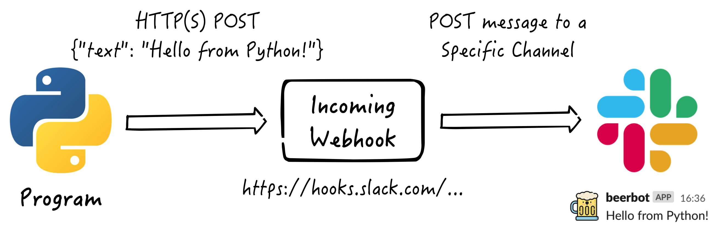

**Create** Incoming Webhooks Integration 🔧
===========================================

**Create** Incoming Webhooks Integration
----------------------------------------
* Generate **Webhook URL**

  1. Create a Slack app
  2. Activate Incoming Webhooks in the app
  3. Add Webhook to Workspace
* see: `Sending messages using Incoming Webhooks <https://api.slack.com/messaging/webhooks>`_

1. Create a Slack app
---------------------
* https://api.slack.com/apps

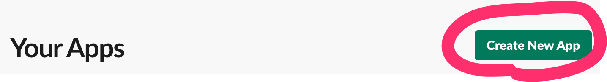

.. image:: images/create-webhook1-2.png
   :width: 50%
     
.. revealjs-break::
   :notitle:

* Enter name and choose workspace

.. image:: images/create-webhook2.png
   :width: 50%
     
.. revealjs-break::
   :notitle:

* Set app icon (optional)

.. image:: images/create-webhook3.png
   :width: 50%

* see: `Beer icons created by Freepik - Flaticon <https://www.flaticon.com/free-icons/beer>`_           
     
2. Activate Incoming Webhooks
-----------------------------
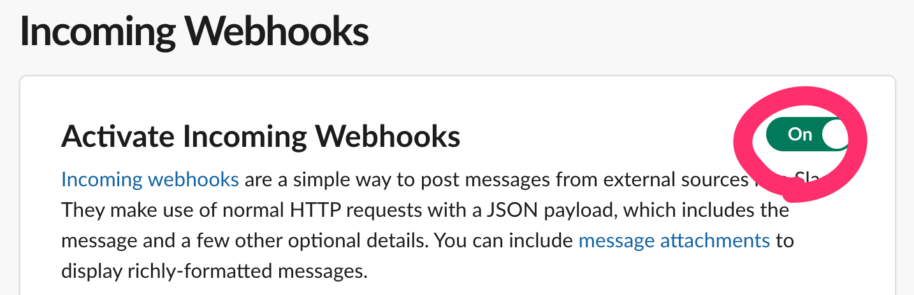

3. Add Webhook to Workspace
---------------------------
* Click "Add New Webhook to Workspace"

.. image:: images/create-webhook4-2.png
   :width: 50%
     
.. revealjs-break::
   :notitle:

* Choose channel → Click "Allow"

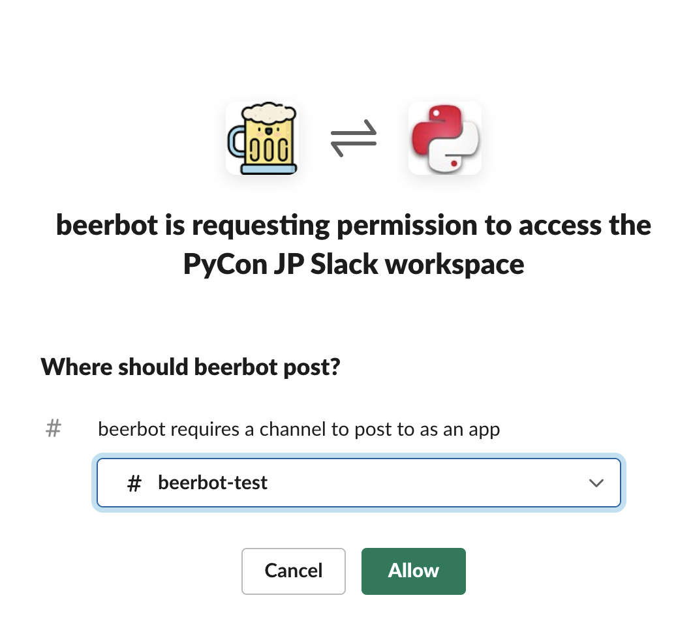
     
.. revealjs-break::
   :notitle:

* Get **Webhook URL**: ``https://hooks.slack.com/...``

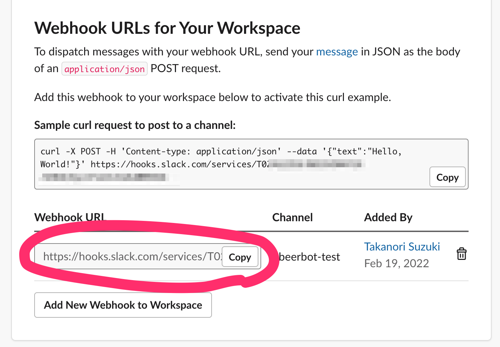

Post message via **Webhook URL** 📬
===================================

Post message with **cURL**
--------------------------

.. code-block:: bash

   $ curl -X POST -H 'Content-type: application/json' \
   > --data '{"text":"Hello Slack!"}' \
   > https://hooks.slack.com/services/T000...

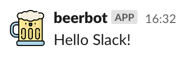

Post message with **Python**
----------------------------
* see: `urllib.request <https://docs.python.org/3/library/urllib.request.html>`_

.. code-block:: python

   import json
   from urllib import request

   url = "https://hooks.slack.com/services/T000..."
   message = {"text": "Hello from Python!"}
   data = json.dumps(message).encode()
   request.urlopen(url, data=data)
           
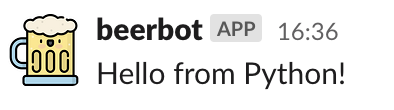

Post message with **Requests**
------------------------------
* see: `Requests <https://docs.python-requests.org/en/latest/>`_

.. code-block:: bash

   $ pip install requests
   
.. code-block:: python

   import requests

   url = "https://hooks.slack.com/services/T000..."
   message = {"text": "Hello from Requests!"}
   r = requests.post(url, json=message)
     
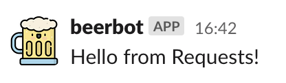

Post message with **Slack SDK**
-------------------------------
* see: `Python Slack SDK <https://slack.dev/python-slack-sdk/>`_

.. code-block:: bash

   $ pip install slack-sdk
   
.. code-block:: python

   from slack_sdk.webhook import WebhookClient

   url = "https://hooks.slack.com/services/T000..."
   webhook = WebhookClient(url)
   r = webhook.send(text="Hello from Slack SDK!")
     
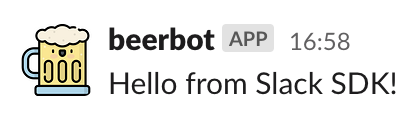

**Formatting** text
-------------------
* see: `Formatting text for app surfaces <https://api.slack.com/reference/surfaces/formatting>`_

.. revealjs-code-block:: python
   :data-line-numbers: 4-7

   from slack_sdk.webhook import WebhookClient

   url = "https://hooks.slack.com/services/T000..."
   webhook = WebhookClient(url)
   # *bold*, <url|text>, :emoji: and etc.
   r = webhook.send(text="*Hello* from "
     "<https://slack.dev/python-slack-sdk/|Slack SDK>! :beer:")
     

Message **Attachments**
-----------------------

.. revealjs-code-block:: python
   :data-line-numbers: 1-11

   fields = [
       {"title": "Love", "value": ":beer:, Ferrets, LEGO", "short": True},
       {"title": "From", "value": "Japan :jp:", "short": True},
   ]
   attachments =  [{
       "pretext": "Nice to meet you!!",
       "author_name": "Takanori Suzuki",
       "text": "*THANK YOU* for coming to my talk !:tada: Please give me *feedback* about this talk :bow:",
       "fields": fields,
   }]

   response = webhook.send(attachments=attachments)

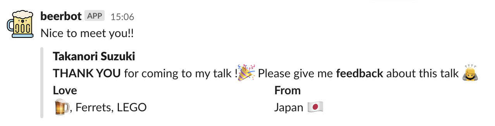

Message **Attachments**
-----------------------
* Message Attachments is **Legacy**

    This feature is a legacy part of messaging functionality for Slack apps.

* see: `Reference: Secondary message attachments <https://api.slack.com/reference/messaging/attachments>`_

.. attachmentsのBlock

**Block** Kit 🧱
================

**Block** Kit
-------------
  A clean and consistent UI framework for Slack apps

* Blocks

  * Elements

    * Composition objects
* see: `Block Kit <https://api.slack.com/block-kit>`_

* TODO: 図にする
* Block Kitは1つ以上のBlockの中にElementを配置してメッセージを作成する

**Example** of Block Kit
------------------------
.. code-block:: python

   blocks = [{
       "type": "section",
       "text": {
            "text": "*THANK YOU* for coming to my talk !:tada: Please give me *feedback* about this talk :bow:",
            "type": "mrkdwn"
       },
       "fields": [
            {"type": "mrkdwn", "text": "*Love*"},
            {"type": "mrkdwn", "text": "*From*"},
            {"type": "plain_text", "text": ":beer:, Ferrets, LEGO"},
            {"type": "plain_text", "text": "Japan :jp:"},
       ],
   }]
   response = webhook.send(blocks=blocks)

.. image:: images/webhook-blocks.png

**Seciton** Block
-----------------
* Section Block with ``text`` and ``fields`` Field

.. revealjs-code-block:: python
   :data-line-numbers: 2,3,7

   blocks = [{
       "type": "section",  # Section Block
       "text": {  # text Field
            "text": "*THANK YOU* for coming to my talk !:tada: Please give me *feedback* about this talk :bow:",
            "type": "mrkdwn"
       },
       "fields": [  # fields Field
            {"type": "mrkdwn", "text": "*Love*"},
            {"type": "mrkdwn", "text": "*From*"},
            {"type": "plain_text", "text": ":beer:, Ferrets, LEGO"},
            {"type": "plain_text", "text": "Japan :jp:"},
       ],
   }]
   response = webhook.send(blocks=blocks)

* see: `Section Block <https://api.slack.com/reference/block-kit/blocks#section>`_

Block Kit **Builder**
---------------------
* ブロックキット複雑なのでBuilderで作れる
* `app.slack.com/block-kit-builder/ <https://app.slack.com/block-kit-builder/>`_

.. raw:: html

   <video src="../_images/block-kit-buiilder.mov"></video>

.. image:: images/block-kit-buiilder.mov

Summary of Incoming **Webhooks**
================================
* **Easy** to post messages from programs 📬
* Create complex messages with **Block Kit** 🧱
* But **one-way** (program➡️Webhook➡️Slack)

**Interactive** bot 🤝
======================

2 types of connection protocols
-------------------------------
* Events API over HTTP
* Socket Mode
* see: `Choosing a protocol to connect to Slack <https://api.slack.com/apis/connections>`_

Events API over HTTP
--------------------

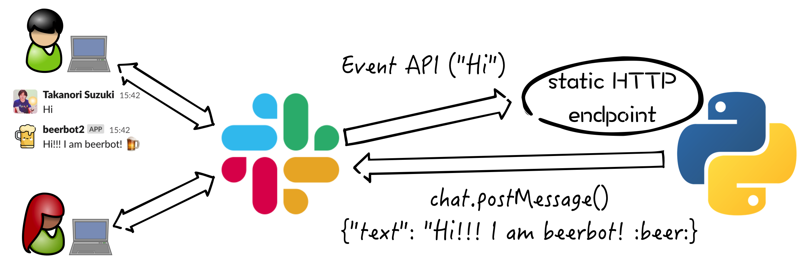

* see: `Using the Slack Events API <https://api.slack.com/apis/connections/events-api>`_

Socket Mode
-----------

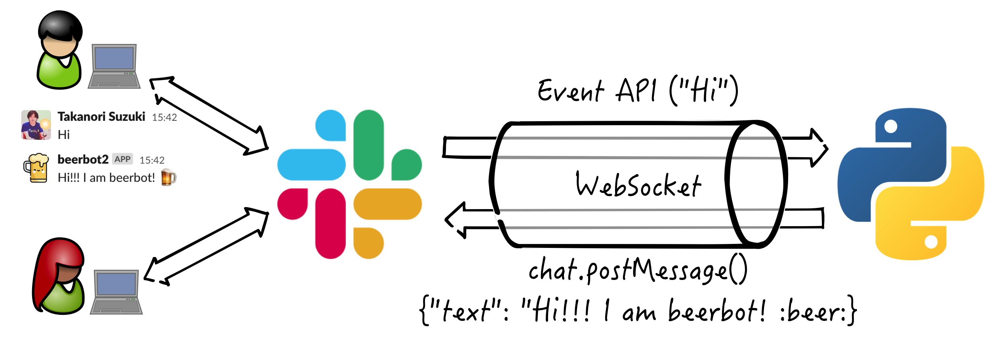

* see: `Intro to Socket Mode <https://api.slack.com/apis/connections/socket>`_

2 types of connection protocols
-------------------------------
* Events API over HTTP
* **Socket Mode** 👈

.. * 公開するエンドポイントを用意するのが難しい場合はSocket Modeが便利
   * ここではSocket Modeで説明をしていく

**Create** bot user 🤖
======================

**Create** bot user
-------------------
* Create bot user with **Socket Mode**

  1. Create a Slack app (same procedure)
  2. Enable Socket Mode
  3. Subscribe bot event
  4. Add Bot Token Scopes
  5. Install App to Workspace
* Invite bot user to Slack channels

1. Create a Slack app
---------------------
* Open https://api.slack.com/apps

.. image:: images/create-webhook1-2.png
   :width: 50%

.. revealjs-break::
   :notitle:

* Enter name and choose workspace

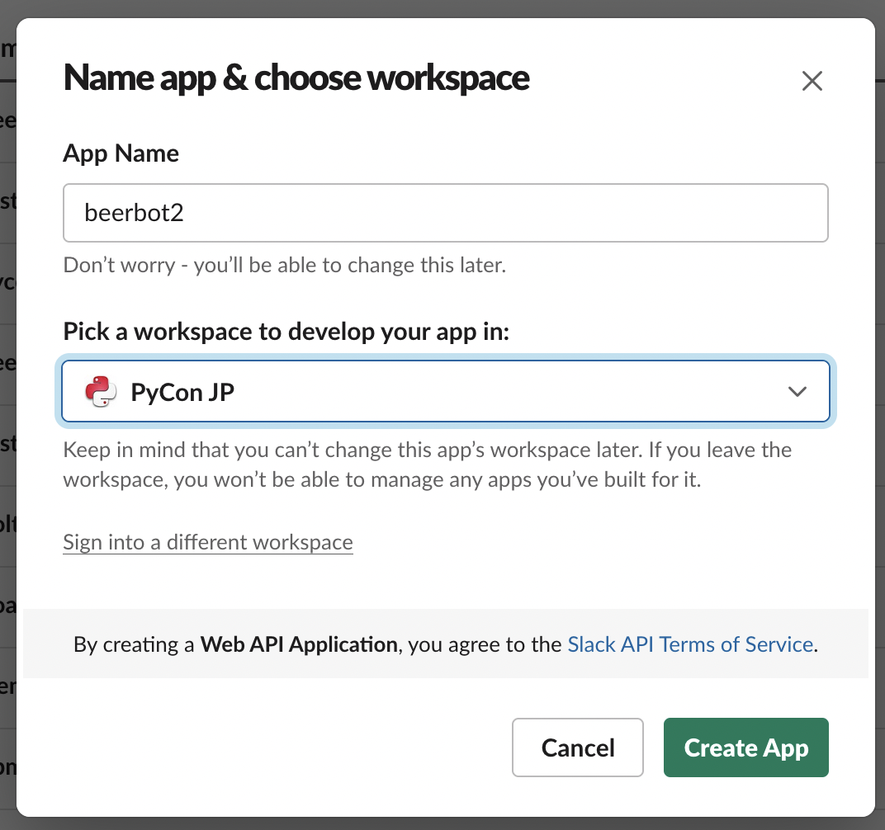
     
.. revealjs-break::
   :notitle:

* Set app icon (optional)

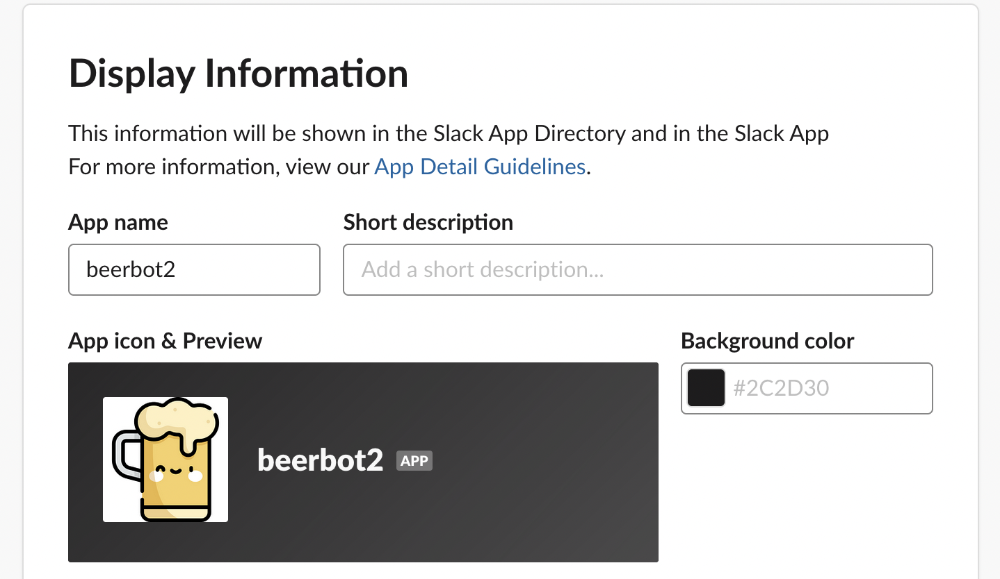

* see: `Beer icons created by Freepik - Flaticon <https://www.flaticon.com/free-icons/beer>`_           

2. Enable Socket Mode
---------------------
* Select "Socket Mode" → Turn toggle on

.. image:: images/create-bot4.png
   :width: 70%

.. revealjs-break::
   :notitle:

* Enter token name → Click "Generate"

.. image:: images/create-bot5.png
   :width: 50%

.. revealjs-break::
   :notitle:

* Get **app-level token**: ``xapp-XXX``

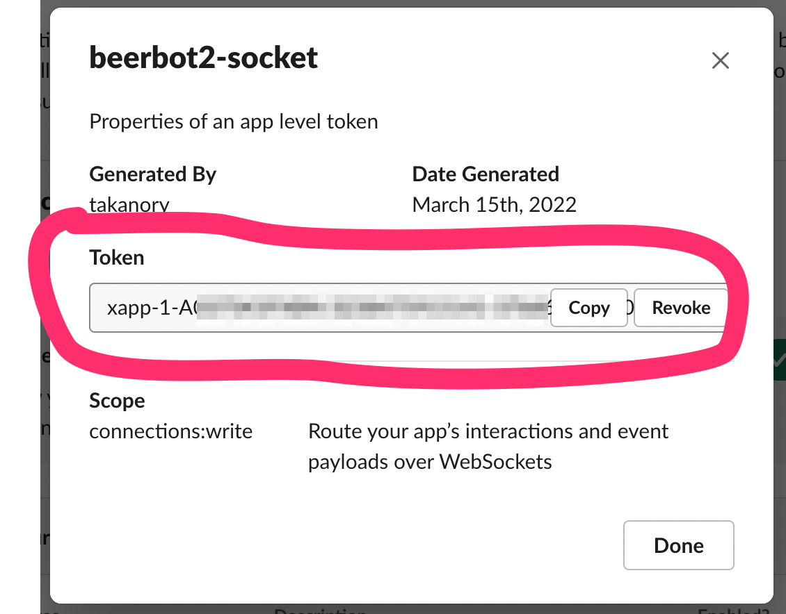

3. Subscribe bot event
----------------------
* Slect "Event Subscriptions" → Turn toggle on

.. image:: images/create-bot3-1.png
   :width: 70%

.. revealjs-break::
   :notitle:

* Add "message.channels" to bot events

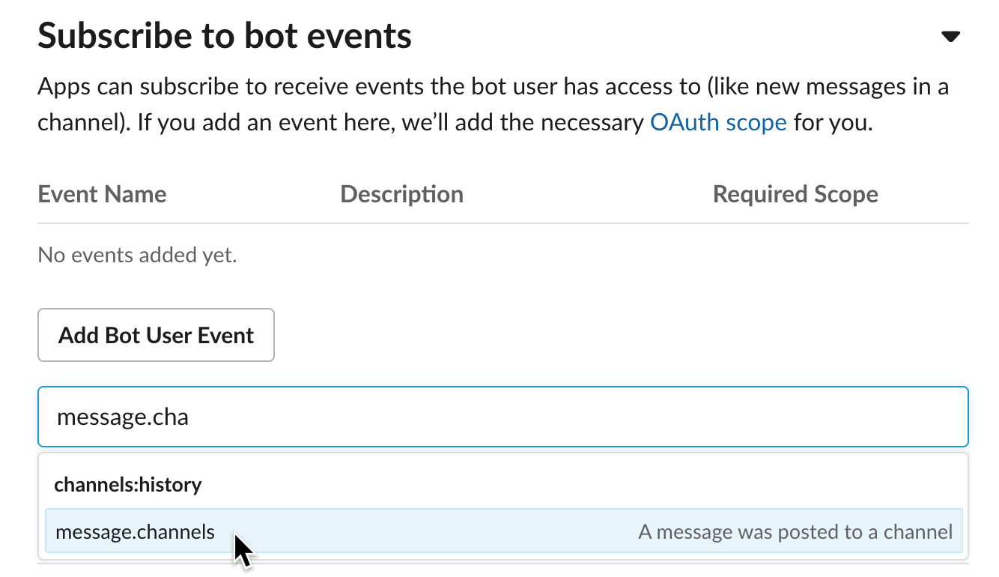

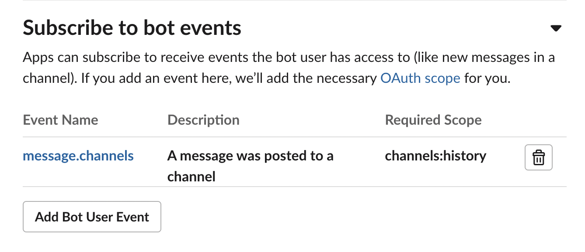

4. Add Bot Token Scopes
-----------------------
* Select "OAuth & Permissions"

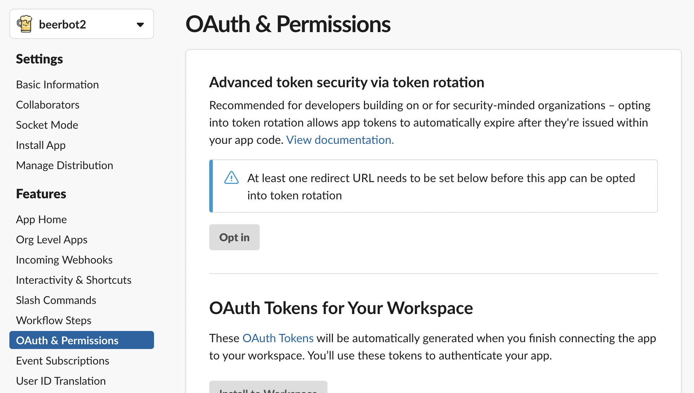

.. revealjs-break::
   :notitle:

* Click "Add on OAuth Scope"

.. image:: images/create-bot8.png
   :width: 80%

.. revealjs-break::
   :notitle:

* Add "chat:write" to Bot Token Scopes

.. image:: images/create-bot9.png
   :width: 50%

.. image:: images/create-bot10.png
   :width: 50%

5. Install App to Workspace
---------------------------
* Select "Install App" → Click "Install to Workspace"

.. image:: images/create-bot11.png
   :width: 80%

.. revealjs-break::
   :notitle:

* Switch OAuth screen → Click "Allow" button

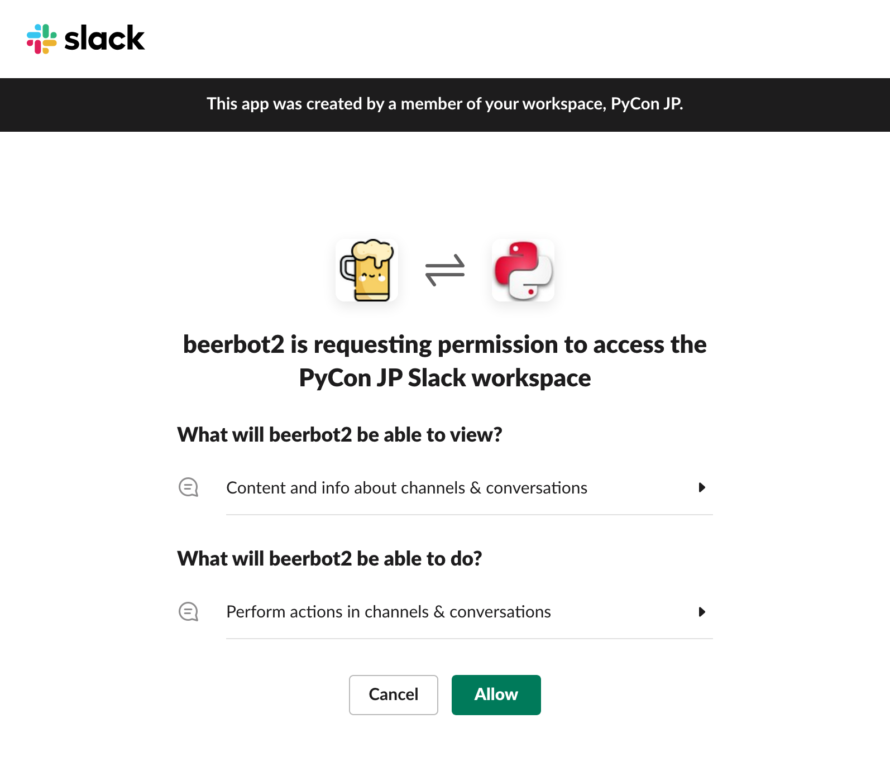

.. revealjs-break::
   :notitle:

* Get **Bot Token**: ``xoxb-XXX``

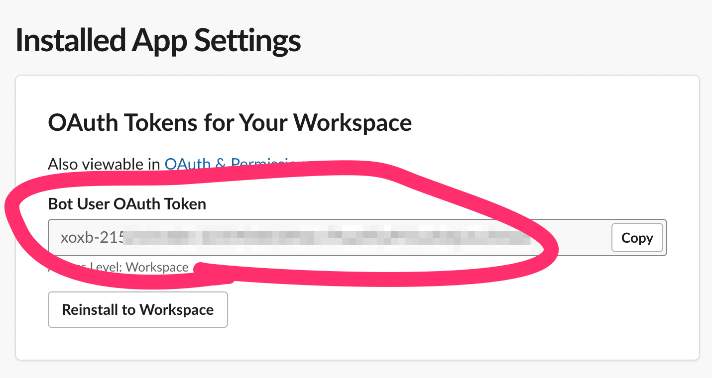

Invite bot user to channels
---------------------------
.. image:: images/invite-bot.png
   :width: 50%

Long and Hard? 🤯
=================

.. ステップが長くて難しいですか?

App **Manifest** ⚙️
===================

App **Manifest**
----------------
* YAML-fomatted configuration for Slack apps
* see: `Create and configure apps with manifests <https://api.slack.com/reference/manifests>`_

Example of App Manifest
-----------------------
.. code-block:: yaml

   display_information:
     name: beerbot2
   features:
     bot_user:
       display_name: beerbot2
       always_online: false
   oauth_config:
     scopes:
       bot:
         - channels:history
         - chat:write
   settings:
     event_subscriptions:
       bot_events:
         - message.channels
     interactivity:
       is_enabled: true
     org_deploy_enabled: false
     socket_mode_enabled: true
     token_rotation_enabled: false

Get App Manifest
----------------
* Select "App Manifest" menu

.. image:: images/get-app-manifest.png
   :width: 70%

Create new app with App Manifest
--------------------------------
* Select "From an app manifest"
* Select workspace → Click "Next"

.. image:: images/app-manifest1.png
   :width: 40%

.. image:: images/app-manifest2.png
   :width: 40%

.. revealjs-break::
   :notitle:

* Enter app manifest YAML

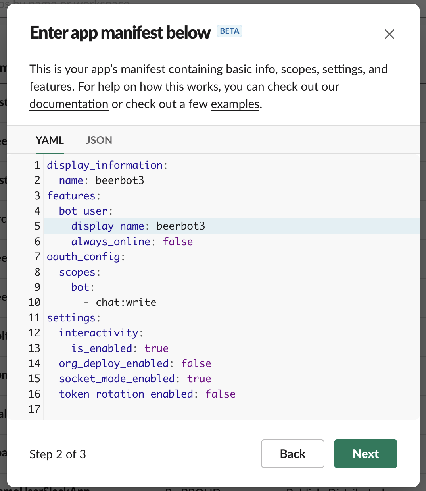

.. revealjs-break::
   :notitle:

* Review app summary → Click "Create"

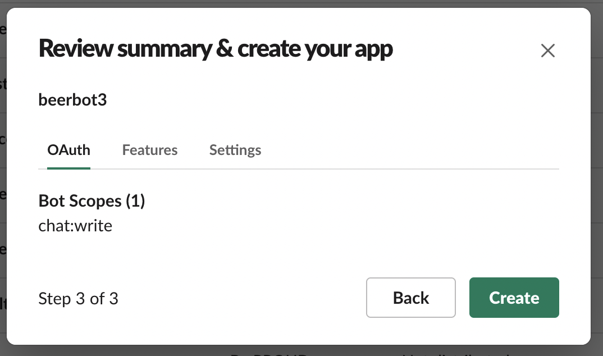

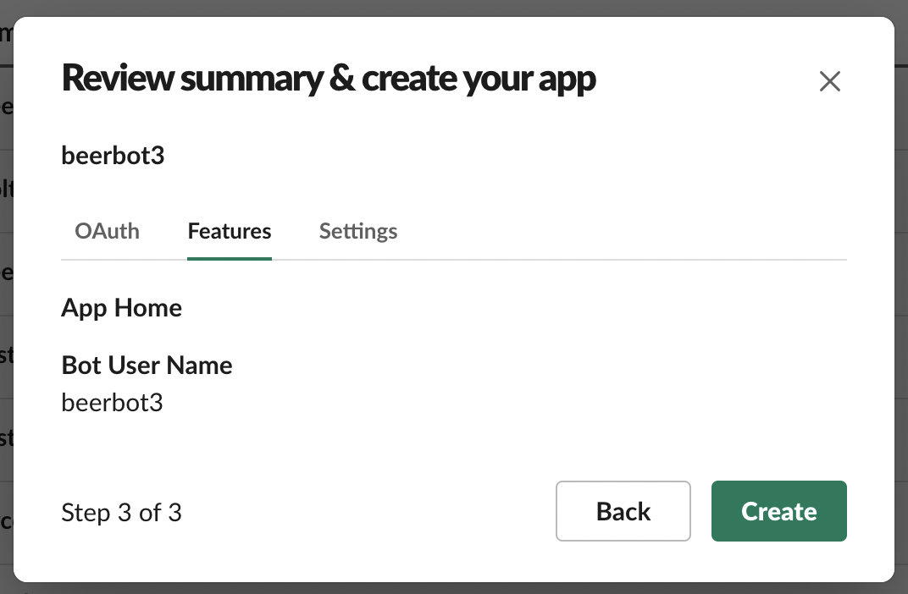

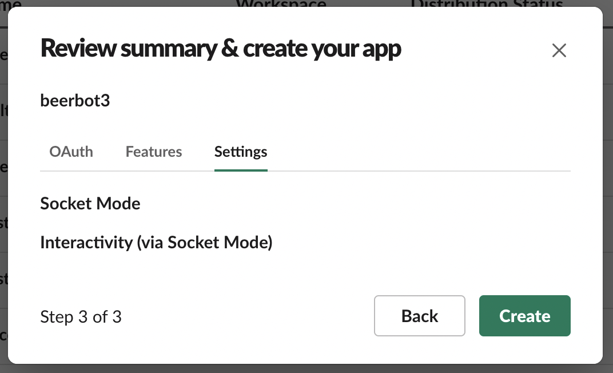

.. revealjs-break::
   :notitle:

* Install App to Workspace   

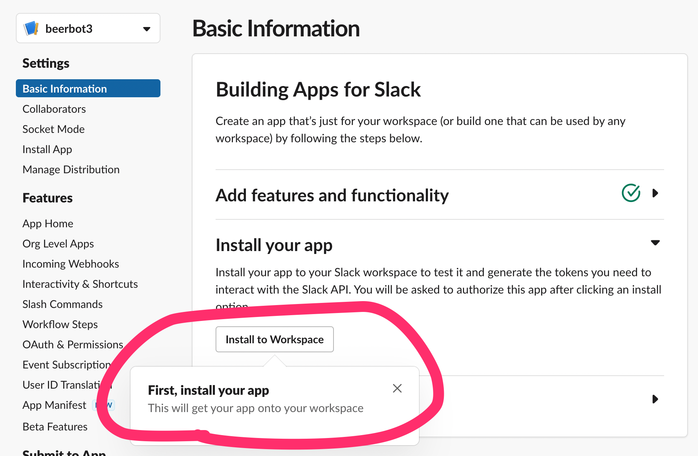

.. revealjs-break::
   :notitle:

* Generate App-Level Token

.. image:: images/app-manifest8.png
   :width: 45%

.. image:: images/app-manifest9.png
   :width: 45%

Short and Reusable !! 🥳
========================

Create bot with **Bolt** ⚡️
============================

Bolt for Python
---------------
* Python framework to build Slack app in a flash
* Developped by Slack
* |github| https://github.com/slackapi/bolt-python
* see:

  * `Bolt for Python <https://slack.dev/bolt-python/concepts>`_
  * `The Bolt family of SDKs <https://api.slack.com/tools/bolt>`_

Instal Bolt for Python
----------------------
.. code-block:: bash

   $ mkdir beerbot
   $ cd beerbot
   $ python3.10 -m venv env
   $ . env/bin/activate
   (env) $ pip install slack-bolt

Create a simple bot with Bolt
-----------------------------
.. literalinclude:: code/app1.py
   :language: python
   :caption: app.py

Run Slackbot
------------
.. code-block:: bash

   (env) $ export SLACK_APP_TOKEN=xapp-XXX
   (env) $ export SLACK_BOT_TOKEN=xoxb-XXX
   (env) $ python app.py
   ⚡️ Bolt app is running!

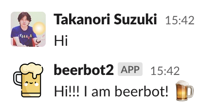

**Extend** bot 🛠
=================

``@app.message()`` decolator
----------------------------
.. literalinclude:: code/app-extend.py
   :lines: 13-23

.. image:: images/bot-decolator.png
   :width: 30%

mention
-------
.. literalinclude:: code/app-extend.py
   :lines: 25-30

.. image:: images/bot-mention.png
   :width: 30%

Using regular expression
------------------------
.. literalinclude:: code/app-extend.py
   :lines: 3-4,31-38

.. image:: images/bot-choice.png
   :width: 30%

.. revealjs-break::

.. literalinclude:: code/app-extend.py
   :lines: 39-45

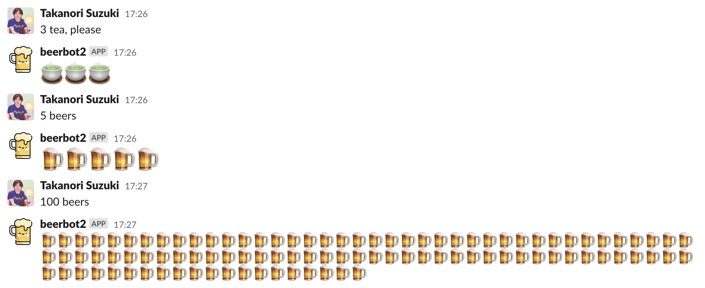

Block Kit support
-----------------
.. literalinclude:: code/app-extend.py
   :lines: 46-61

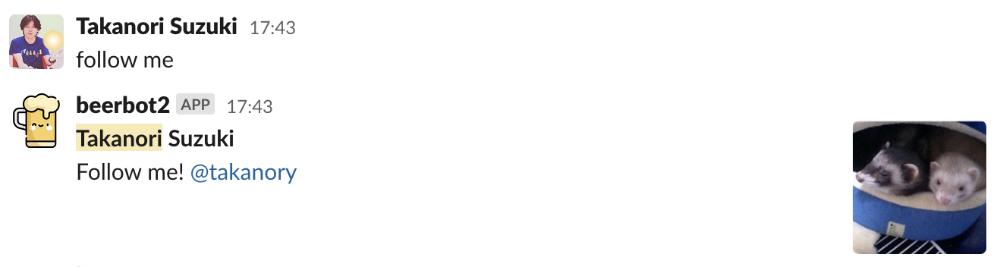

Logging
-------
.. literalinclude:: code/app-extend.py
   :lines: 1,11,78-83

.. code-block:: bash

   $ python app.py
   ⚡️ Bolt app is running!
   DEBUG:app.py:handle_log:message: log
   DEBUG:app.py:handle_log:message: please write log

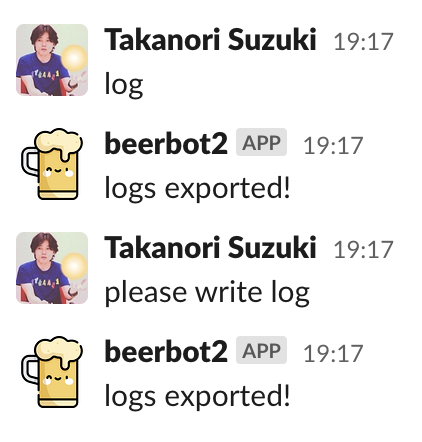

**Events** and **Scopes** 🔭
============================

Events and Scopes
-----------------
* Eventsに設定したイベントしか受け取れない
* Scopesに設定した範囲の情報しかアクセス

Current Bot Eventes and Scopes
------------------------------

* Events

  :message.channels: message posted to **public channels**

* Scopes
                   
  :channels:history: View messages in **public channels**
  :chat:write: Post message

.. revealjs-break::

* Cannot view messages in **private channels**

.. image:: images/bot-private-cannot-view.png
   :width: 50%

Add Events and Scopes for private channels
------------------------------------------

* Select "Event Subscriptions" → Click "Add Bot User Event"
* Add **message.groups** event→ Click "Save Changes"

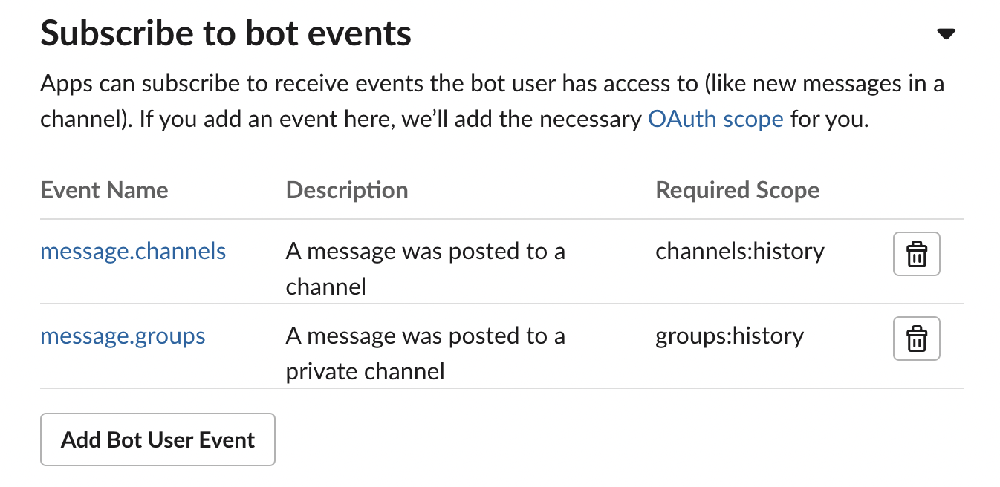

.. revealjs-break::

* Select "OAuth & Permissions"
* **groups:history** scope is added automatically
           
.. image:: images/add-events-and-scopes2.png
   :width: 50%

.. revealjs-break::

* **Reinstall** app to workspace

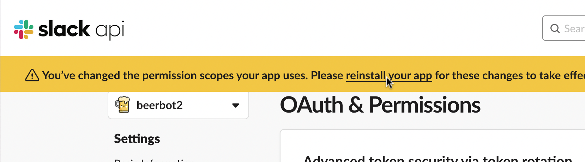

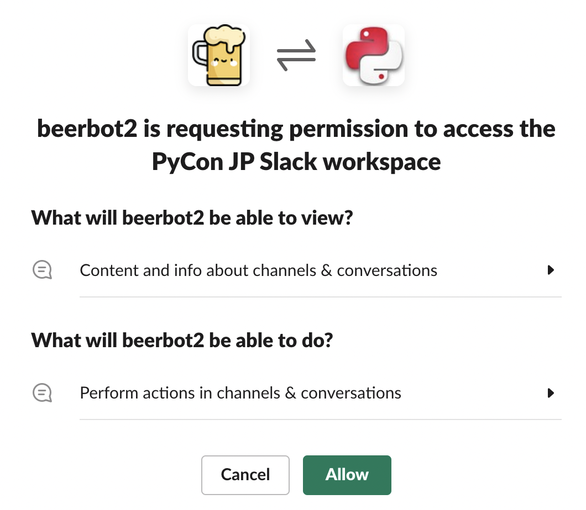
  
.. revealjs-break::

* Bot can view messages in Private Channel !!

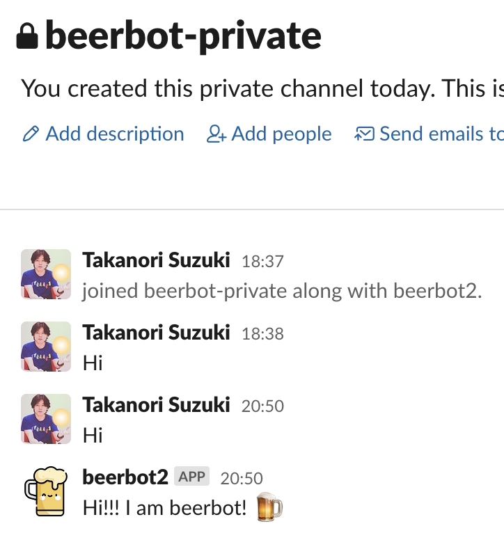

To know user joined a channel
-----------------------------
* Add **member_joined_channel** event → Reinstall app

.. literalinclude:: code/app-extend.py
   :lines: 60-66

.. image:: images/event-member-joined.png
   :width: 40%

Add Emoji reaction
------------------
* Add **reactions:write** scope → Reinstall app

.. literalinclude:: code/app-extend.py
   :language: python
   :lines: 67-75

.. image:: images/scope-reactions-write.png
   :width: 50%

**Summary** of Events and Scopes
--------------------------------
* To receive new events
* To use new API with new scope
* Add events and/or scopes → Reinstall app
* see: `Events API types <https://api.slack.com/events>`_
* see: `Permission scopes <https://api.slack.com/scopes>`_

Case studies 📚
================

Calculator function using **SymPy** 🔢
=======================================

Calculator function using **SymPy**
-----------------------------------

* Motivation

  * I feel heavy to call a calculator app on my smartphone
  * It seems useful if **Slack as a calculator**

about **SymPy**
---------------
.. image:: https://www.sympy.org/static/images/logo.png

* **SymPy**: Python library for symbolic mathematics
* `www.sympy.org <https://www.sympy.org>`_

.. code-block:: bash

   $ pip install sympy

**calc()** function using Sympy
-------------------------------

.. literalinclude:: code/app-sympy.py
   :language: python
   :lines: 6,10-24

Slack as a **calculator** !!
----------------------------

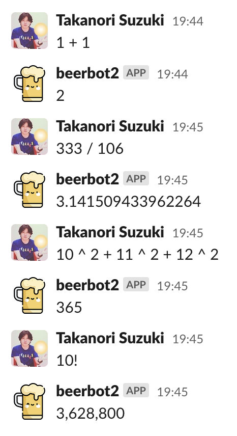

Plus-plus feature using **Peewee ORM** 👍
==========================================

Plus-plus feature using **Peewee ORM**
--------------------------------------
* Motivation

  * In PyCon JP, I want to make a culture that **appreciates** each other staff 👍

about **Peewee**
----------------
.. image:: https://docs.peewee-orm.com/en/latest/_images/peewee3-logo.png
   :width: 40%

* Simple and small ORM.

  * a small, expressive ORM
  * supports sqlite, mysql and postgresql

* `docs.peewee-orm.com <https://docs.peewee-orm.com/>`_

.. code-block:: bash

   $ pip install peewee

plusplus_model.py
-----------------
.. literalinclude:: code/plusplus_model.py

**plusplus()** function using Peewee
------------------------------------
.. literalinclude:: code/app-plusplus.py
   :language: python
   :lines: 6, 10-22

I can **appreciate** it!
------------------------

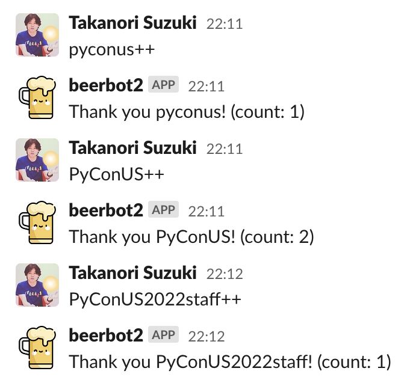

Search issues with **Jira APIs** 🔎
====================================

Search issues with **Jira APIs**
--------------------------------
* Motivation

  * Jira is very useful
  * Jira Web is **slow**
  * Search issues **without Jira Web**

System overview
---------------
* TODO: 図を入れる

about **Python Jira**
---------------------
* Python library to work with Jira APIs
* `jira.readthedocs.io <https://jira.readthedocs.io/>`_

.. code-block:: bash

   $ pip install jira

Authentication
--------------
* Create an API token

  * see: `Manage API tokens for your Atlassian account <https://support.atlassian.com/atlassian-account/docs/manage-api-tokens-for-your-atlassian-account/>`_

.. code-block:: python

   from jira import JIRA

   url = 'https://jira.atlassian.com/'
   jira = JIRA(url, basic_auth=('email', 'API token'))

* see: `2.1.2. Authentication <https://jira.readthedocs.io/examples.html#authentication>`_

Search issues
-------------
.. literalinclude:: code/app-jira.py
   :lines: 15-29
   
* see: `2.1.6. Searching <https://jira.readthedocs.io/examples.html#searching>`_
* see: `JQL: Get started with advanced search in Jira <https://www.atlassian.com/software/jira/guides/expand-jira/jql#advanced-search>`_

**Free** from Jira web!
-----------------------
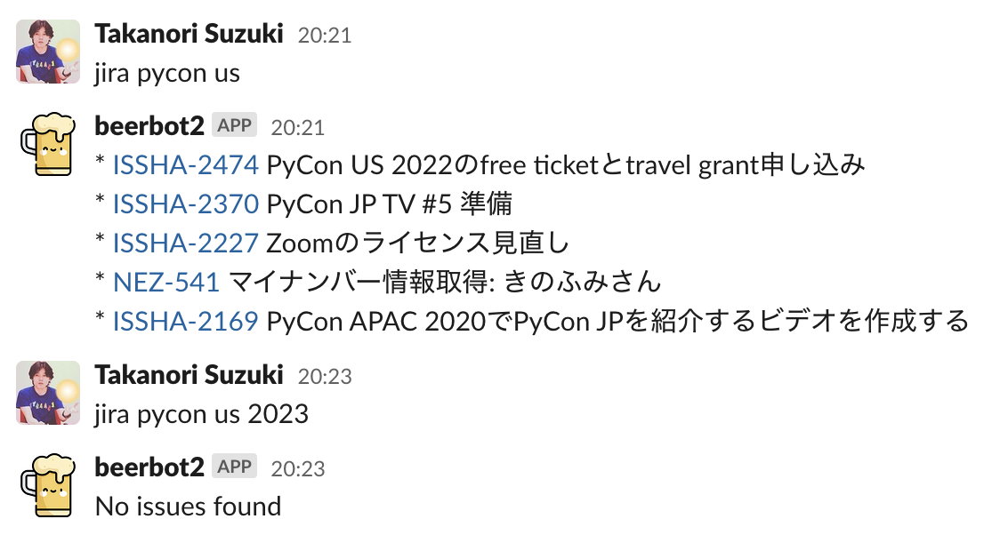

Create **multiple issues** from a template 📝
=============================================

Create **multiple issues** from a template
------------------------------------------
* Motivation

  * In pycamp event, **20+ issues** are required for each event
  * Copying issues by hand is **painful**
  * Jira Web is **slow** (again)

System overview
---------------
* TODO: 図を入れる

Google Authorization is Complex
-------------------------------
* Create a Google Cloud project

  * Enable API(in this case: Google Sheets API)
  * Download ``credentials.json``
* Install Google Client Library

  .. code-block:: bash

     $ pip install google-api-python-client \
       google-auth-httplib2 google-auth-oauthlib

* Download `quickstart.py <https://github.com/googleworkspace/python-samples/blob/master/sheets/quickstart/quickstart.py>`_ from GitHub

.. revealjs-break::

* Run ``quickstart.py``

  * Select your Google account in Web browser
  * Click "Accept" button
  * Get ``token.json`` (finish!!)

.. code-block:: bash

   $ python quickstart.py
   Please visit this URL to authorize this application: https://accounts.google.com/o/oauth2/auth?....
   Name, Major:
   Alexandra, English
   :

* see: `Python Quickstart | Sheets API <https://developers.google.com/sheets/api/quickstart/python>`_

Issue template
--------------
.. image:: images/bot-issue-template.png

Get Spreadsheet date
--------------------
.. code-block:: python

   from google.oauth2.credentials import Credentials
   from googleapiclient.discovery import build

   SCOPES = ["https://www.googleapis.com/auth/spreadsheets.readonly"]
   SHEET = "1i3YQPObe3ZC_i1Jalo44_2_XXXX"

   @app.message("create issues")
   def creaete_issues(message, say):
       creds = Credentials.from_authorized_user_file('token.json', SCOPES)
       service = build('sheets', 'v4', credentials=creds)
       sheet = service.spreadsheets()
       result = sheet.values().get(spreadsheetId=SHEET, range="A2:C4").execute()
       for row in result.get("values", []):
           say(f"* Title: {row[0]}, Delta: {row[1]}")
                
* see: `Method: spreadsheets.values.get | Sheets API <https://developers.google.com/sheets/api/reference/rest/v4/spreadsheets.values/get>`_

.. revealjs-break::

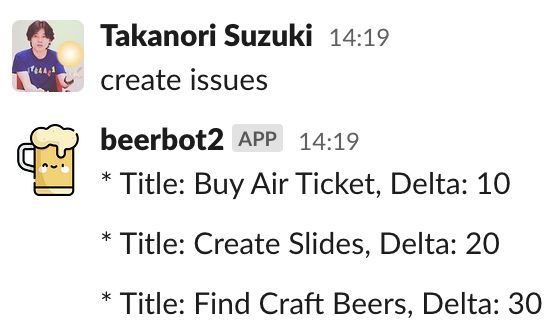

Create Jira issues
------------------
.. literalinclude:: code/app-sheet.py
   :lines: 21, 27-39
   :language: python

* see: `2.1.4. Issues <https://jira.readthedocs.io/examples.html#issues>`_

**Free** from copying issues!
-----------------------------
.. image:: images/bot-sheet2.png
   :width: 30%

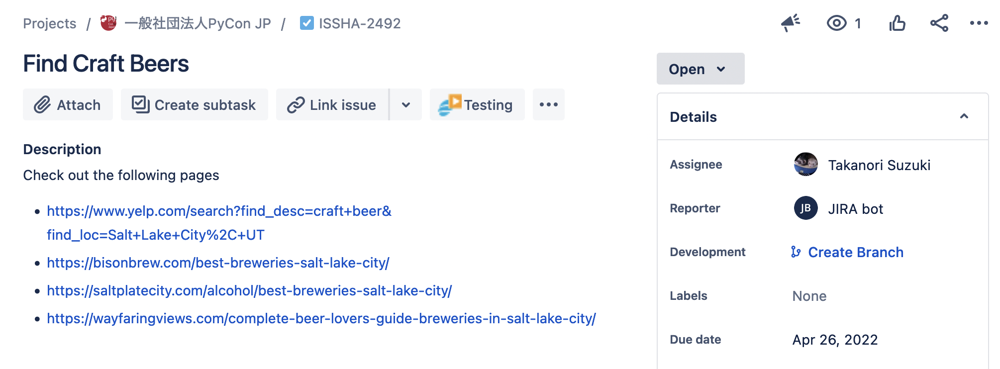

**Account management** of Google Workspace 👥
==============================================

**Account management** of Google Workspace
------------------------------------------
* Motivation

  * PyCon JP Association use ``pycon.jp`` domain with Google Workspace
  * I only use Google Admin web occasionally
  * I **forgot** to use admin screen

System overview
---------------
* TODO: 図を入れる

Update Google Authorization
---------------------------
* Update a Google Cloud project

  * add **Directory API**
  * re-download ``credentials.json``
* Remove ``token.json``
* Add **Directory API** ``quickstart.py``

  * Re-run ``quickstart.py``
  * Get new ``token.json``

Get user list
-------------
.. literalinclude:: code/app-admin.py
   :language: python
   :lines: 11, 13-26

* see: `Method: users.list | Directory API <https://developers.google.com/admin-sdk/directory/reference/rest/v1/users/list>`_

.. revealjs-break::

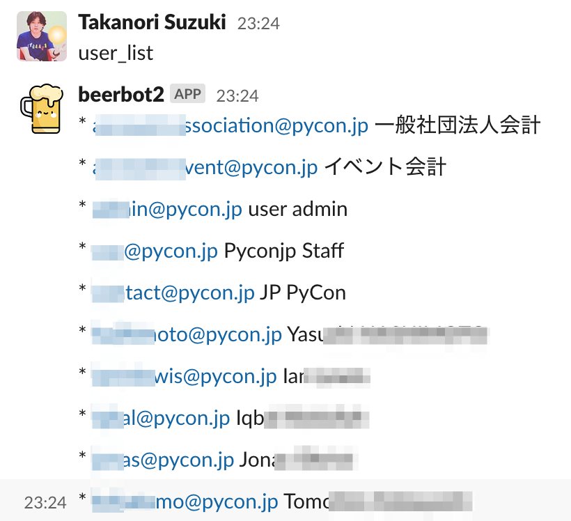

Add user
--------
.. literalinclude:: code/app-admin.py
   :language: python
   :lines: 28-42

* see: `Method: users.insert | Directory API <https://developers.google.com/admin-sdk/directory/reference/rest/v1/users/insert>`_

.. revealjs-break::

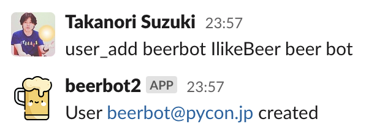

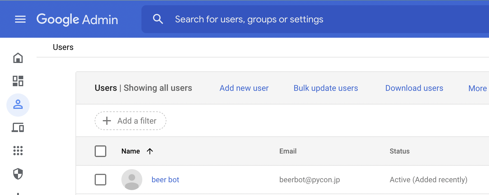

I can **forget** Google Admin!
------------------------------

Summary
=======
* Incoming Webhooks
* Bolt for Python

  * with Libraries, APIs

Next Step 🪜
============
* Let's make **your Slackbot**
* Let's connect with libraries and APIs
* Automate your Boring Stuff with Slackbot

Thank you! 🙏
==============
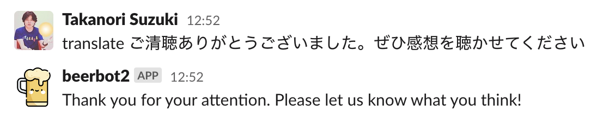

|twitter| `@takanory <https://twitter.com/takanory>`_

|github| `github.com/takanory/slides <https://github.com/takanory/slides>`_

translate command
-----------------
.. code-block:: bash

   $ pip install deepl

.. literalinclude:: code/app-deepl.py
   :lines: 6, 9-10, 12-18

Thank you! 🙏
--------------

|twitter| `@takanory <https://twitter.com/takanory>`_

|github| `github.com/takanory/slides <https://github.com/takanory/slides>`_
