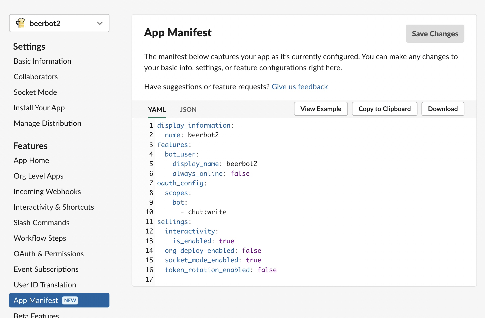

======================================================
 Automate the Boring Stuff with **Slackbot** (ver. 2)
======================================================

Takanori Suzuki

PyCon US 2022 / 2022 Apr 29

.. Thank you for coming to my presentation.
   I am very happy to be able to talk in PyCon US.

Agenda
======
* **Background** and **Motivation** for Slackbot
* How to create **simple** chatbot
* How to create **interactive** bot
* How to **extend** bot using libs and APIs

.. Today, I will talk about...

Photos 📷 Tweets 🐦 👍
=========================

`#pyconus2022` / `@takanory`

.. I'd be happy to take pictures and share them and give you feedback on Twitter, etc.
   Hashtag is #pyconus2022

Slide 💻
---------
`slides.takanory.net <https://slides.takanory.net>`__

.. This slide available on slides.takanory.net.
   And I've already shared this slide on Twitter.

Why **ver. 2** in the title?
============================
.. なぜタイトルにver. 2が付いているか

Back to **2020**
================
.. 2020にトークが採用されたけど急遽オンラインになった
   ビデオ提供したけど発表したって感じしない
   https://us.pycon.org/2020/
   今回、同じ内容を更新して発表する。発表できてうれしい

Who am I? 👤
=============
* Takanori Suzuki / 鈴木 たかのり (|twitter| `@takanory <https://twitter.com/takanory>`_)
* Vice Chair of `PyCon JP Association <https://www.pycon.jp/>`_
* Director of `BeProud Inc. <https://www.beproud.jp/>`_
* `Python Boot Camp <https://www.pycon.jp/support/bootcamp.html>`_, `Python mini Hack-a-thon <https://pyhack.connpass.com/>`_, `Python Bouldering Club <https://kabepy.connpass.com/>`_

.. image:: /assets/images/sokidan-square.jpg

.. Before the main topic,...I will introduce myself.
   I'm Takanori Suzuki. My twitter is "takanory", please follow me.
   I'm Vice-Chairperson of PyCon JP Association.
   And I'm director of BeProud Inc.
   I'm also active in several Python related communities

PyCon JP 🇯🇵
------------
* Date: 2022 XXX XXX
* Venue: Tokyo, Japan

**Background** and **Motivation**
=================================

.. First, I will talk about the Background and Motivation of this talk.

Conference **Tasks**
--------------------
* I held PyCon JP(2014-2016) as Chair
* Conference tasks:

  * 👨‍💻 Keynotes, Talks and Trainings arrangement
  * 🎫 Ticket sales and reception
  * 🏬 Venue and facility(WiFi, Video...) management
  * 🍱 Foods, ☕️ Coffee, 🧁 Snacks and 🍺 Beers

.. I held PyCon JP event several years in the past.
   As you can imagine, lots of tasks to hold Conference.
   For example, talk arrangements, ticket sales, venue management, food...
   And, ...

Staff ask me the **same things**
--------------------------------
* 40+ staff
* 🐣 NEW staff : 🐔 OLD staff = 50 : 50

.. The number of PyCon JP staff is 40 over, half of them are the new staff.
   New staff ask similar things to me. And I send similar answers repeatedly.
   But, ...

Programmer is **Lazy**
======================
.. As you know, programmers dislike routine work. I also dislike it VERY much.

Let's create a **secretary**!!
==============================
.. I want someone to do my bothersome tasks instead of me like a secretary.
   Let's make it.

Goal
====
* How to create **simple** bot
* How to create **interactive** bot
* How to **extend** bot using libs and APIs

.. The goal of this talk.
   You'll learn how to create simple bot,
   how to create interactive bot,
   how to extend bot using libraries and APIs through various case studies.

Why **Slack** ?
===============
* Launching the Slack app at any time 💻 📱
* **Easy** to access Slack
* To do **everything** in Slack

.. image:: /20190224pyconapac/images/slack.png
   :width: 60%
	
.. My secretary is chatbot of Slack.
   Is there someone using Slack?
   I'm Launching the Slack application at any time on PC and smartphone.
   So it's easy to access Slack. I want to do everything in Slack.
   Let's make chatbot on Slack.

Simple integration with **Incoming Webhooks** 🪝
================================================

System overview
---------------
TODO: 図を入れる

**Create** Incoming Webhooks Integration 🔧
===========================================

**Create** Incoming Webhooks Integration
----------------------------------------
* Generate Webhook URL

  1. Create a Slack app
  2. Activate Incoming Webhooks in the app
  3. Add Webhook to Workspace
* see: `Sending messages using Incoming Webhooks <https://api.slack.com/messaging/webhooks>`_

1-1. Create New App
-------------------
* https://api.slack.com/apps

.. image:: images/create-webhook1-1.png
   :width: 50%

.. image:: images/create-webhook1-2.png
   :width: 50%
     
1-2. Name app & choose workspace
--------------------------------
.. image:: images/create-webhook2.png
   :width: 50%
     
1-3. Set app icon (optional)
----------------------------
.. image:: images/create-webhook3.png
   :width: 50%

* see: `Beer icons created by Freepik - Flaticon <https://www.flaticon.com/free-icons/beer>`_           
     
2. Activate Incoming Webhooks
-----------------------------
.. image:: images/create-webhook4-1.png
   :width: 50%

3-1. Add New Webhook to Workspace
---------------------------------
.. image:: images/create-webhook4-2.png
   :width: 50%
     
3-2. Allow app to channel
-------------------------
.. image:: images/create-webhook5.png
   :width: 50%
     
3-3. Get Webhook URL
--------------------
.. image:: images/create-webhook6.png
   :width: 50%

Post message via **Webhook URL** 📬
===================================

Post message with **cURL**
--------------------------

.. code-block:: bash

   $ curl -X POST -H 'Content-type: application/json' \
   > --data '{"text":"Hello Slack!"}' \
   > https://hooks.slack.com/services/T000...

.. image:: images/webhook-curl.png

Post message with **Python**
----------------------------
* see: `urllib.request <https://docs.python.org/3/library/urllib.request.html>`_

.. code-block:: python

   import json
   from urllib import request

   url = "https://hooks.slack.com/services/T000..."
   message = {"text": "Hello from Python!"}
   data = json.dumps(message).encode()
   request.urlopen(url, data=data)
           
.. image:: images/webhook-python.png

Post message with **Requests**
------------------------------
* see: `Requests <https://docs.python-requests.org/en/latest/>`_

.. code-block:: bash

   $ pip install requests
   
.. code-block:: python

   import requests

   url = "https://hooks.slack.com/services/T000..."
   message = {"text": "Hello from Requests!"}
   r = requests.post(url, json=message)
     
.. image:: images/webhook-requests.png

Post message with **Slack SDK**
-------------------------------
* see: `Python Slack SDK <https://slack.dev/python-slack-sdk/>`_

.. code-block:: bash

   $ pip install slack-sdk
   
.. code-block:: python

   from slack_sdk.webhook import WebhookClient

   url = "https://hooks.slack.com/services/T000..."
   webhook = WebhookClient(url)
   r = webhook.send(text="Hello from Slack SDK!")
     
.. image:: images/webhook-slacksdk.png

**Formatting** text
-------------------
* see: `Formatting text for app surfaces <https://api.slack.com/reference/surfaces/formatting>`_

.. revealjs-code-block:: python
   :data-line-numbers: 4-7

   from slack_sdk.webhook import WebhookClient

   url = "https://hooks.slack.com/services/T000..."
   webhook = WebhookClient(url)
   # *bold*, <url|text>, :emoji: and etc.
   r = webhook.send(text="*Hello* from "
     "<https://slack.dev/python-slack-sdk/|Slack SDK>! :beer:")
     
.. image:: images/webhook-formatting.gif

Message **Attachments**
-----------------------

.. revealjs-code-block:: python
   :data-line-numbers: 1-11

   fields = [
       {"title": "Love", "value": ":beer:, Ferrets, LEGO", "short": True},
       {"title": "From", "value": "Japan :jp:", "short": True},
   ]
   attachments =  [{
       "pretext": "Nice to meet you!!",
       "author_name": "Takanori Suzuki",
       "text": "*THANK YOU* for coming to my talk !:tada: Please give me *feedback* about this talk :bow:",
       "fields": fields,
   }]

   response = webhook.send(attachments=attachments)

.. image:: images/webhook-attachments.png

Message **Attachments**
-----------------------
* Message Attachments is **Legacy**

    This feature is a legacy part of messaging functionality for Slack apps.

* see: `Reference: Secondary message attachments <https://api.slack.com/reference/messaging/attachments>`_

.. attachmentsのBlock

**Block** Kit 🧱
================

**Block** Kit
-------------
  A clean and consistent UI framework for Slack apps

* Blocks

  * Elements

    * Composition objects
* see: `Block Kit <https://api.slack.com/block-kit>`_

* TODO: 図にする
* Block Kitは1つ以上のBlockの中にElementを配置してメッセージを作成する

**Example** of Block Kit
------------------------
.. code-block:: python

   blocks = [{
       "type": "section",
       "text": {
            "text": "*THANK YOU* for coming to my talk !:tada: Please give me *feedback* about this talk :bow:",
            "type": "mrkdwn"
       },
       "fields": [
            {"type": "mrkdwn", "text": "*Love*"},
            {"type": "mrkdwn", "text": "*From*"},
            {"type": "plain_text", "text": ":beer:, Ferrets, LEGO"},
            {"type": "plain_text", "text": "Japan :jp:"},
       ],
   }]
   response = webhook.send(blocks=blocks)

.. image:: images/webhook-blocks.png

**Seciton** Block
-----------------
* Section Block with ``text`` and ``fields`` Field

.. revealjs-code-block:: python
   :data-line-numbers: 2,3,7

   blocks = [{
       "type": "section",  # Section Block
       "text": {  # text Field
            "text": "*THANK YOU* for coming to my talk !:tada: Please give me *feedback* about this talk :bow:",
            "type": "mrkdwn"
       },
       "fields": [  # fields Field
            {"type": "mrkdwn", "text": "*Love*"},
            {"type": "mrkdwn", "text": "*From*"},
            {"type": "plain_text", "text": ":beer:, Ferrets, LEGO"},
            {"type": "plain_text", "text": "Japan :jp:"},
       ],
   }]
   response = webhook.send(blocks=blocks)

* see: `Section Block <https://api.slack.com/reference/block-kit/blocks#section>`_

Block Kit **Builder**
---------------------
* ブロックキット複雑なのでBuilderで作れる
* `app.slack.com/block-kit-builder/ <https://app.slack.com/block-kit-builder/>`_

.. raw:: html

   <video src="../_images/block-kit-buiilder.mov"></video>

.. image:: images/block-kit-buiilder.mov

Summary of Incoming **Webhooks**
================================
* **Easy** to post messages from programs 📬
* Create complex messages with **Block Kit** 🧱
* But **one-way** (program➡️Webhook➡️Slack)

**Interactive** bot 🤝
======================

System overview
---------------
* TODO: 図を入れる
* Events APIとSocket Modeがあることを説明
* 公開するエンドポイントを用意するのが難しい場合はSocket Modeが便利

  * ここではSocket Modeで説明をしていく
* https://api.slack.com/apis/connections/events-api

**Create** bot user 🤖
======================

**Create** bot user
-------------------
* Create bot user

  1. Create a Slack app (same procedure)
  2. Enable Socket Mode
  3. Add Bot Token Scopes
  4. Install App to Workspace

1-1. Create New App
-------------------
* https://api.slack.com/apps

.. image:: images/create-webhook1-1.png
   :width: 50%

.. image:: images/create-webhook1-2.png
   :width: 50%
     
1-2. Name app & choose workspace
--------------------------------
.. image:: images/create-bot2.png
   :width: 50%
     
1-3. Set app icon (optional)
----------------------------
.. image:: images/create-bot3.png
   :width: 50%

* see: `Beer icons created by Freepik - Flaticon <https://www.flaticon.com/free-icons/beer>`_           

2-1. Enable Socket Mode
-----------------------
* Select "Socket Mode" menu
* Enable Socket Mode toggle

.. image:: images/create-bot4.png
   :width: 70%

2-2. Generate app-level token
-----------------------------
.. image:: images/create-bot5.png
   :width: 50%

2-2. Get app-level token
------------------------
.. image:: images/create-bot6.png
   :width: 50%

3-1. Select "OAuth & Permissions"
---------------------------------
.. image:: images/create-bot7.png
   :width: 80%

3-2. Add an OAuth Scope
-----------------------
* Click "Add on OAuth Scope"

.. image:: images/create-bot8.png
   :width: 80%

3-3. Add "chat:write" to Scopes
-------------------------------
.. image:: images/create-bot9.png
   :width: 50%

.. image:: images/create-bot10.png
   :width: 50%

4-1. Install App to Workspace
-----------------------------
* Select "Install App" menu
* Click "Install to Workspace"

.. image:: images/create-bot11.png
   :width: 80%

4-2. Allow app to Workspace
---------------------------
.. image:: images/create-bot12.png
   :width: 50%

4-2. Get Bot Token
------------------
.. image:: images/create-bot13.png
   :width: 50%

Long and Hard? 🤯
=================

.. ステップが長くて難しいですか?

App **Manifest** ⚙️
===================

App **Manifest**
----------------
* YAML-fomatted configuration for Slack apps
* see: `Create and configure apps with manifests <https://api.slack.com/reference/manifests>`_

Example of App Manifest
-----------------------
.. code-block:: yaml

   display_information:
     name: beerbot2
   features:
     bot_user:
       display_name: beerbot2
       always_online: false
   oauth_config:
     scopes:
       bot:
         - chat:write
   settings:
     interactivity:
       is_enabled: true
     org_deploy_enabled: false
     socket_mode_enabled: true
     token_rotation_enabled: false

Get you App Manifest
--------------------
* Select "App Manifest" menu

Create new app with App Manifest (1/3)
--------------------------------------
* Select "From an app manifest"
* Select workspace

.. image:: images/app-manifest1.png
   :width: 40%

.. image:: images/app-manifest2.png
   :width: 40%

Create new app with App Manifest (2/3)
--------------------------------------
* Enter app manifest YAML

.. image:: images/app-manifest3.png
   :width: 46%

Create new app with App Manifest (3/3)
--------------------------------------
* Review app summary and create app

.. image:: images/app-manifest4.png
   :width: 40%

.. image:: images/app-manifest5.png
   :width: 40%

.. image:: images/app-manifest6.png
   :width: 40%

.. revealjs-break::

* Install App to Workspace   

.. image:: images/app-manifest7.png
   :width: 70%

Short and Reusable !! 🥳
========================

Bolt for Python
===============

* see: `Bolt for Python <https://slack.dev/bolt-python/concepts>`_

Outline
=======
- How to create chat bot with Bolt for Python (5m)

  - System overview
  - Create bot user on Slack with manifest file
  - Install Bolt for Python
  - Create a simple bot with Bolt for Python
- Extend bot (5m)
- Case study (10m)

  - Calculator function using SymPy
  - Karma function using Peewee ORM
  - Search JIRA issues and display issue

    - JIRA API and jira package
  - Create multiple issues from a template

    - motivation and overview
    - about Sheets Spreadsheet API
    - How to connect with Google API

      - Create a project on the Google Cloud Platform
  - Search files from Google Drive

    - motivation and overview
    - Add Google Drive API to the project
    - Google Drive folders are not hierarchical
    - Create folder hierarchy data
  - Account management of G Suite

    - motivation and overview
    - G Suit API
- Summary and next steps (1m)
