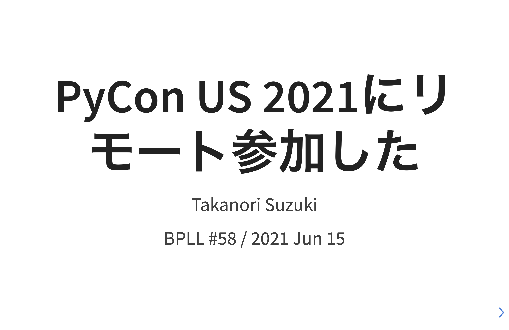
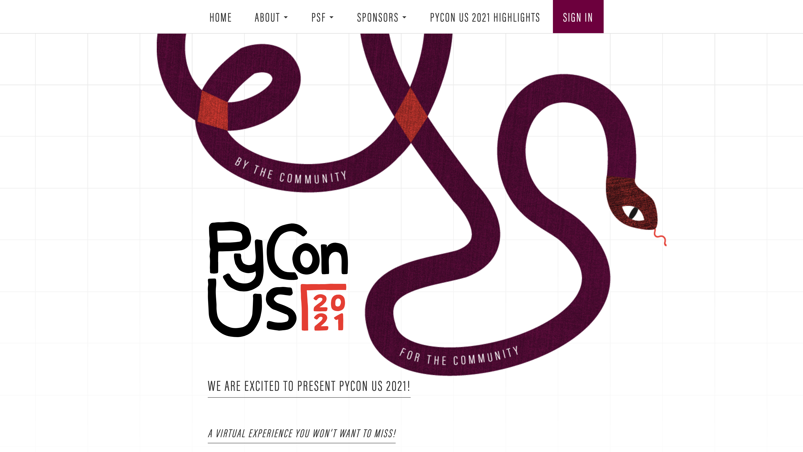
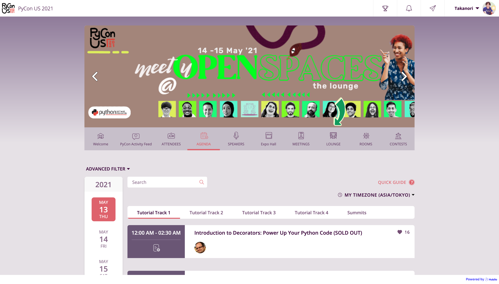
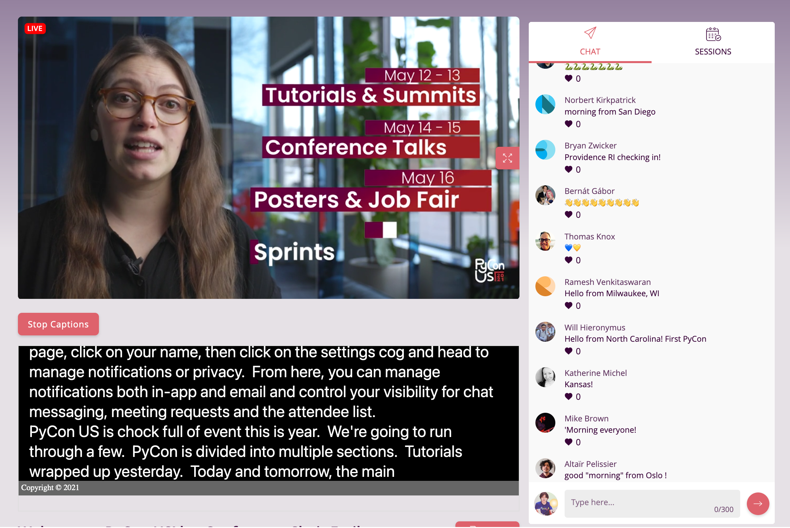
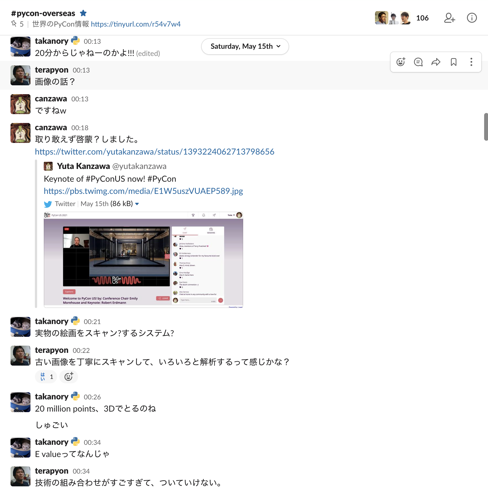
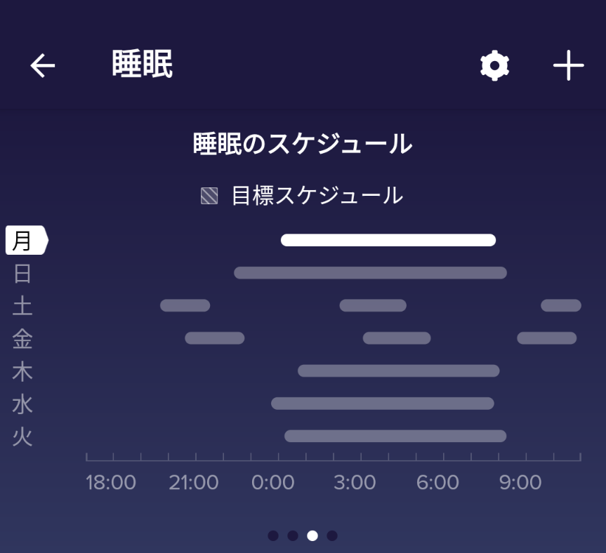
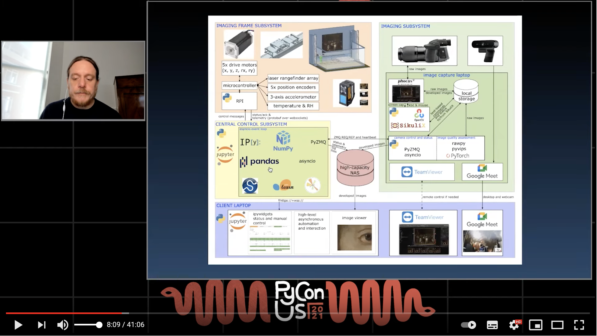
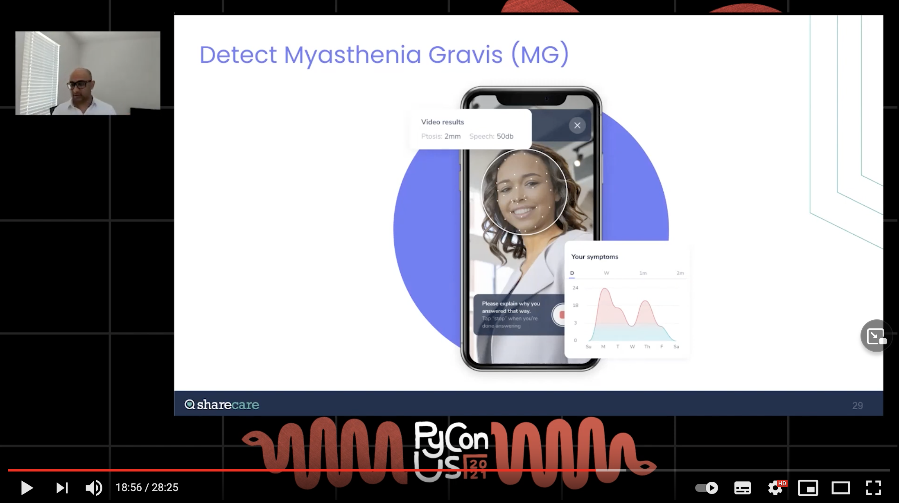
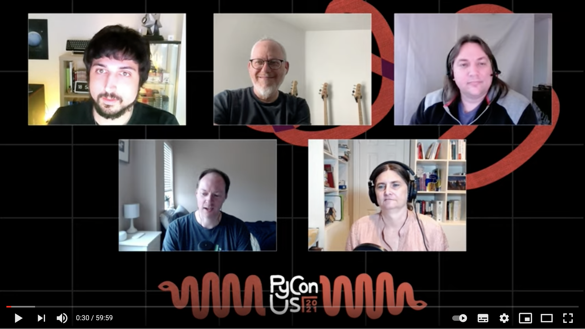
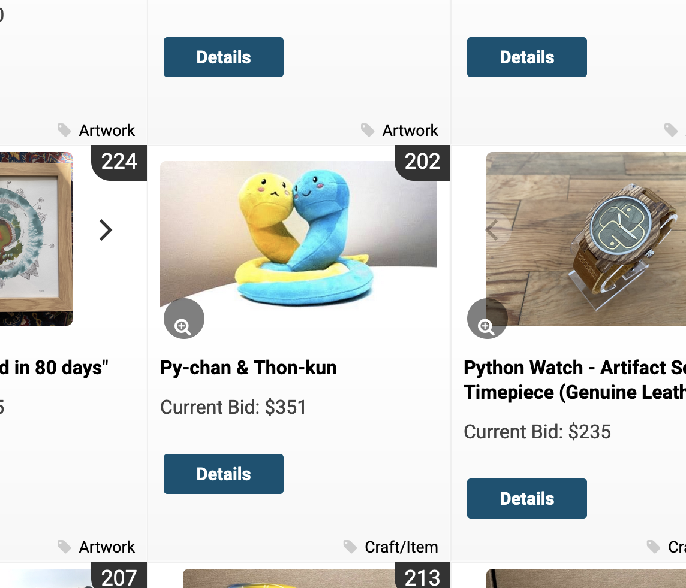

:og:image: _images/20210615bpll.png

=================================
 PyCon US 2021にリモート参加した
=================================

Takanori Suzuki

BPLL #58 / 2021 Jun 15

最初に質問
==========

PyCon 知ってる人? 🙋‍♀️
-----------------------

PyCon 参加したことある人? 🙋‍♂️
-------------------------------

PyCon とは
==========
* Python Conferenecの略
* 世界中で開催されている
* 日本だと PyCon JP

PyCon US とは
-------------

* アメリカで開催されるPyCon
* 世界最大(2019年の参加者は3,000人以上)
* 2020、2021はオンライン開催に変更

PyCon US 2021
-------------

* `us.pycon.org/2021/ <https://us.pycon.org/2021/>`_

.. revealjs-break::

PyCon US 2021
-------------
* Tutorials: May 12 - 13, 2021
* Conference: May 14 - 15, 2021
* Job Fair: May 16, 2021
* Sprints: May 16 - 18, 2021

PyCon US 2021 Highlights
------------------------

* `us.pycon.org/2021/highlights/ <https://us.pycon.org/2021/highlights/>`__
* 約2,650名の参加者
* 100以上のセッション

  * 5日間で23,000のセッション視聴
* 49のバーチャルブース

  * 24,000名が参加

PyCon US 2021 に参加
--------------------

* `Hubilo <https://hubilo.com>`_ というサービスを使っているらしい

.. revealjs-break::

PyCon US 2021 に参加
--------------------

どんな感じか
------------

* 時間になると配信開始
* 基本的に事前録画されたもの
* チャットでスピーカーが質問に答えたりする
* 字幕があって便利

日本からの参加
==============

* 初日のキーノートが5月15日のAM 0:00から
* 初日のライトニングトークがAM 8:00くらい
* つらい...

.. revealjs-break::

* terapyon, canzawaも参加
* pyhack Slackでわいわいやりながらで楽しい

Slackでわいわい
---------------

でも眠かった...
---------------

トークを紹介
============

動画はYouTubeで公開
-------------------

* `www.youtube.com/c/PyConUS <https://www.youtube.com/c/PyConUS/>`_

Keynote: Robert Erdmann
-----------------------

.. revealjs-break::

* `youtu.be/z_hm5oX7ZlE <https://youtu.be/z_hm5oX7ZlE>`_
* 絵画をめっちゃ高精細なカメラで撮影
* それをpandas, scikit-learnとかでなんやかんやで超巨大イメージにする

  * 7,000億ピクセル
* とにかくすごい(語彙力)
* できあがったのが以下

  * `hiper-resolution.org <http://hyper-resolution.org/view.html?pointer=0.275,0.000&i=Rijksmuseum/SK-C-5/SK-C-5_VIS_20-um_2019-12-21>`_

Lightning Talks
---------------

* Day 1: `youtu.be/5zEn3Jta2Dg <https://youtu.be/5zEn3Jta2Dg>`_
* Day 2: `youtu.be/IUI7vHe1EHQ <https://youtu.be/IUI7vHe1EHQ>`_
* ライトニングトークはライブ
* 2名の司会と発表者が多分Zoomでつないでいる
* Day 1は自分の作ったもの紹介が多め
* Day 2はPyCon宣伝、発表初めてです、的なのが多め

.. revealjs-break::

* 発表が終わると司会のDustinがほめるのが印象的

  * 「Awosome!」「Super cool!」
* 拍手の動画を挟むのがなんかほっこりする

Keynote: Akshay Sharma
----------------------

.. revealjs-break::

* `youtu.be/Jmly1Jfbhak <https://youtu.be/Jmly1Jfbhak>`_
* デジタルヘルスケアの会社 `Sharecare <https://www.sharecare.com/>`_ の人
* ヘルスケア関連のデータが73日で2倍になってる

  * Apple Watch, fitbitとか
* 医療関連のデータから予測、予防して医療費を抑える

Keynote: Akshay Sharma
----------------------

* 医療関連のデータから予測、予防して医療費を抑える

  * 爪の写真から乾癬の重症度を測る
  * 顔写真から重症筋無力症を診断
  * ビデオや声から疾病の状態を測る
* データのプライバシーが重要
* スマートフォンにTensorFlow Liteが乗って、そこで判定
* いやー、すごい(語彙力)

Python Steering Council
=======================

.. revealjs-break::

* `youtu.be/xEkuOtCQ6vA <https://youtu.be/xEkuOtCQ6vA>`_
* \C. Willing, T. Wouters, B. Cannon, P. Galindo Salgado, B. Warsaw
* Python の方向性を決める人たち(PEPの採用)
* 毎週ミーティング(大変そう...)

Python 3.10
-----------

* パターンマッチング
* パフォーマンス改善
* typingの拡張
* よりよいデバッグ
* withで複数のコンテキストマネージャー対応
* distutilsの非推奨化

今後は
------

* Pythonの高速化、JITが中心っぽい
* Python 4の予定は今はない

  * 3.14 は super cool
* 3 -> 4 は 2 -> 3 のようにはしない

PyLadies Auction
================

* スポンサーとかから集めたものをオークション
* 収益は PyLadies の運営資金に
* オンラインだとどうなるのか?

PyLadies Auction
----------------

* `cbo.io/bidapp/ <https://cbo.io/bidapp/>`_

まとめ
======

* ぼちぼち楽しめた
* でも、とても眠かった
* 来年は現地で参加したいですね
* 興味が湧いたら YouTube で見てみよう

おしまい
========
