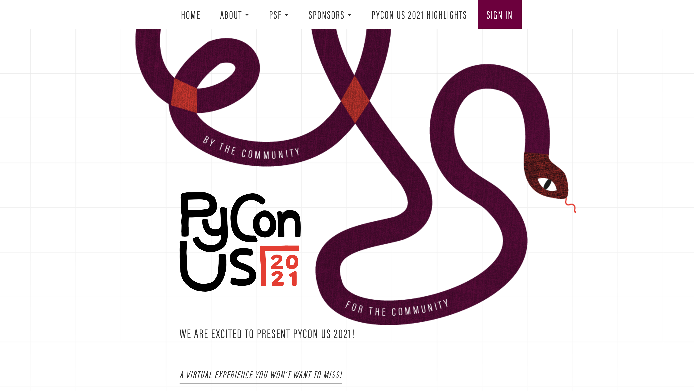
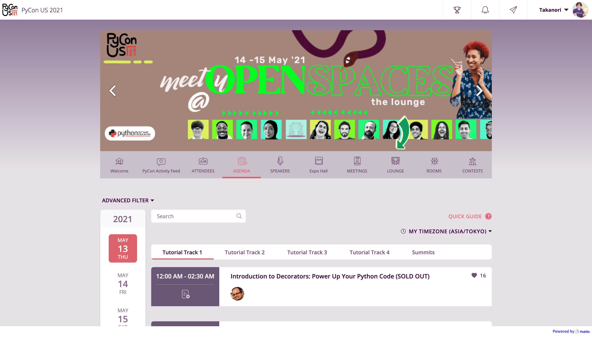
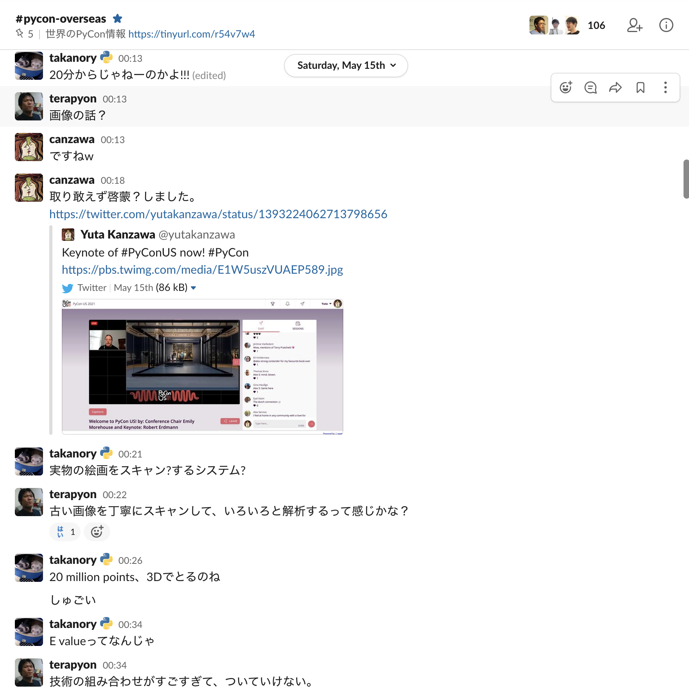
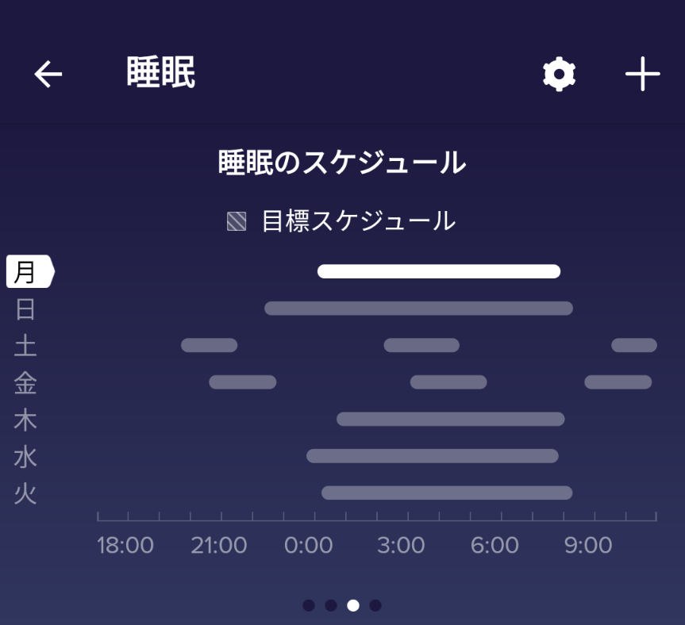
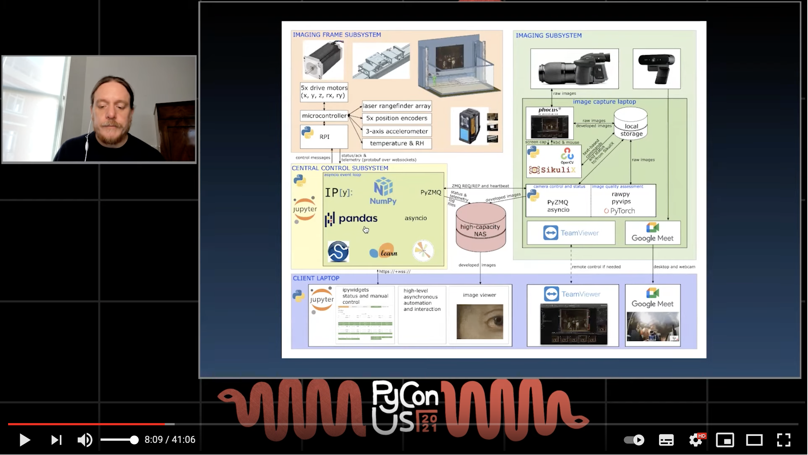
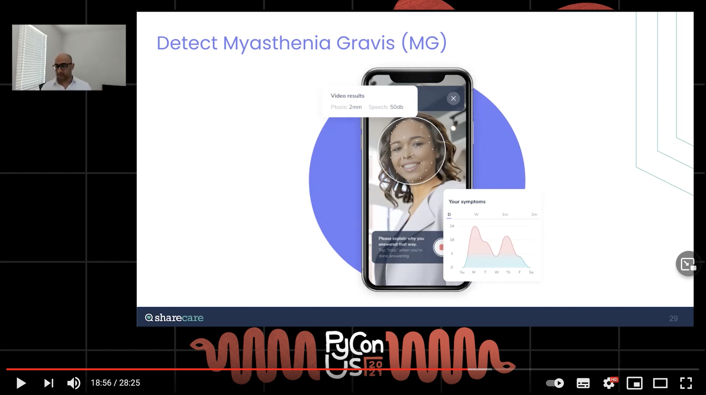
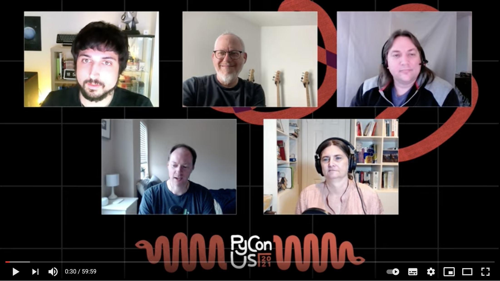
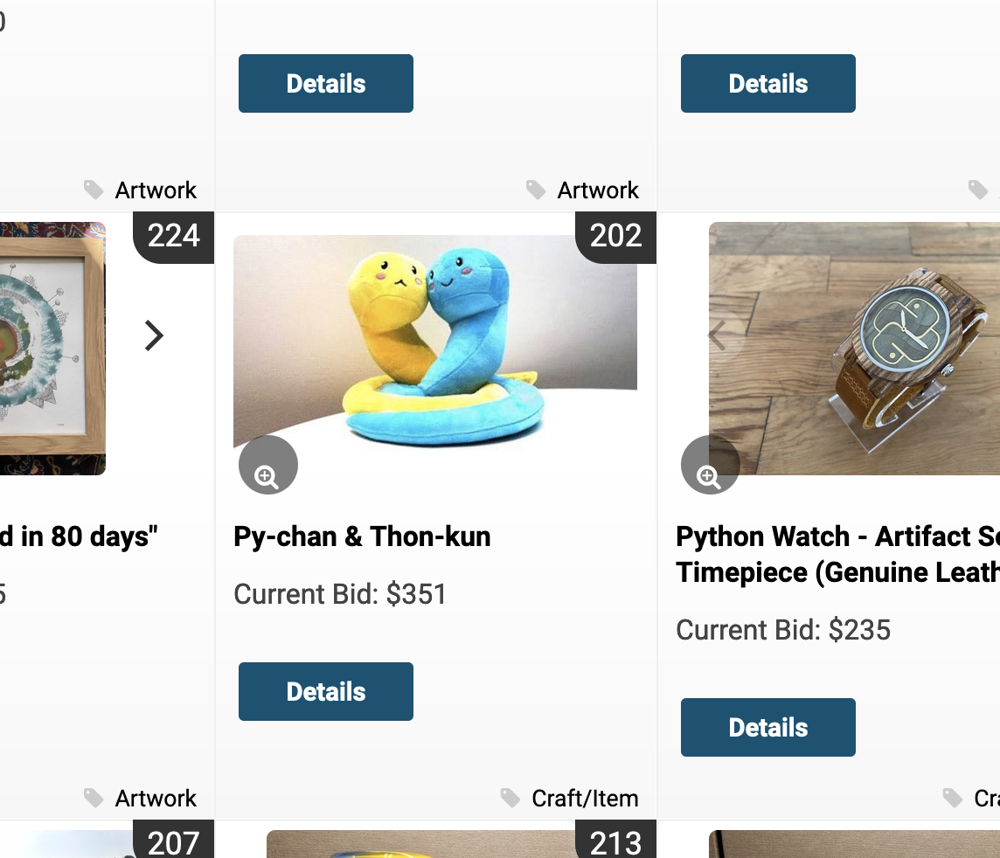

# PyCon US 2021に参加してみた

## Takanori Suzuki

BPLL #58 / 2021 Jun 15

---

### PyCon 知ってる人? 🙋‍♀️

### PyCon 参加したことある人? 🙋‍♂️

--

## PyCon とは

* Python Conferenecの略
* 世界中で開催されている
* 日本だと PyCon JP

--

## PyCon US とは

* アメリカで開催されるPyCon
* 世界最大(2019年の参加者は3,000人以上)
* 2020、2021はオンライン開催に変更

---

## PyCon US 2021

[`us.pycon.org/2021/`](https://us.pycon.org/2021/)

--

--

## PyCon US 2021

* Tutorials: May 12 - 13, 2021
* Conference: May 14 - 15, 2021
* Job Fair: May 16, 2021
* Sprints: May 16 - 18, 2021

--

## PyCon US 2021 Highlights

* [`us.pycon.org/2021/highlights/`](https://us.pycon.org/2021/highlights/)
* 約2,650名の参加者
* 100以上のセッション
    * 5日間で23,000のセッション視聴
* 49のバーチャルブース
    * 24,000名が参加

---

## PyCon US 2021 に参加

* [Hubilo](https://hubilo.com) というサービスを使っているらしい

--

--

--

## どんな感じか

* 時間になると配信開始
* 基本的に事前録画されたもの
* チャットでスピーカーが質問に答えたりする
* 字幕があって便利

---

## 日本からの参加

--

## 日本からの参加

* 初日のキーノートが5月15日のAM 0:00から
* 初日のライトニングトークがAM 8:00くらい
* つらい...

--

## 日本からの参加者

* terapyon, canzawaも参加
* pyhack Slackでわいわいやりながらで楽しい

--

## Slackでわいわい

{:height="50%" width="50%"}

--

## でも眠かった...

{:height="50%" width="50%"}

---

## トークを紹介

--

## 動画はYouTubeで公開

* [`www.youtube.com/c/PyConUS`](https://www.youtube.com/c/PyConUS/)

--

## Keynote: Robert Erdmann

--

## Keynote: Robert Erdmann

* [`youtu.be/z_hm5oX7ZlE`](https://youtu.be/z_hm5oX7ZlE)
* 絵画をめっちゃ高精細なカメラで撮影
* それをpandas, scikit-learnとかでなんやかんやで超巨大イメージにする
    * 7,000億ピクセル
* とにかくすごい(語彙力)
* できあがったのが以下
    * [`hiber-resolution.org`](http://hyper-resolution.org/view.html?pointer=0.275,0.000&i=Rijksmuseum/SK-C-5/SK-C-5_VIS_20-um_2019-12-21)

--

## Lightning Talks

* Day 1: [`youtu.be/5zEn3Jta2Dg`](https://youtu.be/5zEn3Jta2Dg)
* Day 2: [`youtu.be/IUI7vHe1EHQ`](https://youtu.be/IUI7vHe1EHQ)
* ライトニングトークはライブ
* 2名の司会と発表者が多分Zoomでつないでいる
* Day 1は自分の作ったもの紹介が多め
* Day 2はPyCon宣伝、発表初めてです、的なのが多め

--

## Lightning Talks

* 発表が終わると司会のDustinがほめるのが印象的
    * Awosome! Super cool!
* 拍手の動画を挟むのがなんかほっこりする

--

## Keynote: Akshay Sharma

 

--

## Keynote: Akshay Sharma

* [`youtu.be/Jmly1Jfbhak`](https://youtu.be/Jmly1Jfbhak)
* デジタルヘルスケアの会社 [Sharecare](https://www.sharecare.com/) の人
* ヘルスケア関連のデータが73日で2倍になってる
    * Apple Watch, fitbitとか
* 医療関連のデータから予測、予防して医療費を抑える

--

## Keynote: Akshay Sharma

* 医療関連のデータから予測、予防して医療費を抑える
    * 爪の写真から乾癬の重症度を測る
    * 顔写真から重症筋無力症を診断
    * ビデオや声から疾病の状態を測る
* データのプライバシーが重要
* スマートフォンにTensorFlow Liteが乗って、そこで判定
* いやー、すごい(語彙力)

---

## Python Steering Council

--

## Python Steering Council

* [`youtu.be/xEkuOtCQ6vA`](https://youtu.be/xEkuOtCQ6vA)
* C. Willing, T. Wouters, B. Cannon, P. Galindo Salgado, B. Warsaw
* Python の方向性を決める人たち(PEPの採用)
* 毎週ミーティング(大変そう...)

--

## Python 3.10

* パターンマッチング
* パフォーマンス改善
* typingの拡張
* よりよいデバッグ
* withで複数のコンテキストマネージャー対応
* distutilsの非推奨化

--

## 今後は

* Pythonの高速化、JITが中心っぽい
* Python 4の予定は今はない
    * 3.14 は super cool
* 3 -> 4 は 2 -> 3 のようにはしない

---

## PyLadies Auction

* スポンサーとかから集めたものをオークション
* 収益は PyLadies の運営資金に
* オンラインだとどうなるのか?

--

## PyLadies Auction

* [`cbo.io/bidapp/`](https://cbo.io/bidapp/)

{:height="60%" width="60%"}

---

## まとめ

* ぼちぼち楽しめた
* でも、とても眠かった
* 来年は現地で参加したいですね
* 興味が湧いたら YouTube で見てみよう

---

## おしまい
