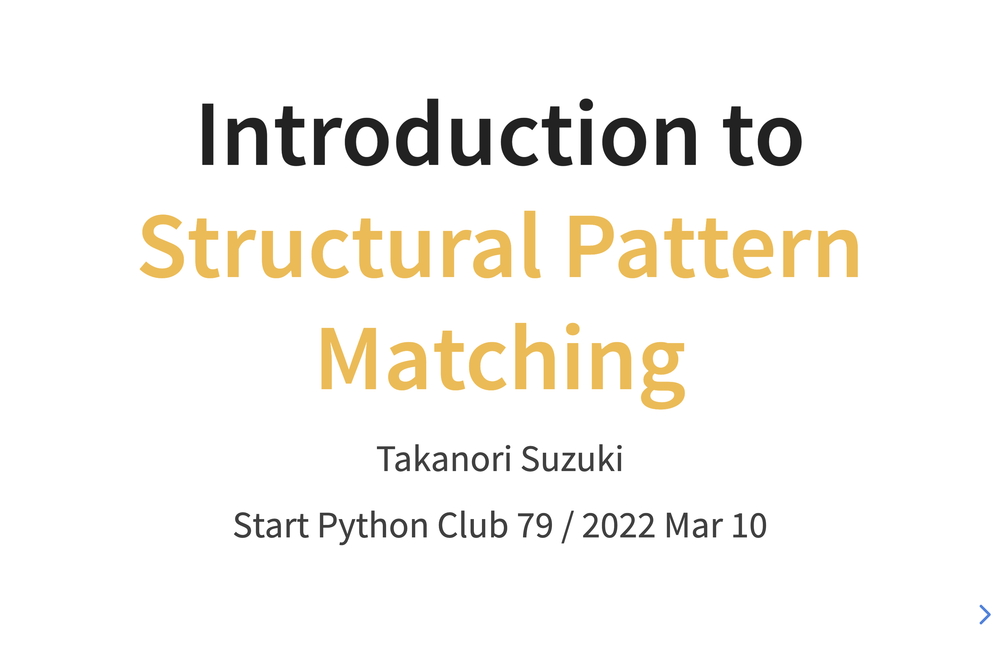
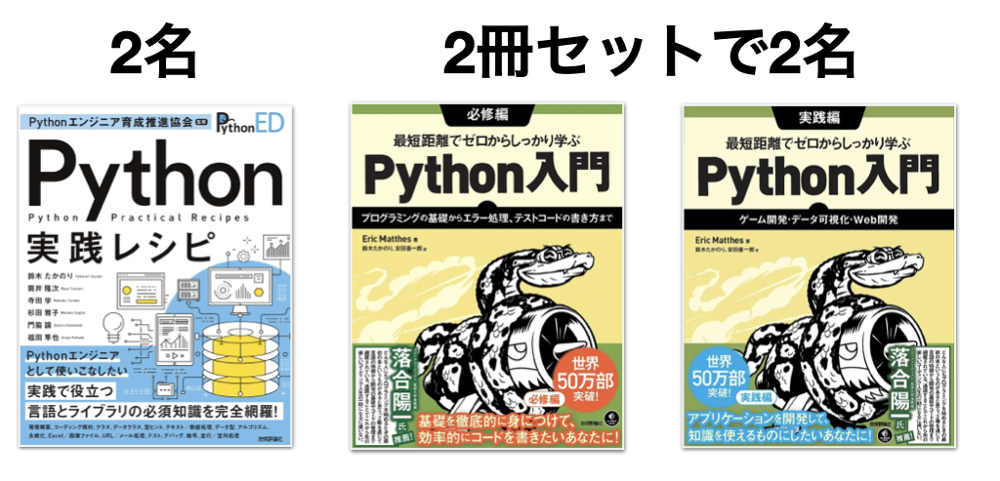
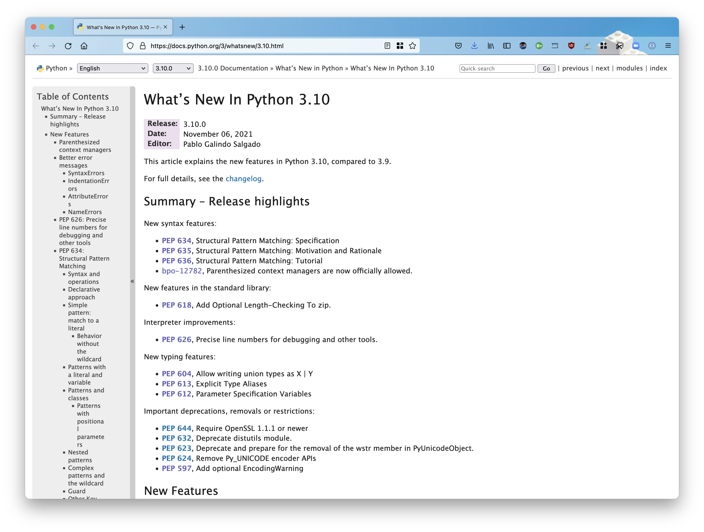
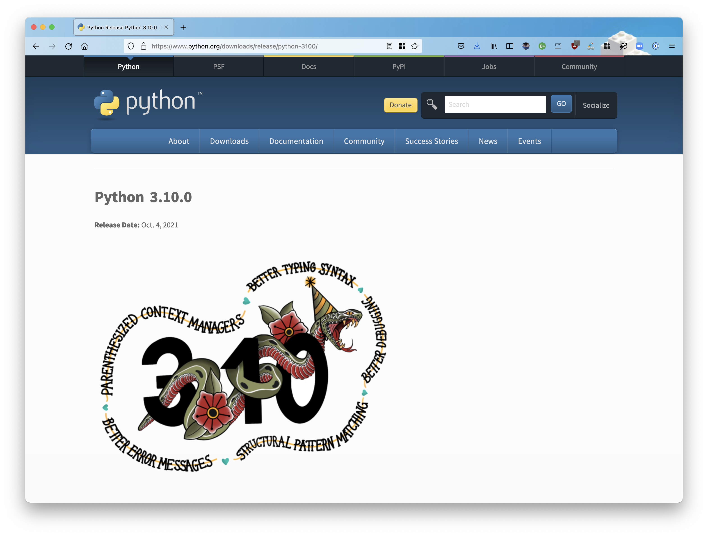

:og:image: _images/20220310stapy.png

=================================================
 Introduction to **Structural Pattern Matching**
=================================================

Takanori Suzuki

Start Python Club 79 / 2022 Mar 10

Agenda / アジェンダ
===================
* Motivation / モチベーション
* What's New / 更新情報
* Syntax / 構文
* Patterns / パターン

.. トークのアジェンダ。
   モチベーションとゴール。
   Python 3.10の新機能を紹介。
   構造的パターンマッチングの構文。
   様々なパターンをコード例と一緒に説明。

Photos 📷 Tweets 🐦 👍
========================
``#stapy`` / ``@takanory``

.. 写真やツイートなどご自由に。

Slide 💻
---------
`slides.takanory.net <https://slides.takanory.net>`__

.. スライドは公開済み。
   TwitterでURLも共有済み

Who am I? / お前誰よ 👤
========================
* Takanori Suzuki / 鈴木 たかのり (|twitter| `@takanory <https://twitter.com/takanory>`_)
* `PyCon JP Association <https://www.pycon.jp/>`_: 副代表理事
* `BeProud <https://www.beproud.jp/>`_: 取締役 / Python Climber
* `Python Boot Camp <https://www.pycon.jp/support/bootcamp.html>`_, `Python mini Hack-a-thon <https://pyhack.connpass.com/>`_, `Python Bouldering Club <https://kabepy.connpass.com/>`_

.. image:: /assets/images/sokidan-square.jpg

Books (|amazon| 著者ページ_) 📚
--------------------------------
.. image:: /assets/images/takanory-books.png
   :width: 75%

.. _著者ページ: https://www.amazon.co.jp/kindle-dbs/entity/author/B00W95A036

プレゼント!! 🎁
---------------

PyCon JP 🐍
===========
- `www.pycon.jp <https://www.pycon.jp/>`__
- 一般社団法人PyCon JP Association

.. image:: /assets/images/pyconjp_logo.png
   :alt: PyCon JP

PSF Community Service Awardを受賞 🎉
------------------------------------

   We are pleased to inform you of the PSF's decision to award the Q4 2021 Community Service Award to you for your many years of community work.

* ブログ: `PyCon JP AssociationがPSFのCommunity Service Awardに選ばれました <https://pyconjp.blogspot.com/2022/02/psf-community-service-award.html>`_

PyCon JP 2022 🎫
-----------------
- 秋の開催に向けて活動開始
- スタッフ募集中
- ブログ: `pyconjp.blogspot.com <https://pyconjp.blogspot.com/>`__

Python Boot Camp 💪
--------------------
- `www.pycon.jp/support/bootcamp.html <https://www.pycon.jp/support/bootcamp.html>`__
- 初心者向けPythonチュートリアル

.. image:: /assets/images/python-boot-camp-logo.png
   :alt: Python Boot Camp
           
BeProud Inc. 🏢
===============
- `www.beproud.jp <https://www.beproud.jp/>`__
- Pythonでシステム開発、研修、自社サービス

  - `PyQ <https://pyq.jp/>`__: オンライン学習サービス
  - `connpass <https://connpass.com/>`__: IT勉強会支援プラットフォーム
  - `TRACERY <https://tracery.jp/>`__: システム開発のためのドキュメントサービス

この発表の **モチベーション** 💪
=================================
* Structural Pattern Matching は **便利そう**
* みんなに **知って**、**使って** みてほしい

.. 本題に入ります。
   Python 3.10にたくさんの新機能がある。
   中でも構造的パターンマッチングはかなり便利そう。
   みんなにも知ってほしい、使ってみてほしい

この発表の **ゴール** 🥅
-------------------------
* **構文** と **基本的な使い方** を知る
* さまざまな **パターン** と、その **使い方** を知る
* 明日から **試せる**

前提条件
--------
* **中級** レベル
* **Pythonの文法** を理解している

  * タプル、リスト、辞書、if、def、isinstance、データクラス、型ヒントなど

.. このトークは中級レベル。
   Pythonの文法を基本的に理解している

質問
====

Python 3.10を使ってますか? 🙋‍♂️
--------------------------------

3.10の新機能を知ってますか? 🙋‍♀️
---------------------------------

**What's New** in Python 3.10 🆕
=================================

.. Python 3.10の新機能について紹介します

**What's New** in Python 3.10 🆕
---------------------------------
* `docs.python.org/3/whatsnew/3.10.html <https://docs.python.org/3/whatsnew/3.10.html>`_

.. Python公式ドキュメントのWhat's Newに新機能がまとまっている

Python Release Python 3.10.0
----------------------------
`www.python.org/downloads/release/python-3100/ <https://www.python.org/downloads/release/python-3100/>`_

.. Python 3.10は10月4日にリリースされた。
   3.10.2が最新。
   3.10には新機能がたくさんあるが...

お前誰よ? 🐍
----------------
.. image:: https://user-images.githubusercontent.com/11718525/135937807-fd3e0fd2-a31a-47a4-90c6-b0bb1d0704d4.png
   :width: 70%
   :alt: Python 3.10 release logo

.. この画像はPython 3.10 release logo。
   ヘビのまわりに3.10の新機能が書いてある

Python 3.10の **新機能**
------------------------
* Parenthesized Context Managers
* Better Typing Syntax
* Better Error Messages
* Structural Pattern Matching
* Better Debugging

.. 5つの主要な新機能がロゴに書いてある。
   Parenthesized...

Python 3.10の **新機能**
------------------------
* Parenthesized Context Managers
* Better Typing Syntax
* Better Error Messages
* **Structural Pattern Matching** 👈
* Better Debugging

.. このトークではStructural Pattern Matchingについて話す

Structural Pattern Matching 🏛
==============================

.. revealjs-break::

* Structural Pattern Matchingの **PEP**

  * `PEP 634 – Specification <https://www.python.org/dev/peps/pep-0634/>`_
  * `PEP 635 – Motivation and Rationale <https://www.python.org/dev/peps/pep-0635/>`_
  * `PEP 636 – Tutorial <https://www.python.org/dev/peps/pep-0636/>`_

.. 機能が大きいため3つのPEPに分かれている。
   Specification、Motivation and Rationale、Tutorial。
   興味のある方は、PEPを読んでみて

モチベーション
--------------
`www.python.org/dev/peps/pep-0635/#motivation <https://www.python.org/dev/peps/pep-0635/#motivation>`_

  (Structural) pattern matching syntax is found in many languages, from Haskell, Erlang and Scala to Elixir and Ruby. (A proposal for JavaScript is also under consideration.)

.. この文章はPEPに書いてあるパターンマッチングのモチベーション

.. revealjs-break::

`www.python.org/dev/peps/pep-0635/#motivation <https://www.python.org/dev/peps/pep-0635/#motivation>`_

  (構造的)パターンマッチの構文は、Haskell、Erlang、ScalaからElixir、Rubyなど、多くの言語で見られます(JavaScriptへの提案も検討中)。

.. 日本語にするとこんな感じ

.. revealjs-break::

.. code-block:: python

   # オブジェクトの型や形を確認する
   if isinstance(x, tuple) and len(x) == 2:
       host, port = x
       mode = "http"
   elif isinstance(x, tuple) and len(x) == 3:
       host, port, mode = x

.. code-block:: python

   # Structural Pattern Matching
   match x:
       case host, port:
           mode = "http"
       case host, port, mode:
           pass

.. if-elif-elseは、オブジェクトの型や形のチェックによく使われる。
   isinstance(), hasattr(), len(), dictのkeyなど。
   match文を使えば、よりエレガントに書くことができる。
   これがStructural Pattern Matchingのモチベーション。
   さて、モチベーションがわかったところで、構文について説明します

構文 |code|
===========
* Pattern Matchingの基本的な構文

.. revealjs-code-block:: python
   :data-line-numbers: 1|2-9

   match subject:
       case <pattern_1>:
           <action_1>
       case <pattern_2>:
           <action_2>
       case <pattern_3>:
           <action_3>
       case _:
           <action_wildcard>

.. match文は、式を受け取り...その値をcaseブロックの連続したパターンと比較する

**ソフト** キーワード
---------------------
* Python 3.10の **新仕様**
* ``match``、``case``、``_``
* **識別子** に使用可能

.. code-block:: pycon

   >>> match = 'match'  # OK
   >>> class = 'class'  # NG
     File "<stdin>", line 1
       class = 'class'  # NG
             ^
   SyntaxError: invalid syntax

.. ソフトキーワードは新しい言語仕様。
   match, case, _はソフトキーワード。
   ソフトキーワードは識別子に使用可能。
   では、パターンについて説明します。

パターン |random|
=================
.. revealjs-break::

.. code-block:: python

   match subject:
       case <pattern_1>:
           <action_1>
       case <pattern_2>:
           <action_2>
       case <pattern_3>:
           <action_3>
       case _:
           <action_wildcard>

.. This is the syntax I introduced before.
   You can specify various patterns after case.
   I will introduce patterns with code examples.

.. これはsyntaxですが、patternにはさまざまなpattensを指定できます。
   いくつかを紹介していきます。

.. これは前に紹介した構文。
   caseの後にいろいろなパターンを指定できる。
   パターンをコード例で紹介する。

**リテラル** パターン
---------------------
.. revealjs-code-block:: python
   :data-line-numbers: 1-9|1-3|1,8-9

   match beer_style:
       case "Pilsner":
           result = "First drink"
       case "IPA":
           result = "I like it"
       case "Hazy IPA":
           result = "Cloudy and cloudy"
       case _:
           result = "I like most beers"

.. 最初はリテラルパターン。リテラルパターンはシンプルなパターン。
   (ページ送り)
   beer_styleの値が"Pilsner"の場合ここが実行される。
   (ページ送り)
   値がどのパターンにもマッチしないと_にマッチする。
   _はワイルドカード。

**OR** パターン
---------------
* ``|`` は OR

.. revealjs-code-block:: python
   :data-line-numbers: 1,4-5

   match beer_style:
       case "Pilsner":
           result = "First drink"
       case "IPA" | "Session IPA":
           result = "I like it"
       case "Hazy IPA":
           result = "Cloudy and cloudy"
       case _:
           result = "I like most beers"

.. このパターンはIPAまたはSession IPAにマッチする

**wildcardなし** のLiteralパターン
----------------------------------
.. revealjs-code-block:: python

   match beer_style:
       case "Pilsner":
           result = "First drink"
       case "IPA":
           result = "I like it"
       case "Hazy IPA":
           result = "Cloudy and cloudy"
       # case _:
       #     result = "I like most beers"

.. 最後のワイルドカードをコメントアウト。
   beer_styleの値がどれにもマッチしなければなにも起こらない

? 🤔
-----

.. あれ?あんまり便利そうに見えない?

**if** 文で書き換える
---------------------
* ``if`` 文で書いた場合

.. code-block:: python

   if beer_style == "Pilsner":
       result = "First drink"
   elif beer_style == "IPA" or beer_style == "Session IPA":
       result =  "I like it"
   elif beer_style == "Hazy IPA":
       result = "Cloudy and cloudy"
   else:
       result = "I like most beers"

.. if文で書き換えてみると、あんまり変わらないように見える。
   あなたの考えは正しい。
   ですが...

Pattern Matchingは **パワフル** 💪
-----------------------------------
.. ですが...Pattern Matchingはもっとパワフル。
   便利なパターンを紹介する。

リテラルと **変数** パターン
============================

リテラルと **変数** パターン
----------------------------
* 長さ2のタプルが注文を表す

.. revealjs-code-block:: python

   order1 = ("IPA", "nuts")  # ビールとフード
   order2 = ("Pilsner", "")  # ビールのみ
   order3 = ("", "fries")    # フードのみ
   order4 = ("", "")         # なにも注文しない

   order_beer_and_food(order1)  # -> I dring IPA with nuts.

リテラルと **変数** パターン
----------------------------
.. revealjs-code-block:: python

   def order_beer_and_food(order: tuple) -> str:
       match order:
           case ("", ""):
               return "Please order something."
           case (beer, ""):
               return f"I drink {beer}."
           case ("", food):
               return f"I eat {food}."
           case (beer, food):
               return f"I drink {beer} with {food}."
           case _:
               return "one beer and one food only."

.. ビールとフードの注文タプルを受け取る関数を考えてみます。

リテラルと **変数** パターン
----------------------------
.. revealjs-code-block:: python
   :data-line-numbers: 1-4,14

   def order_beer_and_food(order: tuple) -> str:
       match order:
           case ("", ""):  # match here
               return "Please order something."
           case (beer, ""):
               return f"I drink {beer}."
           case ("", food):
               return f"I eat {food}."
           case (beer, food):
               return f"I drink {beer} with {food}."
           case _:
               return "one beer and one food only."

   order_beer_and_food(("", ""))  # -> Please order something.

.. 注文が(空, 空)の場合、3行目にマッチし戻り値は"Please order something."

リテラルと **変数** パターン
----------------------------
* ``"IPA"`` が ``beer`` に代入

.. revealjs-code-block:: python
   :data-line-numbers: 1-2,5-6,14

   def order_beer_and_food(order: tuple) -> str:
       match order:
           case ("", ""):
               return "Please order something."
           case (beer, ""):  # match here
               return f"I drink {beer}."
           case ("", food):
               return f"I eat {food}."
           case (beer, food):
               return f"I drink {beer} with {food}."
           case _:
               return "one beer and one food only."

   order_beer_and_food(("IPA", ""))  # -> I drink IPA.

.. 注文が("IPA", 空)の場合、5行目にマッチする。
   そしてタプルの最初の値(IPA)がbeer変数に代入される。
   結果は"I drink IPA."

リテラルと **変数** パターン
----------------------------
* ``"IPA"`` が ``beer`` に代入
* ``"nuts"`` が ``food`` に代入

.. revealjs-code-block:: python
   :data-line-numbers: 1-2,9-10,14

   def order_beer_and_food(order: tuple) -> str:
       match order:
           case ("", ""):
               return "Please order something."
           case (beer, ""):
               return f"I drink {beer}."
           case ("", food):
               return f"I eat {food}."
           case (beer, food):  # match here
               return f"I drink {beer} with {food}."
           case _:
               return "one beer and one food only."

   order_beer_and_food(("IPA", "nuts"))  # -> I drink IPA with nuts.

.. 注文が("IPA", "nuts")の場合、9行目にマッチ。
   最初の値(IPA)がbeer変数に代入、2番目の値(nuts)がfood変数に代入。
   結果は"I drink IPA with nuts."

リテラルと **変数** パターン
----------------------------
* タプルの長さが一致しない

.. revealjs-code-block:: python
   :data-line-numbers: 1-2,11-14

   def order_beer_and_food(order: tuple) -> str:
       match order:
           case ("", ""):
               return "Please order something."
           case (beer, ""):
               return f"I drink {beer}."
           case ("", food):
               return f"I eat {food}."
           case (beer, food):
               return f"I drink {beer} with {food}."
           case _:  # match here
               return "one beer and one food only."

   order_beer_and_food(("IPA", "nuts", "spam"))  # -> one beer and one food only.

.. 注文が("IPA", "nuts", "spam")の場合、タプルの長さが2じゃないのでワイルドカードにマッチする。
   結果は"one beer and one food only."

**if** 文で書き換える
---------------------
.. code-block:: python

   def order_beer_and_food(order: tuple) -> str:
       if len(order) == 2:
           beer, food = order
           if beer == "" and food == "":
               return  "I'm full."
           elif beer != "" and food == "":
               return f"I drink {beer}."
           elif beer == "" and food != "":
               return f"I eat {food}."
           else:
               return f"I drink {beer} with {food}."
       else:
           return  "one beer and one food only."

.. if文で書き換えてみる。このコードは少しわかりにくいと思う。

どっちが好み?
-------------
* Structural Pattern Matching
* ``if`` 文

**順番** は重要 ⬇️
==================
.. revealjs-code-block:: python
   :data-line-numbers: 3-4,14

   def order_beer_and_food(order: tuple) -> str:
       match order:
           case (beer, food):  # match here
               return f"I drink {beer} with {food}."
           case ("", ""):  # never reach
               return "Please order something."
           case (beer, ""):  # never reach
               return f"I drink {beer}."
           case ("", food):  # never reach
               return f"I eat {food}."
           case _:
               return "one beer and one food only."

   order_beer_and_food(("IPA", ""))  # -> I drink IPA with .

.. 注意点が1つある。caseの順番が重要。
   パターンは上から順に比較するので、こう書くと最初のパターンにマッチする。
   その結果、他のパターンに到達しない。

**クラス** パターン
===================

**クラス** パターン
-------------------
.. code-block:: python

   @dataclass
   class Order:  # Order(beer="IPA"), Order("Ale", "nuts")...
       beer: str = ""
       food: str = ""

.. code-block:: python

   def order_with_class(order: Order) -> str:
       match order:
           case Order(beer="", food=""):
               return "Please order something."
           case Order(beer=beer, food=""):
               return f"I drink {beer}."
           case Order(beer="", food=food):
               return f"I eat {food}."
           case Order(beer=beer, food=food):
               return f"I drink {beer} with {food}."
           case _:
               return "Not an order."

.. 注文のためのOrderクラスを作った。beerとfood属性を持っている。
   最初のケースのパターンはbeerとfoodが空の場合にマッチする。
   2番目はfoodのみが空の場合にマッチし、beer変数にOrder.beerが代入される。
   3番目はbeerのみが空の場合。
   4番目はbeerとfood両方が代入される。
   Orderクラスじゃない場合はワイルドカードで処理される。

クラスパターンの **実行結果**
-----------------------------

.. code-block:: python

   >>> order_with_class(Order())
   'Please order something.'
   >>> order_with_class(Order(beer="Ale"))
   'I drink Ale.'
   >>> order_with_class(Order(food="fries"))
   'I eat fries.'
   >>> order_with_class(Order("Ale", "fries"))
   'I drink Ale with fries.'
   >>> order_with_class("IPA")
   'Not an order.'

.. 実行結果。
   さっきのタプルのときと同じように動作している。

クラスパターン
--------------
.. code-block:: python

   def order_with_class(order: Order) -> str:
       match order:
           case Order(beer="", food=""):
               return "Please order something."
           case Order(beer=beer, food=""):
               return f"I drink {beer}."
           case Order(beer="", food=food):
               return f"I eat {food}."
           case Order(beer=beer, food=food):
               return f"I drink {beer} with {food}."
           case _:
               return "Not an order."

.. このコードをif文で書き換えてみる。

**if** 文で書き換える
---------------------
.. code-block:: python

   def order_with_class(order: Order) -> str:
       if isinstance(order, Order):
           if order.beer == "" and order.food == "":
               return  "Please order something."
           elif order.beer != "" and order.food == "":
               return f"I drink {order.beer}."
           elif order.beer == "" and order.food != "":
               return f"I eat {order.food}."
           else:
               return f"I drink {order.beer} with {order.food}."
       else:
           return "Not an order."

.. if文で書き換えるとこんな感じ。
   少しごちゃごちゃしている。
   クラスパターンはもっとパワフルです。

**注文用** クラス
-----------------
.. code-block:: python

   @dataclass
   class Beer:  # Beer("IPA", "Pint")
       style: str
       size: str

   @dataclass
   class Food:  # Food("nuts")
       name: str

   @dataclass
   class Water:  # Water(4)
       number: int

.. ビール、フード、水の注文を表す3種類のクラスを作る。
   各クラスには異なる属性を持つ。

**複数のクラス** を使うパターン
-------------------------------

.. code-block:: python

   def order_with_classes(order: Beer|Food|Water) -> str:
       match order:
           case Beer(style=style, size=size):
               return f"I drink {size} of {style}."
           case Food(name=name):
               return f"I eat {name}."
           case Water(number=number):
               return f"{number} glasses of water, please."
           case _:
               return "Not an order."

.. 複数のクラスを扱うクラスパターンのコード例。
   それぞれのクラスの型で分岐するのでわかりやすいです。

**if** 文で書き換える
---------------------
.. code-block:: python

   def order_with_classes(order: Beer|Food|Water) -> str:
       if isinstance(order, Beer):
           return f"I drink {order.size} of {order.style}."
       elif isinstance(order, Food):
           return f"I eat {order.name}."
       elif isinstance(order, Water):
           return f"{order.number} glasses of water, please."
       else:
           return "Not an order."

.. if文で書き換えてみるとこんな感じになります。
   match caseで書いた方がすっきりして読みやすいと思いませんか?
   パターンはまだまだあります。

.. 宣伝 📣
   ========

   .. revealjs-break::
      :notitle:

   .. image:: images/python-recipes-book.jpg
      :width: 55%

   Python実践レシピ 📕
   --------------------
   * 2022年1月19日発売
   * **鈴木たかのり**、筒井隆次、**寺田学**、杉田雅子、門脇諭、福田隼也著
   * B5変形判 / 512ページ / 2,970円

   .. * クロージングで **プレゼント** あるかも

   宣伝終わり
   ----------

.. 他のパターンを紹介

**シーケンス** パターン ➡️
==========================

注文テキストを解析
------------------
* リストに変換してパターンマッチ

.. code-block:: python

   order_text = "beer IPA pint"
   order_text.split()  # -> ["beer", "IPA", "pint"]

   order_text = "food nuts"
   order_text = "water 3"
   order_text = "bill"

.. Next, I will explain about Sequense pattens.
   In this caes, I'll parse the order text.
   For example...

.. ここではスペース区切りの注のテキストを解析する。
   リストに変換してパターンマッチする。

シーケンスの **長さ** でマッチ
------------------------------

.. code-block:: python

   match order_text.split():
       case [action]:
           # ["bill"] にマッチ
           ...
       case [action, name]:
           # ["food", "nuts"]、["water", "3"] にマッチ
           ...
           # 処理を分岐したい
       case [action, name, size]:
           # ["beer", "IPA", "pint"] にマッチ
           ...

.. シーケンスの長さが1、2、3それぞれにマッチできる。
   長さが2のパターンが2つあるので分岐したい

**特定の値** にマッチ
---------------------
* 特定の値(bill, food...)にマッチ
* **シーケンス** + **リテラル** パターン

.. code-block:: python

   match order_text.split():
       case ["bill"]:  # ["bill"] にのみマッチ
           calculate_amount()
       case ["food", food]:  # ["food", "nuts"]
           tell_kitchen(food)
       case ["water", number]:  # ["water", "3"]
           glass_of_water(number)
       case ["beer", style, size]:  # ["beer", "IPA", "pint"]
           tell_beer_master(style, size)

.. このようにパターンを書くと、リストの任意の値が特定の文字列(bill、food)とマッチできる。
   これはシーケンスパターンとリテラルパターンの組み合わせ

**任意の値** にマッチ
---------------------
* 有効なビールサイズ: ``pint``、``half``
* ``"beer IPA 1-liter"`` はマッチしない

.. code-block:: python

   match order_text.split():
       ...
       case ["beer", style, ("pint" | "half")]:  # ORパターン
           # tell_beer_master(style, size)
           # ビールのサイズはどっち?

.. 有効なビールのサイズはPintとHalfPintのみとする。
   "beer IPA 1-liter" は無効。
   ORパターンを使用すると任意の値にマッチできる。
   しかし、ビールのサイズがわからない。どうすればよいのか。

**AS** パターン
---------------
* **サブパターン** の値を取得
* サイズ(``pint`` または ``half``)を ``size`` に代入

.. code-block:: python

   match order_text.split():
       ...
       case ["beer", style, ("pint" | "half") as size]:
           tell_beer_master(style, size)

.. この場合はASパターンを使う。
   サイズの値がsize変数に代入される

**任意の長さの値** にマッチ
---------------------------
* 複数の料理の注文に対応する
* 例: ``"food nuts fries pickles"``

.. code-block:: python

   order_text = "food nuts fries pickles"

   match order_text.split():
       ...
       case ["food", food]:  # マッチしない
           tell_kitchen(food)

.. 一度に複数のフードの注文に対応したい。
   しかしシーケンスパターンでは1つのフードしか対応していない

**任意の長さの値** にマッチ
---------------------------
* 変数名に **アスタリスク** (``*``)を追加

.. code-block:: python

   order_text = "food nuts fries pickles"

   match order_text.split():
       ...
       case ["food", *foods]:  # 任意の長さの値をキャプチャ
           for food in foods:  # ("nuts", "fries", "pickles")
               tell_kitchen(name)

.. If I add * to the variable name(foods), multiple values will be assigned.
   Now I can order multiple food items at once!

.. foods変数にアスタリスクを付けると、複数の値が代入される。
   これで一度に複数のフードを注文できるようになった!

**マッピング** パターン 📕
===========================
.. 最後のパターンはマッピングパターン

**マッピング** パターン 📕
--------------------------
* **辞書** 用のパターン
* **JSON** の解析に便利

.. code-block:: python

   order_dict = {"beer": "IPA", "size": "pint"}

   match order_dict:
       case {"food": food}:
           tell_kitchen(food)
       case {"beer": style, "size": ("pint" | "half") as size}:
           tell_beer_master(style, size)
       case {"beer": style, "size": _}:
           print("Unknown beer size")
       case {"water": number}:
           glass_of_water(number)
       case {"bill": _}:
           calculate_amount()

.. 辞書のようなマップ型にマッチする。
   マッピングパターンはJSONを読み込んだ辞書の解析に便利

**組み込み** クラスにマッチ
---------------------------
* 料理名は文字列、水の数は整数
* ``str()``、``int()`` などを使う

.. code-block:: python

   order_dict = {"water": 3}
   # order_dict = {"water": "three"}  # マッチしない

   match order_dict:
       case {"food": str(food)}:
           tell_kitchen(food)
       ...
       case {"water": int(number)}:
           glass_of_water(number)
       ...

.. 組み込みクラスを使用して特定の型を指定できる。
   このコードで、料理の種類は文字列で、水の数は整数のみとしている。
   もしwaterの値が文字列のthreeの場合は、パターンにマッチしない

ガード 💂‍♀️
============

.. 最後にガードについて説明します。

ガード 💂‍♀️
------------
* パターンの後ろに **if** 文
* 水は1〜9杯しか頼めない

.. code-block:: python

   order_dict = {"water": 3}  # 有効な値
   # order_dict = {"water": 15}  # -> 水は1〜9杯です
   # order_dict = {"water": "three"}  # -> 水は数値で指定してください

   match order_dict:
       case {"water": int(number)} if 0 < number < 10:
           glass_of_water(number)
       case {"water": int(number)}:
           print("水は1〜9杯です")
       case {"water": _}:
           print("水は数値で指定してください")

.. パターンの後ろにif文を書くとガードになる。
   このコードでは辞書の値が整数であることをチェックし、ガードで数値の範囲を1〜9にしている

まとめ
======
.. revealjs-break::

* モチベーション 💪
* 構文 |code|

  * ソフトキーワード: ``match``、``case``、``_``
* パターン |random|

  * リテラル、ワイルドカード、変数、クラス、シーケンス、マッピング、OR、AS、ガード

.. このトークのまとめ。
   一度では把握しきれないと思うので、ぜひこのスライドを見返してください

Structural Pattern Matching に **挑戦** 👍
-------------------------------------------
.. もしパターンマッチよさそうだなと思ったら、挑戦してみてください。

参考資料 📚
------------
* `What's New In Python 3.10 <https://docs.python.org/ja/3.10/whatsnew/3.10.html>`_
* `Python Release Python 3.10.0 <https://www.python.org/downloads/release/python-3100/>`_
* `PEP 634 -- Structural Pattern Matching: Specification <https://www.python.org/dev/peps/pep-0634/>`_
* `PEP 635 -- Structural Pattern Matching: Motivation and Rationale <https://www.python.org/dev/peps/pep-0635/>`_
* `PEP 636 -- Structural Pattern Matching: Tutorial <https://www.python.org/dev/peps/pep-0636/>`_

.. 参考資料はこちらです

Thank you !! 🙏
===============
Takanori Suzuki (|twitter| `@takanory <https://twitter.com/takanory>`_)

`slides.takanory.net <https://slides.takanory.net/>`_

.. image:: /assets/images/sokidan-square.jpg

.. ありがとうございました。
   またPyCon JP 2022などでお会いしましょう
