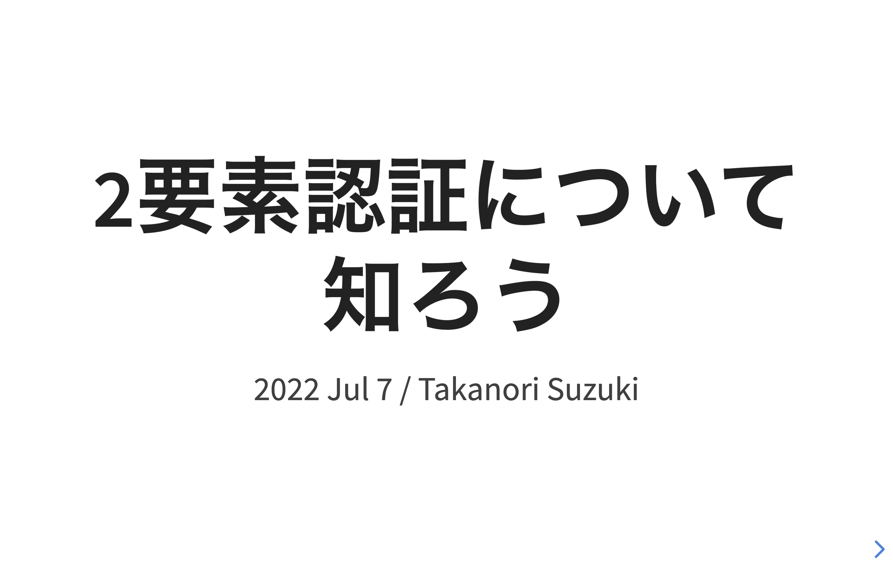
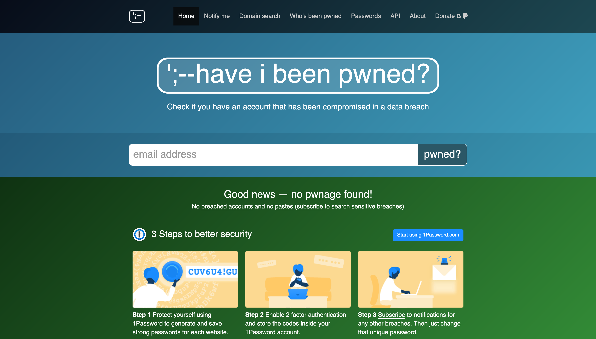

:og:image: _images/20220707_2fa.png

=========================
 2要素認証について知ろう
=========================

2022 Jul 7 / Takanori Suzuki

:fas:`bullseye` 目的
====================
- 認証にどういう種類があるか知る
- 2要素認証がどういうものか知る
- それぞれのメリットデメリットを知る

:fas:`bars` お品書き
====================
- パスワード認証
- パスワード認証の問題
- パスワード管理ソフト
- 2要素認証(2FA)
- 2要素認証どうやるの
- Slackで2FAを設定

:fas:`clipboard-question` 最初に質問
====================================

パスワード管理ソフト使っている人? 🙋‍♀️
----------------------------------------

2要素認証がどういうものか説明できる人? 🙋‍♂️
--------------------------------------------

2要素認証を導入している人? 🙋‍♀️
--------------------------------

:fas:`key` パスワード認証
=========================

パスワード認証とは
------------------
- IDとパスワードの組み合わせでの本人確認手段
- IDとパスワードを知っている人

  - →本人

Q: パスワード認証にはどんな問題がありますか?
--------------------------------------------

パスワードが漏れるとこうなる
----------------------------
- 参考: `WIRED記者の悲劇から学ぶ「セキュリティ9つの常識」 <https://wired.jp/2012/08/14/how-not-to-become-mat-honan/>`__

パスワードが漏れるとこうなる
----------------------------
- 参考: `WIRED記者の悲劇から学ぶ「セキュリティ9つの常識」 <https://wired.jp/2012/08/14/how-not-to-become-mat-honan/>`__

  - iPhoneのデータが全削除
  - MacBookのデータが全削除
  - Twitterを乗っ取られる
  - 8年分のGMailを全削除

アシュレイ・マディソン
----------------------
- 不倫マッチングサイトのデータがクラッキングされて流出
- 11,000,000件のパスワードがクラックされた
- 参考: `「123456」がダントツ人気パスワード、CEO辞任も依然としてユーザー増加中など不倫SNS「アシュレイ・マディソン」情報流出騒動をめぐるあれこれ総まとめ <https://gigazine.net/news/20150914-ashley-madison-password-lesson/>`__

パスワードTop5
--------------
1. ``123456``
2. ``12345``
3. ``password``
4. ``DEFAULT``
5. ``123456789``

よく使われるパスワード
----------------------
* `Top 200 Most Common Password List 2021 | NordPass <https://nordpass.com/most-common-passwords-list/>`_
* `「もっとも使われた危険なパスワード」2021年版が発表！　世界と日本のランキングを見比べてみよう【被害事例に学ぶ、高齢者のためのデジタルリテラシー】 - INTERNET Watch <https://internet.watch.impress.co.jp/docs/column/dlis/1376907.html>`_

流出をチェック
--------------
- `haveibeenpwned.com <https://haveibeenpwned.com/>`__ : メールアドレス
- `haveibeenpwned.com/Passwords <https://haveibeenpwned.com/Passwords>`__ : パスワード

パスワード認証の問題
--------------------
- 複数のサイトで共通のパスワード使うと危険
- 1つバレたら全部バレる
- サイトごとにパスワードのルールが異なる
- 文字数、文字種(英字、数字、記号)
- でもそんなの人は覚えられない

パスワード管理ソフト
--------------------
- IDとパスワードを管理するソフト

  - `1Password <https://1password.com/>`__
  - `LastPass <https://www.lastpass.com/ja>`__
  - `Bitwarden <https://bitwarden.com/>`__
- 参考: `2022 年おすすめのパスワードマネージャー9選 <https://kinsta.com/jp/blog/password-managers/>`_

パスワード認証の問題(その2)
---------------------------
- 漏洩のリスク
- 悪意のある中の人
- 総当たり攻撃

  - `参考Tweet <https://twitter.com/yamatosecurity/status/1155289692268457985>`__

総当たり攻撃の時間
------------------

.. raw:: html

   <blockquote class="twitter-tweet">
最近のパスワードクラッキングのベンチマーク。ご覧の通り今は最短で12文字以上のパスワードが必要だけど、そのうちそれもクラックされてしまうので、15文字以上をおすすめします。できたら25文字以上のパスフレーズ。複雑さより長さの方が重要！ <a href="https://twitter.com/hashtag/%E3%83%91%E3%82%B9%E3%82%AF%E3%83%A9?src=hash&amp;ref_src=twsrc%5Etfw">#パスクラ</a> <a href="https://t.co/yF0H8fmi7k">pic.twitter.com/yF0H8fmi7k</a>
&mdash; 田中ザック (@yamatosecurity) <a href="https://twitter.com/yamatosecurity/status/1155289692268457985?ref_src=twsrc%5Etfw">July 28, 2019</a></blockquote>  

そこで
======

:fas:`dice-two` 2要素認証
=========================

2要素認証とは
-------------
- 2FA(Two-factor Authentication)
- 2種類の要素で認証する

2種類の要素って?
----------------
- 以下の3要素のうち2つ

  - 本人だけが知っていること
  - 本人だけが所有しているもの
  - 本人自身の特性
- Q: それそれどんな認証が例として考えられますか?
- 参考: `二要素認証とは？セキュリティを向上させる5つのポイント <https://japan.norton.com/two-factor-authentication-8528>`__

認証の例
--------
- 本人だけが知っていること: パスワード
- 本人だけが所有しているもの: トークン、スマートフォン
- 本人自身の特性: 指紋、顔認証

2段階認証
---------
- 2要素認証≠2段階認証
- Q: 違いを説明できますか?

2要素認証≠2段階認証
-------------------
- 例: ネットバンキングなど
- ログインパスワード(1段階)
- 振り込み時に秘密の質問(2段階)
- どちらも「本人だけが知っていること」なので1要素

:fas:`mobile` 2要素認証(2FA)どうやるの
======================================

2要素認証(2FA)どうやるの
------------------------
- Webサービス + スマートフォンアプリ
- 引用元: `多要素認証とは？パスワードだけでは守りきれないクラウドのセキュリティ <https://www.secure-sketch.com/blog/multi-factor-authentication>`__

.. image:: https://www.secure-sketch.com/hs-fs/hubfs/blog_GRCP%E5%AF%84%E7%A8%BF/201810_MFA%EF%BC%88%E5%B1%B1%E7%94%B0%EF%BC%89/MFA2.jpg
   :alt: 多要素認証実施までの流れ
   :width: 70%

2FAに対応しているサービス(例)
-----------------------------
- Googleアカウント
- Slack
- Dropbox
- Evernote
- Facebook
- Twitter
- GitHub
- AWS
- PayPal

2FAの認証クライアント
---------------------
- スマートフォンにインストールして使う
- `Authy <https://authy.com/>`__
- `Google
  Authenticator <https://support.google.com/accounts/answer/1066447?co=GENIE.Platform%3DAndroid&hl=ja&oco=0>`__
- `LastPass Authenticator <https://lastpass.com/auth/>`__
- `IIJ SmartKey <https://www.iij.ad.jp/smartkey/>`__

TOTP
----
- Time-based One-Time Password
- ワンタイムパスワードの1種
- 時間単位(だいたい30秒)でパスワードが払い出される
- `RFC 6238 - TOTP: Time-Based One-Time Password Algorithm <https://tools.ietf.org/html/rfc6238>`__
- 参考: `ワンタイムパスワード <https://ja.wikipedia.org/wiki/%E3%83%AF%E3%83%B3%E3%82%BF%E3%82%A4%E3%83%A0%E3%83%91%E3%82%B9%E3%83%AF%E3%83%BC%E3%83%89>`__

pyotp: OTPのPython実装
----------------------
- `pyauth/pyotp <https://github.com/pyauth/pyotp>`__

.. code-block:: python

   totp = pyotp.TOTP('base32secret3232')
   totp.now() # => '492039'

   # OTP verified for current time
   totp.verify('492039') # => True
   time.sleep(30)
   totp.verify('492039') # => False

ハードウェアキー
----------------
- (私は使ったことありません)
- `YubiKey <https://yubikey.yubion.com/>`__
- `Titanセキュリティキー <https://store.google.com/jp/product/titan_security_key?hl=ja>`__
- FIDO(Fast IDentity Online)という認証技術
- 参考: `FIDO (認証技術) - Wikipedia <https://ja.wikipedia.org/wiki/FIDO\_(%E8%AA%8D%E8%A8%BC%E6%8A%80%E8%A1%93%29>`__
- 参考: `SOLUTION | YubiOn <https://www.yubion.com/solution/fido>`_

:fas:`arrows-to-circle` まとめ
==============================
- 認証にどういう種類があるか

  - パスワード管理、2FA
- 2要素認証がどういうものか知る

  - 2種類の要素で認証する

