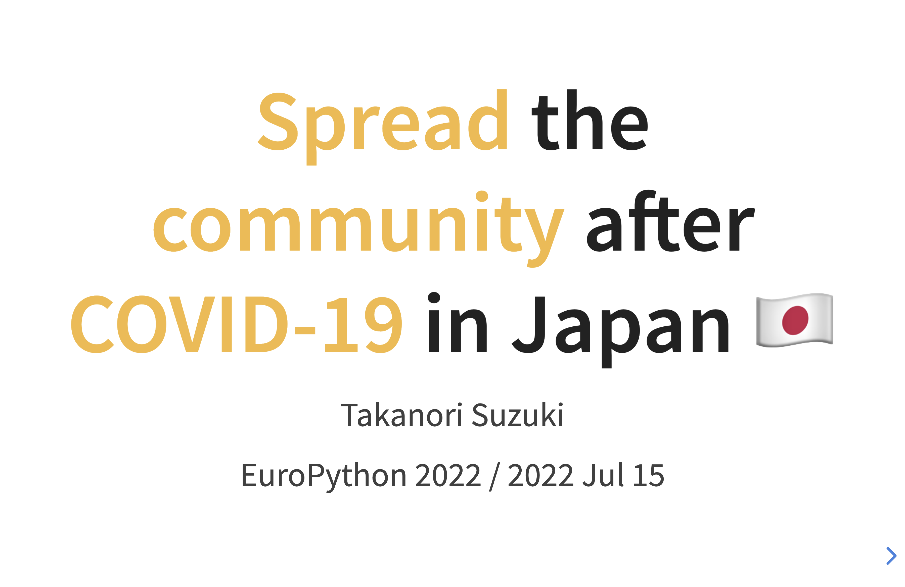
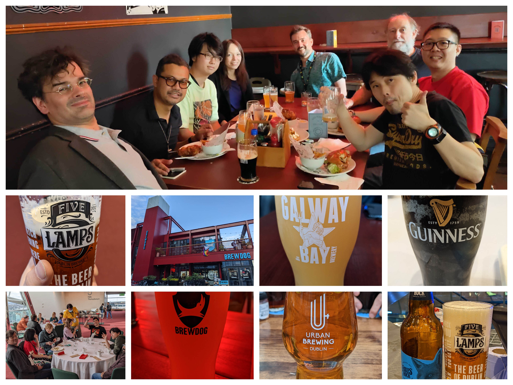
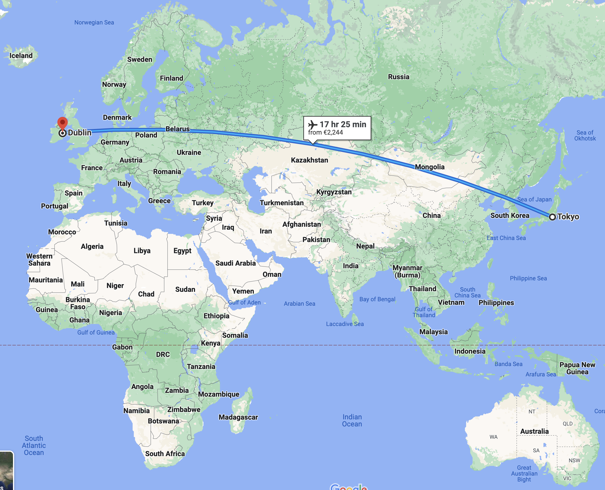
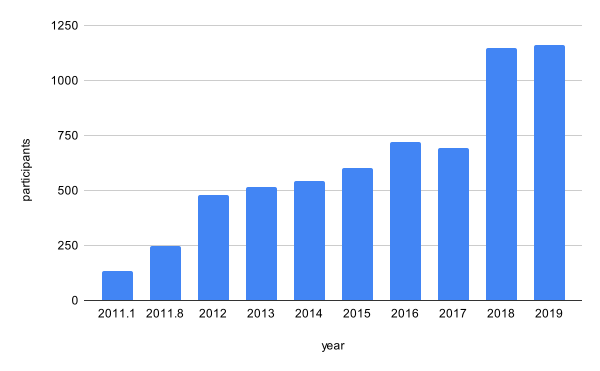
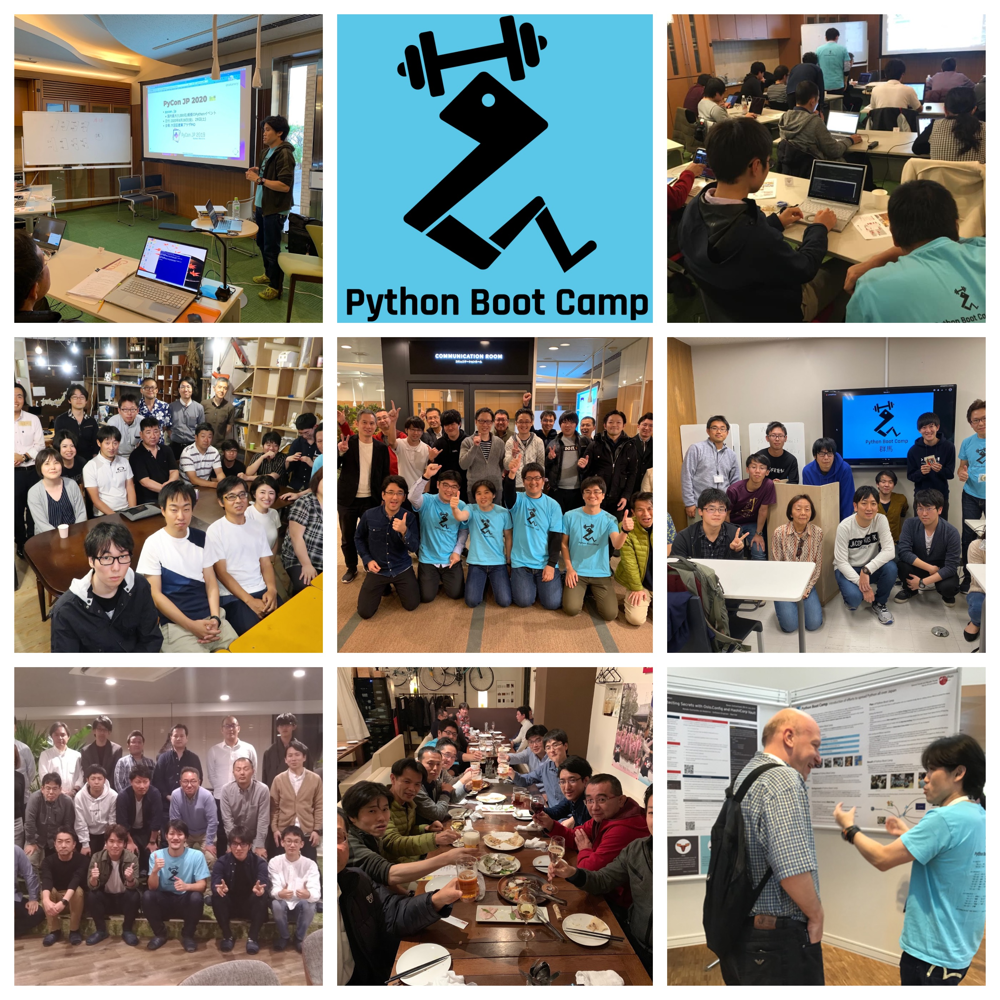
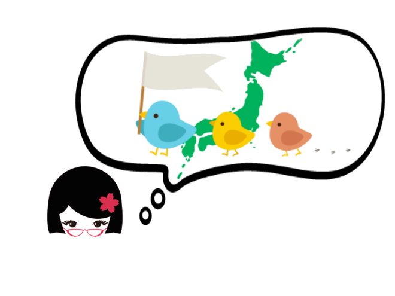
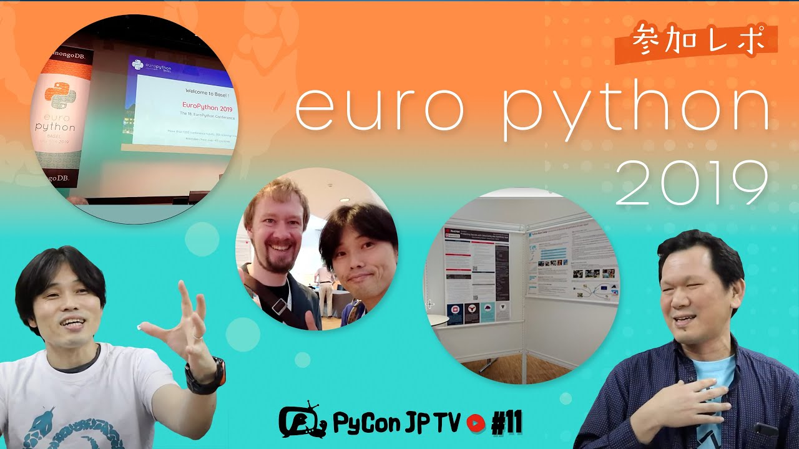
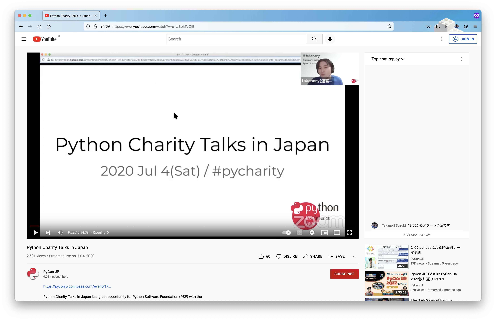
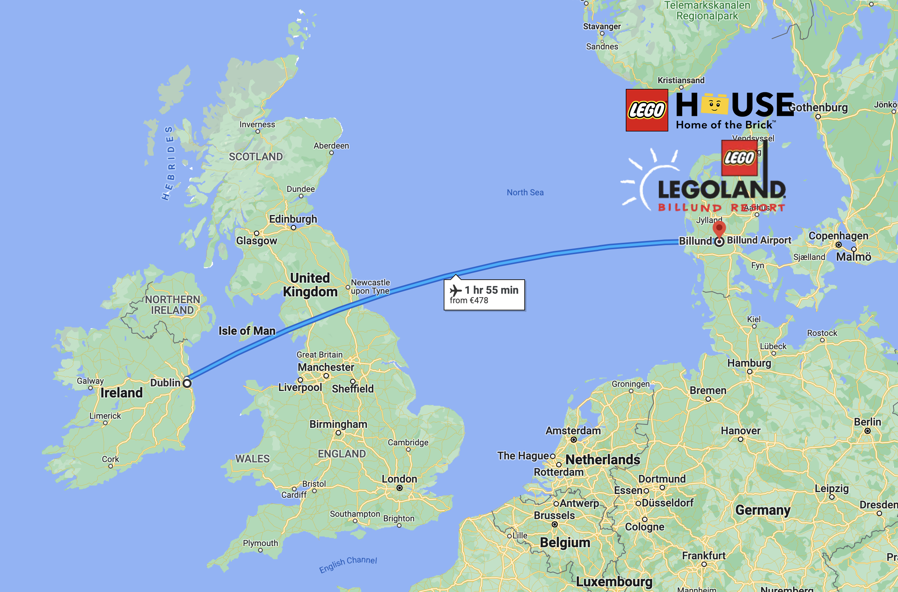

:og:image: _images/20220715europython-lt.png

=============================================================
 **Spread** the **community** after **COVID-19** in Japan 🇯🇵
=============================================================

Takanori Suzuki

EuroPython 2022 / 2022 Jul 15

Enjoy ? 🥳
===========

.. revealjs-notes::

   Did you enjoy EuroPython?

.. revealjs-break::
   :notitle:

   
.. revealjs-notes::

   I really enjoyed EuroPython with good people and nice beer and nice beer.

Who am I? 👤
=============
* **Takanori** Suzuki / 鈴木たかのり(:fab:`twitter` `@takanory <https://twitter.com/takanory>`__)
* Vice Chair of **PyCon JP** Association
* Director of BeProud Inc.
* Love: Ferrets, LEGO, 🍺 / Hobby: 🎺, 🧗‍♀️

.. image:: /assets/images/sokidan-square.jpg
   :width: 180

.. image:: /assets/images/kurokuri.jpg
   :width: 180

.. revealjs-notes::

   I'm Takanori Suzuki. Please call me Takanori.

Japan 🇯🇵
=========

.. revealjs-notes::

   I'm from Tokyo, Japan. Tokyo is far from Europe.
   Do you know Japan?
   Have you been Japan?
   Do you Know PyCon Japan?
   Have you attended PyCon Japan?

PyCon JP Association 🐍
------------------------
.. `www.pycon.jp <https://www.pycon.jp>`__

.. image:: /assets/images/pyconjp_logo.png

.. revealjs-notes::

   I'm Vice chair of PyCon JP association.
   We launched PyCon JP in 2011.
   At that time, the Python community in Japan was small.

Number of **participants** 📈
------------------------------

.. https://docs.google.com/spreadsheets/d/1uOexhV5nVG7c0s-p1qxlh704YrBUTAVE01SRLyyc2ds/edit#gid=0           
   
.. revealjs-notes::

   The first PyCon JP had about 150 participants.
   Now, PyCon JP has grown to 1,000 participants over.

PyCon JP 2022
-------------
* `2022.pycon.jp <https://2022.pycon.jp>`__
* Date: 2022 **Oct** 14 (Fri) - 16 (Sun)
* Venue: **Tokyo**, Japan (in-person)

.. image:: /assets/images/pyconjp2022logo.png
   :alt: PyCon JP 2022
   :width: 50%

.. revealjs-notes::

   In this year, PyCon JP will be held as an in-person event.
   Please come to Japan! Have a beer with me.

Other **Activities** 🕺
========================
.. revealjs-notes::

   Apart from PyCon JP event, We also work to spread Python in Japan.

Python Boot Camp 💪
--------------------

.. revealjs-notes::

   One is "Python Boot Camp", tutorial events for beginners, all over Japan.
   We have held 44 camps with about 800 participants!
   BTW, I introduced it at the EuroPython poster session in 2019.
   Does anyone remember that?

**PyLadies** Caravan 👩‍💻
--------------------------

.. revealjs-notes::

   Another one is "PyLadies Caravan".
   The event connects local women's communities across Japan.
   However,...

**Stopped** our activities 💤
==============================

.. revealjs-notes::

   However,... as you all know, COVID-19 has changed the world.
   We are no longer able to organise in-person events. But,...

COVID-19 **Cannot stop** us 🏃‍♂️
=================================

.. revealjs-notes::

   But, we must not stop our activities to spread Python!
   We have started 2 new activities.   

PyCon JP **TV** 📺
-------------------
* Monthly **YouTube Live**

.. revealjs-notes::

   The first is "PyCon JP TV".
   We stream youtube live every month.
   We talk about "Python News", "Conference overview", "Python new features" and etc.

**Selfie** time! 📷
-------------------
.. revealjs-notes::

   I't selfie time!
   I will present EuroPython at the next PyCon JP TV.
   I'd like to take pictures with you all and share it on youtube live and twitter.
   Are you OK? ... 
   Thank you. I'll share it later.

Python **Charity** Talks 🎗
----------------------------
* Half-day, **online** event / **Donate** to PSF ($25,000+)

.. revealjs-notes::

   Another one is "Python Charity Talks".
   We wondered if there was a way to combine our spreading Python in Japan with donating to the PSF.
   It is a half-day online event, with all participation and sponsorship fees donated to the PSF.
   We held 3 events and donated 25,000 USD over.

PSF Community Service **Award** 🏆
-----------------------------------
.. image:: /assets/images/psf-awards.jpg
   :width: 80%

* see: `PyCon JP Association Awarded the PSF Community Service Award for Q4 2021 <https://pyfound.blogspot.com/2022/05/pycon-jp-association-awarded-psf.html>`_

.. revealjs-notes::

   In recognition of these activities, board members of PyCon JP Association, including me, won the "PSF Community Service Award".
   It was a great pleasure for us.

**PyCon JP** Association
========================
* `www.pycon.jp <https://www.pycon.jp>`__ (:fab:`twitter` `@pyconjapan <https://twitter.com/pyconjapan/>`_)
* `tv.pycon.jp <https://tv.pycon.jp/>`__ (:fab:`twitter` `@pyconjptv <https://twitter.com/pyconjptv/>`_)
* `2022.pycon.jp <https://2022.pycon.jp>`__
* `pycamp.pycon.jp <https://pycamp.pycon.jp>`__

.. revealjs-notes::

   If you are interested in us, check out the following URL or Twitter.
   Finally,...

Goodbye 😢 👋
===============
.. revealjs-notes::

   Finally, I am sorry, but I have to say goodbye.

Heading to Denmark!! 🛫
========================

.. revealjs-notes::

   I'm now heading to Denmark.
   Because the LEGO House and LEGOLAND are waiting for me.
   Super excited!!

Thank you ! 🙏
===============
:fas:`laptop` `slides.takanory.net <http://slides.takanory.net>`_

:fab:`twitter` `@takanory <https://twitter.com/takanory>`__
:fab:`github` `takanory <https://github.com/takanory/>`__
:fab:`linkedin` `takanory <https://www.linkedin.com/in/takanory/>`__
:fab:`untappd` `takanory <https://untappd.com/user/takanory/>`__

.. image:: /assets/images/sokidan-square.jpg

.. revealjs-notes::

   See you again at PyCon JP or somewhere!
