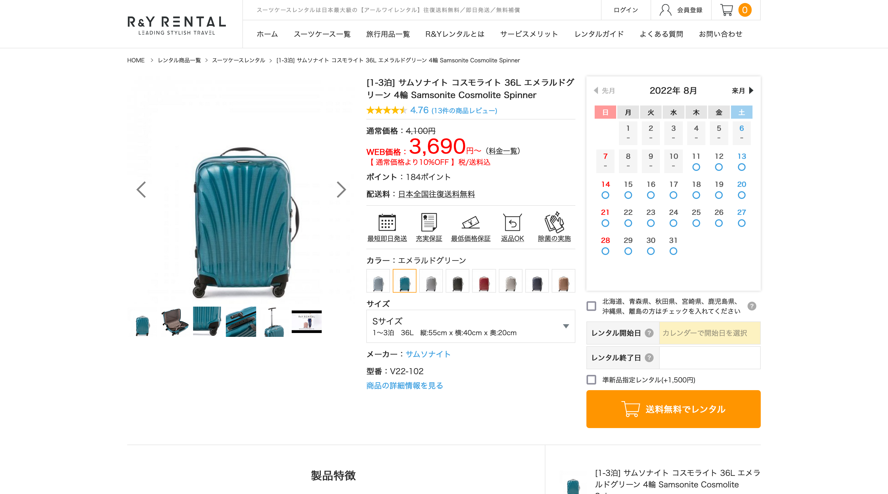
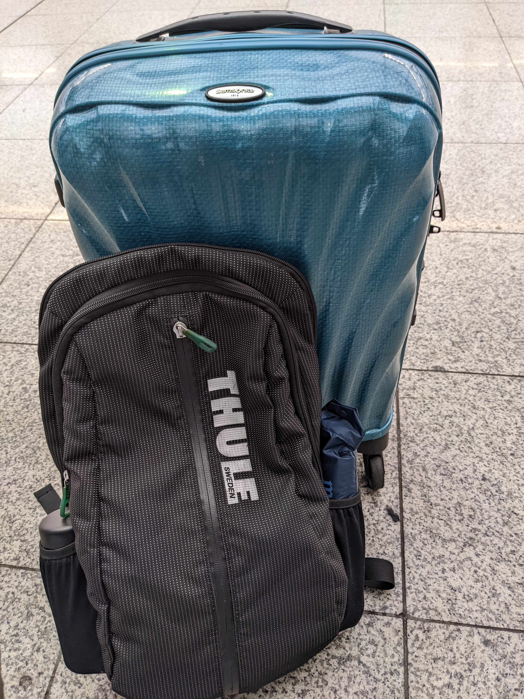
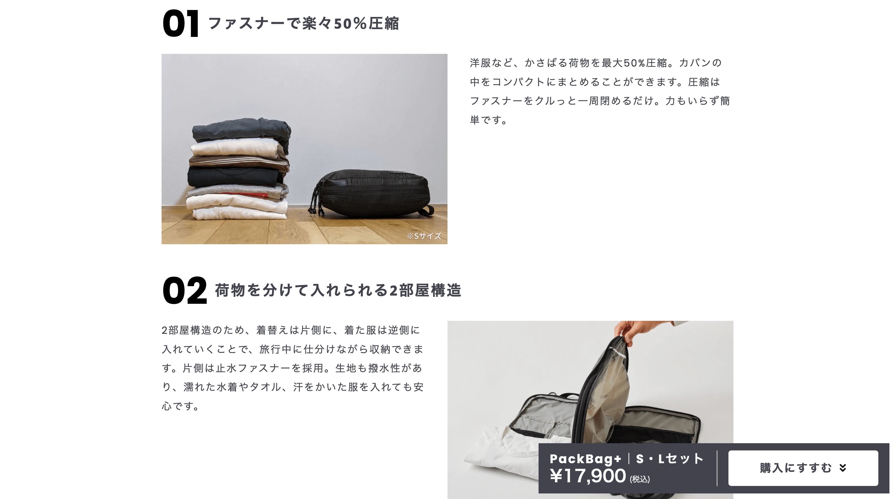
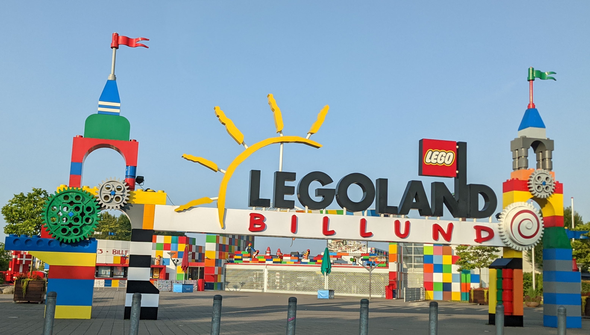

:og:image: _images/20220804bpstyle.png

.. |cover| image:: images/20220804bpstyle.png

==============================
 Experience in **EuroPython**
==============================

Takanori Suzuki

BPStyle139 / 2022 Aug 4

about **EuroPython** 🇪🇺
========================
EuroPythonについて

about **EuroPython** 🇪🇺
------------------------
* `www.europython-society.org/europython <https://www.europython-society.org/europython/>`__
* **Largest conference** for Python in Europe
* Since **2002** (PyCon US since 2003)
* Organizers: `EuroPython Society <https://www.europython-society.org/>`_

EuroPython **2022**
-------------------
* `ep2022.europython.eu <https://ep2022.europython.eu/>`_
* Date: 2022 **July** 11-17
* Location: **Dublin Ireland** & Remote
* Venue: The Convention Centre Dublin

.. revealjs-break::
   :notitle:

.. image:: images/europython.png

Dublin **Ireland** 🇮🇪
======================
ダブリン アイルランド

Have you been to **Ireland**?
-----------------------------
アイルランドに行ったことある人?

.. revealjs-break::
   :notitle:

.. image:: images/tokyo-dublin.png

What have I done? ✅
=====================
何してきたの?

Day 1
=====

Venue
-----
.. image:: images/cdc.jpg

Reception
---------
.. image:: images/reception.jpg
           
Badge
-----
.. image:: images/badge.jpg
   :width: 50%
           
Opening
-------
.. image:: images/opening.jpg
           
Keynote
-------
.. image:: images/keynote.jpg
           
Booth
-----
.. image:: images/booth.jpg

.. revealjs-break::

.. image:: images/booth2.jpg

Lunch
-----
.. image:: images/lunch.jpg

.. revealjs-break::

.. image:: images/lunch2.jpg
           
My Talk
-------
.. image:: images/takanory-talk.jpg

.. revealjs-break::

* Slide: `Automate the Boring Stuff with Slackbot (ver. 2) <https://slides.takanory.net/slides/20220713europython/#/>`_

Walking
-------
.. image:: images/walking.jpg

.. revealjs-break::

.. image:: images/beech.jpg

Pikumin
-------
.. image:: images/pikumin.png
   :width: 40%

.. image:: images/pikumin2.png
   :width: 40%

Brewdog
-------
.. image:: images/brewdog.jpg

Day 2
=====

Main hall
---------
.. image:: images/hall.jpg

Mark shannon
------------
.. image:: images/shannon2.jpg

.. revealjs-break::

.. image:: images/shannon.jpg

Community lunch
---------------
.. image:: images/community-lunch.jpg

.. revealjs-break::

.. image:: images/ninja-cat.jpg
   :width: 50%

Whitphx's talk
--------------
.. image:: images/whitphx.jpg

.. revealjs-break::

.. image:: images/whitphx2.jpg

D&I Panel
---------
.. image:: images/d-and-i.jpg

Beer
----
.. image:: images/day2beer1.jpg
   :width: 40%

.. image:: images/day2beer2.jpg
   :width: 40%

Party
-----
.. image:: images/party.jpg

.. revealjs-break::

.. image:: images/party2.jpg

.. revealjs-break::

.. image:: images/party3.jpg
   :width: 45%

.. image:: images/party4.jpg
   :width: 45%

Day 3
=====

Keynote
-------
.. image:: images/keynote2.jpg

Lunch
-----
.. image:: images/lunch3-1.jpg

.. revealjs-break::

.. image:: images/lunch3-2.jpg

Lightning Talks
---------------
.. image:: images/lt1.jpg

.. revealjs-break::

.. image:: images/lt2.jpg

.. revealjs-break::

.. image:: images/lt3.jpg

.. revealjs-break::

.. image:: images/selfie.jpg

.. revealjs-break::

* Slide `Spread the community after COVID-19 in Japan 🇯🇵 <https://slides.takanory.net/slides/20220715europython-lt/#/>`_

Closing
-------
.. image:: images/closing1.jpg

.. revealjs-break::

.. image:: images/closing2.jpg

Heading to LEGOLAND!!
---------------------
.. image:: images/to-billund.png

.. revealjs-break::

.. image:: images/ryanair.jpg

.. revealjs-break::

.. image:: images/welcome.jpg

.. revealjs-break::

.. image:: images/lodge.jpg

Inside story
============
裏話

ヨーロッパ空港やばい問題
------------------------
* 以下ツイートを見てヤベェと思う

.. raw:: html

   <blockquote class="twitter-tweet">
これからヨーロッパに来る人。 ・乗り換えダメ。直行便を。 ・バッグは機内持ち込み。 ・スーツケースを預けるならAirtag必須。 ・ドイツの交通機関はスケジュールに組み入れない。 年間50〜150フライトを15年続けてますが、現在のヨーロッパの空港状況は未体験の崩壊ぶり。
&mdash; m-take (@takeonomado) <a href="https://twitter.com/takeonomado/status/1541354965184253953?ref_src=twsrc%5Etfw">June 27, 2022</a></blockquote>  

.. revealjs-break::

* 荷物を **機内持ち込み** サイズにする
* 途中LCC(Ryanair)も使うので、重さも大事
* → **軽いスーツケース** をレンタルすることにした
* → 洋服は圧縮して、途中で **洗濯**

スーツケースレンタル
--------------------
* `サムソナイト コスモライト 36L <https://www.ry-rental.com/products/detail.php?product_id=850>`_

全荷物(11泊12日)
----------------

        

圧縮バッグ
----------
* `HOLICC PackBag+ S・Lセット <https://holicc.jp/products/packbagplus-set>`_

ヨーロッパって今どんな感じ?: コロナ
-----------------------------------
* 基本的には **普通**
* マスクは個人の意思にまかされている
* 空港、バスとかも制限なし
* ダブリンに入るときに陰性証明聞かれたかも?

ヨーロッパって今どんな感じ?: 物価
---------------------------------
* 1ユーロ≒135円くらい
* アイルランド: ちょっと高い x 円安。ホテル高い。 **ビールは安い**
* デンマーク: 日本の2倍以上の感覚。500mlの水が220円くらい
* ハンガリー: 日本よりちょっと安い。ホテル普通。 **ビールも安い**

ヨーロッパって今どんな感じ?: 買い物
-----------------------------------
* 基本クレジットカードの **タッチ決済**

  * スマホの **Google Pay** で済むので超便利
  * たまにはじかれるて、ICチップ+PINコード
* 最初に50 EURキャッシングしたが使わなかった

ヨーロッパって今どんな感じ?: 気候
---------------------------------
* アイルランド: 涼しい
* デンマーク: 涼しい
* ハンガリー: 暑い、日差しが強い
* `イギリスで史上初めて気温40度超え…欧州に熱波襲来 <https://www.businessinsider.jp/post-256938>`_

日本入国
--------
* **PCR検査** はブダペスト空港で受けた
* **MySOS** のアプリをインストール、もろもろ入力、アップロード

  * すぐにアプリ上での確認が終わった
* 海外でMySOS見せても「は、知らんし?」って感じだった

  * **紙のPCR結果** よこせ→PDFしかねぇ...
* 日本入国時はMySOSの画面を見せるとスムーズ

その他
------
* `ahamo <https://ahamo.com/>`__ のeSIMを1ヶ月契約。海外ローミングで20GB使える
* ビックの `テイクアウトレンタル <https://goopass.jp/takeoutrental/>`_ でデジカメを1ヶ月借りた
* `ヤザワ 海外用マルチ変換タップ3個口 <https://www.yodobashi.com/product/100000001001598902/>`_ 便利
* ダイソーの `ドリンクボトル <https://jp.daisonet.com/collections/leisure0222/products/4549131539875>`_ を水筒代わりに。一回落として割れた...

For more information
====================
* PyCon JP TV: `#19: EuroPython 2022振り返り <https://tv.pycon.jp/episode/19.html>`_

  * 8月5日(金) 19:30から配信!!
* `Python学習チャンネル by PyQ <https://blog.pyq.jp/>`_ (予定)
* `gihyo.jp <https://gihyo.jp/>`_ レポート (予定)

End
===

