:og:image: _images/20221015pyconjp.png

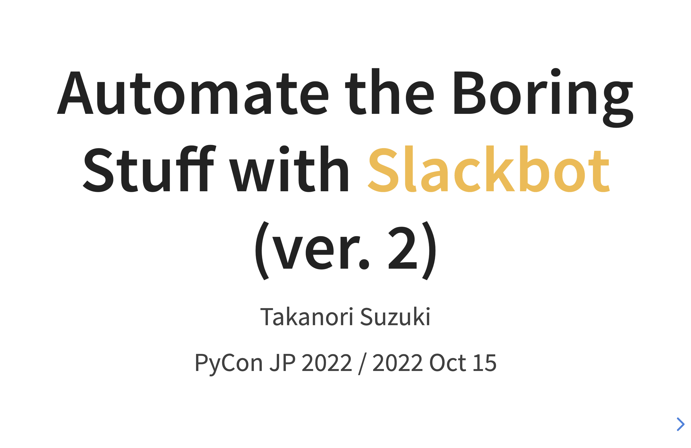

======================================================
 Automate the Boring Stuff with **Slackbot** (ver. 2)
======================================================

Takanori Suzuki

PyCon JP 2022 / 2022 Oct 15

.. revealjs-notes::

   聞きに来てくれてうれしいです。
   PyCon JPで発表できてうれしいです。
   トークタイトルは「Automate the Boring Stuff with Slackbot (ver. 2)」です。
   日本語では...

退屈なことは **Slackbot** にやらせよう (ver. 2)
===============================================

Takanori Suzuki

PyCon JP 2022 / 2022 Oct 15

Agenda / アジェンダ
===================
* **Background** and **Motivation** for Slackbot
* How to create **simple** bot
* How to create **interactive** bot
* How to **extend** bot using libs and APIs

.. revealjs-notes::

   背景とモチベーション、シンプルなボットの作り方、対話型ボットの作り方、ライブラリとAPIを使って拡張する方法

Photos 📷 Tweets 🐦 👍
=========================

``#pyconjp`` / ``@takanory``

.. revealjs-notes::

   写真をとってもらってOKです。
   Twitterなどでシェアしてもらって構いません。
   ハッシュタグは #pyconjp

Slide 💻
---------
`slides.takanory.net <https://slides.takanory.net>`__

.. raw:: html

   <blockquote class="twitter-tweet">
My talk &quot;Automate the Boring Stuff with Slackbot (ver. 2)&quot; slides are <a href="https://t.co/YfAyUxQT0e">https://t.co/YfAyUxQT0e</a> <a href="https://twitter.com/hashtag/EuroPython2022?src=hash&amp;ref_src=twsrc%5Etfw">#EuroPython2022</a>
&mdash; Takanori Suzuki (@takanory) <a href="https://twitter.com/takanory/status/1547222521648390149?ref_src=twsrc%5Etfw">July 13, 2022</a></blockquote>  

.. revealjs-notes::

   スライドはslides.takanory.netで公開済みです。
   スライドURLはTwitterで共有済みです。
   コードが多いので、コードは手元で見ることがおすすめです。

Why **ver. 2** in the title?
============================

なぜタイトルに **ver. 2** が入ってるの?

Back to **2019** / 2019年に遡る
-------------------------------
* Title: "Automate the Boring Stuff with Slackbot"
* Talk in 🇵🇭 🇹🇭 🇲🇾 🇯🇵 🇹🇼 🇸🇬 🇮🇩

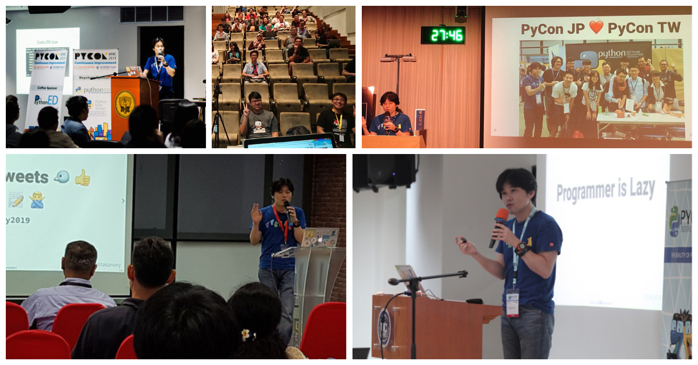

.. revealjs-notes::

   物語は2019年に遡ります。
   複数の複数のPythonカンファレンスでSlackbotについて発表しました。
   それから3年経ち...

And the **2022** / そして2022年
-------------------------------
* **Updated** with latest information 🆕
* In-person event after COVID-19 in Japan 🇯🇵
* **Thanks** to PyCon JP staff and volunteers!! 👏

.. revealjs-notes::

   2022年。
   トークの内容をSlackとライブラリについて最新の情報に更新。
   日本でみなさんの前で直接発表できてうれしいです。
   また開催に尽力したPyCon JPスタッフのみなさん、ありがとうございます。
   さて、メインの話の前に...

Who am I? / お前誰よ 👤
========================
* Takanori Suzuki / 鈴木 たかのり (:fab:`twitter` `@takanory <https://twitter.com/takanory>`_)
* `PyCon JP Association <https://www.pycon.jp/>`_ Vice Chair
* `BeProud Inc. <https://www.beproud.jp/>`_ Director / Python Climber
* `Python Boot Camp <https://www.pycon.jp/support/bootcamp.html>`_, `Python mini Hack-a-thon <https://pyhack.connpass.com/>`_
* Love: `Ferrets <https://twitter.com/search?q=%E3%81%9B%E3%81%B6%E3%82%93%E3%81%A1%E3%82%83%E3%82%93%20(from%3Atakanory)&src=typed_query>`__, `🍺 <https://untappd.com/user/takanory>`__, `LEGO <https://brickset.com/sets/ownedby-takanori>`__ / Hobby: `🎺 <https://twpo.org/>`_, `🧗‍♀️ <https://kabepy.connpass.com/>`__

.. image:: /assets/images/sokidan-square.jpg
   :width: 180

.. image:: /assets/images/kurokuri.jpg
   :width: 180

.. revealjs-notes::

   メインの話の前に...自己紹介をします。
   I'm Takanori Suzuki. My twitter is "takanory", please follow me.
   I'm Vice-Chairperson of the PyCon JP Association.
   And I'm director of BeProud Inc.
   I'm also active in several Python related communities in Japan.

**BeProud** inc. 🏢
--------------------
* `BeProud <https://www.beproud.jp/>`_: Pythonシステム開発、Consulting
* `connpass <https://connpass.com/>`_: IT勉強会支援プラットフォーム
* `PyQ <https://pyq.jp/>`_: Python独学プラットフォーム
* `TRACERY <https://tracery.jp/>`_: システム開発ドキュメントサービス

(TODO: ロゴ画像)

**BeProud** Booth
-----------------

(TODO: ブース画像)

**Python ED** Booth
-------------------
* 関連書籍をお得な価格で販売中!!

(TODO: ブース画像)

AD is over / 宣伝は終了
-----------------------

.. revealjs-notes::

   本題に戻ります

**Background** and **Motivation**
=================================

**背景** と **モチベーション**

.. revealjs-notes::

   最初にこのトークの背景とモチベーションについて話します

Conference **Tasks**
--------------------
カンファレンスの **タスク**

* I held PyCon JP(2014-2016) as **Chair**
* Conference tasks:

  * 👨‍💻 Keynotes, Talks and Trainings
  * 🎫 Ticket sales and reception
  * 🏬 Venue and facility(WiFi, Video...)
  * 🍱 Foods, ☕️ Coffee, 🧁 Snacks and 🍺 Beers

.. revealjs-notes::

   過去PyCon JPの座長をやっていました。
   カンファレンスの開催にはたくさんのタスクがあります。
   たとえばトークの管理、チケット販売、会場管理、フード、コーヒー、..
   そして...

Staff ask me the **same things**
--------------------------------
スタッフは **同じこと** を質問する

* 40+ staff
* 🐣 NEW staff : 🐔 OLD staff = 50 : 50

.. revealjs-notes::

   スタッフの数は40名を超えていて、だいたい半分が新規スタッフでした。
   新規スタッフは似たようなことを私に聴いてきて、私も繰り返し同じように回答します。
   しかし...

Programmer is **Lazy**
======================

プログラマーは **怠惰**

.. revealjs-notes::

   ご存じの通り、プログラマーはルーチンワークを嫌います。私もとても嫌いです。
   誰か私の秘書が面倒なタスクを代わりにやってほしいと思います。
   そうだ!

Let's create a **secretary**!!
==============================
**秘書** を作ろう!!

.. revealjs-notes::

   秘書を作ろう!!
   なぜなら私はプログラマーだから。

Goal / ゴール 🥅
=================
* How to create **simple** bot
* How to create **interactive** bot
* How to **extend** bot using libs and APIs

.. revealjs-notes::

   このトークのゴールは、以下を知ることです。
   単純なボットの作り方、対話ボットの作り方、ライブラリとAPIを使ってノットを拡張する方法。

Why **Slack** ? / なぜ **Slack**? :fab:`slack`
==============================================
* Launching the Slack app at any time 💻 📱
* **Easy** to access
* To do **everything**

.. image:: /20190224pyconapac/images/slack.png
   :width: 60%

.. revealjs-notes::

   私の秘書はSlack上のbot。
   Slack使っている人?
   私はSlackアプリをPCとスマホでいつも立ち上げているので、すぐにアクセスできる。
   いろんなことをSlack上でやりたい。
   では、botを作りましょう。

You can create **interactive** bot
----------------------------------

**対話** botが作れるようになる

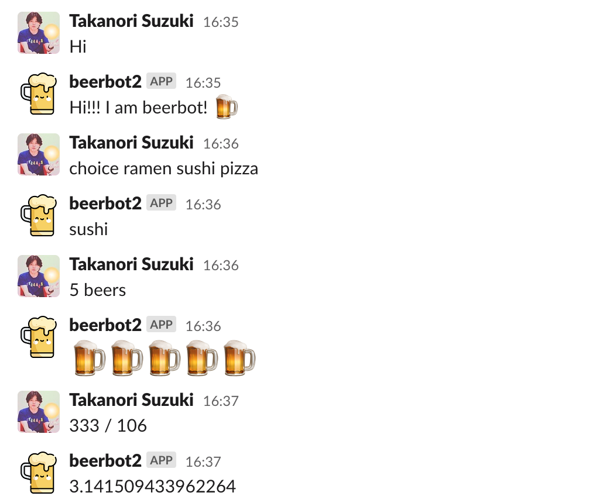

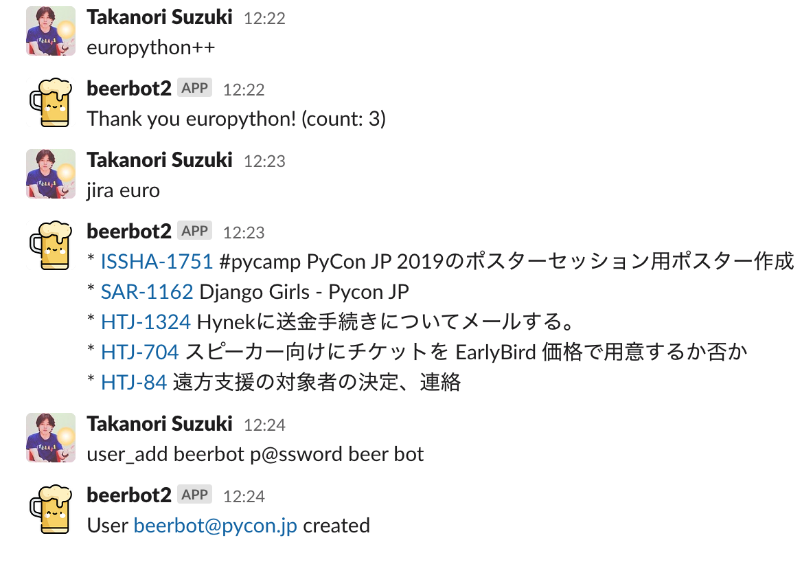

.. revealjs-notes::

   このトークを聴くとこんなbotが作れるようになる。
   あいさつ、random選択、計算、プラプラ、JIRA検索、メールアドレス追加など
   botの作り方を説明します。

.. このトークを聞くとこんなbotが作れるようになりますよ。
   あいさつしたり、randomに選んだり、計算したり、カウントしたり、JIRA検索したり、メールアドレスを追加したり。

Simple integration with **Incoming Webhooks** 🪝
================================================

**Incoming Webhooks** での簡単な連携

.. revealjs-notes::

   First, I will explain Simple integration with Incoming Webhooks.

System overview / システム概要
------------------------------
.. image:: images/diagram-webhook.png

.. revealjs-notes::

   Incoming Webhooksのシステム概要。
   プログラムがメッセージをWebhook URLに送信すると、そのメッセージがSlackに表示される

**Create** Incoming Webhooks Integration 🔧
===========================================
Incoming Webhooks連携を **作成**

**Create** Incoming Webhooks Integration
----------------------------------------
* Generate **Webhook URL**

  1. Create a Slack app
  2. Activate Incoming Webhooks in the app
  3. Add Webhook to Workspace
* see: `Sending messages using Incoming Webhooks <https://api.slack.com/messaging/webhooks>`_

.. revealjs-notes::

   Webhook URLを生成する手順は以下のとおり

1. Create a Slack app / Slack appを作成
---------------------------------------

* https://api.slack.com/apps

.. image:: images/create-webhook1-1.png
   :width: 50%

.. image:: images/create-webhook1-2.png
   :width: 50%

.. revealjs-break::
   :notitle:

* Enter name and choose workspace

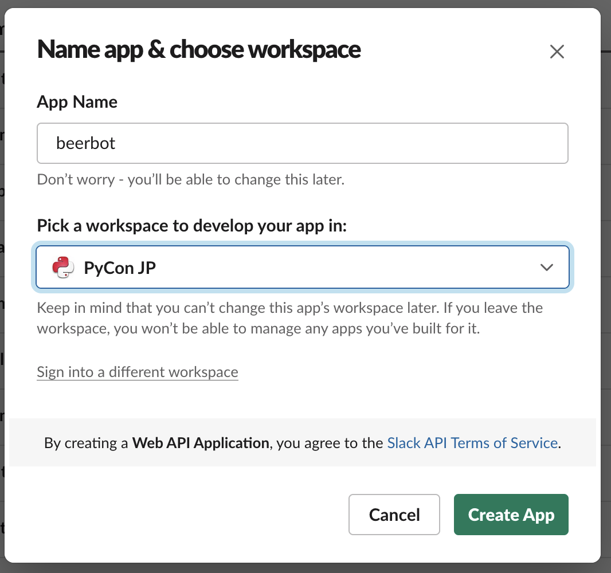

.. revealjs-break::
   :notitle:

* Set app icon (optional)

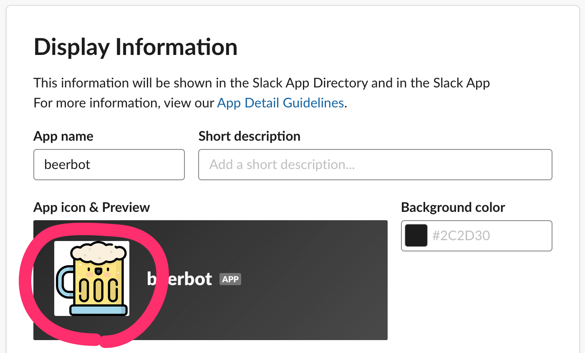

* see: `Beer icons created by Freepik - Flaticon <https://www.flaticon.com/free-icons/beer>`_

2. Activate Incoming Webhooks / 有効化
--------------------------------------
.. image:: images/create-webhook4-1.png
   :width: 50%

3. Add Webhook to Workspace / ワークスペースに追加
--------------------------------------------------
* Click "Add New Webhook to Workspace"

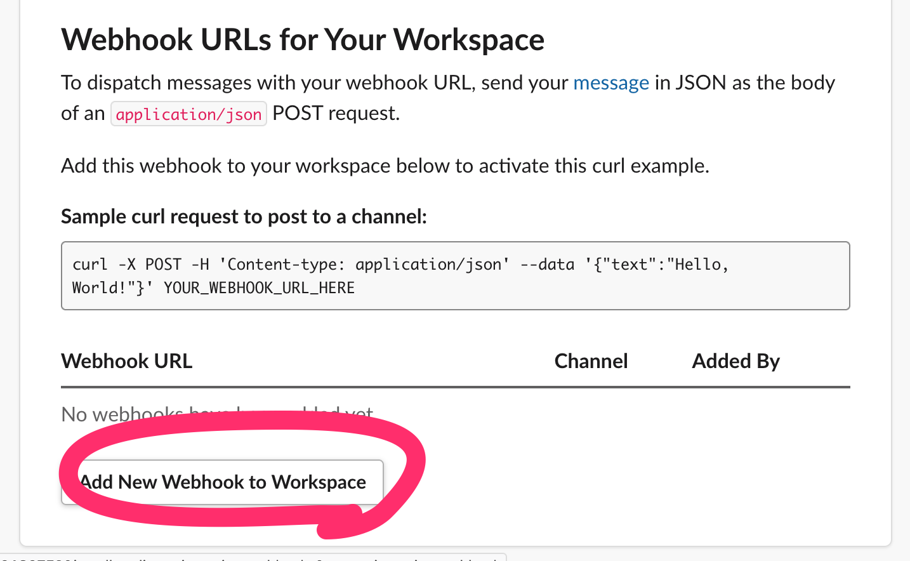

.. revealjs-break::
   :notitle:

* Choose channel → Click "Allow"

.. image:: images/create-webhook5.png
   :width: 50%

.. revealjs-break::
   :notitle:

* Get **Webhook URL**: ``https://hooks.slack.com/...``

.. image:: images/create-webhook6.png
   :width: 50%

.. revealjs-notes::

   最後にWebhook URLが取得できる。
   このURLを使ってSlackにメッセージを送信しましょう

Post message via **Webhook URL** 📬
===================================
**Webhook URL** 経由でメッセージを投稿

Post message with **cURL**
--------------------------

.. code-block:: bash

   $ curl -X POST -H 'Content-type: application/json' \
   > --data '{"text":"Hello Slack!"}' \
   > https://hooks.slack.com/services/T000...

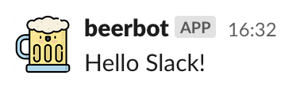

.. revealjs-notes::

   簡単なメッセージをcURLで送信する。
   JSONの中にメッセージを入れて送信するとSlackに表示される

Post message with **Python**
----------------------------
* see: `urllib.request <https://docs.python.org/3/library/urllib.request.html>`_

.. code-block:: python

   import json
   from urllib import request

   url = "https://hooks.slack.com/services/T000..."
   message = {"text": "Hello from Python!"}
   data = json.dumps(message).encode()
   request.urlopen(url, data=data)

.. image:: images/webhook-python.png

.. revealjs-notes::

   みなさんはpythonistaなので、urllib.requestを使います

Post message with **Requests**
------------------------------
* see: `Requests <https://docs.python-requests.org/en/latest/>`_

.. code-block:: bash

   $ pip install requests

.. code-block:: python

   import requests

   url = "https://hooks.slack.com/services/T000..."
   message = {"text": "Hello from Requests!"}
   r = requests.post(url, json=message)

.. image:: images/webhook-requests.png

.. revealjs-notes::

   Requestsだとより簡単

Post message with **Slack SDK**
-------------------------------
* see: `Python Slack SDK <https://slack.dev/python-slack-sdk/>`_

.. code-block:: bash

   $ pip install slack-sdk

.. code-block:: python

   from slack_sdk.webhook import WebhookClient

   url = "https://hooks.slack.com/services/T000..."
   webhook = WebhookClient(url)
   r = webhook.send(text="Hello from Slack SDK!")

.. image:: images/webhook-slacksdk.png

.. revealjs-notes::

   Slackが提供しているPython Slack SDKもおすすめです。

**Formatting** text / テキストを整形
------------------------------------
* see: `Formatting text for app surfaces <https://api.slack.com/reference/surfaces/formatting>`_

.. revealjs-code-block:: python
   :data-line-numbers: 4-7

   from slack_sdk.webhook import WebhookClient

   url = "https://hooks.slack.com/services/T000..."
   webhook = WebhookClient(url)
   # *bold*, <url|text>, :emoji: and etc.
   r = webhook.send(text="*Hello* from "
     "<https://slack.dev/python-slack-sdk/|Slack SDK>! :beer:")

.. revealjs-notes::

   markdownっぽくテキストがフォーマットできる。
   より複雑なメッセージを作成したい場合は...

.. markdownっぽくテキストがフォーマットできます。

**Block** Kit 🧱
================

.. revealjs-notes::

   Block Kitを使います

**Block** Kit
-------------

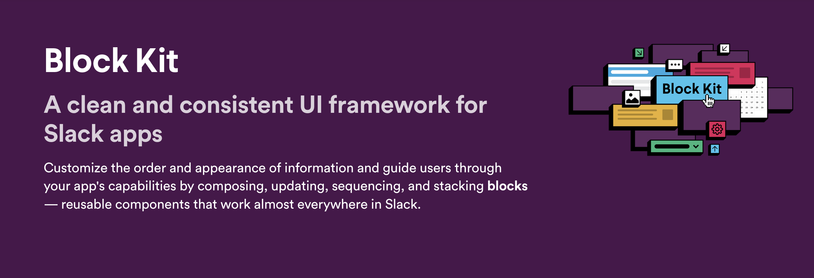

* see: `Block Kit <https://api.slack.com/block-kit>`_

.. revealjs-notes::

   Block KitはSlackアプリのUIフレームワーク

**Example** of Block Kit
------------------------
.. code-block:: python

   blocks = [{
       "type": "section",
       "text": {
            "text": "*THANK YOU* for coming to my talk !:tada: Please give me *feedback* about this talk :bow:",
            "type": "mrkdwn"
       },
       "fields": [
            {"type": "mrkdwn", "text": "*Love*"},
            {"type": "mrkdwn", "text": "*From*"},
            {"type": "plain_text", "text": ":beer:, Ferrets, LEGO"},
            {"type": "plain_text", "text": "Japan :jp:"},
       ],
   }]
   response = webhook.send(blocks=blocks)

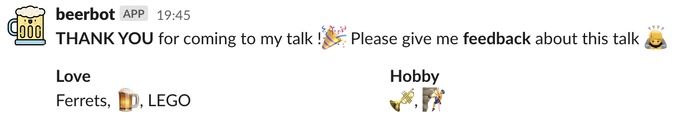

Block Kit **Builder**
---------------------
.. image:: images/block-kit-builder.gif
   :width: 80%

* `app.slack.com/block-kit-builder/ <https://app.slack.com/block-kit-builder/>`_

.. revealjs-notes::

   Blockを作成するのにBlock Kit Builderが便利です。
   Block Kitのコードを対話的に生成して表示が確認できる

**Summary** of Incoming Webhooks
================================
**まとめ**: Incoming Webhooks

* **Easy** to post messages from programs 📬
* Create complex messages with **Block Kit** 🧱
* But **one-way** (program➡️Webhook➡️Slack)

.. revealjs-notes::

   プログラムで簡単にメッセージを投稿できる。
   複雑なメッセージをBlock Kitで作成できる。
   しかし一方向です。
   次に、...

**Interactive** bot 🤝
======================
**対話型** のbot

.. revealjs-notes::

   次に、対話型のbotの作成方法を解説する

Connection protocols / 接続方式
-------------------------------
* Events API over HTTP
* Socket Mode
* see: `Choosing a protocol to connect to Slack <https://api.slack.com/apis/connections>`_

.. revealjs-notes::

   Slackは対話用に2種類のプロトコルを提供している

Events API over HTTP
--------------------

.. image:: images/diagram-eventsapi.png

* see: `Using the Slack Events API <https://api.slack.com/apis/connections/events-api>`_

.. revealjs-notes::

   「Events API over HTTP」では、ユーザーが送信したメッセージはEvents APIとして送信される。
   このプロトコルでは公開のHTTPエンドポイントが必要

Socket Mode
-----------

.. image:: images/diagram-socketmode.png

* see: `Intro to Socket Mode <https://api.slack.com/apis/connections/socket>`_

.. revealjs-notes::

   もう一つの「Socket Mode」ではHTTPエンドポイントは不要。
   プライベートなWebSocket内でEvent APIを受信する

Connection protocols / 接続方式
-------------------------------
* Events API over HTTP
* **Socket Mode** 👈

.. revealjs-notes::

   この発表では、ローカルでの開発が簡単なので、Socket Modeを使います

**Create** bot user 🤖
======================
bot userを **作成**

**Create** bot user
-------------------
* Create bot user with **Socket Mode**

  1. Create a Slack app (same procedure)
  2. Enable Socket Mode
  3. Subscribe bot event
  4. Add Bot Token Scopes
  5. Install App to Workspace
* Invite bot user to Slack channels

.. revealjs-notes::

   I describe how to create an interactive bot.
   At first, we create bot user on Slack.

1. Create a Slack app
---------------------
* Open https://api.slack.com/apps

.. image:: images/create-webhook1-1.png
   :width: 50%

.. image:: images/create-webhook1-2.png
   :width: 50%

.. revealjs-break::
   :notitle:

* Enter name and choose workspace

.. image:: images/create-bot2.png
   :width: 50%

.. revealjs-break::
   :notitle:

* Set app icon (optional)

.. image:: images/create-bot3.png
   :width: 50%

* see: `Beer icons created by Freepik - Flaticon <https://www.flaticon.com/free-icons/beer>`_

2. Enable Socket Mode
---------------------
* Select "Socket Mode" → Turn toggle on

.. image:: images/create-bot4.png
   :width: 70%

.. revealjs-break::
   :notitle:

* Enter token name → Click "Generate"

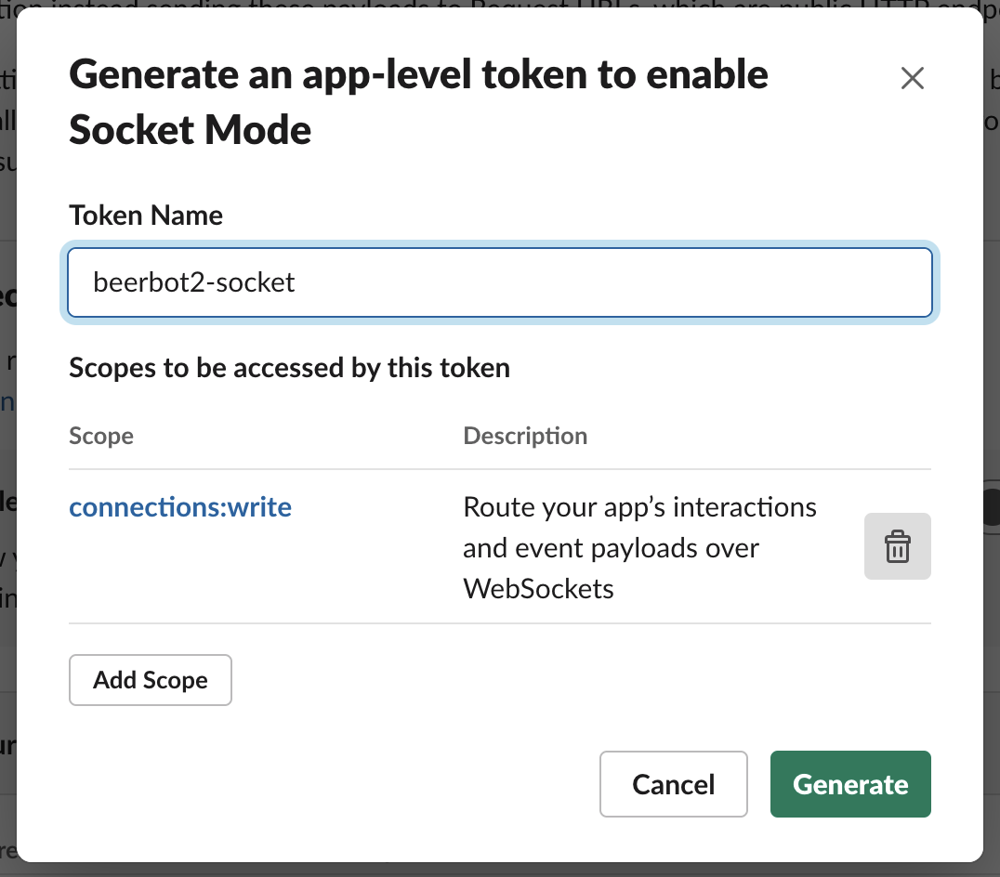

.. revealjs-break::
   :notitle:

* Get **app-level token**: ``xapp-...``

.. image:: images/create-bot6.png
   :width: 50%

3. Subscribe bot event
----------------------
* Select "Event Subscriptions" → Turn toggle on

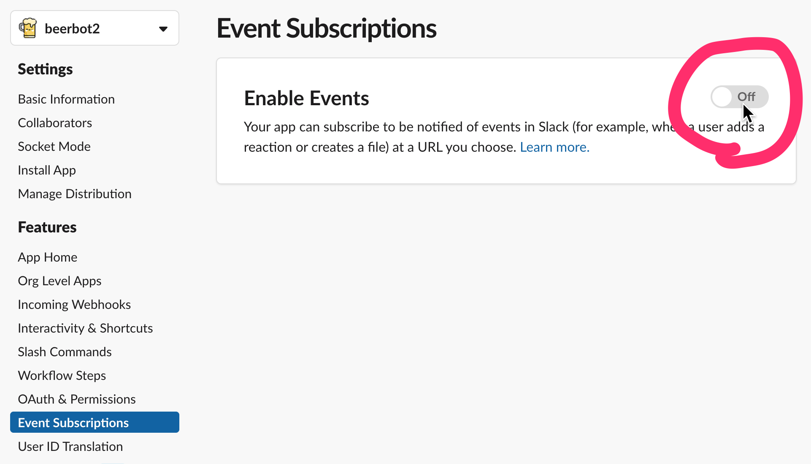

.. revealjs-break::
   :notitle:

* Add "message.channels" to bot events

.. image:: images/create-bot3-2-1.png
   :width: 50%

.. image:: images/create-bot3-2-2.png
   :width: 50%

4. Add Bot Token Scopes
-----------------------
* Select "OAuth & Permissions"

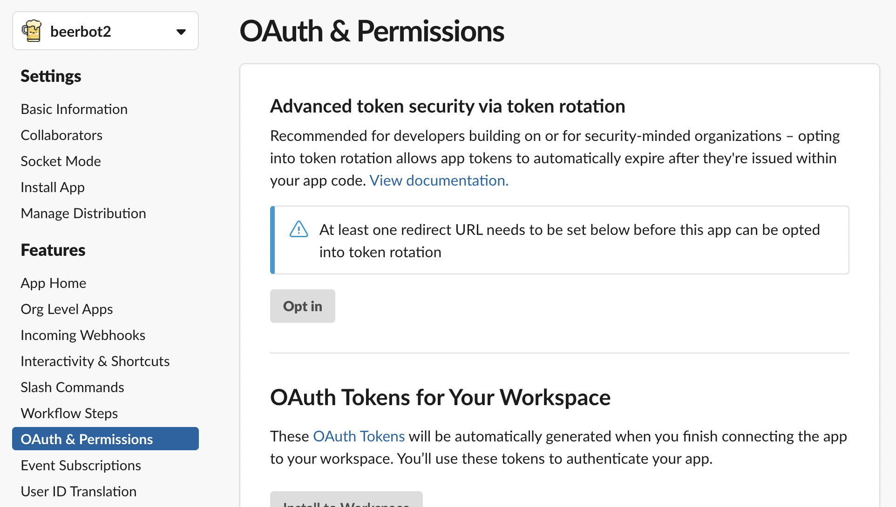

.. revealjs-break::
   :notitle:

* Click "Add on OAuth Scope"

.. image:: images/create-bot8.png
   :width: 80%

.. revealjs-break::
   :notitle:

* Add "chat:write" to Bot Token Scopes

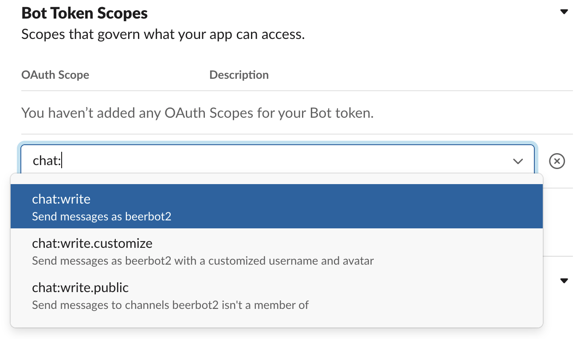

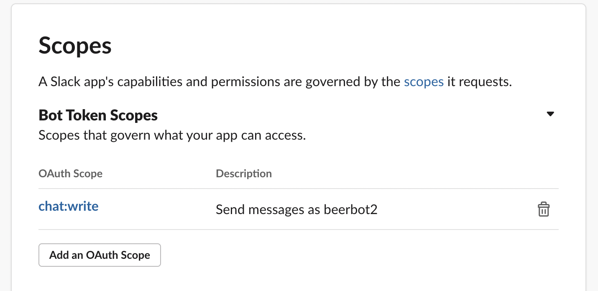

5. Install App to Workspace
---------------------------
* Select "Install App" → Click "Install to Workspace"

.. image:: images/create-bot11.png
   :width: 80%

.. revealjs-break::
   :notitle:

* Switch OAuth screen → Click "Allow" button

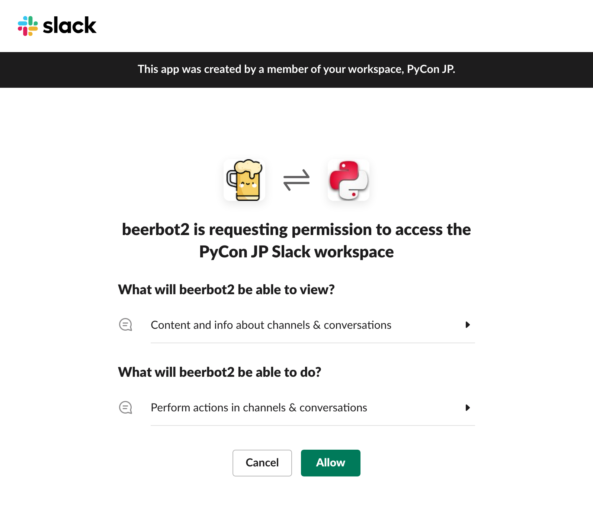

.. revealjs-break::
   :notitle:

* Get **Bot Token**: ``xoxb-...``

.. image:: images/create-bot13.png
   :width: 50%

Invite bot user to channels
---------------------------
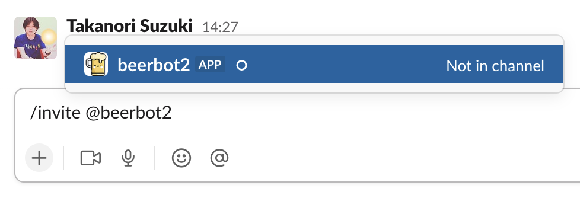

**Long** and **Complex** !! 🤯
===============================
**長い** し **複雑** !!

.. revealjs-notes::

   The steps are long and complex !!
   Is there a better way ?
   I recommend... App Manifest.

.. ステップが長くて難しいですか?

App **Manifest** ⚙️
===================

.. revealjs-notes::

   I recommend... App Manifest.

App **Manifest**
----------------
* YAML-formatted configuration for Slack apps
* see: `Create and configure apps with manifests <https://api.slack.com/reference/manifests>`_

.. revealjs-notes::

   App Manifests are YAML-formatted configuration bundles for Slack apps.
   We can share and reuse manifests.

Example of App Manifest
-----------------------
.. code-block:: yaml

   display_information:
     name: beerbot2
   features:
     bot_user:
       display_name: beerbot2
       always_online: false
   oauth_config:
     scopes:
       bot:
         - channels:history
         - chat:write
   settings:
     event_subscriptions:
       bot_events:
         - message.channels
     interactivity:
       is_enabled: true
     org_deploy_enabled: false
     socket_mode_enabled: true
     token_rotation_enabled: false

Get App Manifest
----------------
* Select "App Manifest" menu

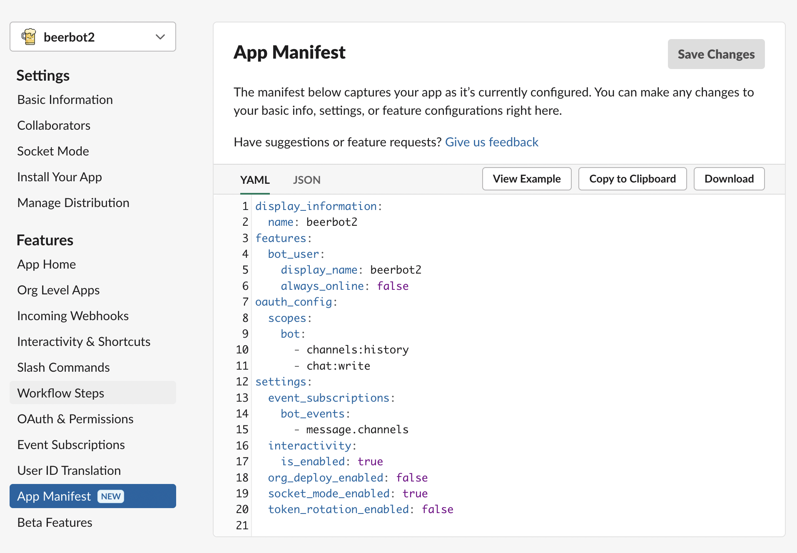

Create new app with App Manifest
--------------------------------
* Select "From an app manifest"
* Select workspace → Click "Next"

.. image:: images/app-manifest1.png
   :width: 40%

.. image:: images/app-manifest2.png
   :width: 40%

.. revealjs-break::
   :notitle:

* Enter app manifest YAML

.. image:: images/app-manifest3.png
   :width: 46%

.. revealjs-break::
   :notitle:

* Review app summary → Click "Create"

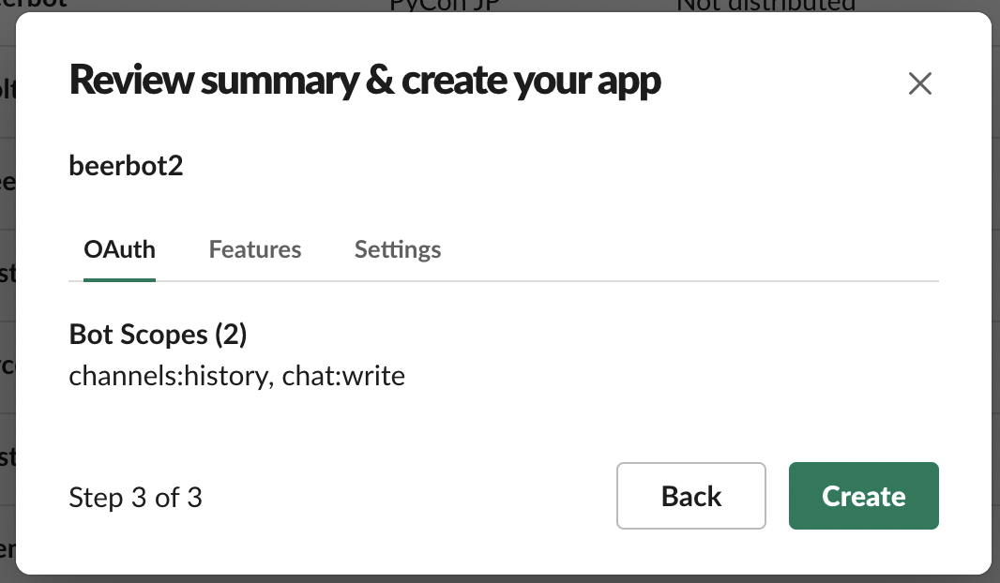

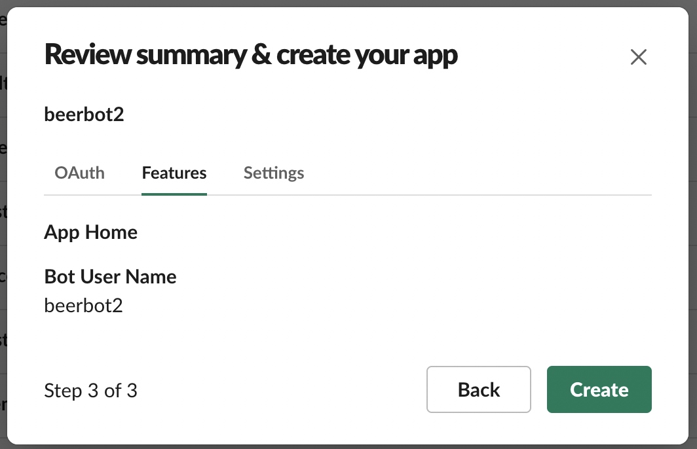

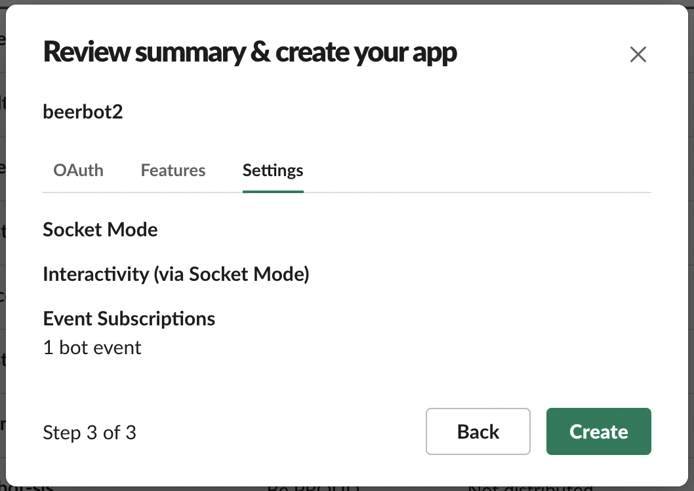

.. revealjs-break::
   :notitle:

* Install App to Workspace

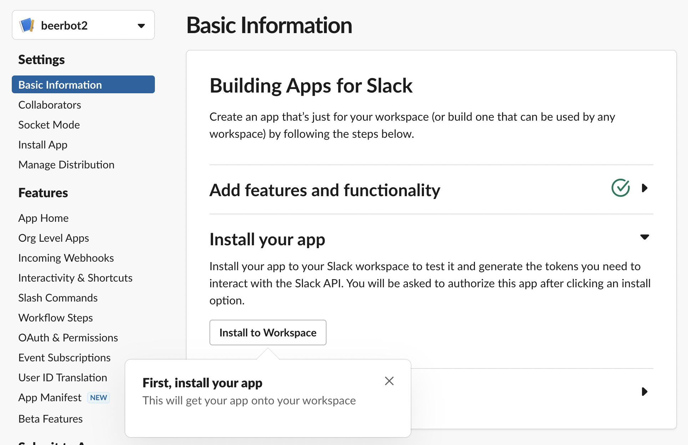

.. revealjs-break::
   :notitle:

* Generate App-Level Token

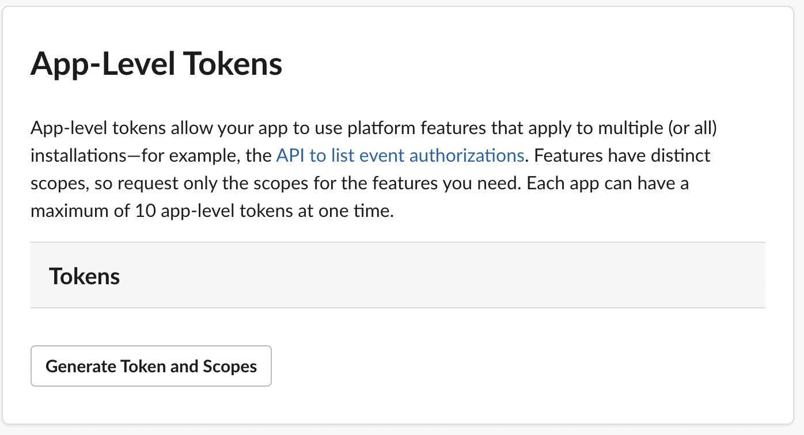

.. image:: images/app-manifest9.png
   :width: 45%

**Short** and **Reusable** !! 🥳
=================================
**短い** し **再利用** できる!!

.. revealjs-notes::

   App Manifest makes steps shorter and reusable.
   Now we are ready to start creating an interactive bot.

Create bot with **Bolt** ⚡️
============================
**Bolt** を使ってbotを作成

.. revealjs-notes::

   Let's create a bot with Bolt !
   What is Bolt?

Bolt for Python
---------------
* Python framework to build Slack app in a **flash**
* Developped by **Slack**
* :fab:`github` `github.com/slackapi/bolt-python <https://github.com/slackapi/bolt-python>`_
* see:

  * `Bolt for Python <https://slack.dev/bolt-python/concepts>`_
  * `The Bolt family of SDKs <https://api.slack.com/tools/bolt>`_ (JavaScript, Java)

.. revealjs-notes::

   Bolt is a Python framework to build Slack app in a flash.
   Slack also provides Bolt for JavaScript and Java.

**Install** Bolt for Python
---------------------------
.. code-block:: bash

   $ mkdir beerbot
   $ cd beerbot
   $ python3.10 -m venv env
   $ . env/bin/activate
   (env) $ pip install slack-bolt

**Create** a simple bot with Bolt
---------------------------------
.. literalinclude:: code/app1.py
   :language: python
   :caption: app.py

.. revealjs-notes::

   When the bot receives the string "Hi", bot sends a greeting message.

**Running** bot
---------------
.. code-block:: bash

   # Set 2 tokens in environment variables
   (env) $ export SLACK_APP_TOKEN=xapp-...
   (env) $ export SLACK_BOT_TOKEN=xoxb-...
   (env) $ python app.py
   ⚡️ Bolt app is running!

.. revealjs-notes::

   Set 2 tokens in environment variables, then run app.py.
   When I write a messge "Hi" on Slack,...

I can **interact** with the bot ! 🎉
-------------------------------------
botと **会話** できた!

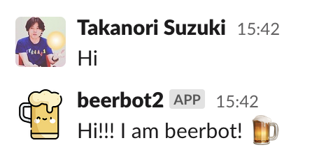

.. revealjs-notes::

   When I write a message "Hi" on Slack, ... the bot responds!
   But this is simple enough, so...

**Extend** bot 🛠
=================
botを **拡張**

.. revealjs-notes::

   so ... I will extend the bot.

``@app.message()`` decolator
----------------------------
.. literalinclude:: code/app-extend.py
   :lines: 13-23

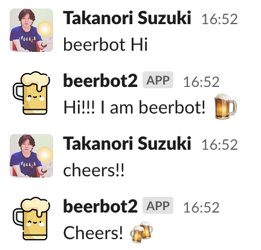

.. revealjs-notes::

   app.message() decolator executes the function when it matches the pattern.

mention / メンション
--------------------
.. literalinclude:: code/app-extend.py
   :lines: 25-30

.. image:: images/bot-mention.png
   :width: 30%

.. revealjs-notes::

   The bot can send mentions

Use regular expression / 正規表現を使う
---------------------------------------
.. literalinclude:: code/app-extend.py
   :lines: 3-4,31-38

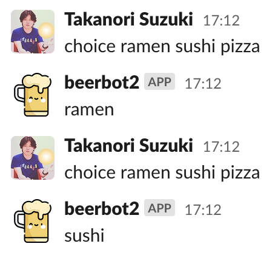

.. revealjs-notes::

   Bolt can handle parameters.
   We use regular expressions in app.message() decolator, you can extract matched strings from context["matches"]

.. revealjs-break::

.. literalinclude:: code/app-extend.py
   :lines: 39-45

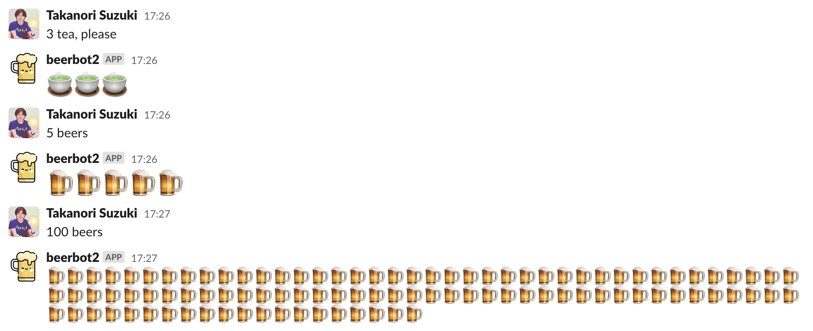

Block Kit support
-----------------
.. literalinclude:: code/app-extend.py
   :lines: 46-61

.. image:: images/bot-followme.png
   :width: 60%

Logging / ロギング
------------------
.. literalinclude:: code/app-extend.py
   :lines: 1,11,78-83

.. code-block:: bash

   $ python app.py
   ⚡️ Bolt app is running!
   DEBUG:app.py:handle_log:message: log
   DEBUG:app.py:handle_log:message: please write log

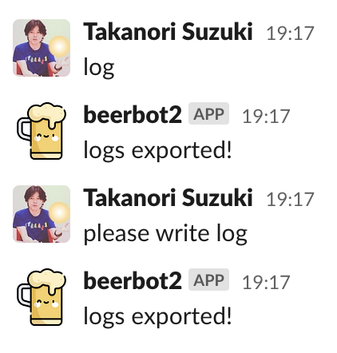

**Events** and **Scopes** 🔭
============================
**イベント** と **スコープ**

Events and Scopes
-----------------
* Can only receive events in **Bot Events**
* Can only execute APIs allowed by **Bot Token Scopes**

.. revealjs-notes::

   Events and Scopes are important concepts in Slack Bots.
   Bot can only receive events in **Bot Events**.
   And bot can only execute APIs allowed by **Bot Token Scopes**.

Current Bot Events and Scopes
-----------------------------

* Events

  :message.channels: message posted to **public channels**

* Scopes

  :channels:history: View messages in **public channels**
  :chat:write: Post message

.. revealjs-notes::

   For example, the current bot event is message.channels, bot scopes are channels:history and chat:write only.

.. revealjs-break::

* Cannot read/write messages on **private channels**

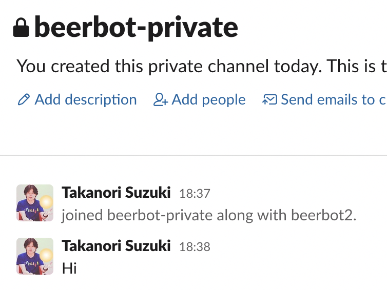

.. revealjs-notes::

   So, the bot cannot read/write messages on private channels.
   I invited the bot to a private channel and sent a "Hi" message but no response!
   What shoud I do?

Add Events and Scopes for private channels
------------------------------------------

* Select "Event Subscriptions" → Click "Add Bot User Event"
* Add **message.groups** event→ Click "Save Changes"

.. image:: images/add-events-and-scopes1.png
   :width: 50%

.. revealjs-notes::

   I need to add events and scopes for private channels.
   I added a "message.groups" event.

.. revealjs-break::

* Select "OAuth & Permissions"
* **groups:history** scope is automatically added

.. image:: images/add-events-and-scopes2.png
   :width: 50%

.. revealjs-notes::

   "groups:history" scope is automatically added

.. revealjs-break::

* **Reinstall** app to workspace

.. image:: images/add-events-and-scopes3.png
   :width: 50%

.. image:: images/add-events-and-scopes4.png
   :width: 40%

.. revealjs-notes::

   I will reinstall the app because of the change in events and scopes.

.. revealjs-break::

* Bot can read/write messages in **private channel**

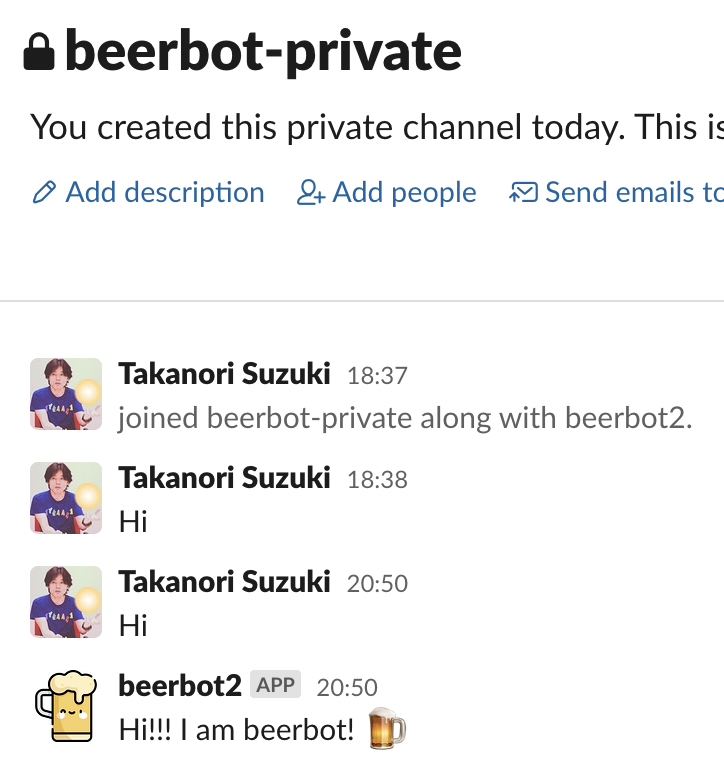

.. revealjs-notes::

   Then, the bot can read/write messages in **private channel**

To know user joined a channel
-----------------------------
* Add **member_joined_channel** event → Reinstall app

.. literalinclude:: code/app-extend.py
   :emphasize-lines: 1-2
   :lines: 60-66

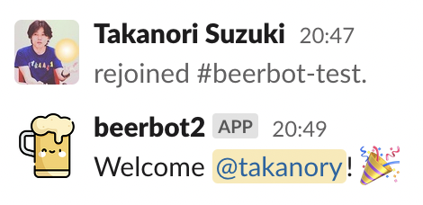

.. revealjs-notes::

   If you want to know when a user joins a channel, add a "member_joind_channel" event.
   And You can handle the event with @app.event decorator.

Add Emoji reaction
------------------
* Add **reactions:write** scope → Reinstall app

.. literalinclude:: code/app-extend.py
   :language: python
   :lines: 67-76

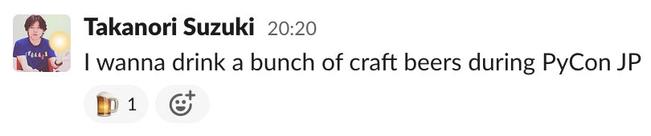

.. revealjs-notes::

   If you want to add emoji reactions, add a "reactions:write" scope.

**Summary** of Events and Scopes
--------------------------------
**まとめ**: イベントとスコープ

* To receive new events
* To use new API with new scopes
* Add **events** and/or **scopes** → Reinstall app
* see: `Events API types <https://api.slack.com/events>`_
* see: `Permission scopes <https://api.slack.com/scopes>`_

Case studies 📚
================
事例紹介

.. revealjs-notes::

   From here, I will create functions to solve the issues.

Calculator function using **SymPy** 🔢
=======================================
**SymPy** を使った電卓機能

Calculator function using **SymPy**
-----------------------------------

* Motivation

  * I feel heavy to call a calculator app on my smartphone
  * It seems useful if **Slack as a calculator**

System overview / システム概要
------------------------------
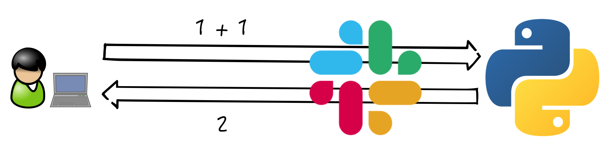

about **SymPy**
---------------
.. image:: https://www.sympy.org/static/images/logo.png

* **SymPy**: Python library for symbolic mathematics
* `www.sympy.org <https://www.sympy.org>`_

.. code-block:: bash

   $ pip install sympy

**calc()** function using Sympy
-------------------------------

.. literalinclude:: code/app-sympy.py
   :language: python
   :lines: 6,10-24

Slack as a **calculator**!! 🎉
------------------------------
Slackが **電卓** になった!!

.. image:: images/case-sympy.png
   :width: 30%

Plus-plus feature using **Peewee ORM** 👍
==========================================
**Peewee ORM** を使ったプラプラ機能

Plus-plus feature using **Peewee ORM**
--------------------------------------
* Motivation

  * In PyCon JP, I want to make a culture that **appreciates** each other staff 👍

System overview
---------------
.. image:: images/diagram-peewee.png

about **Peewee**
----------------
.. image:: https://docs.peewee-orm.com/en/latest/_images/peewee3-logo.png
   :width: 40%

* Simple and small ORM.

  * a small, expressive ORM
  * supports sqlite, mysql and postgresql

* `docs.peewee-orm.com <https://docs.peewee-orm.com/>`_

.. code-block:: bash

   $ pip install peewee

plusplus_model.py
-----------------
.. literalinclude:: code/plusplus_model.py

**plusplus()** function using Peewee
------------------------------------
.. literalinclude:: code/app-plusplus.py
   :language: python
   :lines: 6, 10-22

I can **appreciate** it! 🎉
---------------------------
**感謝** できる!!

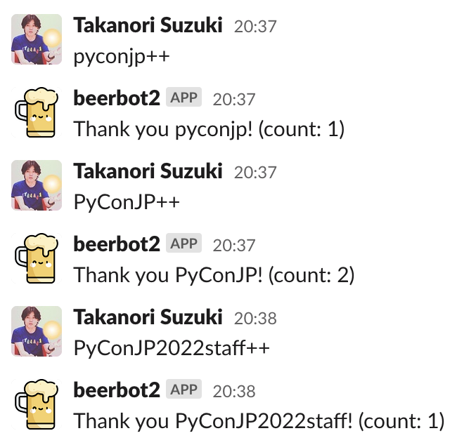

Search issues with **Jira APIs** 🔎
====================================
**Jira API** で課題を検索

Search issues with **Jira APIs**
--------------------------------
* Motivation

  * Jira is very useful
  * Jira Web is **slow**
  * Search issues **without Jira Web**

System overview
---------------

about **Python Jira**
---------------------
* Python library to work with Jira APIs
* `jira.readthedocs.io <https://jira.readthedocs.io/>`_

.. code-block:: bash

   $ pip install jira

Authentication
--------------
* Create an API token

  * see: `Manage API tokens for your Atlassian account <https://support.atlassian.com/atlassian-account/docs/manage-api-tokens-for-your-atlassian-account/>`_

.. code-block:: python

   from jira import JIRA

   url = 'https://jira.atlassian.com/'
   jira = JIRA(url, basic_auth=('email', 'API token'))

* see: `2.1.2. Authentication <https://jira.readthedocs.io/examples.html#authentication>`_

Search issues
-------------
.. literalinclude:: code/app-jira.py
   :lines: 15-29

* see: `2.1.6. Searching <https://jira.readthedocs.io/examples.html#searching>`_
* see: `JQL: Get started with advanced search in Jira <https://www.atlassian.com/software/jira/guides/expand-jira/jql#advanced-search>`_

**Free** from Jira web! 🎉
--------------------------
Jira webからの **解放**!

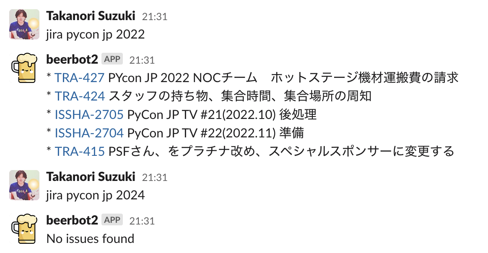

Create **multiple issues** from a template 📝
=============================================
テンプレートから **複数の課題** を作成

Create **multiple issues** from a template
------------------------------------------
* Motivation

  * In pycamp event, **20+ issues** are required for each event
  * Copying issues by hand is **painful**
  * Jira Web is **slow** (again)

System overview
---------------
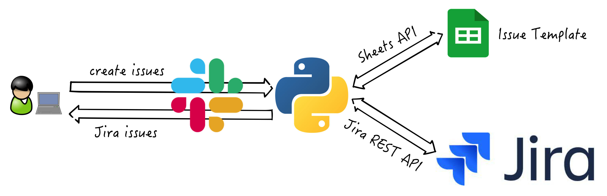

Google Authorization is Complex
-------------------------------
* Create a Google Cloud project

  * Enable API(in this case: Google Sheets API)
  * Download ``credentials.json``
* Install Google Client Library

  .. code-block:: bash

     $ pip install google-api-python-client \
       google-auth-httplib2 google-auth-oauthlib

* Download `quickstart.py <https://github.com/googleworkspace/python-samples/blob/master/sheets/quickstart/quickstart.py>`_ from GitHub

.. revealjs-break::

* Run ``quickstart.py``

  * Select your Google account in Web browser
  * Click "Accept" button
  * Get ``token.json`` (finish!!)

.. code-block:: bash

   $ python quickstart.py
   Please visit this URL to authorize this application: https://accounts.google.com/o/oauth2/auth?....
   Name, Major:
   Alexandra, English
   :

* see: `Python Quickstart | Sheets API <https://developers.google.com/sheets/api/quickstart/python>`_

Issue template
--------------
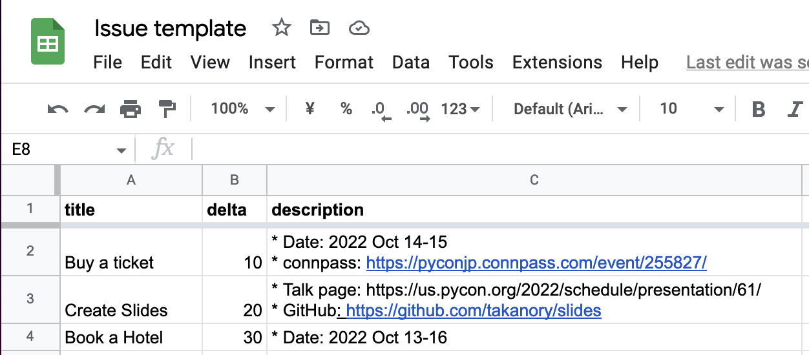

Get Spreadsheet data
--------------------
.. code-block:: python

   from google.oauth2.credentials import Credentials
   from googleapiclient.discovery import build

   SCOPES = ["https://www.googleapis.com/auth/spreadsheets.readonly"]
   SHEET = "1i3YQPObe3ZC_i1Jalo44_2_..."

   @app.message("create issues")
   def creaete_issues(message, say):
       creds = Credentials.from_authorized_user_file('token.json', SCOPES)
       service = build('sheets', 'v4', credentials=creds)
       sheet = service.spreadsheets()
       result = sheet.values().get(spreadsheetId=SHEET, range="A2:C4").execute()
       for row in result.get("values", []):
           say(f"* Title: {row[0]}, Delta: {row[1]}")

* see: `Method: spreadsheets.values.get | Sheets API <https://developers.google.com/sheets/api/reference/rest/v4/spreadsheets.values/get>`_

.. revealjs-break::

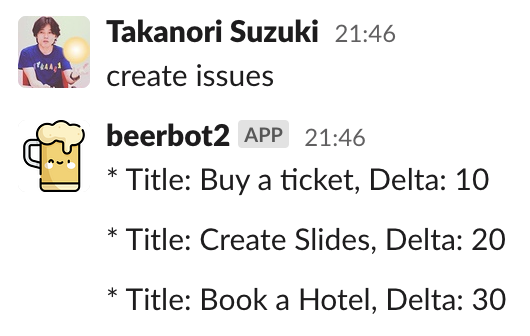

Create Jira issues
------------------
.. literalinclude:: code/app-sheet.py
   :lines: 21, 27-39
   :language: python

* see: `2.1.4. Issues <https://jira.readthedocs.io/examples.html#issues>`_

**Free** from copying issues! 🎉
--------------------------------
課題のコピーからの **解放**!

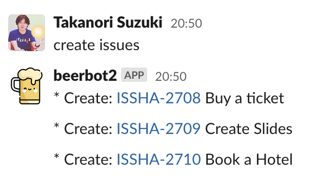

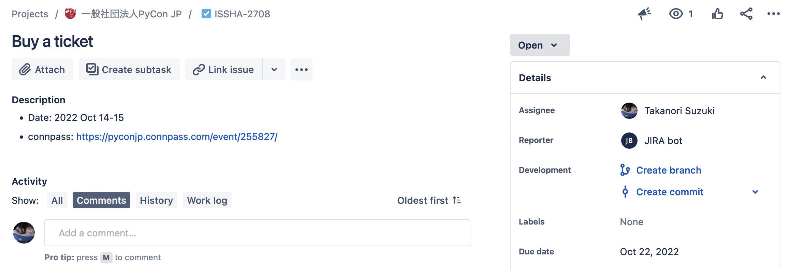

**Account management** of Google Workspace 👥
==============================================
Google Workspaceでの **アカウント管理**

**Account management** of Google Workspace
------------------------------------------
* Motivation

  * PyCon JP Association use ``pycon.jp`` domain with Google Workspace
  * I only use Google Admin web occasionally
  * I **forgot** to use admin screen

System overview
---------------
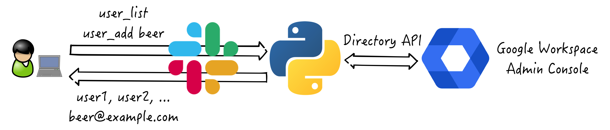

Update Google Authorization
---------------------------
* Update a Google Cloud project

  * add **Directory API**
  * re-download ``credentials.json``
* Remove ``token.json``
* Add **Directory API** ``quickstart.py``

  * Re-run ``quickstart.py``
  * Get new ``token.json``

Get user list
-------------
.. literalinclude:: code/app-admin.py
   :language: python
   :lines: 11, 13-26

* see: `Method: users.list | Directory API <https://developers.google.com/admin-sdk/directory/reference/rest/v1/users/list>`_

.. revealjs-break::

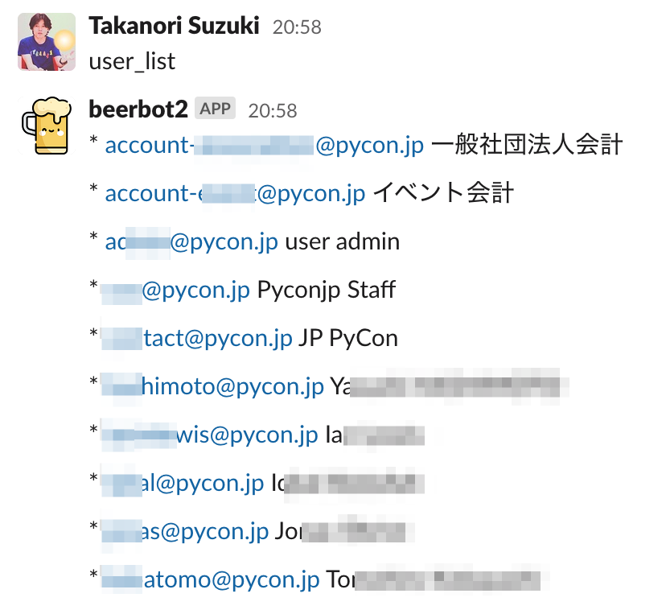

Add user
--------
.. literalinclude:: code/app-admin.py
   :language: python
   :lines: 28-42

* see: `Method: users.insert | Directory API <https://developers.google.com/admin-sdk/directory/reference/rest/v1/users/insert>`_

.. revealjs-break::

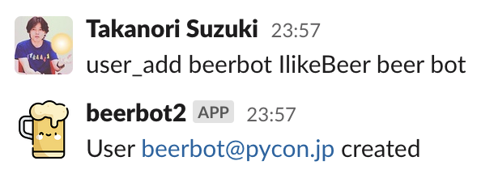

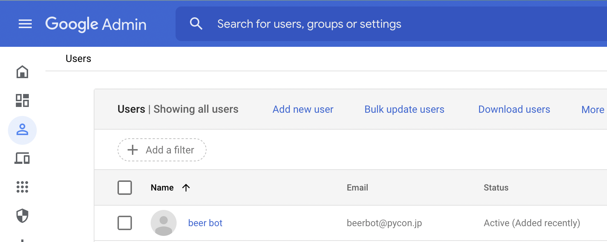

I can **forget** Google Admin! 🎉
---------------------------------
Google Adminを **忘れられる**!

.. revealjs-notes::

   But ...

Security Issue 🔓
------------------
* **Anyone** can run it
* Run only **Slack Admin** 🔒

.. revealjs-notes::

   But ...there is a security issue with this code.
   It means anyone can list and add users.
   So, modify commands to run only for the Slack Admin

Not-Admin cannot run
--------------------
* Add ``users:read`` scope, use `users.info <https://api.slack.com/methods/users.info>`_ API

.. literalinclude:: code/app-admin2.py
   :language: python
   :lines: 14-22

.. image:: images/bot-not-admin.png
   :width: 40%

**Resolve** a security issue 🎊
--------------------------------
セキュリティ上の問題も **解決**

Summary / まとめ
================
* Simple bot using **Incoming Webhooks**
* Interactive bot using **Bolt** for Python
* Extend bot using **libraries** and **APIs**

Next Step / 次のステップ 🪜
============================

* Let's make **your Slackbot**
* Let's connect with **libraries** and **APIs**
* **Automate your Boring Stuff** with Slackbot

.. revealjs-notes::

   Then you will have more free time so you can do other creative things more.

Thank you! 🙏
==============
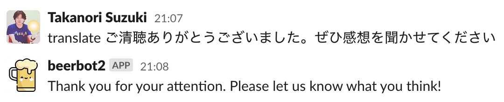

:fab:`twitter` `@takanory <https://twitter.com/takanory>`_

:fas:`desktop` `slides.takanory.net <https://slides.takanory.net>`__

:fas:`code` `sample code <https://github.com/takanory/slides/tree/master/slides/20221015pyconjp/code>`__

translate command
-----------------
.. code-block:: bash

   $ pip install deepl

.. literalinclude:: code/app-deepl.py
   :lines: 6, 9-10, 12-18

Thank you! 🙏
--------------

:fab:`twitter` `@takanory <https://twitter.com/takanory>`_

:fas:`desktop` `slides.takanory.net <https://slides.takanory.net>`__

:fas:`code` `sample code <https://github.com/takanory/slides/tree/master/slides/20221015pyconjp/code>`__
