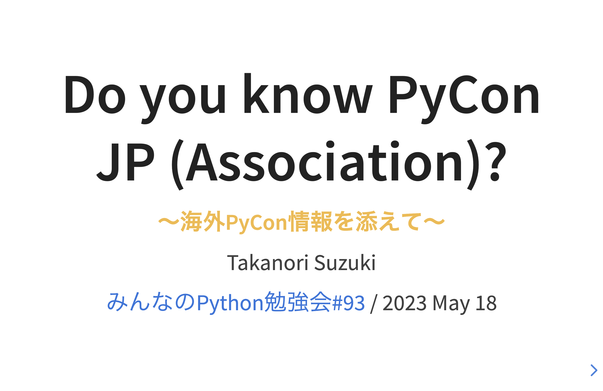
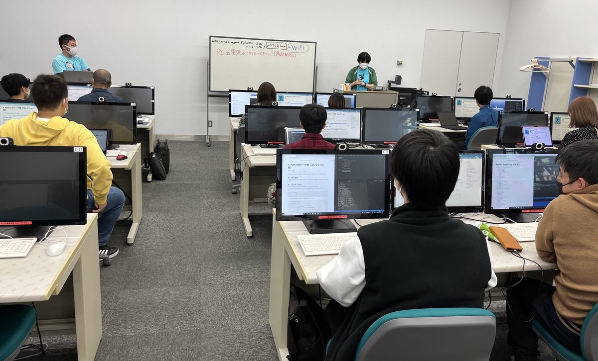
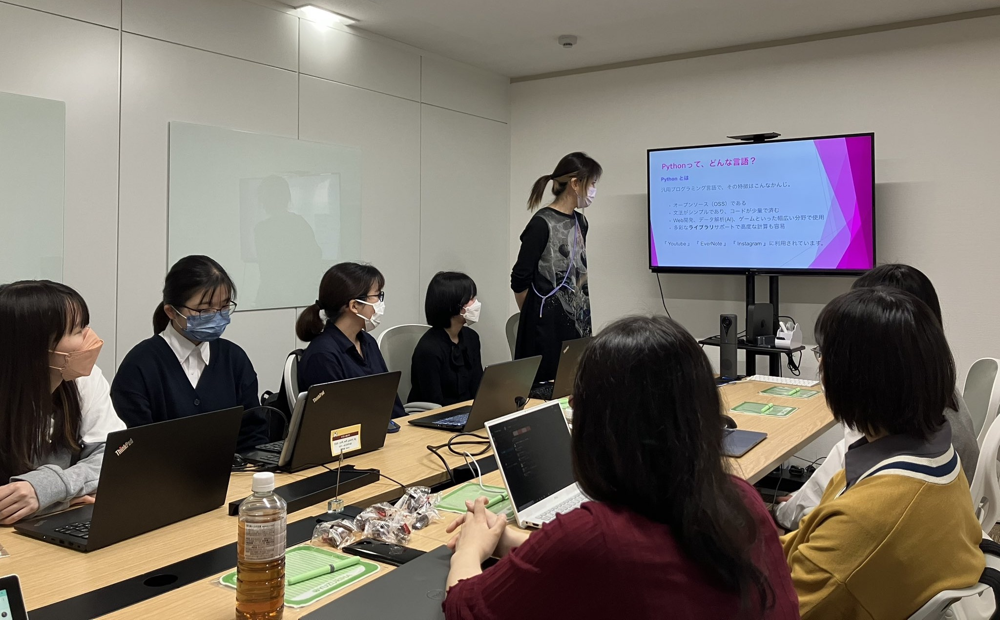
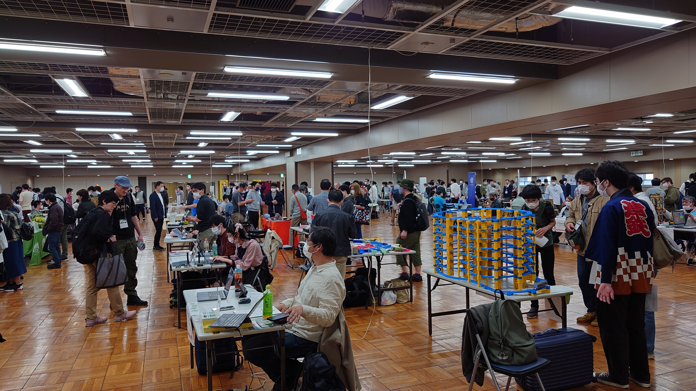
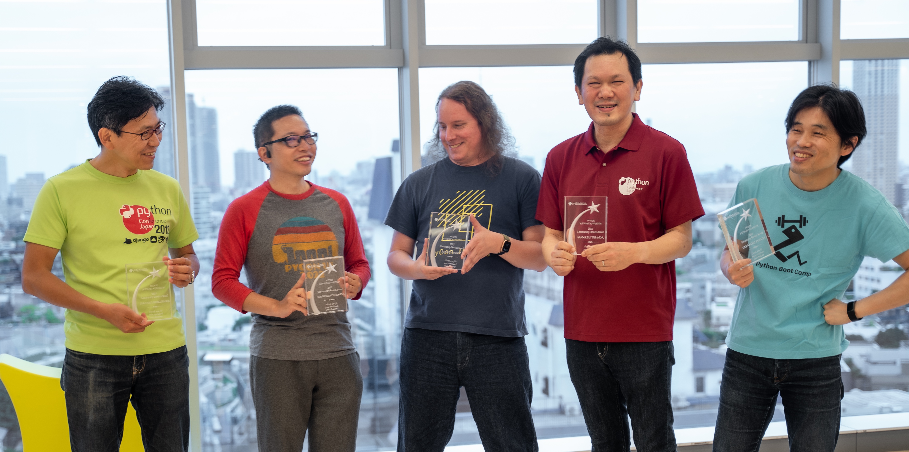
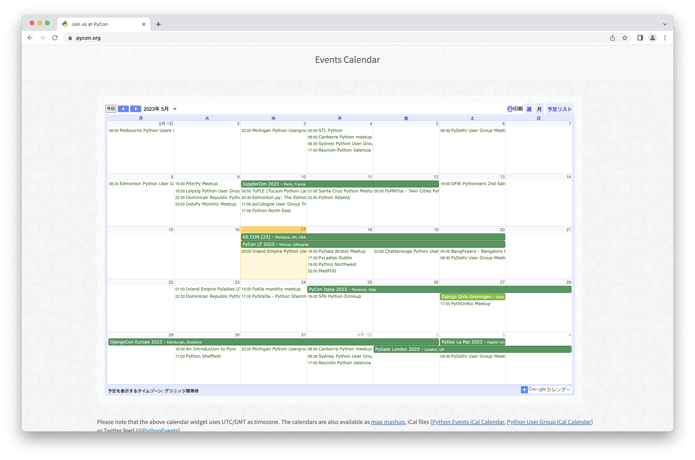
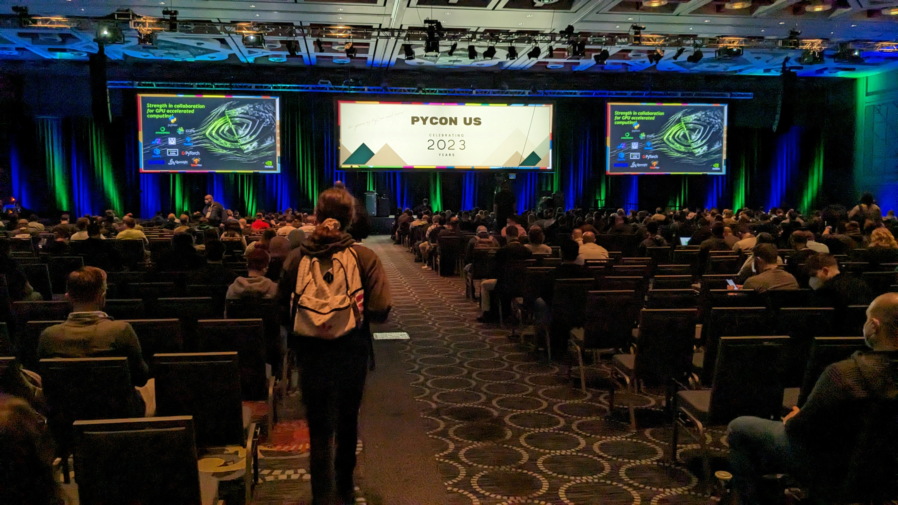

:og:image: _images/20230518stapy.png
:og:image:alt:  Do you know PyCon JP (Association)?  〜海外PyCon情報を添えて〜

=====================================
 Do you know PyCon JP (Association)? 
=====================================

**〜海外PyCon情報を添えて〜**

Takanori Suzuki

`みんなのPython勉強会#93 <https://startpython.connpass.com/event/272158/>`__ / 2023 May 18

Agenda 📝
==========
* PyCon JPとは
* PyCon JP Associationとは
* PyCon JP Associationの活動
* PyCon APACとは
* 海外PyCon情報  

Photos 📷 Tweets 🐦 👍
=========================

``#stapy`` / ``@takanory``

Slide 💻
---------
`slides.takanory.net <https://slides.takanory.net>`__

最初に質問 
==========
I have questions

PyCon JPを知っている人 🙋
---------------------------
Do you know PyCon JP?

PyCon JPに参加したことある人 🙋‍♀️
----------------------------------
Have you attended PyCon JP?

PyCon JP Associationを知っている人 🙋‍♂️
-----------------------------------------
Do you know PyCon JP Association?

Who am I? / お前誰よ 👤
========================
* Takanori Suzuki / 鈴木 たかのり (:fab:`twitter` `@takanory <https://twitter.com/takanory>`_)
* `PyCon JP Association <https://www.pycon.jp/>`_ Chair
* `BeProud Inc. <https://www.beproud.jp/>`_ Director / Python Climber
* `Python Boot Camp <https://www.pycon.jp/support/bootcamp.html>`_, `Python mini Hack-a-thon <https://pyhack.connpass.com/>`_
* Love: `Ferrets <https://twitter.com/search?q=%E3%81%9B%E3%81%B6%E3%82%93%E3%81%A1%E3%82%83%E3%82%93%20(from%3Atakanory)&src=typed_query>`__, `🍺 <https://untappd.com/user/takanory>`__, `LEGO <https://brickset.com/sets/ownedby-takanori>`__ / Hobby: `🎺 <https://twpo.org/>`_, `🧗‍♀️ <https://kabepy.connpass.com/>`__

.. image:: /assets/images/sokidan-square.jpg
   :width: 180

.. image:: /assets/images/kurokuri.jpg
   :width: 180

**BeProud** inc. 🏢
--------------------
* `BeProud <https://www.beproud.jp/>`_: Pythonシステム開発、コンサル
* `connpass <https://connpass.com/>`_: IT勉強会支援プラットフォーム
* `PyQ <https://pyq.jp/>`_: Python独学プラットフォーム
* `TRACERY <https://tracery.jp/>`_: システム開発ドキュメントサービス

.. image:: /assets/images/beproud-logos.png

PyCon JPとは 🇯🇵
================
.. revealjs-break::

* 日本開催のPythonの国際カンファレンス

  * PyCon = **Py** thon **Con** ference
* 国内 **最大級**
* 2011年から **毎年開催**
* 2020年から **オンライン**
* 2022年から完全 **現地開催へ**

* ref: `PyCon JP イベント主催事業 <https://www.pycon.jp/organizer/index.html>`_

主なコンテンツ 🗣️
------------------
* いろんな発表を見たり聞いたり

  * キーノート
  * トークセッション
  * ポスターセッション
  * ライトニングトーク

.. revealjs-break::
   
* 学んだり開発したり交流したり

  * チュートリアル
  * スプリント
  * スポンサーブース

.. revealjs-break::

* おいしいものを食べたり飲んだり

  * ランチ
  * コーヒーブレイク
  * パーティー

今年のイベントは？
------------------
後半で紹介します

PyCon JP Associationとは 🗾
============================
.. revealjs-break::

* 初期(2011年)のPyCon JPイベントでは **個人** が **お金の管理**、**契約の対応** をしていた
* イベントの規模、金額が **大きく** なってきた

  * 人数: 130名 → 500名
  * 予算: 0.5M JPY→ 5.0M JPY
* → **法人を作ろう** ！！

PyCon JP Association
--------------------
* **非営利型** 一般社団法人

  * →利益を配分しない
* PyCon JPイベントを **継続的** に開催

  * →日本のPython界隈を **盛り上げたい**
* 2013年3月21日に設立

  * ref: `設立趣意書 <https://www.pycon.jp/committee/charter.html>`_

**理事会**
----------
* 最大6名(現在は5名)
* 代表理事(2023年): 鈴木たかのり
* 吉田、清水川、寺田、ヨナス

* ref: `PyCon JP Association理事会 <https://www.pycon.jp/committee/board.html>`_

**非営利型** 一般社団法人
-------------------------
* **税制の優遇** がうけられる
* `TechSoup Japan <https://www.techsoupjapan.org/>`_ でいろいろ安く買える
* **Nonprofitライセンス** 等でサービスが使える

  * `SlackのNPO支援プログラム <https://slack.com/intl/ja-jp/help/articles/204368833-Slack-%E3%81%AE-NPO-%E6%94%AF%E6%8F%B4%E3%83%97%E3%83%AD%E3%82%B0%E3%83%A9%E3%83%A0%E3%81%AE%E5%89%B2%E5%BC%95%E3%81%AB%E7%94%B3%E3%81%97%E8%BE%BC%E3%82%80>`_
  * `Google for Nonprofits <https://www.google.com/intl/ja/nonprofits/>`_
  * `Open Source Project License | Atlassian <https://www.atlassian.com/software/views/open-source-license-request>`_
  * `1Password for Open Source Projects <https://github.com/1Password/1password-teams-open-source>`_

PyCon JP以外にも
----------------
いろいろやってます
    
PyCon JP Associationの活動 🕺
==============================
.. revealjs-break::

* Python関連コミュニティ支援
* Python Boot Camp
* PyLadies Caravan
* Python Boot Camp Caravan
* Python Charity Talks in Japan
* PyCon JP TV
* PyCon miniイベントへの支援  

Python関連コミュニティ支援 (2015-)
----------------------------------
* インフラ、物品の共有や提供
* イベントノウハウの共有
* 宣伝協力、メディアやスポンサー紹介
* 契約窓口や資金サポート
* **20イベント** をサポート
* ref: `Python関連コミュニティへの支援 <https://www.pycon.jp/support/community.html>`_

支援イベント(一部)
------------------

`PyCon Kyushu 2022 Kumamoto <https://kyushu.pycon.jp/2022/>`_、
`PyCon mini Shizuoka 2021 <https://shizuoka.pycon.jp/2021>`_、
`DjangoCongress JP 2021 <https://djangocongress.jp/>`_、
`PyCon mini Hiroshima 2020 <https://hiroshima.pycon.jp/2020//>`_、
`PyCon mini Sapporo 2019 <https://sapporo.pycon.jp/2019/>`_、
`SciPy Japan 2019 <https://www.scipyjapan2019.scipy.org/?lang=ja>`_、
`Plone Conference 2018 Tokyo <https://2018.ploneconf.org/>`_、
`PyCon mini Osaka 2018 <https://osaka.pycon.jp/>`_、
`Django Girls Tokyo <https://djangogirls.org/tokyo/>`_

Python Boot Camp (2016-)
------------------------
* **初心者向け** Pythonチュートリアル
* 48回、36都道府県で開催(目指せ全国制覇)
* 講師をPyCon JP Associationから **派遣**
* 現地スタッフ **募集中**!!

  * `Python Boot Camp 全国ツアーお問い合わせフォーム <https://docs.google.com/forms/d/e/1FAIpQLSedZskvqmwH_cvwOZecI10PA3KX5d-Ui-74aZro_cvCcTZLMw/viewform>`_
* ref: `Python Boot Camp <https://www.pycon.jp/support/bootcamp.html>`_

.. revealjs-break::
   :notitle:

PyLadies Caravan(2019-)
-----------------------
* 日本各地での **PyLadies** (女性Pythonユーザー)ミートアップ
* 現地スタッフ **募集中**!!

  * 👉 `PyLadies Caravan お問い合わせフォーム <https://docs.google.com/forms/d/e/1FAIpQLSfEsiDOS94nOqXVazSpKAO01STY2o8RZlMF4SkCoL_aDF_F7w/viewform>`_
* ref: `PyLadies Caravan <https://tokyo.pyladies.com/caravan/index.html>`_
  
.. revealjs-break::
   :notitle:

Python Boot Camp Caravan(2019-)
-------------------------------
* `オープンソースカンファレンス <https://ospn.jp/>`_ に出展/発表
* PyCon JP Associationの活動を知ってもらう
* ref: `Python Boot Camp Caravan始動のお知らせ <https://pyconjp.blogspot.com/2019/03/python-boot-camp-caravan.html>`_

.. revealjs-break::
   :notitle:

Python Charity Talks in Japan (2020-)
-------------------------------------
* オンライン発表イベント
* 参加費、スポンサー費は全額PSF(Python Software Foundation)に **寄付**

  * 背景にPSFの2020年の **財政難**
* 3回開催、計約 **270万円** の寄付
* ref: `Python Charity Talks in Japan 開催します！ <https://pyconjp.blogspot.com/2020/05/python-charity-talks-in-jp.html>`_
* ref: `Python Charity Talks in Japan - connpass <https://pyconjp.connpass.com/event/177586/>`_

.. revealjs-break::

.. raw:: html

   <iframe width="560" height="315" src="https://www.youtube.com/embed/o-UBokTvQjE" title="YouTube video player" frameborder="0" allow="accelerometer; autoplay; clipboard-write; encrypted-media; gyroscope; picture-in-picture; web-share" allowfullscreen></iframe>

* ref: `Python Charity Talks in Japan - YouTube <https://www.youtube.com/watch?v=o-UBokTvQjE&t=560s>`_

PyCon JP TV (2021-)
-------------------
* **月1回** YouTubeライブ(第1金曜 19:30から)
* Pythonニュース、技術ネタ、コミュティ情報
* **コロナ禍** でオンラインのコミュニケーションに挑戦
* ref: `tv.pycon.jp <https://tv.pycon.jp/>`_
* ref: `PyCon JP - YouTube <https://www.youtube.com/@PyConJP>`_

.. revealjs-break::

.. raw:: html

   <iframe width="560" height="315" src="https://www.youtube.com/embed/7-UjyXNriwk" title="YouTube video player" frameborder="0" allow="accelerometer; autoplay; clipboard-write; encrypted-media; gyroscope; picture-in-picture; web-share" allowfullscreen></iframe>

* ref: `PyCon JP TV #28: PyCon US 2023振り返り - YouTube <https://www.youtube.com/watch?v=7-UjyXNriwk&list=PLMkWB0UjwFGnmt4FKkJAP8x17-br80l2Y&index=39>`_

こんな感じでいろいろ活動していたら
----------------------------------

PSF Community Service Awardを受賞 🎉
-------------------------------------
* ref: `PyCon JP Association Awarded the PSF Community Service Award for Q4 2021 <https://pyfound.blogspot.com/2022/05/pycon-jp-association-awarded-psf.html>`_

PyCon JP Associationの活動
--------------------------
気になるものがあったら **参加してみて**!!

もしくは **一緒にやりましょう** !!

👉 `運営会議 <https://pyconjp-staff.connpass.com/event/283673/>`_ に参加

👉 `運営メンバー <https://www.pycon.jp/committee/members.html>`_ に申し込み

PyCon APACとは 🌏
==================
.. revealjs-break::

* **アジア太平洋** (Asia-Pacific)地域のPyCon
* 2010年に **シンガポール** で初開催

  * 当時アジアのPyConは他はインドくらい?
* 2013年に日本でPyCon APACを開催

  * 台湾、韓国、マレーシア、シンガポール、フィリピンと持ち回り
* ref: `PyConAPAC - Python Wiki <https://wiki.python.org/moin/PyConAPAC>`_

.. revealjs-break::
   :notitle:

.. image:: images/apac2013.jpg

PyCon APAC 2023
---------------
* **10年振り** に日本でPyCon APACが開催
* `2023-apac.pycon.jp <https://2023-apac.pycon.jp/>`_
* 日程: 10月27日(金)〜29日(日)
* 会場: `TOC有明 <https://www.toc.co.jp/saiji/ariake/>`_

.. revealjs-break::

* `スタッフ募集中 <https://pyconjp.blogspot.com/2023/01/pycon-jp-2023.html>`_
* `プロポーザル募集中 <https://pretalx.com/pyconapac2023/cfp>`_

  * トーク、ポスター、ライトニングトーク、チュートリアル
* スポンサー募集はこれから

知り合いがいない?
-----------------
.. revealjs-break::

* **スピーカー** に声をかける
* **PyCon APAC スタッフ** に声をかける
* **takanory** に声をかける
* **stapyスタッフ** に声をかける

PyCon APAC 2023で会いましょう
-----------------------------
See you at PyCon APAC 2023

海外PyCon情報 🌎
=================
* **PyCon** (Python Conference)は **世界中** で開催
* **APAC地域** での開催も増えている

APAC PyCons
-----------
* Feb 25-26: `PyCon Philippines <https://pycon-2023.python.ph/>`_
* Aug 11-13: `PyCon Korea <https://2023.pycon.kr/>`_
* Aug 18-22: `PyCon Australia <https://2023.pycon.org.au/>`_
* Aug 17-19 (Tentative): `PyCon Singapore <https://pycon.sg/>`_
* Aug 26: `PyCon Malaysia <https://pycon.my/>`_
* Sep 2-3: `PyCon Taiwan <https://tw.pycon.org/2023/en-us>`_

.. revealjs-break::

* Sep 15-17: `Kiwi PyCon <https://kiwipycon.nz/>`_ New Zealand
* Sep 29-Oct 2: `PyCon India <https://in.pycon.org/2023/>`_
* Oct 27-29: `PyCon APAC <https://2023-apac.pycon.jp/>`_ Japan
* Nov 10-11: `PyCon Hong Kong <https://pycon.hk/>`_
* Nov 11-12: `PyCon Indonesia <https://pycon.id/>`_
* Dec 15-16 (Tentative): `PyCon Thailand <https://th.pycon.org/>`_

PyCon APAC Organizers(`pycon.asia <https://pycon.asia/>`_)
----------------------------------------------------------
.. image:: images/pyconasia.png

World PyCons(`pycon.org <https://pycon.org/>`_)
-----------------------------------------------

PyCon US 2023
-------------
* `us.pycon.org/2023 <https://us.pycon.org/2023/>`_
* ユタ州ソルトレイクシティ
* 4月19日-20日: チュートリアル
* 4月21日-23日: カンファレンス
* 4月24日-27日: スプリント
* 2000人以上が参加

.. revealjs-break::

.. revealjs-break::

* 詳しくはPyCon JP TVをどうぞ

.. raw:: html

   <iframe width="560" height="315" src="https://www.youtube.com/embed/7-UjyXNriwk" title="YouTube video player" frameborder="0" allow="accelerometer; autoplay; clipboard-write; encrypted-media; gyroscope; picture-in-picture; web-share" allowfullscreen></iframe>

* `gihyo.jp <https://gihyo.jp>`_ にレポート掲載予定

過去に参加したイベントレポート
------------------------------
* `slides.takanory.net <https://slides.takanory.net/>`_ の **Report** をクリック

`EuroPython 2022 <https://gihyo.jp/article/2022/09/europython2022-01>`_、
`PyCon Indonesia 2019 <https://gihyo.jp/news/report/2019/12/1701>`_、
`PyCon Singapore 2019 <https://gihyo.jp/news/report/2019/10/2901>`_、
`PyCon Taiwan 2019 <https://gihyo.jp/list/group/%E6%97%A5%E6%9C%AC%E3%81%A8%E5%8F%B0%E6%B9%BE%E3%81%AEPython%E3%82%B3%E3%83%9F%E3%83%A5%E3%83%8B%E3%83%86%E3%82%A3%E3%81%AE%E6%9E%B6%E3%81%91%E6%A9%8B%E3%81%AB-PyCon-Taiwan-2019-%E3%83%AC%E3%83%9D%E3%83%BC%E3%83%88>`_、
`PyCon Malaysia 2019 <https://gihyo.jp/news/report/2019/09/0901>`_、
`EuroPython 2019 <https://gihyo.jp/list/group/%E3%83%A8%E3%83%BC%E3%83%AD%E3%83%83%E3%83%91%E3%81%AEPython%E3%82%B3%E3%83%9F%E3%83%A5%E3%83%8B%E3%83%86%E3%82%A3%E3%81%A8%E4%BA%A4%E6%B5%81%E3%81%A7%E3%81%8D%E3%82%8B3%E6%97%A5%E9%96%93-EuroPython-2019-%E5%8F%82%E5%8A%A0%E3%83%AC%E3%83%9D%E3%83%BC%E3%83%88>`_、
`PyCon Thailand 2019 <https://gihyo.jp/news/report/2019/07/0501>`_、
`PyCon US 2019 <https://gihyo.jp/list/group/%E4%B8%96%E7%95%8C%E6%9C%80%E5%A4%A7%E3%81%AEPython%E3%82%AB%E3%83%B3%E3%83%95%E3%82%A1%E3%83%AC%E3%83%B3%E3%82%B9-US-PyCon-2019-%E3%83%AC%E3%83%9D%E3%83%BC%E3%83%88>`_、
`PyCon APAC 2019 <https://gihyo.jp/news/report/2019/03/1201>`_ (Philippines)

海外PyCon情報
-------------
旅行のついでにPyCon参加おすすめ

アジアは近いしおすすめ

Pythonという **共通の話題** があるので話がしやすい

まとめ / Summary 📝
====================
* PyCon JPは **日本最大級** のPythonイベント

  * 2023年は **PyCon APAC** として開催
* PyCon JP Associationは **契約、お金を管理**

  * 他にも **いろんな活動** しているよ
* **世界中** で **PyCon** が開催されているよ

Thank you! 🙏
==============
:fab:`twitter` `@takanory <https://twitter.com/takanory>`_

:fas:`desktop` `slides.takanory.net <https://slides.takanory.net>`__

-----

PyCon JP Association: `www.pycon.jp <https://www.pycon.jp>`__

PyCon APAC 2023: `2023-apac.pycon.jp <https://2023-apac.pycon.jp/>`__

:fab:`twitter` `@pyconjapan <https://twitter.com/pyconjapan>`_
