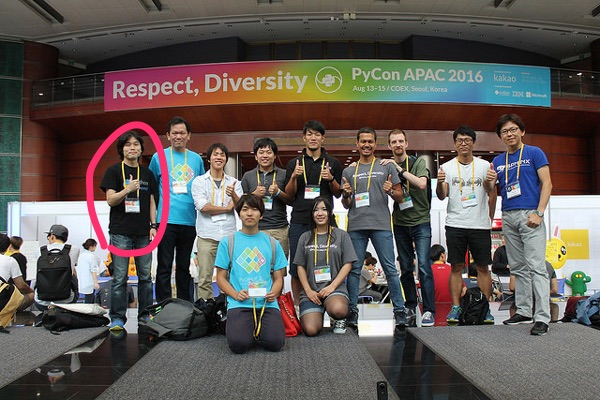

```{eval-rst}
:og:image: _images/20230812pyconkr.png
:og:image:alt: Introduction to Structural Pattern Matching

.. |cover| image:: images/20230812pyconkr.png
```

% <div class="logo"></div>

# Introduction to **Structural Pattern Matching**

Takanori Suzuki

PyCon KR 2023 / 2023 Aug 12

```{revealjs-notes}
Thank you for coming to my talk.
I'm happy to be giving a talk at PyCon Korea.
I'm Takanori Suzuki.
My talk title is "Introduction to Structural Pattern Matching".
```

## Agenda

- Motivation / Goal
- What's New
- Syntax
- Patterns

```{revealjs-notes}
Agenda of this talk.
First, I will share my motivation and goals for this talk.
Next, I will introduce what's new in Python 3.10.
Then, I'll explain the syntax of structural pattern matching.
Finally, various patterns will be explained with code examples.
```

## Photos 📷 Tweets 🐦 👍

`#pyconkr` / `@takanory`

```{revealjs-notes}
I'd be happy to take pictures and share them and give you feedback on Twitter or some SNS.
Hashtag is #pyconkr
```

### Slide 💻

[slides.takanory.net](https://slides.takanory.net)

```{revealjs-notes}
Slides available on slides.takanory.net.
And I've already shared slides on Twitter.
Please check it out.
Before the main topic,...
```

## Who am I? 👤

- Takanori Suzuki / 鈴木 たかのり ({fab}`twitter` [@takanory](https://twitter.com/takanory))
- [PyCon JP Association](https://www.pycon.jp/): Chair
- [BeProud Inc.](https://www.beproud.jp/): Director / Python Climber
- [Python Boot Camp](https://www.pycon.jp/support/bootcamp.html), [Python mini Hack-a-thon](https://pyhack.connpass.com/), [Python Bouldering Club](https://kabepy.connpass.com/)


```{revealjs-notes}
Before the main topic,...I will introduce myself.
I'm Takanori Suzuki. My X(Twitter) is "takanory", please follow me.
I'm Chairperson of PyCon JP Association.
And I'm director of BeProud Inc.
I'm also active in several Python related communities in Japan
```

### Me and **Korea** 🇰🇷

- Attended **PyCon APAC 2016** in Korea



```{revealjs-notes}
My memory of Korea is attending PyCon APAC 7 yeas ago.
It is a pleasant memory for me.
Long time no see, Korean Pythonistas!!
By the way, do you know about this year's PyCon APAC?
```

### PyCon APAC 2023 in **Tokyo, Japan** 🇯🇵

```{image} /assets/pyconapac2023-logo.png
:width: 55%
```

- [2023-apac.pycon.jp](https://2023-apac.pycon.jp/)
- Date: 2023 Oct 27-29

```{revealjs-notes}
This year, the PyCon Japan team will host PyCon APAC 2023 in Tokyo.
I hope to see YOU again in PyCon APAC.
And let's go have a beer!!
```

## Motivation of this talk 💪

- Structural Pattern Matching looks **useful**
- You to **know** and **use** it

```{revealjs-notes}
Now back to the main topic.
There are a lat of new features in Python 3.10.
I think Structural Pattern Matching looks pretty useful.
I want YOU all to know about it and use it.
```

### Goal of this talk 🥅

- Learn **syntax** and **basic usage**
- Learn **various patterns** and **how to use** them
- **Try it** tomorrow

```{revealjs-notes}
You will learn the syntax and basic usage of Structural Pattern Matching.
And, you will learn about the various patterns and how to use them.
You'll be able to try it tomorrow.
```

### Prerequisites

- **Intermediate** level
- You should know **Python syntax**
  - tuple, list, dict, if, def, isinstance, dataclass, type hinting and more

```{revealjs-notes}
This talk is for interemediate level.
You should have a basic understanding of Python syntax.
For example, ...
```

## Questions {fas}`circle-question`

```{revealjs-notes}
First, I have questions
```

### Are you using **Python 3.10+**? 🙋‍♂️

```{revealjs-notes}
Are you using Python 3.10 or higher?
```

### Do you know the **new features**? 🙋‍♀️

```{revealjs-notes}
Do you know the new features in 3.10?
```

## **What's New** in Python 3.10 🆕

```{revealjs-notes}
Now, let me introduce to the new features of Python 3.10.
```

### **What's New** in Python 3.10 🆕

- [docs.python.org/3/whatsnew/3.10.html](https://docs.python.org/3/whatsnew/3.10.html)

```{image} images/whatsnew.png
:alt: What's New in Python 3.10
:width: 70%
```

```{revealjs-notes}
The new features are summarized in the "What's new" page of the Python official documentation.
```

### Python Release Python 3.10.11 🐍

[www.python.org/downloads/release/python-31011/](https://www.python.org/downloads/release/python-31011/)

```{image} images/python31011.png
:alt: Python Release Python 3.10.11
:width: 55%
```

```{revealjs-notes}
Python 3.10 was released on October 4, 2021.
The latest maintenance version is 3.10.11.
3.10 has many new features...By the way...
```

### Who are You? 🐍

```{image} https://user-images.githubusercontent.com/11718525/135937807-fd3e0fd2-a31a-47a4-90c6-b0bb1d0704d4.png
:alt: Python 3.10 release logo
:width: 70%
```

```{revealjs-notes}
This image is "Python 3.10 release logo".
You can find the new features around this snake.
```

### New features of Python 3.10

- Parenthesized Context Managers
- Better Typing Syntax
- Better Error Messages
- Structural Pattern Matching
- Better Debugging

```{revealjs-notes}
There are five major new features written in the logo.
Parenthesized...
```

### New features of Python 3.10

- Parenthesized Context Managers
- Better Typing Syntax
- Better Error Messages
- **Structural Pattern Matching** 👈
- Better Debugging

```{revealjs-notes}
In this talks, I will talk about Structural Pattern Matching.
```

## Structural Pattern Matching {fas}`landmark`

```{revealjs-break}
```

- PEPs for Structural Pattern Matching
  - [PEP 634 – Specification](https://peps.python.org/pep-0634/)
  - [PEP 635 – Motivation and Rationale](https://peps.python.org/pep-0635/)
  - [PEP 636 – Tutorial](https://peps.python.org/pep-0636/)

```{revealjs-notes}
Because of the large function of Structural Patten Matching, it is diveded into 3 PEPs.
Specification, Motivation and Rationale, Tutorial.
If you are interested, please read these PEPs.
```

### Motivation

[www.python.org/dev/peps/pep-0635/#motivation](https://www.python.org/dev/peps/pep-0635/#motivation)

> (Structural) pattern matching syntax is found in many languages, from Haskell, Erlang and Scala to Elixir and Ruby. (A proposal for JavaScript is also under consideration.)

```{revealjs-notes}
This sentence is the motivation for the Structural Pattern Matching written in PEP.
```

```{revealjs-break}
```

```python
# check type or shape of an object
if isinstance(x, tuple) and len(x) == 2:
    host, port = x
    mode = "http"
elif isinstance(x, tuple) and len(x) == 3:
    host, port, mode = x
```

```python
# Structural Pattern Matching
match x:
    case host, port:
        mode = "http"
    case host, port, mode:
        pass
```

```{revealjs-notes}
Look at this code.
The if-elif-else idiom is often used to check type or shape of an object.
For example isinstance(), hasattr(), len(), key in dict.
Use match statements to write more elegantly.
This is the motivation for Structural Pattern Matching.
Now that you have figured out the motivation, let's talk about syntax.
```

## Syntax {fas}`code`

- Generic syntax of pattern matching

```{revealjs-literalinclude} code/syntax.py
:language: python
:data-line-numbers: 1|2-9
```

```{revealjs-notes}
A match statement takes an expression ... and compares its value to successive patterns given as one or more case blocks.
```

### **Soft** keywords

- New in Python 3.10
- **`match`**, **`case`** and **`_`**
- Can be used **identifier names**

```pycon
>>> match = "match"  # Valid(Soft keyword)
>>> class = "class"  # Invalid(Keyword)
  File "<stdin>", line 1
    class = "class"
          ^
SyntaxError: invalid syntax
```

```{revealjs-notes}
Soft keywords are a new language specification in 3.10.
match, case and _ are soft keywords.
Soft keywords can be used identifier names.
Next, let's talk about patterns!!
```

## Patterns {fas}`list-ul`

```{revealjs-notes}
From here I will explain the various patterns.
```

### Patterns {fas}`list-ul`

```{literalinclude} code/syntax.py
:language: python
```

```{revealjs-notes}
This is the syntax I introduced before.
You can specify various patterns after "case" keyword.
```

### **Literal** patterns

```{revealjs-literalinclude} code/literal.py
:language: python
:data-line-numbers: 1-7|1,8-9
```

```{revealjs-notes}
First, Literal patterns. Literal patterns are the simplest patterns.
If the value of beer_style is "Pilsner", then 3rd line will be executed. /
If the value os beer_style is "Ale", it will not match any patterns.
In this case it will match _. _ is wildcard pattern.
```

### **OR** patterns

- `|` is OR

```{revealjs-literalinclude} code/or.py
:language: python
:data-line-numbers: 1,4-5
```

```{revealjs-notes}
The vertical bar is OR.
This pattern matches IPA or Session IPA
```

### Literal patterns **without wildcard**

```{revealjs-literalinclude} code/literal2.py
:language: python
:data-line-numbers: 1,8-9
```

```{revealjs-notes}
I commented out the last wildcard pattern.
If the value doesn't match any of the pattens, nothing will happen.
In this case, variable "result" is not defined.
```

### Useful? 🤔

```{revealjs-notes}
Is it useful?
You don't think so?
```

### rewrite with **if** statement

- If written as an `if` statement

```{literalinclude} code/literal_if.py
:language: python
```

```{revealjs-notes}
When I rewrite the code with a if statement, it looks similar to mathc/case.
You're ritght.
But...
```

### Pattern Matching is **Powerful** 💪

```{revealjs-notes}
But...Pattern Matching is much more powerful.
I will introduce more useful patterns.
```

## Literal and **Variable** patterns

### Literal and **Variable** patterns

```{literalinclude} code/variable.py
:language: python
:lines: 1-12
```

```{revealjs-notes}
Let's consider a function receives orders tuple about beer and food.
```

### Literal and **Variable** patterns

```{revealjs-literalinclude} code/variable.py
:language: python
:data-line-numbers: 1-4,14-15
:lines: 1-15
```

```{revealjs-notes}
If my order is (empty, empty) tuple, it matches the 3rd line pattern.
The return value is "Please order something."
```

### Literal and **Variable** patterns

- `"IPA"` assign to `beer`

```{revealjs-literalinclude} code/variable.py
:language: python
:data-line-numbers: 1-2,5-6,14-15
:lines: 1-13,17-18
```

```{revealjs-notes}
If the order is ("IPA", empty) tuple, it matches the 5th line pattern.
Then the first value of the tuple, IPA, is then assigned to the beer variable.
The return values is "I drink IPA."
```

### Literal and **Variable** patterns

- `"IPA"` assign to `beer`、`"nuts"` assign to `food`

```{revealjs-literalinclude} code/variable.py
:language: python
:data-line-numbers: 1-2,9-10,14-15
:lines: 1-13,20-21
```

```{revealjs-notes}
If the order is ("IPA", "nuts") tuple, it matches the 9th line pattern.
Then "IPA" assigned to the beer variable and "nuts" assigned to the food variable.
The return values is "I drink IPA with nuts."
```

### Literal and **Variable** patterns

- Tuple length does not match

```{revealjs-literalinclude} code/variable.py
:language: python
:data-line-numbers: 1-2,11-15
 :lines: 1-13,23-24
```

```{revealjs-notes}
If the order is ("IPA", "nuts", "spam"), it matches whildcard pattern.
Because the length of the tuple to be matched is only 2.
The return values is "one beer and one food only."
```

### rewrite with **if** statement

```{literalinclude} code/variable_if.py
:language: python
```

```{revealjs-notes}
Let's rewrite this code with an if statement.
I think the code is a little confusing.
```

### Which code do you **prefer**?

- Pattern Matching 🆚 `if` statement

```{revealjs-notes}
Do you prefer Pattern Matching or if statements?
Still not sure?
I will introduce other patterns as well.
```

## **Case Order** is important ⬇️

```{revealjs-literalinclude} code/pattern_order.py
:language: python
:data-line-numbers: 3-4,14,15
```

```{revealjs-notes}
There is one note for pattern matching.
The order of the cases is important.
The patterns are compared in order from top to bottom, so if you write code like this, it will only match the first pattern.
As a result,  it does not match any other patterns.
```

## **Classes** patterns

```{revealjs-notes}
Next, Classes patterns.
```

### **Classes** patterns

```{literalinclude} code/classes.py
:language: python
:lines: 4-7
```

```{revealjs-literalinclude} code/classes.py
:language: python
:lines: 10-21
:data-line-numbers: 3-4|5-6|7-8|9-10|1-12
```

```{revealjs-notes}
Here I create Order dataclass. The order dataclass has a beer attribute and a food attribute.
The 1st case matches when the beer and food are empty. /
The 2nd case matches if only beer has a value. /
The 3rd case matches if food has a value. /
If both beer and food have a value, it matches in the 4th case. / 
It is easy to read, don't you think?
```

### **Results**: Classes patterns

```python
>>> order_with_class(Order())
'Please order something.'
>>> order_with_class(Order(beer="Ale"))
'I drink Ale.'
>>> order_with_class(Order(food="fries"))
'I eat fries.'
>>> order_with_class(Order("Ale", "fries"))
'I drink Ale with fries.'
>>> order_with_class("IPA")
'Not an order.'
```

```{revealjs-notes}
Here is the result of this function.
It works in the same way as the previous tuple case.
```

### Classes patterns

```python
def order_with_class(order: Order) -> str:
    match (order):
        case Order(beer="", food=""):
            return "Please order something."
        case Order(beer=beer, food=""):
            return f"I drink {beer}."
        case Order(beer="", food=food):
            return f"I eat {food}."
        case Order(beer=beer, food=food):
            return f"I drink {beer} with {food}."
        case _:
            return "Not an order."
```

```{revealjs-notes}
Let's rewrite Classes patterns with if statements.
```

### rewrite with **if** statement

```python
def order_with_class(order: Order) -> str:
    if isinstance(order, Order):
        if order.beer == "" and order.food == "":
            return  "Please order something."
        elif order.beer != "" and order.food == "":
            return f"I drink {order.beer}."
        elif order.beer == "" and order.food != "":
            return f"I eat {order.food}."
        else:
            return f"I drink {order.beer} with {order.food}."
    else:
        return "Not an order."
```

```{revealjs-notes}
I rewrite the code.
It looks a little complex.
And, Classes patterns are much more powerful.
```

### Use **multiple** classses

```python
@dataclass
class Beer:  # Beer("IPA", "Pint")
    style: str
    size: str

@dataclass
class Food:  # Food("nuts")
    name: str

@dataclass
class Water:  # Water(4)
    number: int
```

```{revealjs-notes}
There are three classes representing order of beer, food, and water.
Each classes has attributes beer style and size, food name, and the number of glasses of water.
```

### Use **multiple** classses

```python
def order_with_classes(order: Beer|Food|Water) -> str:
    match (order):
        case Beer(style=style, size=size):
            return f"I drink {size} of {style}."
        case Food(name=name):
            return f"I eat {name}."
        case Water(number=number):
            return f"{number} glasses of water, please."
        case _:
            return "Not an order."
```

```{revealjs-notes}
This code written in classes patterns with multiple classess.
It is easy to read because each class type has a different matching case.
```

### rewrite with **if** statement

```python
def order_with_classes(order: Beer|Food|Water) -> str:
    if isinstance(order, Beer):
        return f"I drink {order.size} of {order.style}."
    elif isinstance(order, Food):
        return f"I eat {order.name}."
    elif isinstance(order, Water):
        return f"{order.number} glasses of water, please."
    else:
        return "Not an order."
```

```{revealjs-notes}
I rewrite the code with if statements.
Pattern mathing is cleaner and readable than if statements, don't you think?
```

## **Sequense** patterns ➡️

```{revealjs-notes}
Next, Sequense pattens.
```

### **Sequense** patterns ➡️

- Parse the order text
- for example:

```python
order_text = "beer IPA pint"
order_text = "food nuts"
order_text = "water 3"
order_text = "bill"
```

```{revealjs-notes}
In this caes, I'll parse the order text.
For example...
```

### Matching by **length** of sequence

```python
match order_text.split():
    case [action]:  # match "bill"
        ...
    case [action, name]:  # match "food nuts", "water 3"
        ...
    case [action, name, size]:  # match "beer IPA pint"
        ...
```

```{revealjs-notes}
This code can match the patterns of multiple sequences.
In this case, it matches list or tuple of length 1, 2 or 3.
```

### Matching **specific values** in sequence

- Specific values: `"bill"`, `"food"`...

```python
match order_text.split():
    case ["bill"]:  # match "bill"
        calculate_amount()
    case ["food", food]:  # match "food nuts"
        tell_kitchen(food)
    case ["water", number]:  # match "water 3"
        grass_of_water(number)
    case ["beer", style, size]:  # match "beer IPA pint"
        tell_beer_master(style, size)
```

```{revealjs-notes}
Also, if you write the pattern like this, any value in the list will be matched with a specific string(bill, food...).
This is a combination of sequence patterns and literal patterns.
```

### Capturing matched **sub-patterns**

- Valid beer size: `"Pint"` or `"HalfPint"`
- `"beer IPA Small"` is invalid

```python
order_text = "beer IPA Pint"

match order_text.split():
    ...
    case ["beer", style, ("Pint" | "HalfPint")]:
        # I don't know beer size
```

```{revealjs-notes}
If the only size of the beer is a pint or half pint.
For example, "beer IPA small" is invalid order.
Using the OR patterns in this way, you can match only Pint or HalfPint.
But, I don't know beer size. How do I get the beer size?
```

### Capturing matched **sub-patterns**

- Use **as** patterns
- `("Pint" | "HalfPint") as size`

```python
order_text = "beer IPA Pint"

match order_text.split():
    ...
    case ["beer", style, ("Pint" | "HalfPint") as size]:
        tell_beer_master(style, size)  # size is "Pint"
```

```{revealjs-notes}
In this case, use as patterns.
If I write "as size", beer size is assigned to the size variable.
```

### Matching **multiple values**

- I want to order **several foods**
- example: `"food nuts fries pizza"`

```python
order_text = "food nuts fries pizza"

match order_text.split():
    ...
    case ["food", food]:  # capture single value
        tell_kitchen(food)
```

```{revealjs-notes}
I want to order several food items at once.
For example "food nuts fries pizza",
But, only one food item can be ordered in this sequence pattern.
```

### Matching **multiple values**

- `food` → `*foods`

```python
order_text = "food nuts fries pizza"

match order_text.split():
    ...
    case ["food", *foods]:  # capture multiple values
        for food in foods:  # ("nuts", "fries", "pizza")
            tell_kitchen(food)
```

```{revealjs-notes}
In this case, the *(star) is prefixed to the variable. 
Then, multiple values are assigned to a variable as a tuple.
```

### I can order several foods!! 🎉

```{revealjs-notes}
Now I can order multiple food items at once!
```

## **Mapping** Patterns 📕

```{revealjs-notes}
Last patterns is Mapping patterns.
```
### **Mapping** Patterns 📕

- Pattern match for **dict**
- Useful for alalyzing **JSON**

```python
order_dict = {"beer": "IPA", "size": "Pint"}

match order_dict:
    case {"food": food}:
        tell_kitchen(food)
    case {"beer": style, "size": ("Pint" | "HalfPint") as size}:
        tell_beer_master(style, size)
    case {"beer": style, "size": _}:
        print("Unknown beer size")
    case {"water": number}:
        grass_of_water(number)
    case {"bill": _}:
        calculate_amount()
```

```{revealjs-notes}
The pattern is matched by map types such as dictionaries.
Mapping patterns are useful for analyzing a JSON-loaded dictionary.
```

### Matching **builtin** classes

- Use **str()**, **int()** and more

```{revealjs-code-block}
:data-line-numbers: 1-2,5,7,11

order_dict = {"water": 3}
# order_dict = {"water": "three"}  # Doesn't match

match order_dict:
    case {"food": str(food)}:
        tell_kitchen(food)
    case {"beer": str(style), "size": ("Pint" | "HalfPint") as size}:
        tell_beer_master(style, size)
    case {"beer": style, "size": _}:
        print("Unknown beer size")
    case {"water": int(number)}:
        grass_of_water(number)
    case {"bill": _}:
        calculate_amount()
```

```{revealjs-notes}
You can use builtin classes to specify the type of the value.
In this code, food and beer style are string, and the number of water is an integer.
If the value of water is string, it will not match the pattern.
```

## Guards 💂‍♀️

```{revealjs-notes}
Finally, let me explain Guards.
Guards are not patterns, guards add conditions to patterns.
```

### **Number** of water

- Invalid: 9, 10, ...
- Valid: 1, 2, ... 8
- Invalid: 0, -1, ...

```{revealjs-notes}
I would limit the number of water orders.
You cannot order more than 9 glasses of water at a time.
Also, you cannot order 0 or negative numbers.
Valid numbers are 1 to 8.
```

### Guards 💂‍♀

- Valid: 1, 2, ... 8
- **`if` statement** after pattern

```{revealjs-code-block}
:data-line-numbers: 1-2,5

order_list = ["water", 3]  # -> 3 glasses of water, please.
# order_list = ["water", 15]  # -> 15 is invalid value.

match order_list:
    case ["water", int(number)] if 1 <= number <= 8:
        print(f"{number} glasses of water, please.")
    case ["water", _]:
        print(f"{number} is invalid value.")
```

```{revealjs-notes}
In this case, use guards.
When you write an if statement after the pattern, it becomes a guard.
Line 5 matches if the second value in the order_list is an int.
But because of the guard, if number is between 1 and 8, it matches this case.
```

### Can't order **many glasses** of water! 🎉

```{revealjs-notes}
Can't order **many glasses** of water with guards!!
```

## Summary

```{revealjs-break}
```

- Motivation / Goal
- What's New
- Syntax
  - Soft keywords: `match`, `case` and `_`
- Patterns
  - Literal, Variable, Classes, Sequense, Mapping
  - Wildcard(`_`), OR(`|`), AS, Guards

```{revealjs-notes}
Summary of this talk.
I tald about ...
```

### **Try** Structural Pattern Matching 👍

```{revealjs-notes}
If you think pattern matching looks good, please try it out!!
```
### References 📚

- [What's New In Python 3.10](https://docs.python.org/3/whatsnew/3.10.html)
- [Python Release Python 3.10.11](https://www.python.org/downloads/release/python-31011/)
- [PEP 634 -- Specification](https://peps.python.org/pep-0634/)
- [PEP 635 -- Motivation and Rationale](https://peps.python.org/pep-0635/)
- [PEP 636 -- Tutorial](https://peps.python.org/pep-0636/)
- [4.6. `match` Statements - The Python Tutorial](https://docs.python.org/3/tutorial/controlflow.html#match-statements)

```{revealjs-notes}
References are here
```

## Thank you !! 🙏

{fas}`desktop` [slides.takanory.net](https://slides.takanory.net/)

{fab}`twitter` [@takanory](https://twitter.com/takanory)
{fab}`github` [takanory](https://github.com/takanory/)
{fab}`linkedin` [takanory](https://www.linkedin.com/in/takanory/)
{fab}`untappd` [takanory](https://untappd.com/user/takanory/)


```{revealjs-notes}
Thank you for your attention.
I look forward to seeing you at PyCon APAC in Tokyo, Japan.
```
