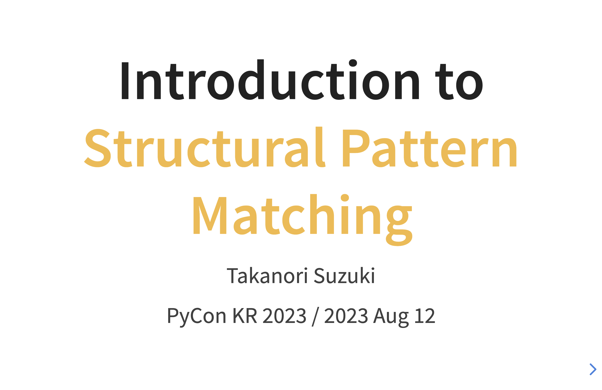

:og:image: _images/20230812pyconkr.png

=================================================
 Introduction to **Structural Pattern Matching**
=================================================

Takanori Suzuki

PyCon KR 2023 / 2023 Aug 12

.. Thank you for coming to my talk.
   I'm happy to be giving a talk at PyCon Korea.
   I'm Takanori Suzuki
   Talk title is "Introduction to Structural Pattern Matching".

Agenda
======
* Motivation / Goal
* What's New
* Syntax
* Patterns

.. Agenda of this talk.
   First, I will share my motivation and goals for this talk.
   Next, I will introduce what's new in Python 3.10.
   Then, I'll explain the syntax of structural pattern matching.
   Finally, various patterns will be explained with code examples.

Photos 📷 Tweets 🐦 👍
========================
``#pyconkr`` / ``@takanory``

.. I'd be happy to take pictures and share them and give you feedback on Twitter or some SNS.
   Hashtag is #pyconkr

Slide 💻
---------
`slides.takanory.net <https://slides.takanory.net>`__

.. This slide available on slides.takanory.net.
   And I've already shared this slide on Twitter.
   Please check it out #pyconapac.

Who am I? 👤
=============
* Takanori Suzuki / 鈴木 たかのり (:fab:`twitter` `@takanory <https://twitter.com/takanory>`_)
* `PyCon JP Association <https://www.pycon.jp/>`_: Chair
* `BeProud Inc. <https://www.beproud.jp/>`_: Director / Python Climber
* `Python Boot Camp <https://www.pycon.jp/support/bootcamp.html>`_, `Python mini Hack-a-thon <https://pyhack.connpass.com/>`_, `Python Bouldering Club <https://kabepy.connpass.com/>`_

.. image:: /assets/images/sokidan-square.jpg

.. Before the main topic,...I will introduce myself.
   I'm Takanori Suzuki. My twitter is "takanory", please follow me.
   I'm Chairperson of PyCon JP Association.
   And I'm director of BeProud Inc.
   I'm also active in several Python related communities

Me and **Korea** 🇰🇷
--------------------
* Attended **PyCon APAC 2016** in Korea

.. image:: images/pyconapac2016.jpg

.. My memory of Korea is attending PyCon APAC 7 yeas ago.
   Long time no see, Pythonistas in Korea.
   Do you know about this year's PyCon APAC?
           
`PyCon APAC 2023`_ in **Japan** 🇯🇵
-----------------------------------
.. image:: /assets/pyconapac2023-logo.png
   :width: 55%

.. _`PyCon APAC 2023`: https://2023-apac.pycon.jp

* Date: 2023 Oct 27-29

.. This year, the PyCon Japan team will host PyCon APAC 2023 in Tokyo.
   I hope to see you again in Japan in October for a beer!

Motivation of this talk 💪
===========================
* Structural Pattern Matching looks **useful**
* You to **know** and **try** it

.. Now let's get to the main topic.
   There are a lat of new features in Python 3.10.
   I think Structural Pattern Matching looks pretty useful.
   I'd like to YOU to know about it and try it out.

Goal of this talk 🥅
---------------------
* Learn **syntax** and **basic usage**
* Learn **various patterns** and **how to use** them
* **Try it** tomorrow

.. You will learn the syntax and basic usage of Structural Pattern Matching.
   And, you witll learn about the various patterns and how to use them.
   You'll be able to try it tomorrow.

Prerequisites
-------------
* **Intermediate** level
* You should know **Python syntax**

  * tuple, list, dict, if, def, isinstance, dataclass, type hinting and more

.. This talk is for interemediate level.
   You should have a basic understanding of Python syntax.
   For example, ...

Questions :fas:`circle-question`
================================

.. First, I have questions

Are you using **Python 3.10+**? 🙋‍♂️
-------------------------------------

.. Are you using Python 3.10 or higher?

Do you know the **new features**? 🙋‍♀️
---------------------------------------
.. Do you know the new features in 3.10?

**What's New** in Python 3.10 🆕
=================================

.. Now, let me introduce to the new features of Python 3.10.

**What's New** in Python 3.10 🆕
---------------------------------
* `docs.python.org/3/whatsnew/3.10.html <https://docs.python.org/3/whatsnew/3.10.html>`_

.. image:: images/whatsnew.png
   :width: 70%
   :alt: What's New in Python 3.10

.. The new features are summarized in the "What's new" page of the Python official documentation.

Python Release Python 3.10.11 🐍
---------------------------------
`www.python.org/downloads/release/python-31011/ <https://www.python.org/downloads/release/python-31011/>`_

.. Python 3.10 was released on October 4, 2021.
   The latest version os 3.10.11.
   3.10 has many new features...By the way...

Who are You? 🐍
----------------
.. image:: https://user-images.githubusercontent.com/11718525/135937807-fd3e0fd2-a31a-47a4-90c6-b0bb1d0704d4.png
   :width: 70%
   :alt: Python 3.10 release logo

.. This image is "Python 3.10 release logo".
   You can find the new features around this snake.

New features of Python 3.10
---------------------------
* Parenthesized Context Managers
* Better Typing Syntax
* Better Error Messages
* Structural Pattern Matching
* Better Debugging

.. There are five major new features written in the logo.
   Parenthesized...

New features of Python 3.10
---------------------------
* Parenthesized Context Managers
* Better Typing Syntax
* Better Error Messages
* **Structural Pattern Matching** 👈
* Better Debugging

.. In this talks, I will talk about Structural Pattern Matching.

Structural Pattern Matching :fas:`landmark`
===========================================

.. revealjs-break::

* PEPs for Structural Pattern Matching

  * `PEP 634 – Specification <https://www.python.org/dev/peps/pep-0634/>`_
  * `PEP 635 – Motivation and Rationale <https://www.python.org/dev/peps/pep-0635/>`_
  * `PEP 636 – Tutorial <https://www.python.org/dev/peps/pep-0636/>`_

.. Because of the large function of Structural Patten Matching, it is diveded into 3 PEPs.
   Specification, Motivation and Rationale, Tutorial.
   If you are interested, please read these PEPs.

Motivation
----------
`www.python.org/dev/peps/pep-0635/#motivation <https://www.python.org/dev/peps/pep-0635/#motivation>`_

  (Structural) pattern matching syntax is found in many languages, from Haskell, Erlang and Scala to Elixir and Ruby. (A proposal for JavaScript is also under consideration.)

.. This sentence is the motivation for the Structural Pattern Matching written in PEP.

.. revealjs-break::

.. code-block:: python

   # check type or shape of an object
   if isinstance(x, tuple) and len(x) == 2:
       host, port = x
       mode = "http"
   elif isinstance(x, tuple) and len(x) == 3:
       host, port, mode = x

.. code-block:: python

   # Structural Pattern Matching
   match x:
       case host, port:
           mode = "http"
       case host, port, mode:
           pass

.. Look at this code.
   The if-elif-else idiom is often used to check type or share of an object.
   For example isinstance(), hasattr(), len(), key in dict.
   Use match statements to write more elegantly.
   This is the motivation for Structural Pattern Matching.
   Now that you have figured out the motivation, let's talk about syntax.

Syntax :fas:`code`
==================
* Generic syntax of pattern matching

.. revealjs-literalinclude:: code/syntax.py
   :language: python
   :data-line-numbers: 1|2-9

.. A match statement takes an expression ... and compares its value to successive patterns given as one or more case blocks.

Soft keywords
-------------
* New in Python 3.10
* ``match``, ``case`` and ``_``
* Can be used identifier names

.. code-block:: pycon

   >>> match = "match"  # Valid
   >>> class = "class"  # Invalid
     File "<stdin>", line 1
       class = "class"
             ^
   SyntaxError: invalid syntax

.. Soft keywords are a new language specification in 3.10.
   match, case and _ are soft keywords.
   Soft keywords can be used identifier names.
   Next, let's talk about patterns!!
   I will explain how to write using a variety of patterns.

Patterns :fas:`list-ul`
=======================
.. revealjs-break::

.. literalinclude:: code/syntax.py
   :language: python

.. This is the syntax I introduced before.
   You can specify various patterns after "case" keyword.
   I will introduce patterns with code examples.

**Literal** patterns
--------------------
.. revealjs-literalinclude:: code/literal.py
   :language: python
   :data-line-numbers: 1-7|1,8-9

.. First, Literal patterns. Literal patterns are the simplest patterns.
   If the value of beer_style is "Pilsner", then 3rd line will be executed.
   (ページ送り)
   If the value doesn't match any of the patterns, it will match _.
   _ is wildcard pattern.

**OR** patterns
---------------
* ``|`` is OR

.. revealjs-literalinclude:: code/or.py
   :language: python
   :data-line-numbers: 1,4-5

.. The vertical bar is OR.
   This pattern matches IPA or Session IPA

Literal patterns **without wildcard**
-------------------------------------
.. revealjs-literalinclude:: code/literal2.py
   :language: python
   :data-line-numbers: 1,8-9

.. I commented out the last wildcard case.
   If the value doesn't match any of the pattens, nothing will happen.
   In this case, variable "result" is not defined.

Useful? 🤔
-----------

.. What?
   Doesn't look useful?

rewrite with **if** statement
-----------------------------
* If written as an ``if`` statement

.. literalinclude:: code/literal_if.py
   :language: python

.. If I rewrite the code with a if statement, it does not look much different.
   You're ritght.
   But...

Pattern Matching is **Powerful** 💪
------------------------------------
.. But...Pattern Matching is much more powerful.
   I will introduce more useful patterns.

Literal and **Variable** patterns
=================================

Literal and **Variable** patterns
---------------------------------
.. literalinclude:: code/variable.py
   :language: python
   :lines: 1-12

.. Let's consider a function receives orders tuple about beer and food.

Literal and **Variable** patterns
---------------------------------
.. revealjs-literalinclude:: code/variable.py
   :language: python
   :data-line-numbers: 1-4,14-15
   :lines: 1-15

.. If my order is (empty, empty) tuple, it matches the 3rd line pattern.
   The return value is "Please order something."

Literal and **Variable** patterns
---------------------------------
* ``"IPA"`` assign to ``beer``

.. revealjs-literalinclude:: code/variable.py
   :language: python
   :data-line-numbers: 1-2,5-6,14-15
   :lines: 1-13,17-18

.. If the order is ("IPA", empty) tuple, it matches the 5th line pattern.
   Then the first value of the tuple, IPA, is then assigned to the beer variable
   The return values is "I drink IPA."

Literal and **Variable** patterns
---------------------------------
* ``"IPA"`` assign to ``beer``、``"nuts"`` assign to ``food``

.. revealjs-literalinclude:: code/variable.py
   :language: python
   :data-line-numbers: 1-2,9-10,14-15
   :lines: 1-13,20-21

.. If the ordert is ("IPA", "nuts"), it matches the 9th line pattern.
   Then "IPA" assigned to the beer variable and "nuts" assigned to the food variable.
   The return values is "I drink IPA with nuts."

Literal and **Variable** patterns
---------------------------------
* Tuple length does not match

.. revealjs-literalinclude:: code/variable.py
   :language: python
   :data-line-numbers: 1-2,11-15
   :lines: 1-13,23-24

.. If the order is ("IPA", "nuts", "spam"), it matches whildcard pattern.
   Because the length of the tuple to be matched is only 2.
   The return values is "one beer and one food only."

rewrite with **if** statement
-----------------------------
.. literalinclude:: code/variable_if.py
   :language: python

.. Let's rewrite this code with an if statement.
   I think the code is a little confusing.

Which code do you **prefer**?
-----------------------------
* Pattern Matching 🆚 ``if`` statement

.. Do you prefer Pattern Matching or if statements?
   Still not sure?
   I will introduce other patterns as well.

**Case Order** is important ⬇️
===============================
.. revealjs-literalinclude:: code/pattern_order.py
   :language: python
   :data-line-numbers: 3-4,14,15

.. There is one note for pattern matching.
   The order of the cases is important.
   The patterns are compared in order from top to bottom, so if you write code like this, it will only match the first pattern.
   As a result, no other patterns will be reached.

**Classes** patterns
====================
.. Next, Classes patterns.

**Classes** patterns
--------------------
.. literalinclude:: code/classes.py
   :language: python
   :lines: 4-7

.. revealjs-literalinclude:: code/classes.py
   :language: python
   :lines: 10-21
   :data-line-numbers: 3-4|5-6|7-8|9-10|1-12

.. Here I create Order dataclass.
   The 1st case matches when the beer and food are empty.
   The 2nd case matches if only beer has a value.
   The 3rd case matches if food has a value.
   If both beer and food have a value, it matches in the 4th case
   It's easy to read, don't you think?

**Results**: Classes patterns
-----------------------------

.. code-block:: python

   >>> order_with_class(Order())
   'Please order something.'
   >>> order_with_class(Order(beer="Ale"))
   'I drink Ale.'
   >>> order_with_class(Order(food="fries"))
   'I eat fries.'
   >>> order_with_class(Order("Ale", "fries"))
   'I drink Ale with fries.'
   >>> order_with_class("IPA")
   'Not an order.'

.. Here is the result of this function.
   It works in the same way as the previous tuple case.

Classes patterns
----------------
.. code-block:: python

   def order_with_class(order: Order) -> str:
       match (order):
           case Order(beer="", food=""):
               return "Please order something."
           case Order(beer=beer, food=""):
               return f"I drink {beer}."
           case Order(beer="", food=food):
               return f"I eat {food}."
           case Order(beer=beer, food=food):
               return f"I drink {beer} with {food}."
           case _:
               return "Not an order."

.. Let's rewrite this code with if statements.

rewrite with **if** statement
-----------------------------
.. code-block:: python

   def order_with_class(order: Order) -> str:
       if isinstance(order, Order):
           if order.beer == "" and order.food == "":
               return  "Please order something."
           elif order.beer != "" and order.food == "":
               return f"I drink {order.beer}."
           elif order.beer == "" and order.food != "":
               return f"I eat {order.food}."
           else:
               return f"I drink {order.beer} with {order.food}."
       else:
           return "Not an order."

.. I rewrote that code with if statements.
   It looks a little complex.
   And, Classes patterns are much more powerful.

**Order** classses
------------------
.. code-block:: python

   @dataclass
   class Beer:  # Beer("IPA", "Pint")
       style: str
       size: str

   @dataclass
   class Food:  # Food("nuts")
       name: str

   @dataclass
   class Water:  # Water(4)
       number: int

.. There are three classes representing order of beer, food, and water.
   Each classes has attributes beer style and size, food name, and the number of glasses of water.

**Classes** patterns
--------------------
* With **multiple** classes

.. code-block:: python

   def order_with_classes(order: Beer|Food|Water) -> str:
       match (order):
           case Beer(style=style, size=size):
               return f"I drink {size} of {style}."
           case Food(name=name):
               return f"I eat {name}."
           case Water(number=number):
               return f"{number} glasses of water, please."
           case _:
               return "Not an order."

.. This code written in classes patterns with multiple classess.
   It is easy to recognize because of the branching by each class type.

rewrite with **if** statement
-----------------------------
.. code-block:: python

   def order_with_classes(order: Beer|Food|Water) -> str:
       if isinstance(order, Beer):
           return f"I drink {order.size} of {order.style}."
       elif isinstance(order, Food):
           return f"I eat {order.name}."
       elif isinstance(order, Water):
           return f"{order.number} glasses of water, please."
       else:
           return "Not an order."

.. I rewrite that code  with if statements. It looks like this.
   The match case is cleaner and readable, don't you think?

.. match caseで書いた方がすっきりして読みやすいと思いませんか?

**Sequense** patterns ➡️
==========================

**Sequense** patterns ➡️
--------------------------
* Parse the order text
* for example:

.. code-block:: python

   order_text = "beer IPA pint"
   order_text = "food nuts"
   order_text = "water 3"
   order_text = "bill"

.. Next, I will explain about Sequense pattens.
   In this caes, I'll parse the order text.
   For example...

.. 次はシーケンスのマッチについて解説します。
   ここでは注文のテキストを解析します。
   In this caes, I'll parse the order text.

Matching multiple patterns
--------------------------
* Matching by **length** of sequence

.. code-block:: python

   match order_text.split():
       case [action]:  # match "bill"
           ...
       case [action, name]:  # match "food nuts", "water 3"
           ...
       case [action, name, size]:  # match "beer IPA pint"
           ...

.. This code can match the patterns of multiple sequences.
   In this case, there are patterns with list lengths of 1, 2, and 3.

.. 複数のシーケンスのパターンにマッチできます。
   この場合はリストの長さが1、2、3のパターンがあります。

Matching specific values
------------------------
* Matching specific attions(bill, food...)

.. code-block:: python

   match order_text.split():
       case ["bill"]:  # match "bill"
           calculate_amount()
       case ["food", food]:  # match "food nuts"
           tell_kitchen(food)
       case ["water", number]:  # match "water 3"
           grass_of_water(number)
       case ["beer", style, size]:  # match "beer IPA pint"
           tell_beer_master(style, size)

.. Also, if you write the pattern like this, any value in the list will be matched with a specific string(bill, food...).
   This is a combination of sequence patterns and literal patterns.

.. また、このようにパターンを書くと、リストの任意の値が特定の文字列とマッチします

Capturing matched **sub-patterns**
----------------------------------
* Valid beer size are ``"Pint"`` and ``"HalfPint"``
* ``"beer IPA 1-liter"`` is invalid

.. code-block:: python

   match order_text.split():
       ...
       case ["beer", style, ("Pint" | "HalfPint")]:
           # I don't know beer size

.. Valid beer sizes are Pint or Half Pint only.
   For example, "beer IPA 1-liter" is invalid.
   Using the OR patterns in this way, you can match any value.
   But I don't know beer size. How do I get the value of size.

.. 有効なビールのサイズはPintとHalfPintのみだとします

Capturing matched **sub-patterns**
----------------------------------

* Use **as** patterns
* Assign the size value(``"Pint"`` or ``"HalfPint"``) to ``size``

.. code-block:: python

   match order_text.split():
       ...
       case ["beer", style, ("Pint" | "HalfPint") as size]:
           tell_beer_master(style, size)

.. In this case, use as patterns.
   Assign the size value(Pint or HalfPint) to the size variable.

Matching **multiple values**
----------------------------
* Can handle multiple food order
* example:

  * ``"food nuts fries pickles"``

.. code-block:: python

   order_text = "food nuts fries pickles"

   match order_text.split():
       ...
       case ["food", food]:  # capture single value
           tell_kitchen(food)

.. I want to order multiple food items at once.
   For example "food nuts fries pickles",
   But this sequence pattern can handle single food.

Matching **multiple values**
----------------------------
* Add **\*** to variable name

.. code-block:: python

   order_text = "food nuts fries pickles"

   match order_text.split():
       ...
       case ["food", *foods]:  # capture multiple values
           for food in foods:  # ("nuts", "fries", "pickles")
               tell_kitchen(name)

.. If I add * to the variable name(foods), multiple values will be assigned.
   Now I can order multiple food items at once!

.. これで一度に複数のフードを注文できるようになりました!

**Mapping** Patterns 📕
========================
.. Last patterns is Mapping pattens.

**Mapping** Patterns 📕
------------------------
* Pattern match for **dictinaries**
* Useful for alalyzing **JSON**

.. code-block:: python

   order_dict = {"beer": "IPA", "size": "Pint"}

   match order_dict:
       case {"food": food}:
           tell_kitchen(food)
       case {"beer": style, "size": ("Pint" | "HalfPint") as size}:
           tell_beer_master(style, size)
       case {"beer": style, "size": _}:
           print("Unknown beer size")
       case {"water": number}:
           grass_of_water(number)
       case {"bill": _}:
           calculate_amount()

.. The pattern is matched by map types such as dictionaries.
   The mapping pattern is useful for analyzing a JSON-loaded dictionary.

Matching **builtin** classes
----------------------------
* Use **str()**, **int()** and more

.. code-block:: python

   order_dict = {"water": 3}
   # order_dict = {"water": "three"}  # Doesn't match

   match order_dict:
       case {"food": str(food)}:
           tell_kitchen(food)
       case {"beer": str(style), "size": ("Pint" | "HalfPint") as size}:
           tell_beer_master(style, size)
       case {"beer": str(style), "size": _}:
           print("Unknown beer size")
       case {"water": int(number)}:
           grass_of_water(number)
       case {"bill": _}:
           calculate_amount()

.. You can use builtin classes to specify the type of the value.
   In this code, food and beer style are string, and the number of water is an integer only.
   If the value of water is string, it will not match the pattern.

.. このコードでは、料理やビールの種類は文字列で、水の数は整数のみとなります。
   もしwaterの値が文字のthreeの場合は、パターンにマッチしません。

Guards 💂‍♀️
============

.. Finally, let me introduce Guards.

.. 最後にガードについて説明します。

Guards 💂‍♀
------------
* **if** statement after pattern

.. code-block:: python

   order_list = ["water", 3]  # -> 3 glasses of water, please.
   # order_list = ["water", 15]  # -> You can only order 1-9 glasses of water.

   match order_list:
       case ["water", int(number)] if 0 < number < 10:
           print(f"{number} glasses of water, please.")
       case ["water", _]:
           print("You can only order 1-9 glasses of water.")

.. If you write an if statement after the pattern, it becomes a guard.
   This code will match if the second value of order_list is an integer.
   After that, a guard checks if the number is in the range of 1-9.

.. パターンの後ろにif文を書くとguardになります。

Summary
=======
.. revealjs-break::

* Motivation 💪
* Syntax :fas:`code`

  * Soft keywords: ``match``, ``case`` and ``_``
* Patterns :fas:`shuffle`

  * Literal, Variable, Classes, Sequense, Mapping
  * Wildcard, OR, AS, Guards

.. Summary of this talks.
   I tald about ...

**Try** Structural Pattern Matching 👍
---------------------------------------
.. If you think pattern matching looks good, give it a try!!

.. もしパターンマッチよさそうだなと思ったら、挑戦してみてください

References 📚
--------------
* `What's New In Python 3.10 <https://docs.python.org/ja/3.10/whatsnew/3.10.html>`_
* `Python Release Python 3.10.0 <https://www.python.org/downloads/release/python-3100/>`_
* `PEP 634 -- Structural Pattern Matching: Specification <https://www.python.org/dev/peps/pep-0634/>`_
* `PEP 635 -- Structural Pattern Matching: Motivation and Rationale <https://www.python.org/dev/peps/pep-0635/>`_
* `PEP 636 -- Structural Pattern Matching: Tutorial <https://www.python.org/dev/peps/pep-0636/>`_

.. References are here

Thank you !! 🙏
===============
Takanori Suzuki (:fab:`twitter` `@takanory <https://twitter.com/takanory>`_)

`slides.takanory.net <https://slides.takanory.net/>`_

.. image:: /assets/images/sokidan-square.jpg

.. Thank you for your attention.
   I hope to see you at PyCon held onsite somewhere.

What's New in Python 3.10 🆕
=============================
.. revealjs-break::

* **Parenthesized Context Managers** 👈
* **Better Error Messages** 👈
* **Better Typing Syntax** 👈
* Structural Pattern Matching
* Better Debugging

Parenthesized Context Managers
------------------------------
.. code-block:: python

   # 3.10
   with (
       open('craftbeer.txt') as f1,
       open('beer-in-kanda.txt') as f2,
   ):
       ...

.. code-block:: python

   # Before 3.10
   with open('craftbeer.txt') as f1, \
        open('beer-in-kanda.txt') as f2
       ...

Better Error Messages
---------------------
.. code-block:: python

   # Brackets are not closed
   beer_types = ['Pilsner', 'Ale', 'IPA', 'Hazy IPA'
   print(beer_types)

.. revealjs-code-block:: python
   :data-line-numbers: 3-6

   $ python3.10 beer_styles.py
     File ".../beer_styles.py", line 2
       beer_styles = ['Pilsner', 'Ale', 'IPA', 'Hazy IPA'
                     ^
   SyntaxError: '[' was never closed
   # Easy to understand!!

.. revealjs-code-block:: python
   :data-line-numbers: 3-5

   $ python3.9 beer_styles.py
     File ".../beer_styles.py", line 3
       print(beer_styles)
       ^
   SyntaxError: invalid syntax

Better Error Messages
---------------------
.. revealjs-code-block:: python
   :data-line-numbers: 3-7

   # 3.10
   >>> if beer_syle = 'IPA':
     File "<stdin>", line 1
       if beer_syle = 'IPA':
          ^^^^^^^^^^^^^^^^^
   SyntaxError: invalid syntax. Maybe you meant '==' or ':=' instead of '='?
   # Very friendly!!

.. revealjs-code-block:: python
   :data-line-numbers: 3-5

   # Before 3.10
   >>> if beer_syle = 'IPA':
     File "<stdin>", line 1
       if beer_syle = 'IPA':
                    ^
   SyntaxError: invalid syntax

Better Typing Syntax
--------------------
* `PEP 604 <https://www.python.org/dev/peps/pep-0604>`_: New Type Union Operator

  * ``Union[X, Y]`` → ``X | Y``
  * ``Optional[X]`` → ``X | None``

.. revealjs-code-block:: python
   :data-line-numbers: 2

   # 3.10
   def drink_beer(number: int | float) -> str | None
       if am_i_full(number):
           return 'I'm full'

.. revealjs-code-block:: python
   :data-line-numbers: 2

   # Before 3.10
   def drink_beer(number: Union[int, float]) -> Optional[str]
       if am_i_full(number):
           return 'I'm full'

.. revealjs-break::

* `PEP 613 <https://www.python.org/dev/peps/pep-0613>`_: TypeAlias

.. code-block:: python

   # 3.10
   BeerStr: TypeAlias = 'Beer[str]'  # a type alias
   LOG_PREFIX = 'LOG[DEBUG]'  # a module constant

.. code-block:: python

   # Before 3.10
   BeerStr = 'Beer[str]'  # a type alias
   LOG_PREFIX = 'LOG[DEBUG]'  # a module constant

.. revealjs-break::

* Can use Python 3.7 - 3.9

.. code-block:: python

   from __future__ import annotations

   def drink_beer(number: int | float) -> str | None
       if am_i_full(number):
           return 'I'm full'

Try Python 3.10 👍
-------------------
