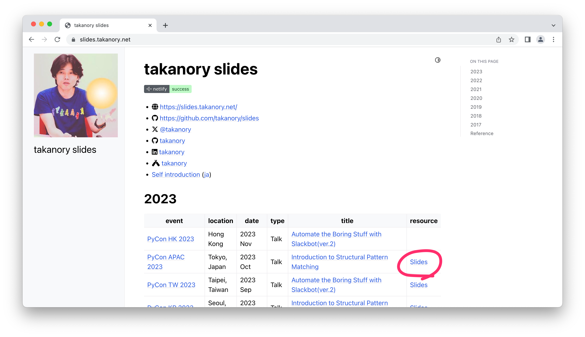

```{eval-rst}
:og:image: _images/20231027pyconapac.png
:og:image:alt: Introduction to Structural Pattern Matching

.. |cover| image:: images/20231027pyconapac.png
```

# Introduction to **Structural Pattern Matching**

Takanori Suzuki

PyCon APAC 2023 / 2023 Oct 27

## **構造的パターンマッチング** 入門

Takanori Suzuki

PyCon APAC 2023 / 2023 Oct 27

## Agenda / アジェンダ

- Motivation and Goal / モチベーションとゴール
- What's New
- Syntax / 構文
- Patterns / パターン

## Photos 📷 Tweets 🐦 👍

`#pyconapac` / `#pyconapac_4`

`@takanory`

### Slide / スライド 💻

[slides.takanory.net](https://slides.takanory.net)



## **Who** am I? / お前 **誰よ** 👤

- Takanori Suzuki / 鈴木 たかのり ({fab}`twitter` [@takanory](https://twitter.com/takanory))
- [PyCon JP Association](https://www.pycon.jp/): Chair
- [BeProud Inc.](https://www.beproud.jp/): Director / Python Climber
- [Python Boot Camp](https://www.pycon.jp/support/bootcamp.html), [Python mini Hack-a-thon](https://pyhack.connpass.com/), [Python Bouldering Club](https://kabepy.connpass.com/)


### PyCon JP **Association** 🐍

* [`www.pycon.jp`](https://www.pycon.jp)
* PyCon JP Association Meeting 2023
* Date: Oct 27
* TIme: 12:30-13:30
* Venue: 20F open space

### **BeProud** inc. 🏢

* [BeProud](https://www.beproud.jp/): Pythonシステム開発、Consulting
* [connpass](https://connpass.com/): IT勉強会支援プラットフォーム
* [PyQ](https://pyq.jp/): Python独学プラットフォーム
* [TRACERY](https://tracery.jp/): システム開発ドキュメントサービス


### **BeProud** booth

We are hiring!!

(TODO: 写真を入れる)

## Motivation of this talk 💪

- Structural Pattern Matching looks **useful**
- You to **know** and **use** it

### Goal of this talk 🥅

- Learn **syntax** and **basic usage**
- Learn **various patterns** and **how to use** them
- **Try it** tomorrow

### Prerequisites

- **Intermediate** level
- You should know **Python syntax**
  - tuple, list, dict, if, def, isinstance, dataclass, type hinting and more

## Questions {fas}`circle-question`

質問

### Are you using **Python 3.10+**? 🙋‍♂️

**Python 3.10以上** を使っている人？

### Do you know the **new features**? 🙋‍♀️

**新機能** を知っている人？

## **What's New** in Python 3.10 🆕

Python 3.10の **新機能**

### **What's New** in Python 3.10 🆕

- [docs.python.org/3/whatsnew/3.10.html](https://docs.python.org/3/whatsnew/3.10.html)

```{image} images/whatsnew.png
:alt: What's New in Python 3.10
:width: 70%
```

### Python Release Python 3.10.11 🐍

[www.python.org/downloads/release/python-31011/](https://www.python.org/downloads/release/python-31011/)

```{image} images/python31011.png
:alt: Python Release Python 3.10.11
:width: 55%
```

### **Who** are You? / お前は **誰よ**？ 🐍

```{image} https://user-images.githubusercontent.com/11718525/135937807-fd3e0fd2-a31a-47a4-90c6-b0bb1d0704d4.png
:alt: Python 3.10 release logo
:width: 70%
```

```{revealjs-notes}
This image is "Python 3.10 release logo".
You can find the new features around this snake.
```

### New features of Python 3.10

- Parenthesized Context Managers
- Better Typing Syntax
- Better Error Messages
- Structural Pattern Matching
- Better Debugging

```{revealjs-notes}
There are five major new features written in the logo.
Parenthesized...
```

### New features of Python 3.10

- Parenthesized Context Managers
- Better Typing Syntax
- Better Error Messages
- **Structural Pattern Matching** 👈
- Better Debugging

## Structural Pattern Matching {fas}`landmark`

構造的パターンマッチング

```{revealjs-break}
```

- PEPs for Structural Pattern Matching
  - [PEP 634 – Specification](https://peps.python.org/pep-0634/)
  - [PEP 635 – Motivation and Rationale](https://peps.python.org/pep-0635/)
  - [PEP 636 – Tutorial](https://peps.python.org/pep-0636/)

### Motivation / モチベーション

[www.python.org/dev/peps/pep-0635/#motivation](https://www.python.org/dev/peps/pep-0635/#motivation)

> (Structural) pattern matching syntax is found in many languages, from Haskell, Erlang and Scala to Elixir and Ruby. (A proposal for JavaScript is also under consideration.)

```{revealjs-break}
```

```python
# check type or shape of an object
if isinstance(x, tuple) and len(x) == 2:
    host, port = x
    mode = "http"
elif isinstance(x, tuple) and len(x) == 3:
    host, port, mode = x
```

```python
# Structural Pattern Matching
match x:
    case host, port:
        mode = "http"
    case host, port, mode:
        pass
```

```{revealjs-notes}
Look at this code.
The if-elif-else idiom is often used to check type or shape of an object.
For example isinstance(), hasattr(), len(), key in dict.
Use match statements to write more elegantly.
This is the motivation for Structural Pattern Matching.
Now that you have figured out the motivation, let's talk about syntax.
```

## Syntax / 構文 {fas}`code`

- Generic syntax of pattern matching

```{revealjs-literalinclude} code/syntax.py
:language: python
:data-line-numbers: 1|2-9
```

### **Soft** keywords / **ソフト** キーワード

- New in Python 3.10
- **`match`**, **`case`** and **`_`**
- Can be used **identifier names**

```pycon
>>> match = "match"  # Valid(Soft keyword)
>>> class = "class"  # Invalid(Keyword)
  File "<stdin>", line 1
    class = "class"
          ^
SyntaxError: invalid syntax
```

```{revealjs-notes}
Soft keywords are a new language specification in 3.10.
match, case and _ are soft keywords.
Soft keywords can be used identifier names.
Next, let's talk about patterns!!
```

## Patterns / パターン {fas}`list-ul`

### Patterns / パターン  {fas}`list-ul`

```{revealjs-literalinclude} code/syntax.py
:language: python
:data-line-numbers: 2,4,6,8
```

### **Literal** patterns

```{revealjs-literalinclude} code/literal.py
:language: python
:data-line-numbers: 1-7|1,8-9
```

```{revealjs-notes}
First, Literal patterns. Literal patterns are the simplest patterns.
If the value of beer_style is "Pilsner", then 3rd line will be executed. /
If the value of beer_style is "Ale", it will not match any patterns.
In this case it will match _. _ is wildcard pattern.
```

### **OR** patterns

- `|` is OR

```{revealjs-literalinclude} code/or.py
:language: python
:data-line-numbers: 1,4-5
```

```{revealjs-notes}
The vertical bar is OR.
This pattern matches IPA or Session IPA
```

### Literal patterns **without wildcard**

```{revealjs-literalinclude} code/literal2.py
:language: python
:data-line-numbers: 1,8-9
```

```{revealjs-notes}
I commented out the last wildcard pattern.
If the value doesn't match any of the patterns, nothing will happen.
In this case, result variable is not defined.
```

### Useful? 🤔

便利そう？そうでもない？

### rewrite with **if** statement

- If written as an `if` statement

```{literalinclude} code/literal_if.py
:language: python
```
### Pattern Matching is **Powerful** 💪

パターンマッチングは **強力**

## Literal and **Variable** patterns

リテラルと **変数** パターン

### Literal and **Variable** patterns

```{literalinclude} code/variable.py
:language: python
:lines: 1-12
```

### Literal and **Variable** patterns

```{revealjs-literalinclude} code/variable.py
:language: python
:data-line-numbers: 1-4,14-15
:lines: 1-15
```

### Literal and **Variable** patterns

- `"IPA"` assign to `beer`

```{revealjs-literalinclude} code/variable.py
:language: python
:data-line-numbers: 1-2,5-6,14-15
:lines: 1-13,17-18
```

### Literal and **Variable** patterns

- `"IPA"` assign to `beer`、`"nuts"` assign to `food`

```{revealjs-literalinclude} code/variable.py
:language: python
:data-line-numbers: 1-2,9-10,14-15
:lines: 1-13,20-21
```

### Literal and **Variable** patterns

- Tuple length does not match

```{revealjs-literalinclude} code/variable.py
:language: python
:data-line-numbers: 1-2,11-15
 :lines: 1-13,23-24
```

### rewrite with **if** statement

```{literalinclude} code/variable_if.py
:language: python
```

### Which code do you **prefer**?

どっちが **好み** ？

- Pattern Matching 🆚 `if` statement

## **Case Order** is important ⬇️

**ケースの順番** は重要

### **Case Order** is important ⬇️

```{revealjs-literalinclude} code/pattern_order.py
:language: python
:data-line-numbers: 3-4,14,15
```

## **Classes** patterns

**クラス** パターン

### **Classes** patterns

```{literalinclude} code/classes.py
:language: python
:lines: 4-7
```

```{revealjs-literalinclude} code/classes.py
:language: python
:lines: 10-21
:data-line-numbers: 3-4|5-6|7-8|9-10|1-12
```

### **Results**: Classes patterns

**実行結果**: クラスパターン

```python
>>> order_with_class(Order())
'Please order something.'
>>> order_with_class(Order(beer="Ale"))
'I drink Ale.'
>>> order_with_class(Order(food="fries"))
'I eat fries.'
>>> order_with_class(Order("Ale", "fries"))
'I drink Ale with fries.'
>>> order_with_class("IPA")
'Not an order.'
```

### Classes patterns

```python
def order_with_class(order: Order) -> str:
    match (order):
        case Order(beer="", food=""):
            return "Please order something."
        case Order(beer=beer, food=""):
            return f"I drink {beer}."
        case Order(beer="", food=food):
            return f"I eat {food}."
        case Order(beer=beer, food=food):
            return f"I drink {beer} with {food}."
        case _:
            return "Not an order."
```

### rewrite with **if** statement

```python
def order_with_class(order: Order) -> str:
    if isinstance(order, Order):
        if order.beer == "" and order.food == "":
            return  "Please order something."
        elif order.beer != "" and order.food == "":
            return f"I drink {order.beer}."
        elif order.beer == "" and order.food != "":
            return f"I eat {order.food}."
        else:
            return f"I drink {order.beer} with {order.food}."
    else:
        return "Not an order."
```

### Use **multiple** classses

**複数** のクラスを使用

```python
@dataclass
class Beer:  # Beer("IPA", "Pint")
    style: str
    size: str

@dataclass
class Food:  # Food("nuts")
    name: str

@dataclass
class Water:  # Water(4)
    number: int
```

### Use **multiple** classses

**複数** のクラスを使用

```python
def order_with_classes(order: Beer|Food|Water) -> str:
    match (order):
        case Beer(style=style, size=size):
            return f"I drink {size} of {style}."
        case Food(name=name):
            return f"I eat {name}."
        case Water(number=number):
            return f"{number} glasses of water, please."
        case _:
            return "Not an order."
```

### rewrite with **if** statement

```python
def order_with_classes(order: Beer|Food|Water) -> str:
    if isinstance(order, Beer):
        return f"I drink {order.size} of {order.style}."
    elif isinstance(order, Food):
        return f"I eat {order.name}."
    elif isinstance(order, Water):
        return f"{order.number} glasses of water, please."
    else:
        return "Not an order."
```

## **Sequense** patterns ➡️

**シーケンス** パターン

### **Sequense** patterns ➡️

- Parse the order text
- for example:

```python
order_text = "beer IPA pint"
order_text = "food nuts"
order_text = "water 3"
order_text = "bill"
```

### Matching by **length** of sequence

シーケンスの **長さ** でマッチ

```python
match order_text.split():
    case [action]:  # match "bill"
        ...
    case [action, name]:  # match "food nuts", "water 3"
        ...
    case [action, name, size]:  # match "beer IPA pint"
        ...
```

### Matching **specific values** in sequence

シーケンス中の **任意の値** でマッチ

- Specific values: `"bill"`, `"food"`...

```python
match order_text.split():
    case ["bill"]:  # match "bill"
        calculate_amount()
    case ["food", food]:  # match "food nuts"
        tell_kitchen(food)
    case ["water", number]:  # match "water 3"
        grass_of_water(number)
    case ["beer", style, size]:  # match "beer IPA pint"
        tell_beer_master(style, size)
```

### Capturing matched **sub-patterns**

マッチした **サブパターン** を捕捉する

- Valid beer size: `"Pint"` or `"HalfPint"`
- `"beer IPA Small"` is invalid

```python
order_text = "beer IPA Pint"

match order_text.split():
    ...
    case ["beer", style, ("Pint" | "HalfPint")]:
        # I don't know beer size
```

### Capturing matched **sub-patterns**

マッチした **サブパターン** を捕捉する

- Use **as** patterns
- `("Pint" | "HalfPint") as size`

```python
order_text = "beer IPA Pint"

match order_text.split():
    ...
    case ["beer", style, ("Pint" | "HalfPint") as size]:
        tell_beer_master(style, size)  # size is "Pint"
```

### Matching **multiple values**

**複数の値** にマッチ

- I want to order **several foods**
- example: `"food nuts fries pizza"`

```python
order_text = "food nuts fries pizza"

match order_text.split():
    ...
    case ["food", food]:  # capture single value
        tell_kitchen(food)
```

### Matching **multiple values**

**複数の値** にマッチ

- `food` → `*foods`

```python
order_text = "food nuts fries pizza"

match order_text.split():
    ...
    case ["food", *foods]:  # capture multiple values
        for food in foods:  # ("nuts", "fries", "pizza")
            tell_kitchen(food)
```
### I can order several foods!! 🍟🍕

複数の食べ物を注文できる!!

```{revealjs-notes}
Now I can order multiple food items at once!
```

## **Mapping** Patterns 📕

**マッピング** パターン

```{revealjs-notes}
Last patterns is Mapping patterns.
```
### **Mapping** Patterns 📕

- Pattern match for **dict**
- Useful for alalyzing **JSON**

```python
order_dict = {"beer": "IPA", "size": "Pint"}

match order_dict:
    case {"food": food}:
        tell_kitchen(food)
    case {"beer": style, "size": ("Pint" | "HalfPint") as size}:
        tell_beer_master(style, size)
    case {"beer": style, "size": _}:
        print("Unknown beer size")
    case {"water": number}:
        grass_of_water(number)
    case {"bill": _}:
        calculate_amount()
```

### Matching **builtin** classes

**組み込み** クラスにマッチ

- Use **str()**, **int()** and more

```{revealjs-code-block}
:data-line-numbers: 1-2,5,7,11

order_dict = {"water": 3}
# order_dict = {"water": "three"}  # Doesn't match

match order_dict:
    case {"food": str(food)}:
        tell_kitchen(food)
    case {"beer": str(style), "size": ("Pint" | "HalfPint") as size}:
        tell_beer_master(style, size)
    case {"beer": style, "size": _}:
        print("Unknown beer size")
    case {"water": int(number)}:
        grass_of_water(number)
    case {"bill": _}:
        calculate_amount()
```

## Guards 💂‍♀️

ガード

### **Number** of water

水の **数**

- Invalid: 9, 10, ...
- Valid: 1, 2, ... 8
- Invalid: 0, -1, ...

### Guards 💂‍♀

- Valid: 1, 2, ... 8
- **`if` statement** after pattern

```{revealjs-code-block}
:data-line-numbers: 1-2,5

order_list = ["water", 3]  # -> 3 glasses of water, please.
# order_list = ["water", 15]  # -> 15 is invalid value.

match order_list:
    case ["water", int(number)] if 1 <= number <= 8:
        print(f"{number} glasses of water, please.")
    case ["water", _]:
        print(f"{number} is invalid value.")
```

```{revealjs-notes}
In this case, use guards.
When you write an if statement after the pattern, it becomes a guard.
Line 5 matches if the second value in the order_list is an int.
But because of the guard, if number is between 1 and 8, it matches this case.
```

### Can't order **many glasses** of water! 🎉

**たくさんの水** を注文できない!

```{revealjs-notes}
Can't order **many glasses** of water with guards!!
```

## Summary / まとめ

```{revealjs-break}
```

- Motivation and Goal / モチベーションとゴール
- What's New
- Syntax / 構文
  - Soft keywords: `match`, `case` and `_`
- Patterns / パターン
  - Literal, Variable, Classes, Sequense, Mapping
  - Wildcard(`_`), OR(`|`), AS, Guards

### **Try** Structural Pattern Matching 👍

構造的パターンマッチングに **試して** みよう

### References 📚

- [What's New In Python 3.10](https://docs.python.org/3/whatsnew/3.10.html)
- [Python Release Python 3.10.11](https://www.python.org/downloads/release/python-31011/)
- [PEP 634 -- Specification](https://peps.python.org/pep-0634/)
- [PEP 635 -- Motivation and Rationale](https://peps.python.org/pep-0635/)
- [PEP 636 -- Tutorial](https://peps.python.org/pep-0636/)
- [4.6. `match` Statements - The Python Tutorial](https://docs.python.org/3/tutorial/controlflow.html#match-statements)

```{revealjs-notes}
References are here
```

## Thank you !! 🙏

{fas}`desktop` [slides.takanory.net](https://slides.takanory.net/)

{fab}`twitter` [@takanory](https://twitter.com/takanory)
{fab}`github` [takanory](https://github.com/takanory/)
{fab}`linkedin` [takanory](https://www.linkedin.com/in/takanory/)
{fab}`untappd` [takanory](https://untappd.com/user/takanory/)


