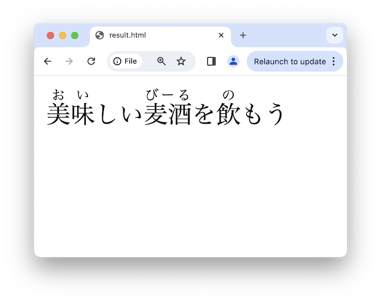
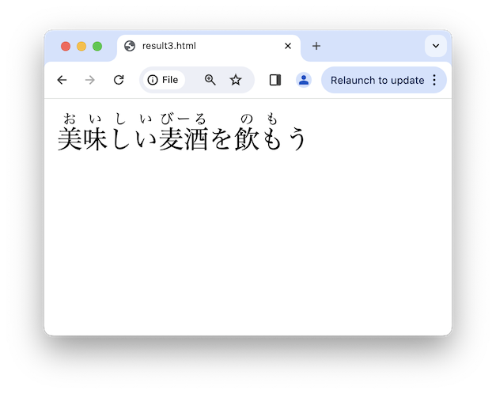
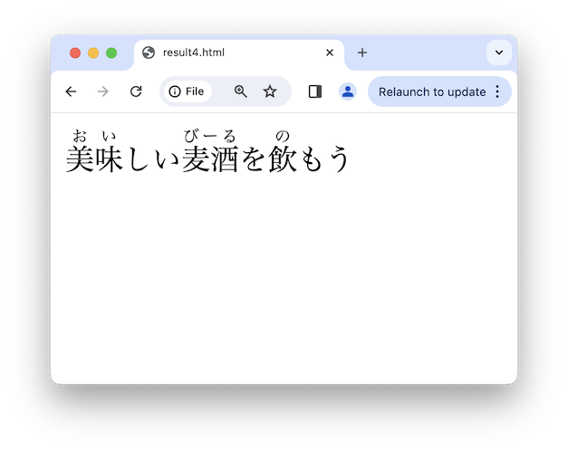
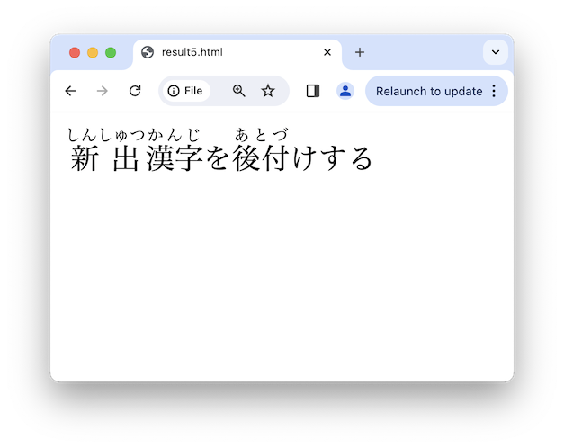
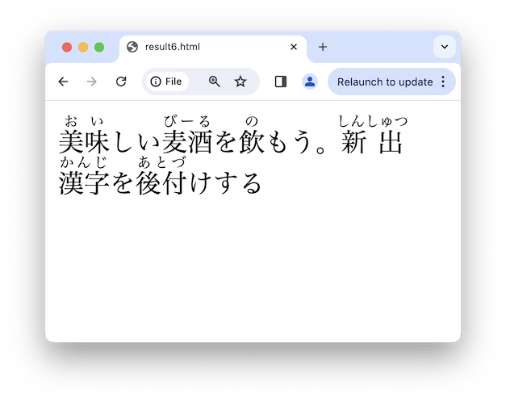
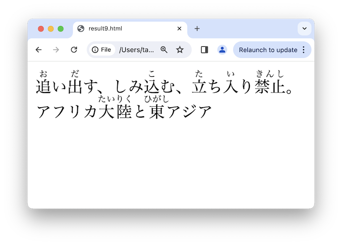

# Pythonで<br />**日本語処理** 入門

**〜フリガナプログラムを作ろう〜**

Takanori Suzuki 

Open Source Conference Osaka 2024 / 2024 Jan 27

## アジェンダ 📋

* 自然言語処理とは
  * **形態素解析** について
* **Janome** でフリガナプログラム
* **SudachiPy** でフリガナプログラム
* LLM(大規模言語モデル)については **話しません**

### ゴール 🥅

* 自然言語処理がどういうものか知る
* JanomeまたはSudachiPyを使った日本語処理ができそう

## Photos 📷 Tweets 🐦 👍

`#oscosk2024` / `@takanory`

### Slide / スライド 💻

[slides.takanory.net](https://slides.takanory.net)

## **Who** am I? / お前 **誰よ** 👤

- Takanori Suzuki / 鈴木 たかのり ({fab}`twitter` [@takanory](https://twitter.com/takanory))
- [PyCon JP Association](https://www.pycon.jp/) 代表理事
- [BeProud](https://www.beproud.jp/) 取締役 / Python Climber
- [Python Boot Camp](https://www.pycon.jp/support/bootcamp.html) 講師、[Python mini Hack-a-thon](https://pyhack.connpass.com/) 主催、[Pythonボルダリング部](https://kabepy.connpass.com/) 部長


### PyCon JP **Association** 🐍

日本国内のPythonユーザのために、**Pythonの普及及び開発支援**を行うために、継続的にカンファレンス(**PyCon**)を開くことを目的とした **非営利組織**

* [`www.pycon.jp`](https://www.pycon.jp)


### PyCon JP **Association** の主な活動

* PyCon JP: 年1の大規模カンファレンス
* [Python Boot Camp](https://www.pycon.jp/support/bootcamp.html): 初心者向けチュートリアル
* [Pythonコミュニティのサポート](https://www.pycon.jp/support/community.html)
* [PyCon JP TV](https://tv.pycon.jp/): YouTubeライブ

### PyCon JP Associationブース

* PyCon JP 2024スタッフ募集
* Python Boot Campの紹介
* PyLadies Caravanの紹介
* その他Python・コミュニティ関連相談

### **BeProud** Inc. 🏢

* [BeProud](https://www.beproud.jp/) :Pythonシステム開発、コンサル
* [connpass](https://connpass.com/): IT勉強会支援プラットフォーム
* [PyQ](https://pyq.jp/): Python独学プラットフォーム
* [TRACERY](https://tracery.jp/): システム開発ドキュメントサービス


## **自然言語処理** とは 🗣️

### **自然言語処理** とは 🗣️

* NLP(Natural Language Processing)
* 自然言語(日本語、英語等)は厳格な構文がない
  * Pythonは[言語仕様](https://docs.python.org/ja/3/reference/index.html)があるので機械的に処理がしやすい
* NLP(自然言語処理)用のライブラリが必要

### NLPライブラリ

* [NLTK: Natural Language Toolkit](https://www.nltk.org/)
* [Gensim](https://radimrehurek.com/gensim/index.html)
* [spaCy](https://spacy.io/)
* [Pytorch-NLP](https://pytorchnlp.readthedocs.io/en/latest/)
* そのままでは **日本語を処理できない** ものも

* [Awesome Python](https://awesome-python.com/#natural-language-processing)より

### 日本語の特徴

* 単語が **スペースで区切られていない**

  * 「すもももももももものうち」

* 一つの漢字に **複数の読み方**

  * 「一月一日は元日で昨日は大晦日」
  
* 文脈で **単語の分かれ目** が違う

  * 「東京都と神奈川の小京都」

## **形態素解析** とは 💬

### **形態素解析** とは 💬

* 自然言語(日本語)を **形態素** に分割

  * 形態素=単語などの要素
* **品詞** などの情報を付加
* 日本語の **辞書データ** が必要

### 品詞、原形、読み

* 形態素解析が付加する主な情報
* 例：「とても美味しいビールを飲みたい」
* **品詞**: とても(副詞)美味しい(形容詞)ビール(副詞)...
* **原形**: 飲み→飲む
* **読み**: 美味しい→おいしい、飲み→のみ

### 形態素解析の用途

* 検索エンジンの検索インデックス
* 文章の分類
* 単語の数で文章の特徴を表す(**Bag of Words**)
* 単語の重要度を調べる(**TF-IDF**)

### **目的**：フリガナを振る

* 形態素解析ライブラリを使ったプログラム

```bash
$ ./furigana.py "美味しい麦酒を飲もう" > result.html && cat result.html
<ruby><rb>美味</rb><rt>おい</rt></ruby>しい
<ruby><rb>麦酒</rb><rt>びーる</rt></ruby>を
<ruby><rb>飲</rb><rt>の</rt></ruby>もう
```



## **Janome** で形態素解析 👀

### **Janome** とは

* URL: [mocobeta.github.io/janome/](https://mocobeta.github.io/janome/)
* **Pure Python** で書かれた **辞書内包** の形態素解析器
  * OSに依存しない
  * すぐ使い始められる

### Janomeをインストール

* `pip install janome` でインストール

```bash
$ python3.11 -m venv env  # venvモジュールで仮想環境作成
$ . env/bin/activate
(env) $ pip install janome
...
Successfully installed janome-0.5.0
```

### Janomeで形態素解析

* `janome` コマンドで形態素解析

```bash
(env) $ echo "美味しい麦酒を飲もう" | janome
美味しい	形容詞,自立,*,*,形容詞・イ段,基本形,美味しい,オイシイ,オイシイ
麦酒	名詞,一般,*,*,*,*,麦酒,ビール,ビール
を	助詞,格助詞,一般,*,*,*,を,ヲ,ヲ
飲も	動詞,自立,*,*,五段・マ行,未然ウ接続,飲む,ノモ,ノモ
う	助動詞,*,*,*,不変化型,基本形,う,ウ,ウ
```

### 形態素解析の結果

* 「表層形	品詞,品詞細分類1,品詞細分類2,品詞細分類3,活用型,活用形,原形,読み,発音」の形式

```
美味しい	形容詞,自立,*,*,形容詞・イ段,基本形,美味しい,オイシイ,オイシイ
麦酒	名詞,一般,*,*,*,*,麦酒,ビール,ビール
を	助詞,格助詞,一般,*,*,*,を,ヲ,ヲ
飲も	動詞,自立,*,*,五段・マ行,未然ウ接続,飲む,ノモ,ノモ
う	助動詞,*,*,*,不変化型,基本形,う,ウ,ウ
```

### プログラムで形態素解析

```{code-block} pycon
(env) $ python
>>> from janome.tokenizer import Tokenizer
>>> t = Tokenizer()  # トークナイザーを生成
>>> for token in t.tokenize("美味しい麦酒を飲もう"):
...     print(token)
... 
美味しい	形容詞,自立,*,*,形容詞・イ段,基本形,美味しい,オイシイ,オイシイ
麦酒	名詞,一般,*,*,*,*,麦酒,ビール,ビール
を	助詞,格助詞,一般,*,*,*,を,ヲ,ヲ
飲も	動詞,自立,*,*,五段・マ行,未然ウ接続,飲む,ノモ,ノモ
う	助動詞,*,*,*,不変化型,基本形,う,ウ,ウ
```

### Janomeで分かち書き

* `tokenize()` メソッドで分かち書きモード（`wakati=True`）を指定

```{code-block} pycon
>>> tokens = t.tokenize("美味しい麦酒を飲もう", wakati=True)
>>> tokens
<generator object Tokenizer.__tokenize_stream at 0x10055e9d0>
>>> list(tokens)
['美味しい', '麦酒', 'を', '飲も', 'う']
>>> list(t.tokenize("すもももももももものうち", wakati=True))
['すもも', 'も', 'もも', 'も', 'もも', 'の', 'うち']
```

### 読みなど任意の情報を取得

```{code-block} pycon
>>> tokens = list(t.tokenize("飲もう"))
>>> tokens[0].surface  # 表層形
'飲も'
>>> tokens[0].part_of_speech  # 品詞情報
'動詞,自立,*,*'
>>> tokens[0].base_form  # 原形
'飲む'
>>> tokens[0].reading  # 読み
'ノモ'
>>> tokens[0].phonetic  # 発音
'ノモ'
>>> tokens = list(t.tokenize("縮む"))  # 読みと発音が異なる例
>>> tokens[0].reading, tokens[0].phonetic
('チヂム', 'チジム')
```

## Janomeで **フリガナ** 🖊️

### Janomeで **フリガナ** 🖊️

* 形態素(トークン)の **表層形** と **読み** を取得

```pycon
>>> from janome.tokenizer import Tokenizer
>>> t = Tokenizer()
>>> for token in t.tokenize("美味しい麦酒を飲もう"):
...     token.surface, token.reading  # 表層形, 読み
... 
('美味しい', 'オイシイ')
('麦酒', 'ビール')
('を', 'ヲ')
('飲も', 'ノモ')
('う', 'ウ')
```

### Janomeで **フリガナ** 🖊️

* `surface` (表層形)と `reading` (読み)を使用

```{revealjs-literalinclude} code/furigana1.py
:language: python
:lines: 1-2, 4-13, 15-16
```

```{revealjs-break}
```

* すべての文字にフリガナが振られている

```bash
(env) $ python furigana1.py "美味しい麦酒を飲もう"
<ruby><rb>美味しい</rb><rt>オイシイ</rt></ruby><ruby><rb>麦酒</rb><rt>ビール</rt></ruby><ruby><rb>を</rb><rt>ヲ</rt></ruby><ruby><rb>飲も</rb><rt>ノモ</rt></ruby><ruby><rb>う</rb><rt>ウ</rt></ruby>
```


### フリガナをひらがなにする

* [jaconv](https://github.com/ikegami-yukino/jaconv)を使用して **ひらがなに変換**

```bash
(env) $ pip install jaconv
```

```{revealjs-literalinclude} code/furigana2.py
:language: python
:lines: 1-3, 5-13
:data-line-numbers: 2, 11
```

```{revealjs-break}
```

* フリガナが **ひらがな** になった

```bash
(env) $ python furigana2.py "美味しい麦酒を飲もう"
<ruby><rb>美味しい</rb><rt>おいしい</rt></ruby><ruby><rb>麦酒</rb><rt>びーる</rt></ruby><ruby><rb>を</rb><rt>を</rt></ruby><ruby><rb>飲も</rb><rt>のも</rt></ruby><ruby><rb>う</rb><rt>う</rt></ruby>
```


### 漢字が含まれる場合のみを対象に

* `surface` に **漢字が含まれる** 場合のみ対象
  * 参考: [note.nkmk.me](https://note.nkmk.me/python-re-regex-character-type/)

```{revealjs-literalinclude} code/furigana3.py
:language: python
:lines: 1, 5-6, 8-19
:data-line-numbers: 1, 3, 10-14
```

```{revealjs-break}
```

* 「を」「う」の **フリガナが消えた**

```bash
(env) $ python furigana3.py "美味しい麦酒を飲もう"
<ruby><rb>美味しい</rb><rt>おいしい</rt></ruby><ruby><rb>麦酒</rb><rt>びーる</rt></ruby>を<ruby><rb>飲も</rb><rt>のも</rt></ruby>う
```



### 送りがなに対応

* 「美味しい」の「美味」にフリガナを振る
* `ruby()` 関数を作成し **送りがな処理** を追加

```{revealjs-literalinclude} code/furigana4.py
:language: python
:lines: 7,9-18
```

```{revealjs-break}
```

* `ruby()` 関数を呼び出すように変更

```{revealjs-literalinclude} code/furigana4.py
:language: python
:lines: 21-30
:data-line-numbers: 7
```

```{revealjs-break}
```

* **送りがな** が処理できるようになった

```bash
(env) $ python furigana4.py "美味しい麦酒を飲もう"
<ruby><rb>美味</rb><rt>おい</rt></ruby>しい<ruby><rb>麦酒</rb><rt>びーる</rt></ruby>を<ruby><rb>飲</rb><rt>の</rt></ruby>もう
```



## **辞書** をカスタマイズ 📕

### 想定したフリガナにならない

* 「新出漢字」「後付け」が想定したフリガナ（しんしゅつかんじ、あとづけ）にならない

```bash
(env) $ echo "新出漢字、後付け" | janome
新出	名詞,固有名詞,人名,姓,*,*,新出,ニイデ,ニーデ
漢字	名詞,一般,*,*,*,*,漢字,カンジ,カンジ
、	記号,読点,*,*,*,*,、,、,、
後	接頭詞,名詞接続,*,*,*,*,後,コウ,コー
付け	名詞,一般,*,*,*,*,付け,ツケ,ツケ
```

### ユーザー定義辞書を使用

* 2種類の辞書フォーマット
* ここでは「簡略辞書フォーマット」を選択
* 参考: [ユーザー定義辞書を使う](https://mocobeta.github.io/janome/#id8)

```{revealjs-break}
```

* ユーザー定義辞書(janome_dict.csv)

```{revealjs-literalinclude} code/janome_dict.csv
:language: csv
```

* `Tokenizer()` の引数に辞書を指定

```{revealjs-literalinclude} code/furigana5.py
:language: python
:lines: 21-24
:data-line-numbers: 3
```

```{revealjs-break}
```

* **ユーザー定義辞書** で結果をカスタマイズ

```bash
(env) $ python furigana5.py "新出漢字を後付けする"    
<ruby><rb>新出</rb><rt>しんしゅつ</rt></ruby><ruby><rb>漢字</rb><rt>かんじ</rt></ruby>を<ruby><rb>後付</rb><rt>あとづ</rt></ruby>けする
```



### Janomeの辞書の **問題点**

* `mecab-ipadic-2.7.0` ベースの辞書
* 「後付け」など登録されていない語が多い
* 新しい単語が入っていない
  * **よりよい辞書**を持つライブラリへ

## **SudachiPy** で形態素解析 🍊

### SudachiPyとは

* URL: [github.com/WorksApplications/sudachi.rs](https://github.com/WorksApplications/sudachi.rs)
* **Rust** 製の形態素解析ライブラリ
* 単語数の異なる **3種類の辞書**
* 処理速度が **速い**

### SudachiPyをインストール

* 辞書は `small`、`core`、`full` の3種類
* ここでは `core` をインストール

```bash
(env) $ pip sudachidict_core sudachipy
Successfully installed sudachipy-0.6.8
...
Successfully installed sudachidict_core-20230927 sudachipy-0.6.8
```

### SudachiPyで形態素解析

* `sudachipy` コマンドで形態素解析
* 読みを確認するには `-a` オプション

```bash
$ echo "美味しい麦酒を飲もう" | sudachipy
美味しい	形容詞,一般,*,*,形容詞,連体形-一般	美味しい
麦酒	名詞,普通名詞,一般,*,*,*	麦酒
を	助詞,格助詞,*,*,*,*	を
飲もう	動詞,一般,*,*,五段-マ行,意志推量形	飲む
EOS
$ echo "美味しい麦酒を飲もう" | sudachipy -a 
美味しい	形容詞,一般,*,*,形容詞,連体形-一般	美味しい	美味しい	オイシイ	0	[6880]
麦酒	名詞,普通名詞,一般,*,*,*	麦酒	麦酒	ビール	0	[649]
を	助詞,格助詞,*,*,*,*	を	を	ヲ	0	[]
飲もう	動詞,一般,*,*,五段-マ行,意志推量形	飲む	飲む	ノモウ	0	[]
EOS
```

### プログラムで形態素解析

```pycon
>>> from sudachipy import Dictionary
>>> tokenizer = Dictionary().create()
>>> for token in tokenizer.tokenize("美味しい麦酒を飲もう"):
...     print(token)
... 
美味しい
麦酒
を
飲もう
```

### 読みなどの任意の情報を取得

```pycon
>>> tokens = list(tokenizer.tokenize("飲もう"))
>>> tokens[0].surface()  # 表層形
'飲もう'
>>> tokens[0].part_of_speech()  # 品詞情報
('動詞', '一般', '*', '*', '五段-マ行', '意志推量形')
>>> tokens[0].reading_form()  # 読み
'ノモウ'
>>> tokens[0].dictionary_form()  # 原形
'飲む'
```

## SudachiPyで **フリガナ** 🖊️

### SudachiPyで **フリガナ** 🖊️

* JanomeからSudachiPyに書き換え

```{revealjs-literalinclude} code/furigana6.py
:language: python
:lines: 4, 20-31
:data-line-numbers: 1, 5, 8-10, 12
```

### SudachiPyで **フリガナ** 🖊️

* 同じ結果が得られる
* 新出漢字、後付けも **デフォルト辞書** で対応

```bash
(env) $ python furigana6.py "美味しい麦酒を飲もう。新出漢字を後付けする"
```



### 辞書を切り替え

* `full` の辞書は **雑多な固有名詞** が増えている
* `-s` オプションで **辞書の切り替え** が可能

```bash
(env) $ pip install sudachidict_full
(env) $ echo "僕のヒーローアカデミア" | sudachipy
僕	代名詞,*,*,*,*,*	僕
の	助詞,格助詞,*,*,*,*	の
ヒーロー	名詞,普通名詞,一般,*,*,*	ヒーロー
アカデミア	名詞,普通名詞,一般,*,*,*	アカデミア
EOS
(env) $ echo "僕のヒーローアカデミア" | sudachipy -s full
僕のヒーローアカデミア	名詞,固有名詞,一般,*,*,*	僕のヒーローアカデミア
EOS
```

```{revealjs-break}
```

* `Dictionary()` に引数 `dict="full"` を指定

```{revealjs-literalinclude} code/furigana7.py
:language: python
:lines: 21-31
:data-line-numbers: 3
```

## フリガナのさらなる **改善** ✨

### 対応できていないパターン

* `[漢字]+[ひらがな]+` のパターンのみに対応
* **途中** にひらがながあると対応できない
  * 例: 追い出す、しみ込む、立ち入り禁止
* **カタカナ** にもフリガナを振っている
  * 例: アフリカ大陸、東アジア

```{revealjs-break}
```

* 適切なフリガナにならない

```bash
$ python furigana7.py "追い出す、しみ込む、立ち入り禁止。アフリカ大陸と東アジア"
<ruby><rb>追い出</rb><rt>おいだ</rt></ruby>す、<ruby><rb>しみ込</rb><rt>しみこ</rt></ruby>む、<ruby><rb>立ち入り禁止</rb><rt>たちいりきんし</rt></ruby>。<ruby><rb>アフリカ大陸</rb><rt>あふりかたいりく</rt></ruby>と<ruby><rb>東アジア</rb><rt>ひがしあじあ</rt></ruby>
```


### doctestを追加

* [doctest](https://docs.python.org/ja/3/library/doctest.html)でdocstringに対話的なテストを記述

```{revealjs-literalinclude} code/furigana8.py
:language: python
:lines: 10-24
```

### doctestを実行

* `python -m doctest` でテストを実行
* 4/6件のテストが失敗

```bash
(env) $ python -m doctest furigana8.py
**********************************************************************
File "/Users/takanori/.../furigana8.py", line 16, in furigana8.ruby
Failed example:
    ruby("追い出す", "おいだす")
Expected:
    '<ruby><rb>追</rb><rt>お</rt></ruby>い<ruby><rb>出</rb><rt>だ</rt></ruby>す'
Got:
    '<ruby><rb>追い出</rb><rt>おいだ</rt></ruby>す'
...
1 items had failures:
   4 of   6 in furigana8.ruby
```

### フリガナ処理を改善

* ひらがなとカタカナに対応
* `make_ruby()` 関数を追加

```{revealjs-literalinclude} code/furigana9.py
:language: python
:lines: 7, 9-12
```

```{revealjs-break}
```

* かなの前後で分割して、フリガナ処理を改善

```{revealjs-literalinclude} code/furigana9.py
:language: python
:lines: 15, 30-43
```

### doctestと実行結果を確認

* 6件のテストに成功(なにも出力されない)

```bash
(env) $ python -m doctest furigana9.py
(env) $ python furigana9.py "追い出す、しみ込む、立ち入り禁止。アフリカ大陸と東アジア"
<ruby><rb>追</rb><rt>お</rt></ruby>い<ruby><rb>出</rb><rt>だ</rt></ruby>す、しみ<ruby><rb>込</rb><rt>こ</rt></ruby>む、<ruby><rb>立</rb><rt>た</rt></ruby>ち<ruby><rb>入</rb><rt>い</rt></ruby>り<ruby><rb>禁止</rb><rt>きんし</rt></ruby>。アフリカ<ruby><rb>大陸</rb><rt>たいりく</rt></ruby>と<ruby><rb>東</rb><rt>ひがし</rt></ruby>アジア
```



### フリガナレベル対応

* [学年別漢字配当表 - Wikipedia](https://ja.wikipedia.org/wiki/%E5%AD%A6%E5%B9%B4%E5%88%A5%E6%BC%A2%E5%AD%97%E9%85%8D%E5%BD%93%E8%A1%A8)
* [別表　学年別漢字配当表：文部科学省](https://www.mext.go.jp/a_menu/shotou/new-cs/youryou/syo/koku/001.htm)

## まとめ
