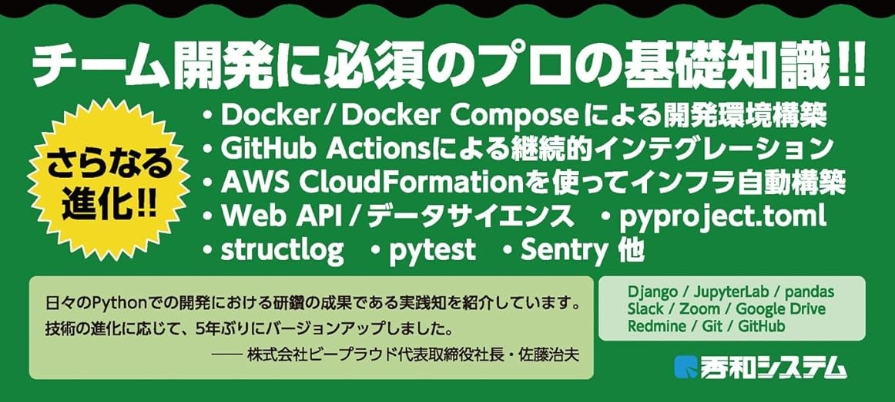

# **Python開発の変遷**

をPythonプロフェッショナルプログラミングの

**改訂の歴史** から知る

Takanori Suzuki

BPStudy #198 / 2024 Feb 28

## アジェンダ

* Pythonプロフェッショナルプログラミング(以下: PyPro)出版の歴史
* ◯◯の歴史と比較
* 

## お前誰よ 👤

* Takanori Suzuki / 鈴木 たかのり ({fab}`twitter` [@takanory](https://twitter.com/takanory))
* [BeProud](https://www.beproud.jp/) 取締役 / Python Climber
* [PyCon JP Association](https://www.pycon.jp/) 代表理事
* [Python Boot Camp](https://www.pycon.jp/support/bootcamp.html) 講師、[Python mini Hack-a-thon](https://pyhack.connpass.com/) 主催、[Pythonボルダリング部](https://kabepy.connpass.com/) 部長


### PyCon JP **Association** 🐍

日本国内のPythonユーザのために、**Pythonの普及及び開発支援**を行うために、継続的にカンファレンス(**PyCon**)を開くことを目的とした **非営利組織**

* [`www.pycon.jp`](https://www.pycon.jp)


### PyCon JP **2024**

* **9月** 後半に **東京** で開催予定
* 3名の **共同座長**(with 吉田さん、寺田さん)
* **主催メンバー** 募集中
* 詳細: [PyCon JP 2024座長決定のお知らせと主催者グループのメンバー募集](https://pyconjp.blogspot.com/2024/01/pyconjp2024-co-chair.html)

### **BeProud** Inc. 🏢

* [BeProud](https://www.beproud.jp/): Pythonシステム開発、コンサル
* [connpass](https://connpass.com/): IT勉強会支援プラットフォーム
* [PyQ](https://pyq.jp/): Python独学プラットフォーム
* [TRACERY](https://tracery.jp/): システム開発ドキュメントサービス


### Pythonプロフェッショナルプログラミング

* **ビープラウド** が執筆した書籍
* ビープラウドに新たに **加わったメンバー** が、開発プロジェクトに **円滑に参加** するためのガイド
  * **Python** で開発する **チーム** に役立つはず
  * **当時の開発スタイル** が見えてくる

## PyPro出版の **歴史** 📚

### PyPro出版の **歴史** 📚

* **初版**(PyPro): 2012年3月27日
* **第2版**(PyPro2): 2015年2月27日
* **第3版**(PyPro3): 2018年6月12日
* **第4版**(PyPro4): 2024年2月16日

### どれくらい **間があいた** のか

```python
>>> from datetime import date
>>> pypro = date(2012, 3, 27)
>>> pypro2 = date(2015, 2, 27)
>>> pypro3 = date(2018, 6, 12)
>>> pypro4 = date(2024, 2, 16)
>>> pypro2 - pypro
datetime.timedelta(days=1067)
>>> pypro3 - pypro2
datetime.timedelta(days=1201)
>>> pypro4 - pypro3
datetime.timedelta(days=2075)
```

### [PyPro](https://www.shuwasystem.co.jp/book/9784798032948.html) (黒)

* 発売日: 2012年3月27日
* 464ページ
* 本体: 2,800円+税


### [PyPro](https://www.shuwasystem.co.jp/book/9784798032948.html) 著者

* リーダー: 清水川貴之
* 岡野真也、池田洋介、畠弥峰、drillbits、cactusman、東健太、tell-k、今川館、ナツ、文殊堂、aita、冨田洋祐


### [2012年](https://ja.wikipedia.org/wiki/2012%E5%B9%B4)のできごと

* [Python 3.3](https://peps.python.org/pep-0398/)、[Python 2.7.3](https://peps.python.org/pep-0373/)
* [Django 1.4](https://docs.djangoproject.com/en/5.0/releases/1.4/)
* 渋谷ヒカリエ、東京スカイツリー開業
* ロンドンオリンピック開催
* Wii U発売

### [PyPro2](https://www.shuwasystem.co.jp/book/9784798043159.html) (黒+赤)

* 発売日: 2015年2月27日
* 472ページ
* 本体: 2,800円+税


### [PyPro2](https://www.shuwasystem.co.jp/book/9784798043159.html) 著者

* リーダー: 清水川貴之
* 岡野真也、drillbits、cactusman、東健太、tell-k、文殊堂、冨田洋祐、**aodag**、**鈴木たかのり**、**清原弘貴**


### [2015年](https://ja.wikipedia.org/wiki/2015%E5%B9%B4)のできごと

* [Python 3.5](https://peps.python.org/pep-0478/)、[Python 2.7.10](https://peps.python.org/pep-0373/)
* [Django 1.8](https://docs.djangoproject.com/en/5.0/releases/1.8/)
* Windows 10リリース
* マイナンバー法が施行
* 北陸新幹線が開業
* Apple Watch発売

### [PyPro3](https://www.shuwasystem.co.jp/book/9784798053820.html) (黒+青)

* 発売日: 2018年6月12日
* 488ページ
* 本体: 2,800円+税


### [PyPro3](https://www.shuwasystem.co.jp/book/9784798053820.html) 著者

* リーダー: 鈴木たかのり
* 清水川貴之、tell-k、清原弘貴、**James Van Dyne**、**的場達矢**、**吉田花春**、**新木雅也**、**altnight**、川村愛美、**石上晋**


### [2018年](https://ja.wikipedia.org/wiki/2018%E5%B9%B4)のできごと

* [Python 3.7](https://peps.python.org/pep-0537/)、[Python 2.7.15](https://peps.python.org/pep-0373/)
* [Django 2.1](https://docs.djangoproject.com/en/5.0/releases/2.1/)
* 平昌冬季オリンピック
* ロシアワールドカップ
* ZOZOSUITがリリース
* Google Home、Amazon Echo発売開始

### [PyPro4](https://www.shuwasystem.co.jp/book/9784798070544.html) (黒+緑)

* 発売日: 2024年2月16日
* 468ページ
* 本体: 3,000円+税


### [PyPro4](https://www.shuwasystem.co.jp/book/9784798070544.html) 著者

* リーダー: 石上晋
* **鈴木駿**、altnight、鈴木たかのり、**Yukie**、**荻野真志**、吉田花春、**降籏洋行**、川村愛美、的場達矢


### [2024年](https://ja.wikipedia.org/wiki/2024%E5%B9%B4)のできごと

* [Python 3.12.2](https://peps.python.org/pep-0693/)、[Python 3.13](https://peps.python.org/pep-0719/)(10月)
* [Django 5.0.2](https://docs.djangoproject.com/en/5.0/releases/5.0.2/)
* Python 3.7以前は[EOL](https://endoflife.date/python)、Django 3.2が[4月にEOL](https://endoflife.date/django)
* Apple Vision Pro発売開始(2月)
* 日本銀行券が刷新(7月)
* パリオリンピック開催(7月)

### PyPro出版の歴史のまとめ

* **12年** で **4回** 出版
* **メンバー** も **入れ替え** ながら
* 執筆 **リーダー** も **代わり** ながら


 

## 改訂の歴史を **遡る**

## PyPro3 ← PyPro4


### PyPro4の **帯** (風デザイン)



### Docker / Docker Composeの採用

* Python開発環境として[Docker](https://www.docker.com/)を採用
* PyPro3では[VirtualBox](https://www.virtualbox.org/) / [Vagrant](https://www.vagrantup.com/) 上のUbuntu
* **2015年頃** からDockerを使う案件が出始める
* **N年頃** からDockerが社内標準に

### Black / Ruff / mypy

* 開発に便利なツールの最新化
* [Black](https://black.readthedocs.io/): コード整形ツール。2018年リリース
* [Ruff](https://docs.astral.sh/ruff/): Pythonリンター。2022年リリース
* [mypy](https://www.mypy-lang.org/): 型ヒントの静的型チェッカー
* 以前はリンターの[Flake8](https://github.com/pycqa/flake8)のみ紹介

### WebアプリケーションからWeb APIへ

* DjangoでHTML生成ではなく、**APIのみ** 提供
* フロントは[Vue.js](https://vuejs.org/)
* [FastAPI](https://fastapi.tiangolo.com/)にも軽く触れている

### 開発ドキュメント

* 普遍的な開発ドキュメントの話に変更
* ビープラウドでは[TRACERY](https://tracery.jp/)を使用
  * [2022年リリース](https://prtimes.jp/main/html/rd/p/000000006.000025386.html)
* [Sphinx](https://www.sphinx-doc.org/)はあまり使われなくなった

### 単体テスト

* [pytest](https://docs.pytest.org/)と各種pytestプラグイン
* 以前はunittestとテストランナーにpytestの組み合わせ

### 継続的インテグレーション

* [GitHub Actions](https://github.co.jp/features/actions)での継続的インテグレーション
  * [2019年に正式リリース](https://github.blog/jp/2019-11-14-universe-day-one/)
* 以前は[CircleCI](https://circleci.com/ja/)を利用
