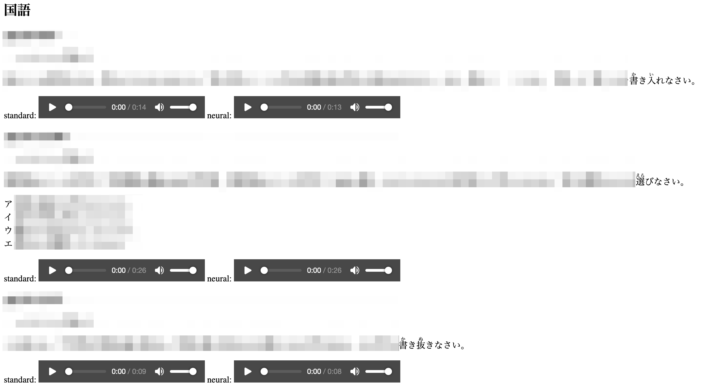

```{eval-rst}
:og:image: _images/20240307bpstyle.png
:og:image:alt: Amazon Pollyで問題文を読み上げ

.. |cover| image:: images/20240307bpstyle.png
```

# **Amazon Polly** で<br />問題文を読み上げ

Takanori Suzuki

BPStyle #158 / 2024 Mar 7

## 背景

* 某案件で学習教材の電子化をやっている
* **合理的配慮** の一環としてテキスト読み上げを実現したい
* 全盲の人向けではなく、**聴覚優位** の人向け

### 合理的配慮

> 合理的配慮とは、障害者から何らかの助けを求める意思の表明があった場合、過度な負担になり過ぎない範囲で、社会的障壁を取り除くために必要な便宜のことである。 

* [合理的配慮 - Wikipedia](https://ja.wikipedia.org/wiki/%E5%90%88%E7%90%86%E7%9A%84%E9%85%8D%E6%85%AE)

### 聴覚優位

> 子どもたちの情報の取り入れ方を下記の3タイプに分類し、“知覚の優位性”という考え方が世界に広がっていったことに始まります。
>
> 視覚優先型・聴覚優先型・運動感覚/触覚優先型

* [聴覚優位タイプとは？見るより聞くほうが理解しやすい子の勉強方法を専門家が解説](https://soctama.jp/column/67272)

### やりたいこと

* 問題文等を読み上げられるようにする
  * 聴覚優位の生徒が理解しやすくする
* 完全に読み上げられなくてもある程度しょうがない

### ちなみに全盲の場合

* OSのアクセシビリティ機能を使う
* PC上のスクリーンリーダーを使用する
* Web側はアクセシビリティに対応する
* 参考: [ウェブアクセシビリティ導入ガイドブック｜デジタル庁](https://www.digital.go.jp/resources/introduction-to-web-accessibility-guidebook/)
* →今回は対象外

## ゴール

* Amazon Pollyでの音声合成を知る
* Pythonでの実装方法を知る
* 読み上げのカスタマイズ方法を知る

## Amaozon Polly

### Amaozon Polly

* [Amazon Polly（深層学習を使用したテキスト読み上げサービス）| AWS](https://aws.amazon.com/jp/polly/)
* **数十の言語** で高品質で自然な人間の声を展開
* 12ヶ月間、 毎月 **500万文字が無料**
* クラウド型コールセンターのAmazon Connectでも使える

### Amazon Pollyのデモ

* [テキスト読み上げ機能 | Amazon Polly | ap-northeast-1](https://ap-northeast-1.console.aws.amazon.com/polly/home/SynthesizeSpeech)
* 多分ytakashimaさんは平成狸合戦ぽんぽこが好き（適当）([nibu.mp3](nibu.mp3))
* Maybe ytakashima-san likes Heisei Raccoon War Ponpoko (appropriate) ([nibu-en.mp3](nibu-en.mp3))

### PythonからAmazon Pollyを実行

```bash
(env) $ pip install boto3
(env) $ export AWS_ACCESS_KEY_ID=AKI...
(env) $ export AWS_SECRET_ACCESS_KEY=ZoWb...
(env) $ export AWS_DEFAULT_REGION=ap-northeast-1
```

* Boto3をインストール
* APIを使うための環境変数を設定

```{revealjs-break}
```

```{literalinclude} code/polly.py
```

* [Polly - Boto3 1.34.56 documentation](https://boto3.amazonaws.com/v1/documentation/api/latest/reference/services/polly.html)
* [AWSでAIサービスを使ってみる〜第3回polly編〜 #Python - Qiita](https://qiita.com/AInosukey/items/cb86c1012d40747b9dda)

```{revealjs-break}
```

* mp3ファイルができた！！ 🎉
* [masashinji.mp3](masashinji.mp3)

```{literalinclude} code/polly.py
:lines: 6-9
```

## Amazon Pollyカスタマイズ

### 言語の変更

* 言語と音声は`VoiceId`引数を変更する
* [Amazon Polly の音声 - Amazon Polly](https://docs.aws.amazon.com/ja_jp/polly/latest/dg/voicelist.html)
* 日本語: Mizuki, Takumi, Kazuha, Tomoko
* 英語: Ivy, Salli, Joey, Justin...など

```{literalinclude} code/polly2.py
:lines: 7-8
```

* [hajimo.mp3](hajimo.mp3)

### 読みの指定

* 🍣を「お寿司」と読ませたい
* `<phoneme>` タグでフリガナを指定
  * [発音記号を使用する](https://docs.aws.amazon.com/ja_jp/polly/latest/dg/supportedtags.html#phoneme-tag)
* `TextType="ssml"` 引数を追加

```{literalinclude} code/polly3.py
:lines: 6-9
```

* [hajimo-osushi.mp3](hajimo-osushi.mp3)

### SSMLタグ

* **音声合成マークアップ言語(SSML)** に対応
  * 速度変更（`<prosody>`）
  * 一時停止（`<break>`）
  * 強調（`<emphasis>`）など
* [SSML ドキュメントから音声を生成する - Amazon Polly](https://docs.aws.amazon.com/ja_jp/polly/latest/dg/ssml.html)
* [サポートされている SSML タグ - Amazon Polly](https://docs.aws.amazon.com/ja_jp/polly/latest/dg/supportedtags.html#phoneme-tag)

```{revealjs-break}
```

```{literalinclude} code/polly4.py
:lines: 6, 14-19
```

* [fumi23.mp3](fumi23.mp3)
* [fumi23-ssml.mp3](fumi23-ssml.mp3)

## **Lexicon** で読みをカスタマイズ

### Lexicon

* **発音レキシコン**: ファイルで発音をカスタマイズ
* `<phoneme>` は個別、レキシコンは共通ルール
* 複数ファイルを用意して使い分けも可能
* [レキシコンの管理 - Amazon Polly](https://docs.aws.amazon.com/ja_jp/polly/latest/dg/managing-lexicons.html)

```{revealjs-break}
```

* レキシコンの例

```{literalinclude} code/sushi-lexicon.xml
:caption: sushi-lexicon.xml
```

```{revealjs-break}
```

* Amazon Pollyの画面でLexionのデモ
* [テキスト読み上げ機能 | Amazon Polly](https://ap-northeast-1.console.aws.amazon.com/polly/home/SynthesizeSpeech)

```
ozkですし🍣...
```

### PythonからLexiconを使用

* 「yukieは実質天皇（）」にLexiconを適用する

```{literalinclude} code/tenno-lexicon.xml
:caption: tenno-lexicon.xml
```

```{revealjs-break}
```

```{literalinclude} code/polly5.py
:lines: 7-15, 20-24
```

* [yukie.mp3](yukie.mp3)
* [yukie-emperor.mp3](yukie-emperor.mp3)

## 問題文読み上げでやったこと

### Lexiconを作成

* ①、②：まるいち、まるに
* （）〔〕：括弧
* 〜：から
* →：やじるし
* ＋：プラス
* ・：、 (句点と同じ空白が入る)

### スペースを `<break>` タグに

* 選択式の文章「〜〜を選べ ① ほげ ② ふが」
* スペース部分を **一時停止タグ** に置換
  * `<break strength="x-strong"/>`

### フリガナを `<phoneme>` タグに

* 問題文はHTML形式
* フリガナは `<ruby>` タグを使用

```html
<ruby>天皇<rt>えんぺらー</rt></ruby>
↓
<phoneme type="ruby" ph="えんぺらー">天皇</phoneme>
```

### 英語と日本語を分割

* `Mizuki` 等日本語音声で英語を読ませると発音がやばい
* 「May the Force be with you.」

* [force-ja.mp3](force-ja.mp3)
* [force-en.mp3](force-en.mp3)

```{revealjs-break}
```

* 英語と日本語に **分割*8 し音声読み上げ
* 1つのmp3にまとめる
* →いい感じの音声になりそう

```{revealjs-break}
```

* 指定した言語で読み上げる関数

```{literalinclude} code/polly6.py
:lines: 6-14
```

```{revealjs-break}
```

* 正規表現で日英を分割して読み上げ
* [yoda.mp3](yoda.mp3)

```{literalinclude} code/polly6.py
:lines: 22-32
```

## その他Amazon Polly情報

### 2種類の音声

* 標準音声とニューラル音声がある
* ニューラル音声の方がよいいい感じ
* 対応している声が異なる
* ニューラル音声の方がお高い
* [Amazon Polly の音声 - Amazon Polly](https://docs.aws.amazon.com/ja_jp/polly/latest/dg/voicelist.html)

```{revealjs-break}
```

* ピックアップした問題文を2種類の音声で生成
* 聞き比べるHTMLを生成してブラウザで確認



### 同期処理の *文字数制限*

* `synthesize_speech()` での音声合成は文字数制限がある
* 長文は `start_speech_synthesis_task()` で非同期処理
  * [start_speech_synthesis_task](https://boto3.amazonaws.com/v1/documentation/api/latest/reference/services/polly/client/start_speech_synthesis_task.html)
* 結果はS3に保存される
* `get_speech_synthesis_task()` でタスクの状態が取れる

### 数式読み上げ

* 問題文ではmathjaxで数式を描画
* svgになっているため読み上げできない
* ライブラリを最新にあげると[MathML](https://developer.mozilla.org/ja/docs/Web/MathML/Authoring)も出力されるっぽい
  * 数式も読み上げられるようになるかも！？
  
## まとめ

* Amazon Pollyで音声合成は簡単にできる
* 多言語に対応
* 細かい調整も可能
* なにかに使えるかも？
* {fab}`github` [sample code](https://github.com/takanory/slides/tree/master/slides/20240307bpstyle/code)

## Thank You 🙏

{fas}`desktop` [slides.takanory.net](https://slides.takanory.net/)

{fab}`twitter` [@takanory](https://twitter.com/takanory)
{fab}`github` [takanory](https://github.com/takanory/)
{fab}`linkedin` [takanory](https://www.linkedin.com/in/takanory/)
{fab}`untappd` [takanory](https://untappd.com/user/takanory/)


