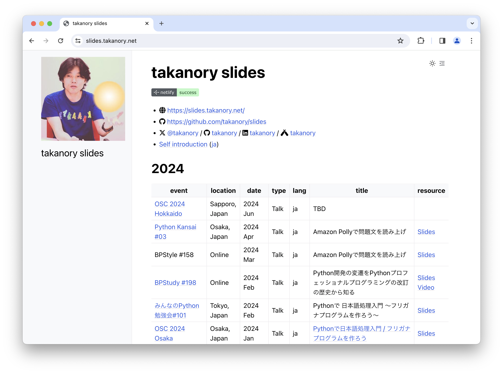
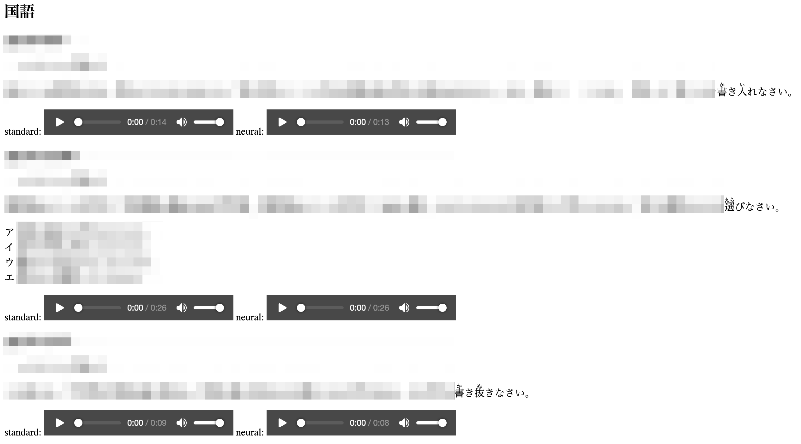

```{eval-rst}
:og:image: _images/20240417pythonkansai.png
:og:image:alt: Amazon Pollyで問題文を読み上げ

.. |cover| image:: images/20240417pythonkansai.png
```

# **Amazon Polly** で<br />問題文を読み上げ

Takanori Suzuki

Python Kansai #03 / 2024 Apr 17

## アジェンダ 📜

* 背景とゴール
* Amazon Pollyの基本
* 読み上げをカスタマイズ
* 問題文読み上げでやったこと

## 背景 🏞️

* 学習教材の **電子化** プロジェクト
* **合理的配慮** の一環としてのテキスト読み上げ
* 全盲の人向けではなく、**聴覚優位** の人向け

### 合理的配慮

> 合理的配慮とは、障害者から何らかの助けを求める意思の表明があった場合、過度な負担になり過ぎない範囲で、社会的障壁を取り除くために必要な便宜のことである。 

* [合理的配慮 - Wikipedia](https://ja.wikipedia.org/wiki/%E5%90%88%E7%90%86%E7%9A%84%E9%85%8D%E6%85%AE)

### 聴覚優位

> 子どもたちの情報の取り入れ方を下記の3タイプに分類し、“知覚の優位性”という考え方が世界に広がっていったことに始まります。
>
> 視覚優先型・聴覚優先型・運動感覚/触覚優先型

* [聴覚優位タイプとは？見るより聞くほうが理解しやすい子の勉強方法を専門家が解説](https://soctama.jp/column/67272)

### やりたいこと

* 問題文などを **読み上げ** られる
  * **聴覚優位** の生徒が理解しやすく
* 完全な読み上げじゃなくてもよい

### ちなみに全盲の場合

* OSのアクセシビリティ機能を使う
* PC上のスクリーンリーダーを使用する
* Web側はアクセシビリティに対応する
* 参考: [ウェブアクセシビリティ導入ガイドブック｜デジタル庁](https://www.digital.go.jp/resources/introduction-to-web-accessibility-guidebook/)
* →今回は対象外

## ゴール 🥅

* **Amazon Polly** での音声合成を知る
* Pythonでの **実装方法** を知る
* 読み上げの **カスタマイズ方法** を知る

## Photos 📷 Tweets 🐦 👍

`#pythonkansai` / `#mixleap`

`@takanory`

### Slides / スライド 💻

[slides.takanory.net](https://slides.takanory.net/)



## **Who** am I? / お前 **誰よ** 👤

* Takanori Suzuki / 鈴木 たかのり ({fab}`twitter` [@takanory](https://twitter.com/takanory))
* [BeProud](https://www.beproud.jp/) 取締役 / Python Climber
* [PyCon JP Association](https://www.pycon.jp/) 代表理事
* [Python Boot Camp](https://www.pycon.jp/support/bootcamp.html) 講師、[Python mini Hack-a-thon](https://pyhack.connpass.com/) 主催、[Pythonボルダリング部](https://kabepy.connpass.com/) 部長


### PyCon JP **Association** 🐍

日本国内のPythonユーザのために、**Pythonの普及及び開発支援**を行うために、継続的にカンファレンス(**PyCon**)を開くことを目的とした **非営利組織**

[`www.pycon.jp`](https://www.pycon.jp)


### PyCon JP **2024** 🇯🇵

* {fas}`globe` [`2024.pycon.jp`](https://2024.pycon.jp/)
* **9月27-29日** に **東京** で開催予定
* 3名の **共同座長**(with 吉田さん、寺田さん)
* **主催メンバー** 募集中
* 詳細: [PyCon JP 2024座長決定のお知らせと主催者グループのメンバー募集](https://pyconjp.blogspot.com/2024/01/pyconjp2024-co-chair.html)

### **BeProud** Inc. 🏢

* [BeProud](https://www.beproud.jp/): Pythonシステム開発、コンサル
* [connpass](https://connpass.com/): IT勉強会支援プラットフォーム
* [PyQ](https://pyq.jp/): Python独学プラットフォーム
* [TRACERY](https://tracery.jp/): システム開発ドキュメントサービス


### PyPro4 📕

* [Python Professional Programming 第4版](https://www.shuwasystem.co.jp/book/9784798070544.html)
* 2024年2月16日発売、468ページ、3,300円


## Amazon Pollyの基本 🗣️

### Amaozon Polly

* [Amazon Polly（深層学習を使用したテキスト読み上げサービス）| AWS](https://aws.amazon.com/jp/polly/)
* **数十の言語** で高品質で自然な人間の声を展開
* 12ヶ月間、 毎月 **500万文字が無料**
* クラウド型コールセンターのAmazon Connectでも使える

### Amazon Pollyの画面

* [テキスト読み上げ機能 | Amazon Polly](https://ap-northeast-1.console.aws.amazon.com/polly/home/SynthesizeSpeech)
* 画面でテキストを入力して読み上げできる

```{image} images/polly-screen.png
:alt: Amazon Pollyの画面
:width: 75%
```

```{revealjs-break}
```

* Amazon Pollyの画面からmp3をダウンロード
* 「私の戦闘力は530000です」([power-ja.mp3](audio/power-ja.mp3))
* 「My power level is 530,000」([power-en.mp3](audio/power-en.mp3))

### PythonからAmazon Pollyを実行

* [Boto3](https://boto3.amazonaws.com/v1/documentation/)をインストール
* APIを使うために環境変数を設定

```bash
$ python3.12 -m venv env
$ . env/bin/activate
(env) $ pip install boto3
(env) $ export AWS_ACCESS_KEY_ID=AKI...
(env) $ export AWS_SECRET_ACCESS_KEY=ZoWb...
(env) $ export AWS_DEFAULT_REGION=ap-northeast-1
```

```{revealjs-break}
```

```{literalinclude} code/polly.py
```

* [Polly - Boto3 1.34.56 documentation](https://boto3.amazonaws.com/v1/documentation/api/latest/reference/services/polly.html)
* [AWSでAIサービスを使ってみる polly編](https://qiita.com/AInosukey/items/cb86c1012d40747b9dda)

```{revealjs-break}
```

* mp3ファイルができた！！ 🎉
* [yamucha-kiero.mp3](audio/yamcha-kiero.mp3)

```{literalinclude} code/polly.py
:lines: 6-10
```

### Amazon Pollyの基本まとめ 🗣️

* **AWSの画面** から使える
* Pythonでは **Boto3** 経由で使える

## 読み上げをカスタマイズ 🔧

### 言語の変更

* `VoiceId`引数で **言語と音声** を指定
* 参考: [Amazon Polly の音声](https://docs.aws.amazon.com/ja_jp/polly/latest/dg/voicelist.html)
  * 日本語: Mizuki, Takumi, Kazuha, Tomoko
  * 英語: Ivy, Salli, Joey, Justinなど

```{literalinclude} code/polly2.py
:lines: 7-9
```

* [goku-cho.mp3](audio/goku-cho.mp3)

### 読みの指定

* 超サイヤ人の「超」を **スーパー** と読ませたい
* `<phoneme>` タグでフリガナを指定
  * 参考: [発音記号を使用する](https://docs.aws.amazon.com/ja_jp/polly/latest/dg/supportedtags.html#phoneme-tag)
* 全体を `<speak>` タグで囲む

```{literalinclude} code/polly3.py
:lines: 7-8
```

```{revealjs-break}
```

* `TextType="ssml"` 引数を追加

```{literalinclude} code/polly3.py
:lines: 9-11
```

* [goku-super.mp3](audio/goku-super.mp3)

### SSMLタグ

* **音声合成マークアップ言語(SSML)** に対応
  * 段落を区切る（`<p>`）
  * 強調する（`<emphasis>`）
  * 呼吸音（`<amazon:breakth>`）など
* 参考:
  * [SSML ドキュメントから音声を生成する](https://docs.aws.amazon.com/ja_jp/polly/latest/dg/ssml.html)
  * [サポートされている SSML タグ](https://docs.aws.amazon.com/ja_jp/polly/latest/dg/supportedtags.html#phoneme-tag)

```{revealjs-break}
```

```{literalinclude} code/polly4.py
:lines: 6-11
```

* [goku-anger1.mp3](audio/goku-anger1.mp3)
* [goku-anger1.mp3](audio/goku-anger2.mp3)

### 読み上げをカスタマイズまとめ 🔧

* **言語** と **音声** を変更できる
* **読み** を指定できる
* **SSMLタグ** でカスタマイズできる

## **Lexicon** で読みをカスタマイズ 🛠️

### **Lexicon** とは

* **発音レキシコン**: 発音の定義ファイル
* `<phoneme>` は **個別**、レキシコンは **共通**
* 複数ファイルを用意して使い分けも可能
* 参考: [レキシコンの管理](https://docs.aws.amazon.com/ja_jp/polly/latest/dg/managing-lexicons.html)

### Lexiconを使用する(画面)

* Lexiconファイルを作成

```{literalinclude} code/db-lexicon.xml
:caption: db-lexicon.xml
```

```{revealjs-break}
```

* 名前を付けてXMLファイルをアップロード

```{image} images/lexicon-upload.png
:alt: Lexiconをアップロード
:width: 75%
```

```{revealjs-break}
```

* レキシコンを指定する

```{image} images/polly-with-lexicon.png
:alt: Lexiconを使用
:width: 65%
```

```{revealjs-break}
```

* 結果の音声ファイル
* [Lexiconあり](audio/legend-with-lexicon.mp3)（すーぱーさいやじん）
* [Lexiconなし](audio/legend-no-lexicon.mp3)（ちょうさいやじん）

### PythonからLexiconを使用

```{literalinclude} code/polly5.py
:lines: 7-15, 20-24
```

* [Lexiconあり](audio/makanko-with-lexicon.mp3)（まかんこうさっぽう）
* [Lexiconなし](audio/makanko-no-lexicon.mp3)（まかんこうさつほう）

### Lexiconで読みをカスタマイズまとめ 🛠️

* **Lexiconファイル** をXMLで作成
* Lexiconファイルを **登録**
* 任意のLexiconを **適用**

## 問題文読み上げでやったこと 📖

### **Lexicon** を作成

* ①、②：まるいち、まるに
* （）〔〕：括弧
* 〜：から
* →：やじるし
* ＋：プラス
* ・：、 (句点と同じ空白が入る)

### スペースを `<break>` タグに

* スペース部分を **一時停止タグ** に置換
* 選択肢のラベルを区切って読む

```
〜〜を選べ ① ほげ ② ふが
```

↓

```
〜〜を選べ<break strength="x-strong"/>①<break strength="x-strong"/>ほげ<break strength="x-strong"/>②<break strength="x-strong"/>ふが
```

### フリガナを `<phoneme>` タグに

* 問題文はHTML形式
* フリガナはHTMLの `<ruby>` タグ

```html
<ruby>魔貫光殺砲<rt>まかんこうさっぽう</rt></ruby>
```

↓

```html
<phoneme type="ruby" ph="まかんこうさっぽう">魔貫光殺砲</phoneme>
```

### 日本語の英語の混ざった文章

* 日本語音声で英語を読ませると発音が**やばい**
* 例：Hang in there Kakarot, you are number one!

* [日本語(Takumi)](audio/vegeta-ja.mp3)
* [英語(Matthew)](audio/vegeta-en.mp3)

```{revealjs-break}
```

* 英語の問題文は日本語と英語が **混ざっている**
* 日本語と英語に **分割** し音声読み上げ
* 1つのmp3にまとめる

```{revealjs-break}
```

* 日本語と英語の混ざった文の例
* vegeta-english.txt

```{literalinclude} code/vegeta-english.txt
```

```{revealjs-break}
```

* （）、①を読ませるために **Lexicon** を登録

```{literalinclude} code/db-lexicon.xml
:lines: 14-22
```

```{literalinclude} code/polly6.py
:lines: 20-23
```

```{revealjs-break}
```

* 指定した言語で読み上げる **関数**

```{literalinclude} code/polly6.py
:lines: 6-15
```

```{revealjs-break}
```

* 正規表現で **日英を分割** して読み上げ

```{literalinclude} code/polly6.py
:lines: 25-37
```

```{revealjs-break}
```

* 日本語と英語の混ざった音声ができた！！ 🎉
* [vegeta-question.mp3](audio/vegeta-question.mp3)

```{literalinclude} code/vegeta-english.txt
```

### 問題文読み上げでやったことまとめ 📖

* Lexiconを作成
* スペースを `<break>` タグに
* フリガナを `<phoneme>` タグに
* 日英の混ざった文章対応

## Amazon Pollyの補足情報 🔍

### 2種類の音声

* **標準音声** と **ニューラル音声** がある
* ニューラル音声の方がよりいい感じ
* 対応している声が異なる
* ニューラル音声の方がお高い
* 参考: [Amazon Polly の音声](https://docs.aws.amazon.com/ja_jp/polly/latest/dg/voicelist.html)

```{revealjs-break}
```

* 複数の問題文を **2種類の音声** で生成
* **聞き比べ用HTML** を作成しブラウザで確認



### 同期処理の **文字数制限**

* `synthesize_speech()` は **文字数制限** あり
* `start_speech_synthesis_task()` で長文を **非同期** 処理
  * [start_speech_synthesis_task](https://boto3.amazonaws.com/v1/documentation/api/latest/reference/services/polly/client/start_speech_synthesis_task.html)
  * 結果はS3に保存
* `get_speech_synthesis_task()` で **状態** を取得

### 数式読み上げ

* 問題文では **mathjaxで数式** を描画
* svgになっているため読み上げできない
* mathjaxが出力する[MathML](https://developer.mozilla.org/ja/docs/Web/MathML/Authoring)を読み上げるといけるかも？→現在調査中

## まとめ 📚

* Amazon Pollyで音声合成は **簡単** にできる
* **多言語** に対応
* **SSML**、**Lexicon** で細かい調整が可能
* ぜひ試してみてください
* サンプルコード：{fab}`github` [code](https://github.com/takanory/slides/tree/master/slides/20240417pythonkansai/code)

## Thank You 🙏

{fas}`desktop` [slides.takanory.net](https://slides.takanory.net/)

{fab}`twitter` [@takanory](https://twitter.com/takanory)
{fab}`github` [takanory](https://github.com/takanory/)
{fab}`linkedin` [takanory](https://www.linkedin.com/in/takanory/)
{fab}`untappd` [takanory](https://untappd.com/user/takanory/)


