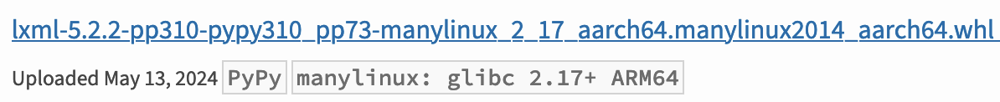

```{eval-rst}
:og:image: _images/cover.png
:og:image:alt: arm64 linux wheel作って、dockerでarm64 linuxで動かして少しテストが速くなったよ

.. |cover| image:: images/cover.png
```

# **arm64 linux wheel**作ってM1 Macのdockerでテストが少し速くなった

Takanori Suzuki

BPStyle #163 / 2024 Aug 1

## 目的 💨

* M1 MacのDockerでamd64 linuxでUTが遅い？
* arm64 linuxならパフォーマンスが上がる？
* wheelがないとpip installで失敗する
* arm64 linux用wheelを作成して使いたい

### arm64 linux wheelがないパッケージ 📦

* [SudachiPy](https://pypi.org/project/SudachiPy/)→buildにrustが必要
* [cwcwidth](https://pypi.org/project/cwcwidth/)
* `manylinuxN_aarch64` のwheelがないもの
* 例）[lxml](https://pypi.org/project/lxml/#files)はwheelが提供されている



## arm64 linux用wheelを作る 👷

* [PyPA(Python Packaging Authority)](https://www.pypa.io/en/latest/index.html)がmanylinux用のイメージを作って配布
* arm64 linuxもある
* [pypa/manylinux: Python wheels that work on any linux (almost)](https://github.com/pypa/manylinux)

### arm64 linuxのmanylinux2014環境 🦾

* Dockerで `manylinux2014_aarch64` 環境を作成

```bash
$ docker pull quay.io/pypa/manylinux2014_aarch64
$ docker run --rm -ti -v `pwd`/docker:/docker -w /docker \
  quay.io/pypa/manylinux2014_aarch64 bash
```

### Rustをインストール {fab}`rust`

* Rustをインストールして有効化
* [Install Rust - Rust Programming Language](https://www.rust-lang.org/tools/install)

```bash
# curl --proto '=https' --tlsv1.2 -sSf https://sh.rustup.rs | sh
# source "$HOME/.cargo/env"
```

### wheelをbuild 🛞

* ソースのURLをPyPIで確認する
  * <https://pypi.org/project/SudachiPy/#files>
  * <https://pypi.org/project/cwcwidth/#files>

```bash
# /opt/python/cp310-cp310/bin/pip wheel \
  --build-option="-pmanylinux2014_aarch64" \
  https://files.pythonhosted.org/packages/49/91/fb79084df253ffce217fe10dcad6729e5263f41813b9ab7e4375e01528bd/SudachiPy-0.6.8.tar.gz
# /opt/python/cp310-cp310/bin/pip wheel --build-option="-pmanylinux2014_aarch64" https://files.pythonhosted.org/packages/95/e3/275e359662052888bbb262b947d3f157aaf685aaeef4efc8393e4f36d8aa/cwcwidth-0.1.9.tar.gz
# ls /docker
cwcwidth-0.1.9-cp310-cp310-linux_aarch64.whl
SudachiPy-0.6.8-cp310-cp310-linux_aarch64.whl
# exit
```

### wheelをプロジェクト側にコピー {fas}`copy`

* 作成したwheelファイルを、プロジェクトのwheel管理用ディレクトリに配置する

```bash
$ cp docker/*.whl ~/Projects/hoge-prj/djangoapp/wheel/
```

## buildしたwheelを使う 🚢

* Dockerで自分でbuildしたarm64 linux用wheelを使用するように設定する

### wheelファイルのコピー {fas}`copy`

* Dockerfileにwheelファイルのコピー処理を追加

```text
ARG APPDIR="/var/www/hoge-proj"
ARG WHEELDIR="${APPDIR}/djangoapp/wheel"

# arm64 linux用のwheelファイルをコピー
COPY djangoapp/wheel/*.whl ${WHEELDIR}/
```

### `--find-links` オプションを追加 👀

* 任意のディレクトリにあるwheelを使うように、requirements.txtに `--find-links` オプションを追加
* [pipの--find-linksオプション](https://pip.pypa.io/en/stable/cli/pip_install/#cmdoption-f)

```text
--find-links /var/www/hoge-prj/djangoapp/wheel

argon2-cffi
antlr4-python3-runtime==4.10
(以下略)
```

## Docker環境を再構築 🛳️

* amd64-linuxの指定を外すのをお忘れ無く

```
$ docker compose build --no-cache
$ docker compose run --rm djangoapp tox
```

### M1 Macでこれくらい速くなった 💻

* 299秒→217秒（1.37倍）

```
# amd64 linux
lintcheck: OK (0.66=setup[0.06]+cmd[0.34,0.26] seconds)
mypy: OK (0.86=setup[0.02]+cmd[0.84] seconds)
py310: OK (297.14=setup[0.03]+cmd[297.10] seconds)
congratulations :) (299.11 seconds)
```

```
# arm64 linux
lintcheck: OK (0.21=setup[0.04]+cmd[0.11,0.07] seconds)
mypy: OK (0.48=setup[0.01]+cmd[0.47] seconds)
py310: OK (216.15=setup[0.03]+cmd[216.12] seconds)
congratulations :) (217.01 seconds)
```

### Windows等他の環境はそのまま {fab}`windows`

* WindowsやGitHub Actionsでは従来通りamd64 linuxで実行
* 本番環境等もamd64 linuxのまま

## Let's build arm64 linux wheel! 🏗️

## おまけ: **pytest-xdist** 🏃‍➡️🏃‍➡️🏃‍➡️

* [pytest-xdist](https://pytest-xdist.readthedocs.io/en/stable/): マルチCPUでテストを分散実行
* マルチコアなので速くなるはず

```bash
$ pip install pytest-xdist[psutil]
```

### テストを実行 💻

```bash
$ pytest -n auto --dist loadfile
...
8 workers  # ワーカー数が出力される
```

* [Running tests across multiple CPUs — pytest-xdist documentation](https://pytest-xdist.readthedocs.io/en/stable/distribution.html)
  * `-n auto`: CPUコア数と同じ数実行
  * `--dist loadfile`: ファイルごとに同じワーカーで実行

### 実行時間を確認 ⏱️

* Apple M1(8コア)

```
# xdistなし
py310: OK (164.82=setup[0.05]+cmd[164.77,0.00] seconds)
# xdistあり
py310: OK (115.08=setup[0.02]+cmd[115.06] seconds)
```

* Apple M2 Max(12コア)

```
py310: OK (90.37=setup[0.03]+cmd[90.33] seconds)
```

### GitHub Actions {fab}`github`

* 1コアなので速くなりません！

```bash
py310: commands[0]> pytest -n auto --dist loadfile --cov-append --cov-report=term-missing:skip-covered --cov=apps -vv
============================= test session starts ==============================
...
created: 1/1 worker
1 worker [2002 items]
```
