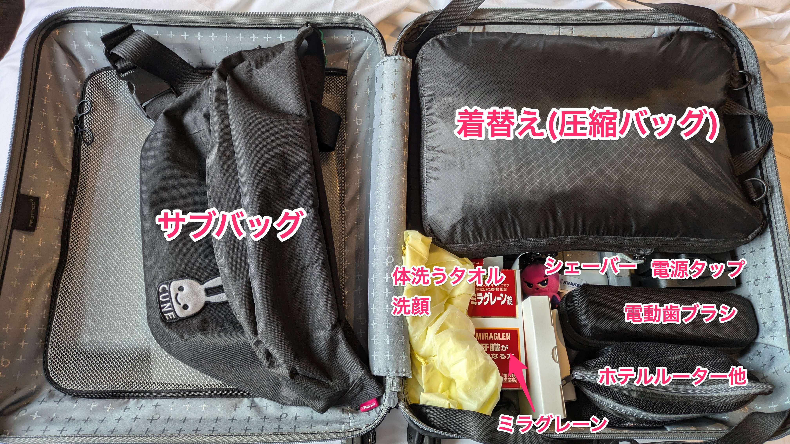

```{eval-rst}
:og:image: _images/20241003bpstyle.png
:og:image:alt: Travel Tips

.. |cover| image:: images/20241003bpstyle.png
```

# **Travel** Tips

Takanori Suzuki

BPStyle 165 / 2024 Oct 3

## Motivation

* 海外PyConとか地域Pythonイベントで、なんやかんや旅行が多い
* 誰かの役に立つかもなのでTipsとしてまとめる

## Travel Logs 🪵

### Travel Logs(1/2)

* [pyhack雪山合宿](https://pyhack.connpass.com/event/302366/) (長野) 1月19日(金)
* [OSC大阪](https://event.ospn.jp/osc2024-osaka/) 1月27日(土)
* [PyCon JP 2024合宿](https://pyconjp-staff.connpass.com/event/312521/) (湯河原) 4月12日(金)
* [Python Kansai](https://kansai-python.connpass.com/event/313464/) (大阪) 4月17日(水)
* [ファミリーコンサート](https://twpo.org/%e3%83%95%e3%82%a1%e3%83%9f%e3%83%aa%e3%83%bc%e3%82%b3%e3%83%b3%e3%82%b5%e3%83%bc%e3%83%88%ef%bc%92%ef%bc%90%ef%bc%92%ef%bc%94/) (八王子) 4月28日(日)
* [PyCon US](https://us.pycon.org/2024/)(ピッツバーグ) 5月17日(金)
* [PyCamp名古屋](https://pyconjp.connpass.com/event/318286/) 6月22日(土)
* [OSC北海道](https://event.ospn.jp/osc2024-do/) (札幌) 6月29日(土)

### Travel Logs(2/2)

* [pyhack夏山合宿](https://pyhack.connpass.com/event/317884/)(長野) 7月12日(金)
* [PyCon TW](https://tw.pycon.org/2024/en-us) (高雄) 9月21日(土)
* [PyCon JP](https://2024.pycon.jp/) (東京) 9月27日(金)
* [PyCon APAC](https://2024-apac.pycon.id/) (インドネシア 10月25日(金)
* [第30回定期演奏会](https://twpo.org/%E7%AC%AC%EF%BC%93%EF%BC%90%E5%9B%9E%E5%AE%9A%E6%9C%9F%E6%BC%94%E5%A5%8F%E4%BC%9A/) (南大沢) 11月3日(日)
* [KOF2024](https://www.k-of.jp/2024/) (大阪) 11月8日(金)
* [PyCon mini 東海](https://tokai.pycon.jp/2024/) (名古屋) 11月16日(土)

### Travel Logs(内訳)

* 8 国内Pythonイベント
* 3 海外PyCon
* 2 pyhack合宿
* 2 吹奏楽演奏会
* 0 ただの旅行、帰省

## 事前準備 🎫

### 事前準備

* 移動チケット確保
* ホテル確保
* PyConチケット確保
* 旅費支援申し込み
* etc.

### スプレッドシートで状況を管理

```{image} images/worldpycon.png
:width: 48%
```

```{image} images/pycontw.png
:width: 48%
```

### eチケット等のファイルをDropbox管理

```{image} images/dropbox.png
```

## スーツケース 🧳

### スーツケース

* 機内持ち込み可能: 3辺合計 **115cm**
* ハードケース: 缶ビールが割れたトラウマ
* フロントオープン(PC等)
* できるだけ大容量
* ストッパーあり

### プロテカ [マックスパス3](https://store.ace.jp/shop/g/g02961-03/) (42L)

```{image} images/maxpass3.jpg
:alt: プロテカ マックスパス3
:width: 60%
```

### Suitcaseの中身


```{revealjs-break}
```



### ["超"圧縮バッグ「PackBag+」](https://holicc.jp/products/packbagplus-single)

* ファスナーで圧縮
* 2部屋あるので汚れた服を分けられる

```{image} https://cdn.shopify.com/s/files/1/0474/9662/6339/files/pbplus_feature_separate.png
:alt: PackBag+
:width: 60%
```

### CIO [Polaris CUBE Built in CABLE](https://connectinternationalone.co.jp/cioproduct/adapter/powerstrip/cio-pcbc67w2c1a/)

* 海外対応、USB-Cx2、USB-Ax1、コンセントx2
* 完璧では？

```{image} https://connectinternationalone.co.jp/wp/wp-content/uploads/2024/04/CIO-PCBC67W2C1A-BK.jpg
:alt: Polaris CUBE Built in CABLE
:width: 50%
```

### BUFFERO [WMR-433W2](https://www.buffalo.jp/product/detail/wmr-433w2-bk.html)

* ホテルルーターというカテゴリー
* ホテルの無線LAN設定をしなくていい
  * ただ有線LANがないホテルも多い...

```{image} https://www.buffalo.jp/webpim/product/image/W/WMR-433W2/WMR-433W2-BK/WMR-433W2-BK__0100.jpg
:alt: BUFFERO WMR-433W2
:width: 50%

```

## サブバッグ 🎒

### サブバッグ

* サイドポケット
* PCポケット
* 容量はそんなにいらない
* 使わないときに折りたためる
* でもペラペラなのはちょっと...

### Air [Go Pack 2 Black](https://aerjapan.jp/products/detail/152)

```{image} images/gopack.jpg
:alt: Go Pack 2 Black
:width: 50%
```

### スターツ [AS01 BK](https://www.yodobashi.com/product/100000001005732240/)

* マグネット式のチェストベルト

```{image} https://image.yodobashi.com/product/100/000/001/005/732/240/100000001005732240_10204_003.jpg
:alt: スターツ AS01 BK
:width: 50%
```

### ユニバーサル電源プラグ

* Amazonで「[ユニバーサル 電源プラグ](https://www.amazon.co.jp/s?k=%E3%83%A6%E3%83%8B%E3%83%90%E3%83%BC%E3%82%B5%E3%83%AB+%E9%9B%BB%E6%BA%90%E3%83%97%E3%83%A9%E3%82%B0&crid=3JOG7ZKMLJHOU&sprefix=%E3%83%A6%E3%83%8B%E3%83%90%E3%83%BC%E3%82%B5%E3%83%AB+%E9%9B%BB%E6%BA%90%2Caps%2C235&ref=nb_sb_ss_ts-doa-p_3_9)」で検索
* 無印[トラベル用変換プラグアダプター](https://www.muji.com/jp/ja/store/cmdty/detail/%E3%83%88%E3%83%A9%E3%83%99%E3%83%AB%E7%94%A8%E5%A4%89%E6%8F%9B%E3%83%97%E3%83%A9%E3%82%B0%E3%82%A2%E3%83%80%E3%83%97%E3%82%BF%E3%83%BC/4548718365739)よさげ

```{image} images/universal.jpg
:alt: ユニバーサル電源プラグ
:width: 50%
```

### ELECOM [LBT-ATR01BK](https://www.elecom.co.jp/products/LBT-ATR01BK.html)

* Bluetoothトランスミッター
* 自分のヘッドホンで機内エンタメを楽しむ

```{image} https://www.elecom.co.jp/photo/p01/LBT-ATR01BK_01.jpg
:alt: ELECOM LBT-ATR01BK
:width: 50%
```

### ノイズキャンセリングヘッドホン

* SONY [WF-1000XM4](https://www.sony.jp/headphone/products/WF-1000XM4/)
* BOSE [Noise Cancelling Headphones 700](https://www.bose.co.jp/ja_jp/products/headphones/noise_cancelling_headphones/noise-cancelling-headphones-700.html#v=noise_cancelling_headphones_700_black)


```{image} images/headphones.jpg
:alt: ノイズキャンセリングヘッドホン
:width: 60%
```
### その他

* 水筒: 機内に水を持ち込む
* 傘: モンベル [トラベルサンブロックアンブレラ](https://webshop.montbell.jp/goods/disp.php?product_id=1128658)
* 薄手のパーカー
* アイマスク: テンピュール [スリープマスク](https://jp.tempur.com/tsh/travel/sleep-mask-TJP180015.html)
* スリッパ、まくら、マスク

## 荷造り 📦

### 荷造り

* アレ入れたっけ？
* 朝起きてから入れるのどれだっけ？

### 絶対忘れない

* 現金
* クレジットカード
* スマートフォン
* (パスポート)

### 海外でのデータ通信

* eSIM対応端末が便利
* [ahamo](https://ahamo.com/): [だいたいの海外](https://ahamo.com/services/roaming-data/index.html)で20GB→30GB使える

```{image} https://cache.cil.ahamo.com/assets/images/pages/services/roaming-data/map.png
:alt: ahamo提供エリア
:width: 55%
```

### 旅行準備チェックシート

```{image} images/checksheet.png
:alt: 旅行準備チェックシート
:width: 40%
```

## Enjoy your Travel!! ✈️
