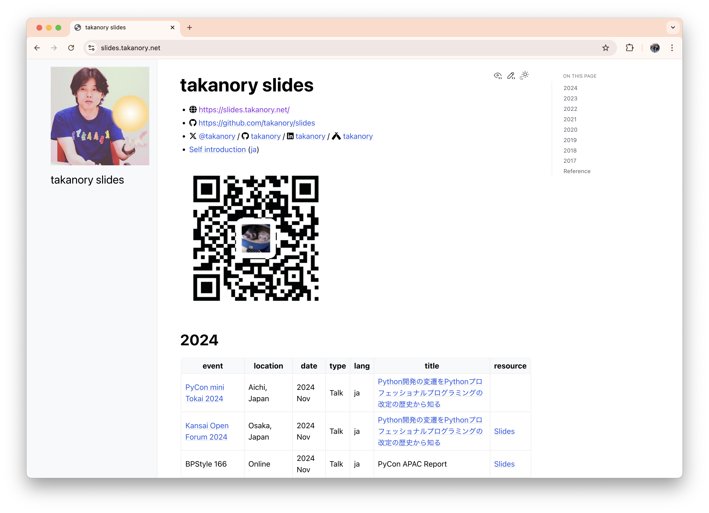

```{eval-rst}
:og:image: _images/20241116tokai.png
:og:image:alt: Python開発の変遷をPythonプロフェッショナルプログラミングの改訂の歴史から知る

.. |cover| image:: images/20241116tokai.png
```

# **Python開発の変遷**

をPythonプロフェッショナルプログラミングの

**改訂の歴史**から知る

Takanori Suzuki


PyCon mini Tokai / 2024 Nov 16

## Agenda / アジェンダ 📜

* Pythonプロフェッショナルプログラミング(以下: PyPro)**出版の歴史**を紹介
* 章ごと**改訂**の歴史を見る

### Goal / ゴール 🥅

* Python**チーム開発の変遷**を知る
* 自身の**プロジェクトの参考**になる
  * なにか導入してみたくなる
* （PyPro4を**買いたく**なる🤑）

## Photos 📷 Tweets 🐦 👍

`#pycontokai` / `@takanory`

### {fas}`globe` [`slides.takanory.net`](https://slides.takanory.net/)



## **Who** am I? / お前**誰よ** 👤

* Takanori Suzuki / 鈴木 たかのり ({fab}`twitter` [@takanory](https://twitter.com/takanory))
* [PyCon JP Association](https://www.pycon.jp/) 代表理事
* [BeProud](https://www.beproud.jp/) 取締役 / Python Climber
* [Python Boot Camp](https://www.pycon.jp/support/bootcamp.html) 講師、[Python mini Hack-a-thon](https://pyhack.connpass.com/) 主催、[Pythonボルダリング部](https://kabepy.connpass.com/) 部長


### PyCon JP **Association** 🐍

日本国内のPythonユーザのために、**Pythonの普及及び開発支援**を行うために、継続的にカンファレンス(**PyCon**)を開くことを目的とした**非営利組織**

[`www.pycon.jp`](https://www.pycon.jp)


### PyCon JP Associationの**主な活動**

* PyCon JP: 年1の大規模カンファレンス
* [Python Boot Camp](https://www.pycon.jp/support/bootcamp.html): 初心者向けチュートリアル
* [Pythonコミュニティのサポート](https://www.pycon.jp/support/community.html)
* [PyCon JP TV](https://tv.pycon.jp/): YouTubeライブ

### PyCon JP **2025**

* {fas}`globe` [`2025.pycon.jp`](https://2024.pycon.jp/)
* **2025年9月26、27日**に**広島**で開催予定
  * **旅費の支援**もあるよ
* 座長は西本卓也さん
* 参考: [PyCon JP 2025は来年9月に広島での開催が決定！座長は西本卓也さん！](https://pyconjp.blogspot.com/2024/10/pyconjp2025-co-chair.html)
### **BeProud** Inc. 🏢

* [BeProud](https://www.beproud.jp/): Pythonシステム開発、コンサル
* [connpass](https://connpass.com/): IT勉強会支援プラットフォーム
* [PyQ](https://pyq.jp/): Python独学プラットフォーム
* [TRACERY](https://tracery.jp/): システム開発ドキュメントサービス


### Pythonプロフェッショナル<br />プログラミング

* **ビープラウド**が執筆した書籍
* ビープラウドに新たに**加わったメンバー**が、プロジェクトに**円滑に参加**するためのガイド
  * **Python**で開発する**チーム**に役立つはず
  * **当時の開発スタイル**が見えてくる

## PyPro出版の**歴史** 📚

### PyPro出版の**歴史** 📚

* **初版**(PyPro): 2012年3月27日
* **第2版**(PyPro2): 2015年2月27日
* **第3版**(PyPro3): 2018年6月12日
* **第4版**(PyPro4): 2024年2月16日

### どれくらい**間があいた**のか

```python
>>> from datetime import date
>>> pypro = date(2012, 3, 27)
>>> pypro2 = date(2015, 2, 27)
>>> pypro3 = date(2018, 6, 12)
>>> pypro4 = date(2024, 2, 16)
>>> (pypro2 - pypro).days / 365
2.9232876712328766
>>> (pypro3 - pypro2).days / 365
3.2904109589041095
>>> (pypro4 - pypro3).days / 365
5.684931506849315
```

### [PyPro](https://www.shuwasystem.co.jp/book/9784798032948.html)（黒）

* 発売日: 2012年3月27日
* 464ページ
* 本体: 2,800円+税


### [PyPro](https://www.shuwasystem.co.jp/book/9784798032948.html)著者

* リーダー: 清水川貴之
* 岡野真也、池田洋介、畠弥峰、drillbits、cactusman、東健太、tell-k、今川館、ナツ、文殊堂、aita、冨田洋祐


### [2012年](https://ja.wikipedia.org/wiki/2012%E5%B9%B4)のできごと

* [Python 3.3](https://peps.python.org/pep-0398/)、[Python 2.7.3](https://peps.python.org/pep-0373/)
* [Django 1.4](https://docs.djangoproject.com/en/5.0/releases/1.4/)
* 渋谷ヒカリエ、東京スカイツリー開業
* ロンドンオリンピック開催
* Wii U発売

### [PyPro2](https://www.shuwasystem.co.jp/book/9784798043159.html)（黒+赤）

* 発売日: 2015年2月27日
* 472ページ
* 本体: 2,800円+税


### [PyPro2](https://www.shuwasystem.co.jp/book/9784798043159.html)著者

* リーダー: 清水川貴之
* 岡野真也、drillbits、cactusman、東健太、tell-k、文殊堂、冨田洋祐、**aodag**、**鈴木たかのり**、**清原弘貴**


### [2015年](https://ja.wikipedia.org/wiki/2015%E5%B9%B4)のできごと

* [Python 3.5](https://peps.python.org/pep-0478/)、[Python 2.7.10](https://peps.python.org/pep-0373/)
* [Django 1.8](https://docs.djangoproject.com/en/5.0/releases/1.8/)
* Windows 10リリース
* マイナンバー法が施行
* 北陸新幹線が開業
* Apple Watch発売

### [PyPro3](https://www.shuwasystem.co.jp/book/9784798053820.html)（黒+青）

* 発売日: 2018年6月12日
* 488ページ
* 本体: 2,800円+税


### [PyPro3](https://www.shuwasystem.co.jp/book/9784798053820.html)著者

* リーダー: 鈴木たかのり
* 清水川貴之、tell-k、清原弘貴、**James Van Dyne**、**的場達矢**、**吉田花春**、**新木雅也**、**altnight**、川村愛美、**石上晋**


### [2018年](https://ja.wikipedia.org/wiki/2018%E5%B9%B4)のできごと

* [Python 3.7](https://peps.python.org/pep-0537/)、[Python 2.7.15](https://peps.python.org/pep-0373/)
* [Django 2.1](https://docs.djangoproject.com/en/5.0/releases/2.1/)
* 平昌冬季オリンピック
* ロシアワールドカップ
* ZOZOSUITがリリース
* Google Home、Amazon Echo発売開始

### [PyPro4](https://www.shuwasystem.co.jp/book/9784798070544.html)（黒+緑）

* 発売日: 2024年2月16日
* 468ページ
* 本体: 3,000円+税


### [PyPro4](https://www.shuwasystem.co.jp/book/9784798070544.html)著者

* リーダー: 石上晋
* **鈴木駿**、altnight、鈴木たかのり、**Yukie**、**荻野真志**、吉田花春、**降籏洋行**、川村愛美、的場達矢


### [2024年](https://ja.wikipedia.org/wiki/2024%E5%B9%B4)のできごと

* [Python 3.12.4](https://peps.python.org/pep-0693/)、[Python 3.13](https://peps.python.org/pep-0719/)（10月）
* [Django 5.0.6](https://docs.djangoproject.com/en/5.0/releases/5.0.6/)
* Python 3.7以前は[EOL](https://endoflife.date/python)、Django 3.2が[4月にEOL](https://endoflife.date/django)
* Apple Vision Pro発売（アメリカ2月、日本6月）
* 日本銀行券が刷新（7月）
* パリオリンピック開催（7月）

### PyPro出版の歴史のまとめ

* **12年間**で**4回**出版
* **メンバー**を**入れ替え**ながら
* 執筆**リーダー**も**代わり**ながら


 

## 章ごと**改訂**の歴史を見る 🆙

## 1. Pythonのセットアップ 🐍

### PyPro3 → PyPro4

* Python: Python 3.11
* 開発環境: [Docker](https://www.docker.com/) / Docker Composeを採用
* 便利なツール
  * [Black](https://black.readthedocs.io/): コード整形（2018年）
  * [Ruff](https://docs.astral.sh/ruff/): Pythonリンター（2022年）
  * [mypy](https://www.mypy-lang.org/): 型ヒントの静的型チェッカー
  
### **Black**: コード整形

* {fas}`globe` [`black.readthedocs.io`](https://black.readthedocs.io/)
* 1行の文字数以外はほぼ**カスタマイズできない**

```bash
$ pip install black
$ black src/ hogehoge.py  # コードをフォーマット
$ black --check src/ hogehoge.py  # フォーマット対象があるかチェック
```

* Ruff（次で紹介）に置き換わりつつある

### **Ruff**: Pythonリンター

* {fas}`globe` [`docs.astral.sh/ruff`](https://docs.astral.sh/ruff/)
* さまざまな[ルール](https://docs.astral.sh/ruff/rules/)でコードをチェック
* Rust製で**速い**

```bash
$ pip install ruff
$ ruff check  # 全ファイルをチェック
$ ruff check --fix  # 可能なら自動で修正
$ ruff format  # 全ファイルをフォーマット
```

### **mypy**: Pythonの静的型チェッカー

* {fas}`globe` [`mypy-lang.org`](https://mypy-lang.org/)
* **型ヒント**を元にコードに問題がないか調べる

```python
def fib(n: int) -> Iterator[int]:
    a, b = 0, 1
    while a < n:
        yield a
        a, b = b, a+b
		
fib("a")  # mypyでエラー
```

### PyPro2 → PyPro3

* Python: Python 3.6.4
* 開発環境: [VirtualBox](https://www.virtualbox.org/) / [Vagrant](https://www.vagrantup.com/) 上のUbuntu
  * Pythonをソースからインストール
* 仮想環境: [venv](https://docs.python.org/ja/3/library/venv.html) (Python 3.3以降)
* 便利なツール: [Flake8](https://github.com/pycqa/flake8): Pythonリンター
* バージョン管理: Gitに変更

### **venv**: Python仮想環境

* Python 3.3から標準
* プロジェクト毎の**仮想環境**を作成できる

```bash
$ python -m venv env
$ . env/bin/activate
(env) $ pip install django
```

* 今後[uv](https://docs.astral.sh/uv/)に変わるかも？

### PyPro1 → PyPro2

* Python: Python 2.7.6
  * Python 3系についても触れている
* 仮想環境: [virtualenv](https://github.com/pypa/virtualenv)をインストール
* バージョン管理: [Mercurial](https://www.mercurial-scm.org/)を使用
  * サーバーも自前でたてていた
  * [Bitbucket](https://bitbucket.org/)も軽く紹介

### PyPro
  
* get-pip.py
  * `pip` コマンドはPythonに含まれていない
  * `get-pip.py` をダウンロード→インストール

```{revealjs-break}
```

* get-pip.pyは**まだ有効**
  * [Installation - pip documentation](https://pip.pypa.io/en/stable/installation/)
* GitHub: [pypa/get-pip](https://github.com/pypa/get-pip)

```bash
$ wget https://bootstrap.pypa.io/get-pip.py
$ sudo python get-pip.py
```
## 2. Webアプリケーション 🕸️

### PyPro3 → PyPro4

* WebアプリケーションからWeb APIへ
  * [Django](https://www.djangoproject.com/)でHTML生成ではなく、**APIのみ**提供
  * フロントは[Vue.js](https://vuejs.org/)
  * [FastAPI](https://fastapi.tiangolo.com/)にも軽く触れている
  
### **Django**: WebApplicationフレームワーク

* {fas}`globe` [`www.djangoproject.com`](https://www.djangoproject.com/)
* 最新バージョン: 5.1.2
* Webアプリーケーション開発に必要な機能が**揃っている**
* **セキュリティ**対策もされている
* 大規模サイトでも利用されている

### **FastAPI**: API構築用フレームワーク

* {fas}`globe` [`fastapi.tiangolo.com`](https://fastapi.tiangolo.com/)
* 最新バージョン: 0.115.4
* **高速**に動作
* インタラクティブな**APIドキュメント**を生成

### PyPro2 → PyPro3

* Flaskで乗りログ
  * [Flask](https://flask.palletsprojects.com/en/3.0.x/)でWebアプリ構築
  * お題は乗りログ（電車の乗車記録）
  
### **Flask**: 軽量Webフレームワーク

* {fas}`globe` [`flask.palletsprojects.com`](https://flask.palletsprojects.com/)
* 最新バージョン: 3.0.3
* シンプルなフレームワーク

### PyPro、PyPro2

* Flaskでゲストブック
  * フレームワークは[Flask](https://flask.palletsprojects.com/en/3.0.x/)
  * お題はゲストブック

## 3. データサイエンス 📊

### PyPro3 → PyPro4

* 機械学習からデータサイエンスへ
  * Jupyter Notebookから[JupyterLab](https://jupyterlab.readthedocs.io/en/latest/)に
  * **数理最適化** を紹介
  
### **JupyterLab**: ノートブック作成アプリ

* {fas}`globe` [`jupyterlab.readthedocs.io`](https://jupyterlab.readthedocs.io/)
* コードの実行結果が表示される
  * グラフ描画、画像表示等も可能
* データ分析、機械学習等での試行に便利

### PyPro3

* 機械学習の章が初登場
* 機械学習プロジェクトの進め方を紹介

## 4. チーム開発のためのツール 🛠️

### PyPro3 → PyPro4

* **複数**の課題管理システムを紹介
  * Redmine、Backlog、JIRA、GitHub Projects
* Slackの使いこなしを追加
* **ビデオ、音声会議**を追加
* **Googleカレンダー**、**1Password**を追加
  * Dropbox、Dropbox Paperを削除
  
### **課題管理システム**

* 課題（タスク）の状況を管理するシステム
* [Redmine](https://redmine.jp/)、[Backlog](https://backlog.com/ja/)、[JIRA](https://www.atlassian.com/ja/software/jira)、[GitHub Projects](https://docs.github.com/ja/issues/planning-and-tracking-with-projects/learning-about-projects/about-projects)など
* いつ、誰がなにをしたか
* 課題が完了したかどうか
* 優先度、期日

### **1Password**: パスワードマネージャー

* {fas}`globe` [`1password.com/jp`](https://1password.com/jp)
* アカウント、パスワード等を安全に管理
* グループのメンバーで共有
* 複数デバイスで利用可能

### PyPro2 → PyPro3

* 課題管理は**Redmine**のみ
  * Redmineのインストールはあっさり

### PyPro → PyPro2

* **Redmine**のインストールはしっかり
* Mercurialとの連携
* チャットシステムは**Slack**（2013年リリース）
  
### PyPro

* 課題管理は[Trac](https://trac.edgewall.org/)
  * Python製、2023年9月まで開発
* チャットシステムは[Skype](https://www.skype.com/ja/)

## 5. 課題管理とレビュー 🎫

### PyPro3 → PyPro4

* Redmineの画面イメージを削除
  * 複数の課題管理システムに対応するため
* Backlog、Jira、GitHubでのテンプレート設定
* チケットテンプレート例がreST→**markdown**

### PyPro → PyPro2

* **チケットテンプレート**が追加
* コードレビューには[rietveld](https://github.com/rietveld-codereview/rietveld)を使用
  * App Engine上で動くレビューツール
  * 2018年まで開発
  
## 6. ソースコード管理 🐙

### PyPro3 → PyPro4

* `git swtich` コマンドを紹介
* GitのGUIクライアントの紹介を削除
  * VSCode、PyCharmのGit連携
  * [GitHub CLI](https://cli.github.com/)を紹介
  
### **GitHub CLI**: コマンドラインツール

* {fas}`globe` [`cli.github.com`](https://cli.github.com/)
* GitHub上の各種処理をコマンドで実行

```bash
$ brew install github
$ gh issue list
$ gh pr create
$ gh pr merge
```

### PyPro2 → PyPro3

* Git/GitHubに変更
  * ブランチ作成
  * マージ、リベース
  * GitHub Flow
  * GitHubのTips

### **GitHub Flow**: 軽量なワークフロー

* ドキュメント: [GitHub フロー](https://docs.github.com/ja/get-started/using-github/github-flow)
* mainブランチと各機能を実装するfeatureブランチのみ
* mainブランチにマージしてデプロイ

### PyPro、PyPro2

* Mercurialでのソースコード管理
  * サーバー上の管理と設定
  * フックの活用
  * BeProud Mercurial Workflow

## 7. 開発ドキュメント 📝

### PyPro3 → PyPro4

* 普遍的な開発ドキュメントの話に変更
* ビープラウドでは[TRACERY](https://tracery.jp/)を使用
  * [2022年リリース](https://prtimes.jp/main/html/rd/p/000000006.000025386.html)

### PyPro〜PyPro3

* [Sphinx](https://www.sphinx-doc.org/)でドキュメント作成

### **Sphinx**: ドキュメンテーションツール

* {fas}`globe` [`www.sphinx-doc.org`](https://www.sphinx-doc.org/)
* マークアップテキストからドキュメント生成
  * reStructuredText、Markdown等
  * HTML、ePub、LaTeX等
* [Python公式ドキュメント](https://docs.python.org/ja/3.13/)もSphinx製 
* [この発表スライド](https://github.com/takanory/slides)もSphinx製

## 8. 単体テスト ✅

### PyPro3 → PyPro4

* [pytest](https://docs.pytest.org/)と各種pytestプラグイン
* Djangoのテストは[pytest-django](https://pytest-django.readthedocs.io/)
* pandasのテストとスナップショットテスト
  * 過去の実行結果を次回のテストで使う
  
### **pytest**: テスト用フレームワーク

* {fas}`globe` [`docs.pytest.org`](https://docs.pytest.org/)
* デファクトスタンダード
* `assert`文で検証
* テストコードを**自動検出**
* **プラグイン**機能と1300以上のプラグイン
  * [Pytest Plugin List](https://docs.pytest.org/en/stable/reference/plugin_list.html#plugin-list)

### PyPro→PyPro2、PyPro3

* [unittest](https://docs.python.org/ja/3/library/unittest.html)とテストランナーにpytestの組み合わせ
* Webのテストは[WebTest](https://docs.pylonsproject.org/projects/webtest/)
  * [最終リリース](https://pypi.org/project/WebTest/)が2021年8月

### PyPro

* テストランナーが[nose](https://nose.readthedocs.io/)
  * [最終リリース](https://pypi.org/project/nose/)が2015年6月

## 9. 継続的インテグレーション 🤵‍♂️

### PyPro3 → PyPro4

* [GitHub Actions](https://github.co.jp/features/actions)に改訂 ([2019年リリース](https://github.blog/jp/2019-11-14-universe-day-one/))
  * チェックアウト、Docker、ユニットテスト、静的解析
  * 結果のSlack通知
  
### **GitHub Actions**: GitHub上のCI/CD

* {fas}`globe` [`github.co.jp/features/actions`](https://github.co.jp/features/actions)
* PRに対して自動テスト実行などで利用
* mainにmergeすると自動デプロイなども可能
* パブリックリポジトリは**無料**
* プライベートでも**2,000分/月無料**

### PyPro2 → PyPro3

* [CircleCI](https://circleci.com/ja/)で継続的インテグレーション
  * ユニットテスト
  * 結果のSlack通知
  * Sphinxドキュメントのビルド

### PyPro、PyPro2

* [Jenkins](https://www.jenkins.io/)で継続的インテグレーション
  * Jenkinsのインストール
  * ユニットテスト
  * Sphinxドキュメントのビルド

## 10. Pythonパッケージ 📦

### PyPro3 → PyPro4

* `pyproject.toml` でパッケージング
  * [PEP 518](https://peps.python.org/pep-0518/): 2016年提案、2020年Final
* READMEがreSTからmarkdown
* [build](https://build.pypa.io/)モジュールでビルド
  * `python -m build` コマンド
  
### **pyproject.toml**: パッケージ設定

* {fas}`globe` [pyproject.toml - pip documentation](https://pip.pypa.io/en/stable/reference/build-system/pyproject-toml/)
* 各種ツールの設定ファイルとしても利用
  * Black: [Configuration via a file](https://black.readthedocs.io/en/stable/usage_and_configuration/the_basics.html#configuration-via-a-file)
  * Ruff: [Configuring Ruff](https://docs.astral.sh/ruff/configuration/)
  * mypy: [The mypy configuration file](https://mypy.readthedocs.io/en/stable/config_file.html)
  * pytest: [Configuration](https://docs.pytest.org/en/latest/reference/customize.html)

### PyPro2 → PyPro3

* `setup.py` でパッケージング
  * [Packaging and distributing projects](https://packaging.python.org/en/latest/guides/distributing-packages-using-setuptools/)
* [twine](https://twine.readthedocs.io/)でPyPIにアップロード

### PyPro → PyPro2

* `python setup.py register` でPyPIにアップロード
* **wheel** パッケージ
  * [PEP 427](https://peps.python.org/pep-0427/): 2012年提案、2013年Accepted

### PyPro

* **bdist_egg** パッケージ
  * [PEP 715](https://peps.python.org/pep-0715/): 2023年PyPIへアップロード不可

## 11. Webアプリの公開 📢

### PyPro3 → PyPro4

* インフラ: [Amazon ECS](https://aws.amazon.com/jp/ecs/)、[AWS Fargate](https://aws.amazon.com/jp/fargate/)、[Amazon ECR](https://aws.amazon.com/jp/ecr/)
  * Dockerベースのインフラ
* [AWS CloudFormation](https://docs.aws.amazon.com/ja_jp/AWSCloudFormation/latest/UserGuide/Welcome.html)で環境構築
* GitHub Actionsでデプロイ

### PyPro → PyPro2、PyPro3

* インフラはサーバー構成のみ
* [Ansible](https://www.ansible.com/)でのデプロイ

### PyPro

* [Fabric](https://www.fabfile.org/)でデプロイ
* [nginx](https://nginx.org/en/)、[gunicorn](https://gunicorn.org/)は変わらず

## 12. テスト 💯

### PyPro3 → PyPro4

* 自動E2Eテストツールを追加
  * [Autify](https://autify.com/ja/)、[MagicPod](https://magicpod.com/)

## 13. Webアプリの監視 👀

### PyPro4 🆕

* 死活監視: [UptimeRobot](https://uptimerobot.com/)
* 構造化ログ: [structlog](https://www.structlog.org/)
* ログ解析: [Amazon CloudWatch Logs Insights](https://aws.amazon.com/jp/blogs/news/new-amazon-cloudwatch-logs-insights-fast-interactive-log-analytics/)
* エラー通知: [Sentry](https://sentry.io/)
* パフォーマンス: [Performance Monitoring: Sentry](https://docs.sentry.io/product/performance/)、[PageSpeed Insights](https://pagespeed.web.dev/)

## 14. 追加開発 🏗️

### PyPro4 🆕

* [endoflife.date](https://endoflife.date/django): Djangoのライフサイクル確認
* `pip list -o` : 更新ライブラリ確認
* [pipdeptree](https://github.com/tox-dev/pipdeptree): パッケージの依存関係確認
* [Dependabot](https://docs.github.com/ja/code-security/dependabot/working-with-dependabot): セキュリティ問題の警告

### **endoflife.date**: 製品のEOLを記録

* {fas}`globe` [`endoflife.date`](https://endoflife.date)
* Djangoは2年ごとにLTSリリース、3年サポート


## 消えた内容 🫥

### 消えた内容

* PyPro2まで
  * 便利なPythonモジュールの紹介
  * [dateutil](https://dateutil.readthedocs.io/)、[bpmappers](https://bpmappers.readthedocs.io/)、[Pillow](https://pillow.readthedocs.io/)、[PyCrypto](https://www.pycrypto.org/)、[tweepy](https://www.tweepy.org/)、[Requests](https://requests.readthedocs.io/)
  * PyCryptoはメンテ終了→[cryptography](https://cryptography.io/)
* PyProのみ
  * [Google App Engine](https://cloud.google.com/appengine/)

## まとめ 📚

* 12年もあると**色々と変わって**いる
  * 大きく変わらないものもある
* 常に**より良い選択**に挑戦している
* **第5版** ではなにが入れ替わるのか、楽しみ

## Thank You 🙏

{fas}`desktop` [slides.takanory.net](https://slides.takanory.net/)

{fab}`twitter` [@takanory](https://twitter.com/takanory)
{fab}`github` [takanory](https://github.com/takanory/)
{fab}`linkedin` [takanory](https://www.linkedin.com/in/takanory/)
{fab}`untappd` [takanory](https://untappd.com/user/takanory/)


