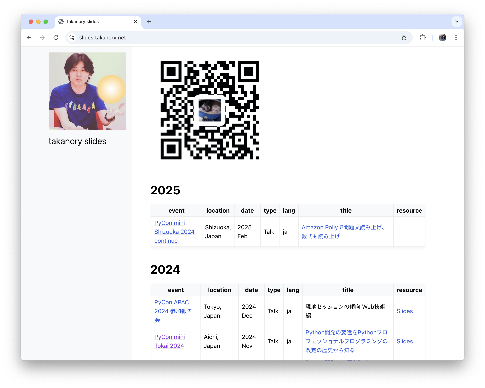

```{eval-rst}
:og:image: _images/20241211apacreport.png
:og:image:alt: 現地セッションの傾向 Web技術編

.. |cover| image:: images/20241211apacreport.png
```

# 現地セッションの<br />傾向 **Web技術**編

Takanori Suzuki

```{image} images/pyconapac2024.png
:width: 100
```

PyCon APAC 2024 参加報告会 / 2024 Dec 11

## 今日話すこと

*

## Photos 📷 Tweets 🐦 👍

`@takanory`

### {fas}`globe` [`slides.takanory.net`](https://slides.takanory.net/)



## **Who** am I? / お前**誰よ** 👤

* Takanori Suzuki / 鈴木 たかのり ({fab}`twitter` [@takanory](https://twitter.com/takanory))
* [PyCon JP Association](https://www.pycon.jp/) 代表理事
* [BeProud](https://www.beproud.jp/) 取締役 / Python Climber
* [Python Boot Camp](https://www.pycon.jp/support/bootcamp.html) 講師、[Python mini Hack-a-thon](https://pyhack.connpass.com/) 主催、[Pythonボルダリング部](https://kabepy.connpass.com/) 部長


## 現地セッションの傾向

**Web技術**編

### [2024-apac.pycon.id/schedule](https://2024-apac.pycon.id/schedule)

```{image} images/schedule.png
:width: 90%
```

### **Webっぽい**タイトルを抜き出してみる

* Optimizing **Web** Presence: Building an SEO Analyzer with **Flask** & NLP-ID / Alysia Alfi
* Streamlining Full-Stack Development: Building OpenAPI-Powered APIs with **FastAPI** and Integrating with Next.js Using TypeScript and React Query / Ryan Elian
* Database replication with **Django** and Postgres / Marcin Gębala

```{revealjs-break}
```

* **FastAPI** Deconstructed: Anatomy of a Modern **ASGI** Framework / Rafiqul Hasan
* Practical **GraphQL** Server Development with **FastAPI** and **Strawberry** / Takayuki Kawazoe
* Supercharge Your Python **Web App** Security Using Logto.io as Your Authentication Service / Rizqon Sadida

```{revealjs-break}
```

* **Structlog** in Practice / Takayuki Shimizukawa
* **GraphQL** in Python / Marcin Gębala
* Pythonic Ways to Build **Serverless** Apps in AWS and how to migrate from Frameworks / Arnel Jan Sarmiento / Arnel Jan Sarmiento

### 9 / 72 = **12.5%**

少ない！！

### Optimizing **Web** Presence: Building an SEO Analyzer with **Flask** & NLP-ID

* {fab}`github` [alysialfi/pycon-seo-optimizer](https://github.com/alysialfi/pycon-seo-optimizer)
* WebサイトのSEO分析をするためのツールをFlaskとNLP-ID（インドネシア語のNLP）で作った話
* Googleのページランクと、Webサイトのキーワードを出してくれるらしい


### Streamlining Full-Stack Development:

Building OpenAPI-Powered APIs with **FastAPI** and Integrating with Next.js Using TypeScript and React Query

* {fab}`github` [ryanelian/pycon-apac-2024](https://github.com/ryanelian/pycon-apac-2024)
  * スライドとサンプルコードがある
* FastAPIとNext.jsのプロジェクトを作成し、OpenAPIを使っていい感じに連携するという話

### Database replication with **Django** and Postgres

* スライド: [Database replication with Django and Postgres - Speaker Deck](https://speakerdeck.com/maarcingebala/database-replication-with-django-and-postgres)
* PostgreSQLでDBのレプリカ作成して、DjangoでDB route使って複数DBを切り替えて使う話

### **FastAPI** Deconstructed: Anatomy of a Modern **ASGI** Framework

* スライド: [FastAPI Deconstructed - Anatomy of a Modern ASGI Framework.pdf](https://github.com/shopnilsazal/fastapi-deconstructed/blob/main/FastAPI%20Deconstructed%20-%20Anatomy%20of%20a%20Modern%20ASGI%20Framework.pdf)
* FastAPIの構成要素としてASGI、Uvicorn、Starlette、Pydantic、Depends、OpenAPIのそれぞれについて解説する話

## 海外PyConに**興味湧いた**？ ✈️

### 出そう**Proposal**！！

* [PyCon APAC 2025](https://pycon-apac.python.ph/): Mar 1-2, Manila, Philippines
  * [pretalx.com/pycon-apac-2025](https://pretalx.com/pycon-apac-2025/): 12月15日まで
* [PyCon US 2025](https://us.pycon.org/2025/): May 16-18, Pittsburgh, PA
  * [pretalx.com/pyconus2025](https://pretalx.com/pyconus2025/): 12月19日まで
  
### Python Conference Deadlines

* {fas}`globe` [`pythondeadlin.es`](https://pythondeadlin.es/)

```{image} images/pythondeadlin.png
:alt: Python Conference Deadlines
:width: 65%
```

### **通ってから**考えよう！！

飛行機、ホテル、現地の移動、英語、食事、

ビール、観光、お土産、など

### **#pycon-overseas**チャンネル

* 海外PyConに**興味がある人**のチャンネル
* Python mini Hack-a-thonのSlack
* [pyhack.connpass.com](https://pyhack.connpass.com/)から参加

```{image} images/pyhack.png
:width: 60%
```

## Thank You 🙏

{fas}`desktop` [slides.takanory.net](https://slides.takanory.net/)

{fab}`twitter` [@takanory](https://twitter.com/takanory)
{fab}`github` [takanory](https://github.com/takanory/)
{fab}`linkedin` [takanory](https://www.linkedin.com/in/takanory/)
{fab}`untappd` [takanory](https://untappd.com/user/takanory/)


