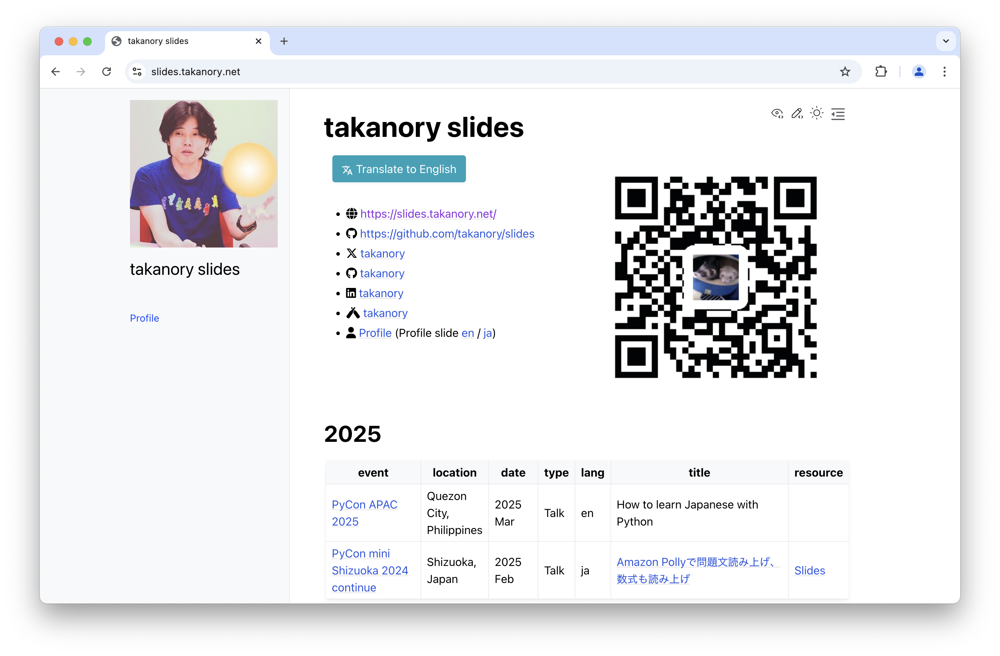
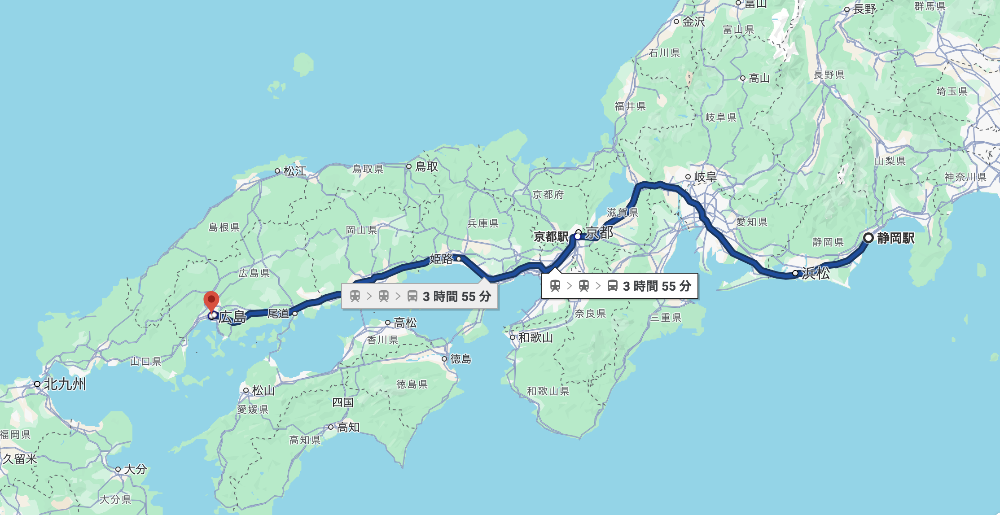

```{eval-rst}
:og:image: _images/20250208pyconshizu.png
:og:image:alt: Amazon Pollyで問題a文を読み上げ

.. |cover| image:: images/20240831pyconshizu.png
```

# **Amazon Polly**で<br />問題文を読み上げ<br />**数式**も読み上げ

Takanori Suzuki

```{image} images/pyconminishizuoka-logo.png
:alt: PyCon mini Shizuoka logo
:width: 60%
```

PyCon mini Shizuoka 2024 continue / 2025 Feb 8

## アジェンダ 📜

* 背景とゴール
* Amazon Pollyの基本
* 読み上げをカスタマイズ
* 問題文読み上げでやったこと
* 数式読み上げ

## 背景 🏞️

* 学習教材の **電子化** プロジェクト
* **合理的配慮** の一環としてのテキスト読み上げ
* 全盲の人向けではなく、**聴覚優位** の人向け

### 合理的配慮

> 合理的配慮とは、障害者から何らかの助けを求める意思の表明があった場合、過度な負担になり過ぎない範囲で、社会的障壁を取り除くために必要な便宜のことである。 

* [合理的配慮 - Wikipedia](https://ja.wikipedia.org/wiki/%E5%90%88%E7%90%86%E7%9A%84%E9%85%8D%E6%85%AE)

### 聴覚優位

> 子どもたちの情報の取り入れ方を下記の3タイプに分類し、“知覚の優位性”という考え方が世界に広がっていったことに始まります。
>
> 視覚優先型・聴覚優先型・運動感覚/触覚優先型

* [聴覚優位タイプとは？見るより聞くほうが理解しやすい子の勉強方法を専門家が解説](https://soctama.jp/column/67272)

### やりたいこと

* 問題文などを **読み上げ** られる
  * **聴覚優位** の生徒が理解しやすく
  * **数式** も読み上げられる
* 完全な読み上げじゃなくてもよい

### ちなみに全盲の場合

* OSのアクセシビリティ機能を使う
* PC上のスクリーンリーダーを使用する
* Web側はアクセシビリティに対応する
* 参考: [ウェブアクセシビリティ導入ガイドブック｜デジタル庁](https://www.digital.go.jp/resources/introduction-to-web-accessibility-guidebook/)
* →今回は対象外

## ゴール 🥅

* **Amazon Polly** での音声合成を知る
* Pythonでの **実装方法** を知る
* 読み上げの **カスタマイズ方法** を知る
* **数式を読み上げ** る方法を知る

## Photos 📷 Tweets 🐦 👍

`#pyconshizu` / `@takanory`

### Slides / スライド 💻

[slides.takanory.net](https://slides.takanory.net/)



## **Who** am I? / お前 **誰よ** 👤

* Takanori Suzuki / 鈴木 たかのり ({fab}`twitter` [@takanory](https://twitter.com/takanory))
* [BeProud](https://www.beproud.jp/) 取締役 / Python Climber
* [PyCon JP Association](https://www.pycon.jp/) 代表理事
* [Python Boot Camp](https://www.pycon.jp/support/bootcamp.html) 講師、[Python mini Hack-a-thon](https://pyhack.connpass.com/) 主催、[Pythonボルダリング部](https://kabepy.connpass.com/) 部長


### PyCon JP **Association** 🐍

日本国内のPythonユーザのために、**Pythonの普及及び開発支援**を行うために、継続的にカンファレンス(**PyCon**)を開くことを目的とした **非営利組織**

[`www.pycon.jp`](https://www.pycon.jp)


### PyCon JP **2025**

* {fas}`globe` [`2025.pycon.jp`](https://2025.pycon.jp/)
* 🗓️ 2025年**9月26日(金)-27日(土)**
* ⛩️ [**広島**国際会議場](https://www.pcf.city.hiroshima.jp/icch/)
  * **旅費の支援**も多分あるよ

### [静岡駅から広島国際会議場](https://www.google.co.jp/maps/dir/%E9%9D%99%E5%B2%A1%E9%A7%85/%E5%BA%83%E5%B3%B6%E5%9B%BD%E9%9A%9B%E4%BC%9A%E8%AD%B0%E5%A0%B4/@34.8798837,133.2867034,7.44z/data=!3m1!5s0x355aa272b9effb61:0x6c097dceac9fffb4!4m18!4m17!1m5!1m1!1s0x601a49fa03e728b3:0x23c1a4887e4776f7!2m2!1d138.3889005!2d34.972187!1m5!1m1!1s0x355aa26d05555dd5:0x4e72455df571cd7a!2m2!1d132.450993!2d34.392088!2m3!6e0!7e2!8j1738917000!3e3?entry=ttu&g_ep=EgoyMDI0MTIxMS4wIKXMDSoASAFQAw%3D%3D) 🚅



### **BeProud** Inc. 🏢

* [BeProud](https://www.beproud.jp/): Pythonシステム開発、コンサル
* [connpass](https://connpass.com/): IT勉強会支援プラットフォーム
* [PyQ](https://pyq.jp/): Python独学プラットフォーム
* [TRACERY](https://tracery.jp/): システム開発ドキュメントサービス


## Amazon Pollyの基本 🗣️

### Amaozon Polly

* [Amazon Polly（深層学習を使用したテキスト読み上げサービス）| AWS](https://aws.amazon.com/jp/polly/)
* **数十の言語** で高品質で自然な人間の声を展開
* 12ヶ月間、 毎月 **500万文字が無料**
* クラウド型コールセンターのAmazon Connectでも使える

### Amazon Pollyの画面

* [テキスト読み上げ機能 | Amazon Polly](https://ap-northeast-1.console.aws.amazon.com/polly/home/SynthesizeSpeech)
* 画面でテキストを入力して読み上げできる

```{image} images/polly-screen.png
:alt: Amazon Pollyの画面
:width: 75%
```

```{revealjs-break}
```

* Amazon Pollyの画面からmp3をダウンロード
* 「ボールはともだち」 {audio}`audio/friend-ja.mp3`
* 「The ball is my friend」{audio}`audio/friend-en.mp3`

### PythonからAmazon Pollyを実行

* [Boto3](https://boto3.amazonaws.com/v1/documentation/)をインストール
* APIを使うために環境変数を設定

```bash
$ python3.12 -m venv env
$ . env/bin/activate
(env) $ pip install boto3
(env) $ export AWS_ACCESS_KEY_ID=AKI...
(env) $ export AWS_SECRET_ACCESS_KEY=ZoWb...
(env) $ export AWS_DEFAULT_REGION=ap-northeast-1
```

```{revealjs-break}
```

```{revealjs-literalinclude} code/polly.py
:data-line-numbers: 1-14|5-6|8-10|12-14|1-14
```

* [Polly - Boto3 1.34.56 documentation](https://boto3.amazonaws.com/v1/documentation/api/latest/reference/services/polly.html)
* [AWSでAIサービスを使ってみる polly編](https://qiita.com/AInosukey/items/cb86c1012d40747b9dda)

```{revealjs-break}
```

* mp3ファイルができた！！ {nekochan}`clap`

```{literalinclude} code/polly.py
:lines: 6-10
```

```{audio} audio/not-afraid.mp3
```

### Amazon Pollyの基本まとめ 🗣️

* **AWSの画面** から使える
* Pythonでは **Boto3** 経由で使える

## 読み上げをカスタマイズ 🔧

### 言語の変更

* `VoiceId`引数で **言語と音声** を指定
* 参考: [Amazon Polly の音声](https://docs.aws.amazon.com/ja_jp/polly/latest/dg/voicelist.html)
  * 日本語: Mizuki, Takumi, Kazuha, Tomoko
  * 英語: Ivy, Salli, Joey, Justinなど

```{literalinclude} code/polly2.py
:lines: 7-9
```

```{audio} audio/sggk.mp3
```

### 読みの指定

* 「S・G・G・K」をちゃんと読ませたい
* `<phoneme>` タグでフリガナ指定
  * 参考: [発音記号を使用する](https://docs.aws.amazon.com/ja_jp/polly/latest/dg/supportedtags.html#phoneme-tag)
* 全体を `<speak>` タグで囲む
* `TextType="ssml"` 引数を追加


```{revealjs-break}
```

```{literalinclude} code/polly3.py
:lines: 7-14
```

```{audio} audio/super-great.mp3
```

### SSMLタグ

* **音声合成マークアップ言語(SSML)** に対応
  * 段落を区切る（`<p>`）
  * 強調する（`<emphasis>`）
  * 音量、話す速度、ピッチ（`<prosody>`）
  * 呼吸音（`<amazon:breath>`）など
* 参考:
  * [SSML ドキュメントから音声を生成する](https://docs.aws.amazon.com/ja_jp/polly/latest/dg/ssml.html)
  * [サポートされている SSML タグ](https://docs.aws.amazon.com/ja_jp/polly/latest/dg/supportedtags.html)

### 読み上げをカスタマイズまとめ 🔧

* **言語** と **音声** を変更できる
* **読み** を指定できる
* **SSMLタグ** でカスタマイズできる

## **Lexicon** で読みをカスタマイズ 🛠️

### **Lexicon** とは

* **発音レキシコン**: 発音の定義ファイル
* `<phoneme>` は **個別**、レキシコンは **共通**
* 複数ファイルを用意して使い分けも可能
* 参考: [レキシコンの管理](https://docs.aws.amazon.com/ja_jp/polly/latest/dg/managing-lexicons.html)

### Lexiconを使用する

* Lexiconファイル（`tsubasa-lexicon.xml`）を用意

```{literalinclude} code/tsubasa-lexicon.xml
:lines: 1-13, 29
```

### Amazon Pollyの画面でLexiconを使用

* 名前を付けてXMLファイルをアップロード
* レキシコンを使用する

```{image} images/lexicon-upload.png
:alt: Lexiconをアップロード
:width: 75%
```

### PythonからLexiconを使用

```{revealjs-literalinclude} code/polly4.py
:lines: 7-15, 20-24
:data-line-numbers: 1-13|1-4|6-9|2,10-13
```

* Lexiconなし {audio}`audio/hando-no-lexicon.mp3`
* Lexiconあり {audio}`audio/hando-with-lexicon.mp3`

### Lexiconで読みをカスタマイズまとめ 🛠️

* **Lexiconファイル** をXMLで作成
* Lexiconファイルを **登録**
* 任意のLexiconを **適用**

## 問題文読み上げでやったこと 📖

### **Lexicon** を作成

* ①、②：まるいち、まるに
* （）〔〕：括弧
* 〜：から
* →：やじるし
* ＋：プラス
* ・：、 (句点と同じ空白が入る)

### スペースを `<break>` タグに

* スペース部分を **一時停止タグ** に置換
* 選択肢のラベルを区切って読む

```
〜〜を選べ ① ほげ ② ふが
```

↓

```
〜〜を選べ<break strength="x-strong"/>①<break strength="x-strong"/>ほげ<break strength="x-strong"/>②<break strength="x-strong"/>ふが
```

### フリガナを `<phoneme>` タグに

* 問題文はHTML形式
* フリガナはHTMLの `<ruby>` タグ

```html
<ruby>反動蹴速迅砲<rt>はんどうしゅうそくじんほう</rt></ruby>
```

↓

```html
<phoneme type="ruby" ph="はんどうしゅうそくじんほう">反動蹴速迅砲</phoneme>
```

### 日本語の英語の混ざった文章

* 日本語音声で英語を読ませると発音が**やばい**
  * カタカナ英語みたいになる
* 英語の問題文は日本語と英語が **混ざっている**
* 日本語と英語に **分割** し音声読み上げ
* 1つのmp3にまとめる

```{revealjs-break}
```

* 問題文の例（`question.txt`）

```{literalinclude} code/question.txt
```

```{revealjs-break}
```

* （）、①を読ませるために **Lexicon** を登録

```{literalinclude} code/tsubasa-lexicon.xml
:lines: 14-22
```

```{literalinclude} code/polly5.py
:lines: 20-23
```

```{revealjs-break}
```

* 指定した言語で読み上げる**関数**

```{revealjs-literalinclude} code/polly5.py
:lines: 6-15
:data-line-numbers: 1-9|1-2|3-4|5-9
```

```{revealjs-break}
```

* 正規表現で **日英を分割** して読み上げ

```{revealjs-literalinclude} code/polly5.py
:lines: 25-37
:data-line-numbers: 1-13|1-3|5|6-11|12-13
```

```{revealjs-break}
```

* 日本語と英語の混ざった音声ができた！！ {nekochan}`medetai`

```{literalinclude} code/question.txt
```

```{audio} audio/question.mp3
```

### 問題文読み上げでやったことまとめ 📖

* Lexiconを作成
* スペースを `<break>` タグに
* フリガナを `<phoneme>` タグに
* 日英の混ざった文章対応

## 数式読み上げ 🧮

### 数式読み上げ 🧮

* 数学や理科の問題文には**数式**がでてくる
* 数式も**読み上げ**たい

### 数式はどう表現している？

* `$$` または `$` で数式を囲む

```markdown
$$x = {-b \pm \sqrt{b^2-4ac} \over 2a}$$

次の式を解きなさい $(5x＋4)(5x＋1)$
```

$$x = {-b \pm \sqrt{b^2-4ac} \over 2a}$$

次の式を解きなさい $(5x＋4)(5x＋1)$

### **どんな数式** が書ける？

* LaTeXで書ける数式は全部できる(はず)
* 参考: [Easy Copy Mathjax](https://easy-copy-mathjax.nakaken88.com/)

\begin{eqnarray}
\triangle ABC \equiv \triangle DEF
\end{eqnarray}

\begin{eqnarray}
\varliminf_{ n \to \infty } A_n
 = \bigcup_{ n = 1 }^{ \infty } \bigcap_{ k = n }^{ \infty } A_k
 = \bigcup_{ n \in \mathbb{ N } } \bigcap_{ k \geqq n } A_k
\end{eqnarray}

### どうやって **数式を表示** している？

* 原稿はMarkdownの中に`$`、`$$`で囲んだ数式
* Markdown変換: [markdown-it](https://github.com/markdown-it/markdown-it)
* Mathjax変換: [markdown-it-mathjax3](https://github.com/tani/markdown-it-mathjax3)
  * markdown-itのプラグイン
  * 内部では[mathjax-full](https://www.npmjs.com/package/mathjax-full)を使用

### 数式は**SVG**で表示されている

$$x = {-b \pm \sqrt{b^2-4ac} \over 2a}$$

```html
<mjx-container class="MathJax CtxtMenu_Attached_0" jax="SVG" display="true" style="position: relative;" tabindex="0" ctxtmenu_counter="11">
  <svg style="vertical-align: -1.575ex;" xmlns="http://www.w3.org/2000/svg" width="20.765ex" height="5.291ex" role="img" focusable="false" viewBox="0 -1642.5 9178 2338.5" xmlns:xlink="http://www.w3.org/1999/xlink" aria-hidden="true">
    <defs>
      <path id="MJX-1-TEX-I-1D465" d="M52 289Q59 331 106 386T222 442Q257 442 286 424T329 379Q371 442 430 442Q467 442 494 420T522 361Q522 332 508 314T481 292T458 288Q439 288 427 299T415 328Q415 374 465 391Q454 404 425 404Q412 404 406 402Q368 386 350 336Q290 115 290 78Q290 50 306 38T341 26Q378 26 414 59T463 140Q466 150 469 151T485 153H489Q504 153 504 145Q504 144 502 134Q486 77 440 33T333 -11Q263 -11 227 52Q186 -10 133 -10H127Q78 -10 57 16T35 71Q35 103 54 123T99 143Q142 143 142 101Q142 81 130 66T107 46T94 41L91 40Q91 39 97 36T113 29T132 26Q168 26 194 71Q203 87 217 139T245 247T261 313Q266 340 266 352Q266 380 251 392T217 404Q177 404 142 372T93 290Q91 281 88 280T72 278H58Q52 284 52 289Z"></path>
      <path id="MJX-1-TEX-N-3D" d="M56 347Q56 360 70 367H707Q722 359 722 347Q722 336 708 328L390 327H72Q56 332 56 347ZM56 153Q56 168 72 173H708Q722 163 722 153Q722 140 707 133H70Q56 140 56 153Z"></path>
      <path id="MJX-1-TEX-N-2212" d="M84 237T84 250T98 270H679Q694 262 694 250T679 230H98Q84 237 84 250Z"></path>
      <path id="MJX-1-TEX-I-1D44F" d="M73 647Q73 657 77 670T89 683Q90 683 161 688T234 694Q246 694 246 685T212 542Q204 508 195 472T180 418L176 399Q176 396 182 402Q231 442 283 442Q345 442 383 396T422 280Q422 169 343 79T173 -11Q123 -11 82 27T40 150V159Q40 180 48 217T97 414Q147 611 147 623T109 637Q104 637 101 637H96Q86 637 83 637T76 640T73 647ZM336 325V331Q336 405 275 405Q258 405 240 397T207 376T181 352T163 330L157 322L136 236Q114 150 114 114Q114 66 138 42Q154 26 178 26Q211 26 245 58Q270 81 285 114T318 219Q336 291 336 325Z"></path><path id="MJX-1-TEX-N-B1" d="M56 320T56 333T70 353H369V502Q369 651 371 655Q376 666 388 666Q402 666 405 654T409 596V500V353H707Q722 345 722 333Q722 320 707 313H409V40H707Q722 32 722 20T707 0H70Q56 7 56 20T70 40H369V313H70Q56 320 56 333Z"></path><path id="MJX-1-TEX-N-221A" d="M95 178Q89 178 81 186T72 200T103 230T169 280T207 309Q209 311 212 311H213Q219 311 227 294T281 177Q300 134 312 108L397 -77Q398 -77 501 136T707 565T814 786Q820 800 834 800Q841 800 846 794T853 782V776L620 293L385 -193Q381 -200 366 -200Q357 -200 354 -197Q352 -195 256 15L160 225L144 214Q129 202 113 190T95 178Z"></path><path id="MJX-1-TEX-N-32" d="M109 429Q82 429 66 447T50 491Q50 562 103 614T235 666Q326 666 387 610T449 465Q449 422 429 383T381 315T301 241Q265 210 201 149L142 93L218 92Q375 92 385 97Q392 99 409 186V189H449V186Q448 183 436 95T421 3V0H50V19V31Q50 38 56 46T86 81Q115 113 136 137Q145 147 170 174T204 211T233 244T261 278T284 308T305 340T320 369T333 401T340 431T343 464Q343 527 309 573T212 619Q179 619 154 602T119 569T109 550Q109 549 114 549Q132 549 151 535T170 489Q170 464 154 447T109 429Z"></path><path id="MJX-1-TEX-N-34" d="M462 0Q444 3 333 3Q217 3 199 0H190V46H221Q241 46 248 46T265 48T279 53T286 61Q287 63 287 115V165H28V211L179 442Q332 674 334 675Q336 677 355 677H373L379 671V211H471V165H379V114Q379 73 379 66T385 54Q393 47 442 46H471V0H462ZM293 211V545L74 212L183 211H293Z"></path><path id="MJX-1-TEX-I-1D44E" d="M33 157Q33 258 109 349T280 441Q331 441 370 392Q386 422 416 422Q429 422 439 414T449 394Q449 381 412 234T374 68Q374 43 381 35T402 26Q411 27 422 35Q443 55 463 131Q469 151 473 152Q475 153 483 153H487Q506 153 506 144Q506 138 501 117T481 63T449 13Q436 0 417 -8Q409 -10 393 -10Q359 -10 336 5T306 36L300 51Q299 52 296 50Q294 48 292 46Q233 -10 172 -10Q117 -10 75 30T33 157ZM351 328Q351 334 346 350T323 385T277 405Q242 405 210 374T160 293Q131 214 119 129Q119 126 119 118T118 106Q118 61 136 44T179 26Q217 26 254 59T298 110Q300 114 325 217T351 328Z"></path><path id="MJX-1-TEX-I-1D450" d="M34 159Q34 268 120 355T306 442Q362 442 394 418T427 355Q427 326 408 306T360 285Q341 285 330 295T319 325T330 359T352 380T366 386H367Q367 388 361 392T340 400T306 404Q276 404 249 390Q228 381 206 359Q162 315 142 235T121 119Q121 73 147 50Q169 26 205 26H209Q321 26 394 111Q403 121 406 121Q410 121 419 112T429 98T420 83T391 55T346 25T282 0T202 -11Q127 -11 81 37T34 159Z"></path></defs><g stroke="currentColor" fill="currentColor" stroke-width="0" transform="scale(1,-1)"><g data-mml-node="math"><g data-mml-node="mi"><use data-c="1D465" xlink:href="#MJX-1-TEX-I-1D465"></use></g><g data-mml-node="mo" transform="translate(849.8,0)"><use data-c="3D" xlink:href="#MJX-1-TEX-N-3D"></use></g><g data-mml-node="TeXAtom" data-mjx-texclass="ORD" transform="translate(1905.6,0)"><g data-mml-node="mfrac"><g data-mml-node="mrow" transform="translate(220,676)"><g data-mml-node="mo"><use data-c="2212" xlink:href="#MJX-1-TEX-N-2212"></use></g><g data-mml-node="mi" transform="translate(778,0)"><use data-c="1D44F" xlink:href="#MJX-1-TEX-I-1D44F"></use></g><g data-mml-node="mo" transform="translate(1429.2,0)"><use data-c="B1" xlink:href="#MJX-1-TEX-N-B1"></use></g><g data-mml-node="msqrt" transform="translate(2429.4,0)"><g transform="translate(853,0)"><g data-mml-node="msup"><g data-mml-node="mi"><use data-c="1D44F" xlink:href="#MJX-1-TEX-I-1D44F"></use></g><g data-mml-node="mn" transform="translate(462,289) scale(0.707)"><use data-c="32" xlink:href="#MJX-1-TEX-N-32"></use></g></g><g data-mml-node="mo" transform="translate(1087.8,0)"><use data-c="2212" xlink:href="#MJX-1-TEX-N-2212"></use></g><g data-mml-node="mn" transform="translate(2088,0)"><use data-c="34" xlink:href="#MJX-1-TEX-N-34"></use></g><g data-mml-node="mi" transform="translate(2588,0)"><use data-c="1D44E" xlink:href="#MJX-1-TEX-I-1D44E"></use></g><g data-mml-node="mi" transform="translate(3117,0)"><use data-c="1D450" xlink:href="#MJX-1-TEX-I-1D450"></use></g></g><g data-mml-node="mo" transform="translate(0,106.5)"><use data-c="221A" xlink:href="#MJX-1-TEX-N-221A"></use></g><rect width="3550" height="60" x="853" y="846.5"></rect></g></g><g data-mml-node="mrow" transform="translate(3121.7,-686)"><g data-mml-node="mn"><use data-c="32" xlink:href="#MJX-1-TEX-N-32"></use></g><g data-mml-node="mi" transform="translate(500,0)"><use data-c="1D44E" xlink:href="#MJX-1-TEX-I-1D44E"></use></g></g><rect width="7032.4" height="60" x="120" y="220"></rect></g></g></g></g>
  :
</mjx-container>
```

### SVGは画像フォーマットなので<br />読めない... {nekochan}`mesareta`

## Mathjaxを読み上げる 💬

### MathJaxの**Accessibility機能**

* [Accessibility Features - Screen Reader Support](https://docs.mathjax.org/en/latest/basic/accessibility.html#screen-reader-support)

  The `assistive-mml` extension embeds visually hidden MathML alongside MathJax's visual rendering while hiding the visual rendering from assistive technology (AT) such as screenreaders.

```{revealjs-break}
```

* `assistive-mml`拡張によって視覚的なレンダリングの横に、**隠されたMathML**を埋め込む
* スクリーンリーダーなどはそのMathMLを読む

### MathJaxの出力を**再確認**

$$x = {-b \pm \sqrt{b^2-4ac} \over 2a}$$

```{revealjs-literalinclude} code/mathml-sample.html
:data-line-numbers: 1-13|2,12|3-11
```

### なんか読めそう！！👍

### **MathML**だけ取り出す

```html
<math xmlns="http://www.w3.org/1998/Math/MathML" display="block">
  <mi>x</mi><mo>=</mo>  # x =
  <mrow data-mjx-texclass="ORD">
    <mfrac>  # 分数(fraction)
      <mrow>  # 分子
        <mo>−</mo><mi>b</mi><mo>±</mo>  # -b±
        <msqrt>  # ルート(sqrt)
          <msup><mi>b</mi><mn>2</mn></msup>  # b 2乗
          <mo>−</mo><mn>4</mn><mi>a</mi><mi>c</mi>  # -4ac
        </msqrt>
      </mrow>
      <mrow><mn>2</mn><mi>a</mi></mrow>  # 分母(2a)
    </mfrac>
  </mrow>
</math>
```

### **MathML**とは

* 数式を記述するためのマークアップ言語
* [Mathematical Markup Language - Wikipedia](https://ja.wikipedia.org/wiki/Mathematical_Markup_Language)
* [MathML の記述 - MathML | MDN](https://developer.mozilla.org/ja/docs/Web/MathML/Authoring)
* [MathML 要素リファレンス - MathML | MDN](https://developer.mozilla.org/ja/docs/Web/MathML/Element)

### MathMLの**主な要素**

* `<mi>`: 識別子(a, b, x, y等)
* `<mo>`: 演算子(+、-等)
* `<mn>`: 数字
* `<mfrac>`: 分数
* `<msqrt>`: ルート
* `<msup>`、`<msub>`: 上付き、下付き
* `<mover>`: 弧で使用

## **読み上げテキスト**作成 ✍️

### MathMLをBeautiful Soup 4で解析 🥣

* [Beautiful Soup 4](https://beautiful-soup-4.readthedocs.io/en/latest/): HTML、XMLのパーサー

```bash
(venv) $ pip install beautifulsoup4
```

```{revealjs-literalinclude} code/polly-mathml.py
:lines: 5, 18-23, 53-55
:data-line-numbers: 1-10|1-5|6-7|9-10
```

### **識別子**、**演算子** を変換

```{literalinclude} code/polly-mathml.py
:lines: 7-11, 16
```

```{literalinclude} code/polly-mathml.py
:lines: 25-28
```

### **分数**に対応

$\dfrac{1}{2}$ を「2ぶんの1」と読ませる

```html
# MathML
<mfrac>
  <mn>1</mn>
  <mn>2</mn>
</mfrac>
```

```{literalinclude} code/polly-mathml.py
:lines: 30-36
```

### **2乗**に対応

$x^2$ を「x2乗」と読ませる

```html
# MathML
<msup>
  <mi>x</mi>
  <mn>2</mn>
</msup>
```

```{literalinclude} code/polly-mathml.py
:lines: 38-41
```

### **ルート**に対応

$\sqrt{5}$ を「ルート5」と読ませる

```html
# MathML
<msqrt>5</msqrt>
```

```{literalinclude} code/polly-mathml.py
:lines: 43-45
```

### **数式**を**読み上げ**る

二次方程式 $ax^2 + bx + c = 0$ の解は

$$x = {-b \pm \sqrt{b^2-4ac} \over 2a}$$

```text
# 読み上げ用テキスト
二次方程式 ax2乗プラスbxプラスc=0 の解は
x=2aぶんのマイナスbプラスマイナスルートb2乗マイナス4ac
```

```{audio} audio/mathml.mp3
```

### おしい... {nekochan}`wink`

* ax → あっくす
* 2a → にあーる

# まとめ  {nekochan}`good`

* Amazon Pollyで音声合成は**簡単**にできる
* **多言語**に対応
* **SSML**と**Lexicon**で細かい調整が可能
* **数式**も**MathML**の解析で読み上げられる
* サンプルコード: {fab}`github` [code](https://github.com/takanory/slides/tree/master/slides/20250208pyconshizu/code)

## お知らせ

* Sphinxドキュメントにネコチャン絵文字を簡単に入れられる拡張[sphinx-nekochan](https://sphinx-nekochan.readthedocs.io/)をリリースしました {nekochan}`banzai`
  * 参考：[【2024.08追加】SlackやDiscordで使えるネコチャン絵文字を配布しています♪｜しかまつ(ネコチャン絵文字職人)](https://note.com/shikamatsu/n/nd217dc0617db)

## Thank You {nekochan}`pray`

{fas}`desktop` [slides.takanory.net](https://slides.takanory.net/)

{fab}`twitter` [@takanory](https://twitter.com/takanory)
{fab}`github` [takanory](https://github.com/takanory/)
{fab}`linkedin` [takanory](https://www.linkedin.com/in/takanory/)
{fab}`untappd` [takanory](https://untappd.com/user/takanory/)


