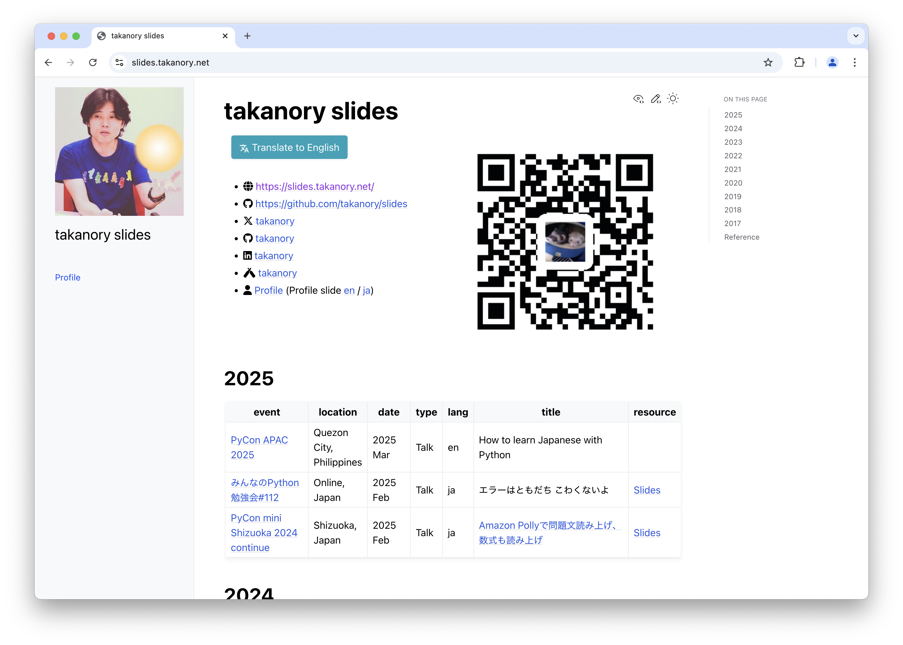
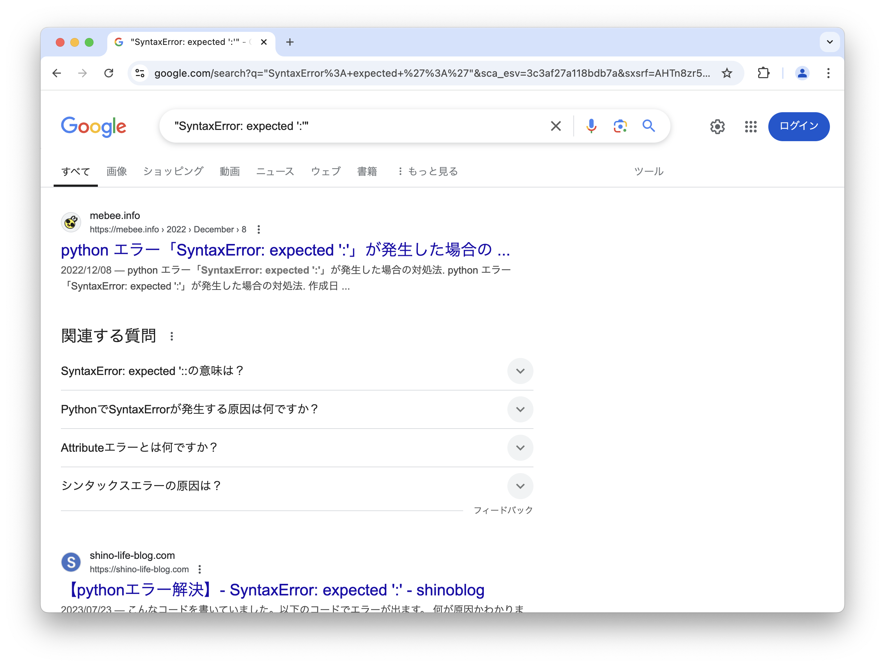
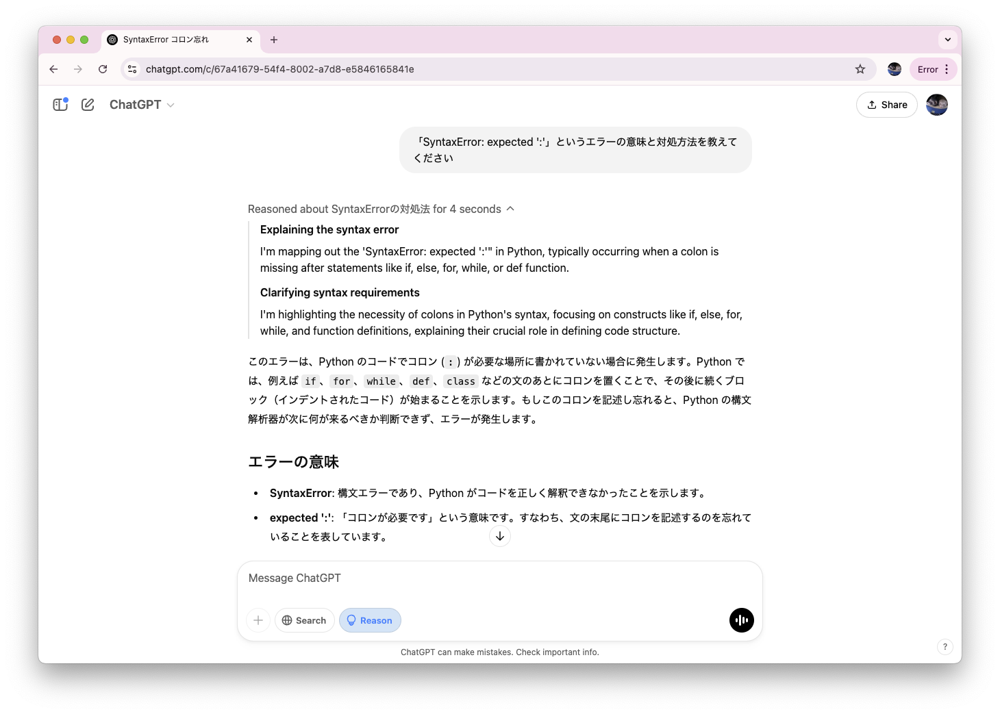

```{eval-rst}
:og:image: _images/20250213stapy.png
:og:image:alt: エラーはともだちこわくないよ

.. |cover| image:: images/20250213stapy.png
```

# **エラー**は**ともだち** こわくないよ

Takanori Suzuki

```{image} images/stapy-logo.png
:alt: Start Python Club logo
:width: 15%
```


みんなのPython勉強会 #112 / 2025 Feb 13

## 今日**はなすこと**

* Pythonのエラーってなに？
* よくあるエラーのパターン
* 例外処理
* おまけ：better error messages

### 今日の**ゴール**

* Pythonのエラーが嫌いじゃなくなる
* エラーと仲良くなれる

## Photos 📷 Tweets 🐦 👍

`#stapy` / `@takanory`

### [`slides.takanory.net`](https://slides.takanory.net/) 💻



## **Who** am I? / お前 **誰よ** 👤

* Takanori Suzuki / 鈴木 たかのり ({fab}`twitter` [@takanory](https://twitter.com/takanory))
* [BeProud](https://www.beproud.jp/) 取締役 / Python Climber
* [PyCon JP Association](https://www.pycon.jp/) 代表理事
* [Python Boot Camp](https://www.pycon.jp/support/bootcamp.html) 講師、[Python mini Hack-a-thon](https://pyhack.connpass.com/) 主催、[Pythonボルダリング部](https://kabepy.connpass.com/) 部長


### PyCon JP **Association** 🐍

日本国内のPythonユーザのために、**Pythonの普及及び開発支援**を行うために、継続的にカンファレンス(**PyCon**)を開くことを目的とした **非営利組織**

[`www.pycon.jp`](https://www.pycon.jp)


### PyCon JP **2025**

* {fas}`globe` [`2025.pycon.jp`](https://2025.pycon.jp/)
* 🗓️ 2025年**9月26日(金)-27日(土)**
* ⛩️ [**広島**国際会議場](https://www.pcf.city.hiroshima.jp/icch/)
  * **旅費の支援**も多分あるよ

### **BeProud** Inc. 🏢

* [BeProud](https://www.beproud.jp/): Pythonシステム開発、コンサル
* [connpass](https://connpass.com/): IT勉強会支援プラットフォーム
* [PyQ](https://pyq.jp/): Python独学プラットフォーム
* [TRACERY](https://tracery.jp/): システム開発ドキュメントサービス


### BeProud**メンバー募集中** {nekochan}`kamon`

```{image} /assets/images/qr-career.png
:width: 40%
:alt: Pythno求人QRコード
:target: https://www.beproud.jp/careers/python/
```

```{image} /assets/images/qr-casual-interview.png
:width: 40%
:alt: カジュアル面談QRコード
:target: https://forms.gle/tM4n2ufKf49MbXsH9
```

## Pythonの**エラーってなに**？ {nekochan}`hate-nya`

### エラー好きな人？ {nekochan}`ok`

### エラー嫌いな人？ {nekochan}`ng`

### Pythonには**2種類のエラー**

* 構文エラー（syntax error）
* 例外（exception）
* 参考：[8. エラーと例外 — Python公式ドキュメント](https://docs.python.org/ja/3.13/tutorial/errors.html)

### 構文エラー（syntax error）

* Pythonの**構文**として**正しくない**
* **構文解析時**にエラーが発生

```pycon
>>> for i in range(10)
  File "<python-input-1>", line 1
    for i in range(10)
                      ^
SyntaxError: expected ':'
```

### 例外（exception）

* 構文が正しい
* **実行時**にエラーが発生

```{code-block} python3.13
>>> 1 / 0
Traceback (most recent call last):
  File "<python-input-0>", line 1, in <module>
    1 / 0
    ~~^~~
ZeroDivisionError: division by zero
```

### エラーが怖い？

### エラーは**怒っていない**

* **ここが問題だよ**と教えてくれている
* 問題を修正するための**案内役**

```{revealjs-break}
```

```{literalinclude} code/error_example.py
:caption: error_example.py
```

```python
% python3.13 error_example.py 
  File ".../error_example.py", line 1  # このファイルの1行目の
    for i in range(10)
                      ^  # この場所で
SyntaxError: expected ':'  # 構文エラーが発生：`:`がここに必要
```

### エラーの意味が**わからない**？

### Googleで検索 {nekochan}`miru`



### AIに質問 {nekochan}`mita`



### そのうち**自分**で**エラーに対処**できる {nekochan}`benkyou` （ようになるはず）

## よくあるエラーの**パターン** {nekochan}`naruhodo`

### 書籍から**エラーの例**を引用【AD】

```{image} images/pycrash2-hisshu.jpg
:alt: 改訂新版 最短距離でゼロからしっかり学ぶ Python入門 必修編
:width: 350px
```

```{revealjs-break}
```

* [改訂新版 最短距離でゼロからしっかり学ぶ Python入門 必修編](https://gihyo.jp/book/2024/978-4-297-14528-6)
* 2024年10月31日発売、価格：3,630円
* Eric Matthes著
* 鈴木たかのり、安田善一郎翻訳
* **大絶賛発売中！！**

### どんなエラーが出る？(p18)

```{literalinclude} code/message.py
:caption: message.py
```

```{revealjs-break}
```

```bash
Traceback (most recent call last):
  File ".../message.py", line 2, in <module>
    print(mesage)
          ^^^^^^
NameError: name 'mesage' is not defined. \
    Did you mean: 'message'?
```

* [`NameError`](https://docs.python.org/ja/3.13/library/exceptions.html#NameError)：名前が見つからないエラー
* `'mesage'`という名前は定義されていません
* `'message'` と間違えてませんか？

```{revealjs-break}
```

* 変数名を修正して解決

```{literalinclude} code/message_fixed.py
```

### どんなエラーが出る？(p27)

```{literalinclude} code/message2.py
:caption: message2.py
```

```{revealjs-break}
```

```bash
  File ".../message2.py", line 1
    message = 'One of Python's strengths is its diverse community.'
                                                                  ^
SyntaxError: unterminated string literal (detected at line 1)
```

* [`SyntaxError`](https://docs.python.org/ja/3.13/library/exceptions.html#SyntaxError)：構文エラー
* 文字列リテラルが終了していません

```{revealjs-break}
```

* クォーテーションを変更して解決

```{literalinclude} code/message2_fixed.py
```

### どんなエラーが出る？(p52)

```{literalinclude} code/beers.py
:caption: beers.py
```

```{revealjs-break}
```

```python
  File ".../beers.py", line 2, in <module>
    print(beers[3])
          ~~~~~^^^
IndexError: list index out of range
```

* [`IndexError`](https://docs.python.org/ja/3.13/library/exceptions.html#IndexError)：インデックスエラー
* インデックスが範囲外です

```{revealjs-break}
```

* 正しい範囲を指定して解決

```{literalinclude} code/beers_fixed.py
```

### どんなエラーが出る？(p60)

```{literalinclude} code/beers2.py
:caption: beers2.py
```

```{revealjs-break}
```

```python
  File ".../beers2.py", line 3
    print(beer)
    ^^^^^
IndentationError: expected an indented block after \
    'for' statement on line 2
```

* [`IndentationError`](https://docs.python.org/ja/3.13/library/exceptions.html#IndentationError)：正しくないインデントのエラー
* 2行目の`for`文のあとにインデントが必要

```{revealjs-break}
```

* インデントを追加して解決

```{literalinclude} code/beers2_fixed.py
```

### どんなエラーが出る？(p61)

```{literalinclude} code/beers3.py
:caption: beers3.py
```

```{revealjs-break}
```

```python
  File ".../beers3.py", line 2
    for beer in beers
                     ^
SyntaxError: expected ':'
```

* [`SyntaxError`](https://docs.python.org/ja/3.13/library/exceptions.html#SyntaxError)：構文エラー
* `:` が必要です

```{revealjs-break}
```

* インデントを追加して解決

```{literalinclude} code/beers3_fixed.py
```

### どんなエラーが出る？(p75)

```{literalinclude} code/sizes.py
:caption: sizes.py
```

```{revealjs-break}
```

```python
Traceback (most recent call last):
  File ".../sizes.py", line 2, in <module>
    sizes[0] = "UK Pint"
    ~~~~~^^^
TypeError: 'tuple' object does not support item assignment
```

* [`TypeError`](https://docs.python.org/ja/3.13/library/exceptions.html#TypeError)：データ型に関するエラー
* タプルは要素の代入に対応していません

```{revealjs-break}
```

* タプル全体を上書きは可能

```{literalinclude} code/sizes_fixed.py
```

### どんなエラーが出る？(p113)

```{literalinclude} code/beer_dict.py
:caption: beer_dict.py
```

```{revealjs-break}
```

```python
Traceback (most recent call last):
  File ".../beer_dict.py", line 2, in <module>
    beer["style"]
    ~~~~^^^^^^^^^
KeyError: 'style'
```

* [`KeyError`](https://docs.python.org/ja/3.13/library/exceptions.html#KeyError)：辞書のキーが存在しないエラー

```{revealjs-break}
```

* `get()`メソッドを使用する

```{literalinclude} code/beer_dict_fixed.py
```

### どんなエラーが出る？(p134)

```{literalinclude} code/age.py
:caption: age.py
```

```bash
% python3.13 age.py
何歳ですか？21
```

```{revealjs-break}
```

```python
% python3.13 age.py
何歳ですか？21
Traceback (most recent call last):
  File ".../age.py", line 2, in <module>
    if age >= 20:
       ^^^^^^^^^
TypeError: '>=' not supported between instances of \
    'str' and 'int'
```

* [`TypeError`](https://docs.python.org/ja/3.13/library/exceptions.html#TypeError)：データ型に関するエラー
* strとintの間で`>=`はサポートされていません

```{revealjs-break}
```

* `int()`で整数に変換する

```{literalinclude} code/age_fixed.py
```

```
% python3.13 age.py
何歳ですか？21
お酒が飲める年齢です
```

### どんなエラーが出る？(p157)

```{literalinclude} code/beer_func.py
:caption: beer_func.py
```

```{revealjs-break}
```

```python
Traceback (most recent call last):
  File ".../beer_func.py", line 5, in <module>
    describe_beer()
    ~~~~~~~~~~~~~^^
TypeError: describe_beer() missing 2 required positional \
    arguments: 'beer_name' and 'brewery'
```

* [`TypeError`](https://docs.python.org/ja/3.13/library/exceptions.html#TypeError)：データ型に関するエラー
* 2つの位置引数beer_nameとbreweryがありません

```{revealjs-break}
```

* 引数を正しく指定する

```{literalinclude} code/beer_func_fixed.py
```

### 何個わかりました？

### エラーの一覧

* [組み込み例外 — Python公式ドキュメント](https://docs.python.org/ja/3.13/library/exceptions.html)
* **初めて見る**例外があったら調べてみよう！

### さまざまな**例外が発生**する {nekochan}`hiza-ni-ya-wo-ukete-simatte`

### 例外が発生しても**正しく動作**させたい {nekochan}`kochira`

## 例外を処理する {nekochan}`kamon`

### 例外処理の基本

* 数値以外を指定すると[`ValueError`](https://docs.python.org/ja/3.13/library/exceptions.html#ValueError)が発生

```{literalinclude} code/age_fixed.py
```

```bash
% python3.13 age.py
何歳ですか？二十歳
Traceback (most recent call last):
  File "...//age.py", line 2, in <module>
    if int(age) >= 20:
       ~~~^^^^^
ValueError: invalid literal for int() with base 10: '二十歳'
```

```{revealjs-break}
```

* `try` と `except` で例外処理

```bash
% python3.13 age2.py
何歳ですか？二十歳
数値を入力してください
```

```{revealjs-literalinclude} code/age2.py
:data-line-numbers: 1-8|1-3,7-8
```

```{revealjs-break}
```

* 例外がなければ `except` 節は**実行されない**

```bash
% python3.13 age2.py
何歳ですか？21
お酒が飲める年齢です
```

```{revealjs-literalinclude} code/age2.py
:data-line-numbers: 1-8|1-4
```

### 複数の例外に対応する

* 1つの処理で異なる種類の例外が発生する場合がある
* ファイルからテキストを読み込む場合
* **どんな例外**が考えられますか？

```{revealjs-literalinclude} code/read_text.py
```

```{revealjs-break}
```

* 例外の種類によってメッセージを**出し分け**

```{revealjs-literalinclude} code/read_text2.py
```

### **事前チェック**と例外処理

* 事前にチェックして例外を防げる場合もある
* どちらを使うかはお好みで

```python
from pathlib import Path

p = Path("beer.txt")
if not p.exists():  # ファイルの存在チェック
    print("ファイルが存在しません")
else:
    ...
	
if key in beer_dict:  # キーの存在チェック
    beer_dict[key]
else:
    ...
```

### **辞書のget**は適切に使おう

* キー名をtypoしているのに気づかないことも
* `[]`なら例外で気づける
* 型ヒントで[`TypedDict`](https://docs.python.org/3/library/typing.html#typing.TypedDict)を使うのもあり

```python
style = beer.get("stlye")  # typoに気づかない

class Beer(TypedDict):
    name: str
    style: str

beer: Beer = {"name": "Stone IPA", "style": "IPA"}
```

### `try`節は短く書く

* 参考：[65:try節は短く書く — 自走プログラマー【抜粋版】](https://jisou-programmer.beproud.jp/%E3%82%A8%E3%83%A9%E3%83%BC%E3%83%8F%E3%83%B3%E3%83%89%E3%83%AA%E3%83%B3%E3%82%B0/65-try%E7%AF%80%E3%81%AF%E7%9F%AD%E3%81%8F%E6%9B%B8%E3%81%8F.html)

## おまけ：better error messages

## まとめ {nekochan}`good`

## お知らせ

* Sphinxドキュメントにネコチャン絵文字を簡単に入れられる拡張[sphinx-nekochan](https://sphinx-nekochan.readthedocs.io/)をリリースしました {nekochan}`banzai`
* 参考：[【2024.08追加】SlackやDiscordで使えるネコチャン絵文字を配布しています♪｜しかまつ(ネコチャン絵文字職人)](https://note.com/shikamatsu/n/nd217dc0617db)

## Thank You {nekochan}`pray`

{fas}`desktop` [slides.takanory.net](https://slides.takanory.net/)

{fab}`twitter` [takanory](https://twitter.com/takanory)
{fab}`github` [takanory](https://github.com/takanory/)
{fab}`linkedin` [takanory](https://www.linkedin.com/in/takanory/)
{fab}`untappd` [takanory](https://untappd.com/user/takanory/)


