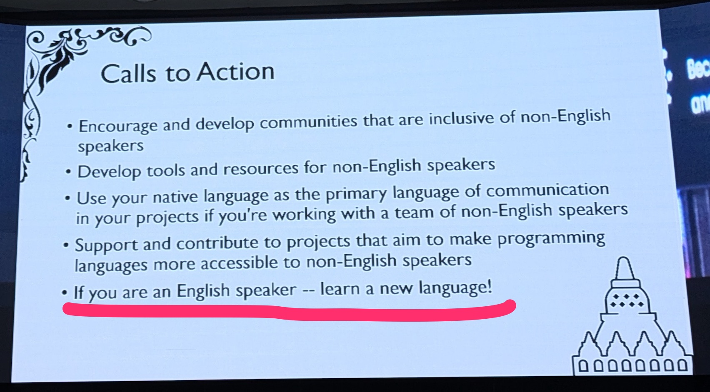

```{eval-rst}
:og:image: _images/20250301pyconapac.png
:og:image:alt: How to learn Japanese with Python

.. |cover| image:: images/20250301pyconapac.png
```

# How to learn **Japanese** w/ **Python**


```{eval-rst}
.. |background| image:: images/pyconapac2025-template.png
```

```{revealjs-section}
:data-background-image: ../_images/pyconapac2025-template.png
:data-background-size: cover
```

Takanori Suzuki

PyCon APAC 2025 / 2025 Mar 1

```{revealjs-notes}
Salamat sa pagpunta
Ang pangalan ko ay Takanori Suzuki.
```

## Agenda ✅

* Background and Motivation / Goal
* Japanese is Difficult
* Python supports Japanese leaning

```{revealjs-notes}
* The agenda for this talk is as follows.
* I will talk about Background, Motivation and goal of this talk.
* Next, I will introduce some of the difficulties of the Japanese language.
* In the last part, I will explain how Python supports Japanese language learning, with examples.
```

## Background and Motivation 🏞️

```{revealjs-notes}
* Backgorund and Motivation of this talk...
```

### Background and Motivation

* Developing School **Textbook Web** at work
  * Japanese NLP to make it **Easier to Learn**
* Python libs could help people **Learn Japanese**

```{revealjs-notes}
* Backgorund and Motivation of this talk...
* I am developing web-based Textbook for jounior high school students at work.
* I am using Japanese NLP to make the textbook easier to learn.
* Based on this experience, I thought Python libraries could help people learn Japanese.
```

### Background and Motivation(cont.)

* [FSI language difficulty](https://www.fsi-language-courses.org/blog/fsi-language-difficulty/)
  * Japanese is "**super-hard languages**" for English speakers to learn
  * Mandarin, Cantonese, Korean and Arabic
  
```{revealjs-notes}
* "FSI language difficulty" reports Japanese is ...
* Others are Mandarin, ...
```

### Background and Motivation(cont.)



  
```{revealjs-notes}
"learn a new language!" by Anthony Show in his PyCon APAC 2024 keynote.
I hope my talk will help Pythonistas who want to learn Japanese.
```

### Goal

* What is **difficult** about Japanese
* How to use **Japanese NLP** libs and APIs
* Python could support **learning Japanese**

```{revealjs-notes}
* The goals of this talk are
* You know what is difficult about the Japanese language,
* You know how to use the Japanese NLP libraries and APIs and
* You understand that Python could support Japanese language learning
```

## Photos 📷 Share 🐦 👍

`#pyconapac` / `@takanory`

### [`slides.takanory.net`](https://slides.takanory.net) 💻

```{image} images/slides-takanory-net.png
:alt: slides.takanory.net
:width: 75%
```

```{revealjs-notes}
This slide has been published.
Please visit slides.takanory.net or via QR code and click on the "Slides" link!
```

## Who am I? 👤

```{revealjs-break}
:notitle:
```

- Takanori Suzuki / 鈴木 たかのり ({fab}`twitter` [@takanory](https://twitter.com/takanory))
- [PyCon JP Association](https://www.pycon.jp/committee/english.html/): Chair
- [BeProud Inc.](https://www.beproud.jp/): Director / Python Climber
- [Python Boot Camp](https://www.pycon.jp/support/bootcamp.html), [Python mini Hack-a-thon](https://pyhack.connpass.com/), [Python Bouldering Club](https://kabepy.connpass.com/)
- Love: Ferrets, LEGO, 🍺 / Hobby: 🎺, 🧗‍♀️


```{revealjs-notes}
I'm Takanori Suzuki. My X(Twitter) is "takanory", please follow me.
I'm a Chair of PyCon JP Association.
And I'm a director of BeProud Inc and my title is "Python CLimber".
I'm also active in several Python related communities in Japan.
```

### PyCon JP Association

{fas}`globe` [`www.pycon.jp`](https://www.pycon.jp/committee/english.html)

**Nonprofit** organization for **Python users** in Japan, to **promote Python** and supports its development. Further it is **our goal** to hold an annual **PyCon JP**.

```{revealjs-notes}
PyCon JP Association is a nonprofit...
We hold PyCon JP every year.
Do you know PyCon JP?
```


### PyCon JP **2025**

* {fas}`globe` [`2025.pycon.jp`](https://2025.pycon.jp/)
* Date: 2025 **Sep 26**(Fri)-**27**(Sat)
* Place: **Hiroshima**, Japan
* There are **English talks**

```{image} images/pyconjp2025-in-hiroshima.jpg
:alt: PyCon JP 2025 in Hiroshima
:width: 60%
```

```{revealjs-notes}
PyCon JP 2025 will be held in Hiroshima at the end of September.
This is the first PyCon JP to be held outside of Tokyo.
Do you know Hiroshima?...
```

### Hiroshima? ⛩️

* Fukushima - **Hiroshima** - Kyoto - Tokyo - Hokkaido
* [Direct flights to Hiroshima - HIJ, Japan](https://www.directflights.com/to/HIJ)
  * Seoul, Taipei, Shanghai, Hong Kong, Dalian, Hanoi

```{image} https://maps.directflights.com/directflights/800/HIJ.jpg
:alt: Direct flights to Hiroshima
:width: 40%
```

```{revealjs-notes}
Do you know Hiroshima?...
Hiroshima location is west of Tokyo and Kyoto.
Hiroshima has several direct flights from overseas, but sorry, no direct flights from indonesia.
But I came here in Yogyakarta. You should be able to go to Hiroshima too.
```

## Questions {nekochan}`hai`

### Have you **learned** Japanese? {nekochan}`study`

### Are you **interested** in Japanese? {nekochan}`miru`

### Would you like to **visit** Japan? {nekochan}`travel`

```{revealjs-notes}
Almost everyone.
There is a very good opportunity for you...
```

### PyCon JP **2025** {nekochan}`yoshi`

* {fas}`globe` [`2025.pycon.jp`](https://2025.pycon.jp/)
* Date: 2025 **Sep 26**(Fri)-**27**(Sat)
* Place: **Hiroshima**, Japan
* There are **English talks**

```{image} images/pyconjp2025-in-hiroshima.jpg
:alt: PyCon JP 2025 in Hiroshima
:width: 60%
```

```{revealjs-notes}
PyCon JP 2025 will be held in Hiroshima in next September.
See you again at PyCon JP 2025.
```

## Japanese is **Difficult** {nekochan}`yabai`

* **3 Types** of Characters
* **No Spaces** between Words
* **Multiple Readings** of Kanji

```{revealjs-notes}
I will show you 3 difficult points of the Japanese language.
```

### **3 Types** of Characters

English | Snake | Beer
-- | -- | --
Pronounciation | hebi | biːru
Hiragana | へび | びーる
Katakana | ヘビ | ビール
Kanji | 蛇 | 麦酒

```{revealjs-notes}
Japanese language has 3 types of characters: hiragana, katakana, and kanji.
This table shows 3 different caracthers for each snake and beer
```

### **No Spaces** between Words

<ruby>すもももももももものうち<rt> su mo mo mo mo mo mo mo mo no u chi </rt></ruby>

```{revealjs-break}
```

すもももももももものうち

↓

すもも/も/もも/も/もも/の/うち

"Plums and peaches are part of peaches"

```{revealjs-notes}
This sentence is a play on words, but it is correct Japanese.
Most Japanese can correctly break this sentence into words.
```

### **Multiple Readings** of Kanji

* **日**: day, sun

```{revealjs-notes}
For example. This kanji means day or sun.
```

```{revealjs-break}
```

* 2 **styles of readings**
* **Japanese**-style reading(<ruby>訓読み<rt>kun yomi</rt></ruby>)
* **Chinese**-style reading(<ruby>音読み<rt>on yomi</rt></ruby>)

```{revealjs-notes}
Many kanji have 2 styles of readings.
```
  
```{revealjs-break}
```

* **日**: day, sun
* **Japanese**-style reading: にち(nichi)、ひ(hi)
* **Chinese**-style reading: じつ(jitsu)、か(ka)

```{revealjs-notes}
This kanji has a total of four different readings.
```

```{revealjs-break}
```

* Japanese-style reading: にち(nichi)、ひ(hi)
* Chinese-style reading: じつ(jitsu)、か(ka)
* How to read?
  * 日曜日 (Sunday)
  * 前日 (Previous day)

```{revealjs-break}
```

* <ruby>日<rt>**nichi**</rt></ruby><ruby>曜<rt>yo</rt></ruby><ruby>日<rt>**bi**</rt></ruby> (Sunday)
  * Japanese-style reading: にち(nichi)、ひ(hi)
* <ruby>前<rt>zen</rt></ruby><ruby>日<rt>**jitsu**</rt></ruby> (Previous day)
  * Chinese-style reading: じつ(jitsu)、か(ka)

### Japanese is **Difficult**!! {nekochan}`scream`

```{revealjs-notes}
Japanese is Difficult!! But...
```

## {fab}`python` **Python** supports **Japanese** leaning

```{revealjs-notes}
We have Python!!
```

## **`<ruby>`** HTML Tag 💎

```{revealjs-notes}
I will explain the ruby tag before I talk about Python
```

### What is **Ruby** ?

* <ruby>ルビ<rt>ruby</rt></ruby> characters are **small annotation**
* Usually placed **above** the text
* ref: [Ruby character - Wikipedia](https://en.wikipedia.org/wiki/Ruby_character)
* (Not a Programming Language)

### **`<ruby>`** HTML Tag 💎

* `<ruby>` represents **small annotations**
* `<rt>` specifies the **ruby text** component

<ruby>PyCon<rt>Python Conference</rt></ruby>
<ruby>APAC<rt>Asia Pacific</rt></ruby>
2024

```html
<ruby>PyCon<rt>Python Conference</rt></ruby>
<ruby>APAC<rt>Asia Pacific</rt></ruby>
2024
```

* ref: [`<ruby>`: The Ruby Annotation element](https://developer.mozilla.org/en-US/docs/Web/HTML/Element/ruby)

```{revealjs-notes}
If I write a ruby tag like this, it will be displayed like this in a web browser
```

### Indicate **pronunciation** with `<ruby>`

* **Alphabet** annotation: Pronounciation

<ruby>パイコン<rt>pa i ko n</rt></ruby>
<ruby>えいぱっく<rt>e i pa kku</rt></ruby>
(PyCon APAc)

```html
<ruby>パイコン<rt>pa i ko n</rt></ruby>
<ruby>えいぱっく<rt>e i pa kku</rt></ruby>
```

```{revealjs-notes}
This slide uses the ruby tag to indicate pronunciation with alphabet.
```

```{revealjs-break}
```

* **Hiragana** annotation: Readings
* <ruby>ふりがな<rt>fu ri ga na</rt></ruby>

<ruby>フィリピン<rt>ふぃりぴん</rt></ruby>
<ruby>共和国<rt>きょうわこく</rt></ruby>
(Republic of the Philippines)

```html
<ruby>フィリピン<rt>ふぃりぴん</rt></ruby>
<ruby>共和国<rt>きょうわこく</rt></ruby>
```

```{revealjs-notes}
The ruby tag is also used to Furigana, the reading of other characters in hiragana.
```

### Understand **`<ruby>`** Tag {nekochan}`naruhodo`

```{revealjs-notes}
Now we understand the ruby tag, let's move on to Python.
```

## **Hiragana** and **Katakana** (あ / ア)

hebi / へび / ヘビ

### **Hiragana** and **Katakana**

* Hiragana and Katakana are **phonogram**
* 1 character represent a phoneme(speech sound)
  * Like a Japanese **alphabet**
* Hiragana: <ruby>あかさたな<rt> a ka sa ta na</rt></ruby>...
* Katakana: <ruby>アカサタナ<rt> a ka sa ta na</rt></ruby>...

```{revealjs-break}
```

* Basically use Hiragana
  * <ruby>まにら<rt>ma ni ra </rt></ruby> (Manila)
* Katakana is used for foreign words
  * <ruby><ruby>パイコン<rt>pa i ko n </rt></ruby> (PyCon)

### **Romanization** of Japanese (Romaji)

* **Alphabet** to represent Japanese
* **Romaji** is often used on **Information Sign**


* Learn **Hiragana**/**Katakana** using Romaji

### jaconv

* [jaconv](https://github.com/ikegami-yukino/jaconv): interconverter for Hiragana, Katakana, alphabet and etc.

```bash
$ python3.12 -m venv env
$ . env/bin/activate
(env) pip install jaconv
```

```pycon
>>> import jaconv
>>> jaconv.kana2alphabet("まにら")  # Hiragana -> alphabet
'manira'
>>> jaconv.kata2alphabet("パイコン")  # Katakana -> alphabet
'paikon'
```

### Add **Romaji** annotation

kana2roman.py

```{revealjs-literalinclude} code/kana2roman.py
:data-line-numbers: 2,4-7|9-12
```

```{revealjs-break}
```

```bash
(env) $ python kana2roman.py パイコンえいぱっく
<ruby>パイコンえいぱっく<rt>paikoneipakku</rt></ruby>
```

<ruby>パイコンえいぱっく<rt>paikoneipakku</rt></ruby>

### Can read **Hiragana** and **Katakana** {nekochan}`good`

## **No Spaces** between Words

<ruby>すもももももももものうち<rt> su mo mo mo mo mo mo mo mo no u chi </rt></ruby>

```{revealjs-break}
```

* Japanese has **no spaces** between words
* Use **Dictionary** to **Recognise** words
* Japanese **Morphological Analyzer** library required

### Japanese **Morphological Analyzer**

* see: {fab}`github` [taishi-i/awesome-japanese-nlp-resources](https://github.com/taishi-i/awesome-japanese-nlp-resources?tab=readme-ov-file#morphology-analysis)

```{image} images/japanese-nlp.png
:alt: Japanese Morphological Analyzers
:width: 60%
```

```{revealjs-notes}
There are many morphological analyzer libraries for Japanese.
```

### Japanese **Morphological Analyzer**

* SudachiPy: [pypi.org/project/SudachiPy](https://pypi.org/project/SudachiPy/)
* SudachiDcit: [pypi.org/project/SudachiDict-core](https://pypi.org/project/SudachiDict-core/)

```bash
(env) $ pip install sudachipy sudachidict_core
```

```{revealjs-notes}
In this case, I use SudachiPy and SudachiDict
```

### SudachiPy

* Made with **Rust**, Very **Fast**
* **Three Types** of Dictionaries
  * Small: small vocabulary
  * **Core**: basic vocabulary (**default**)
  * Full: miscellaneous proper nouns

```{revealjs-notes}
SudachiPy is made by Rust and is very fast.
SudachiDict has three types different dictionaries with different number of vocabularies.
Here I use core dictionary, the default.
```

### **Word Segmentation**

* **Split** the words using **Dictionary**

```pycon
>>> from sudachipy import Dictionary
>>> tokenizer = Dictionary().create()
>>> text = "すもももももももものうち"
>>> for token in tokenizer.tokenize(text):
...     print(token)
... 
すもも
も
もも
も
もも
の
うち
```

* **Cannot read** Hiragana?


### **Word Segmentation** with Romaji

word_segmentation.py

```{revealjs-literalinclude} code/word_segmentation.py
:data-line-numbers: 2,5|3,7-11
```

```{revealjs-break}
```

```bash
(env) $ python word_segmentation.py すもももももももものうち
<ruby>すもも<rt>sumomo</rt></ruby> / <ruby>も<rt>mo</rt></ruby> / <ruby>もも<rt>momo</rt></ruby> / <ruby>も<rt>mo</rt></ruby> / <ruby>もも<rt>momo</rt></ruby> / <ruby>の<rt>no</rt></ruby> / <ruby>うち<rt>uchi</rt></ruby>
```

<ruby>すもも<rt>sumomo</rt></ruby> / <ruby>も<rt>mo</rt></ruby> / <ruby>もも<rt>momo</rt></ruby> / <ruby>も<rt>mo</rt></ruby> / <ruby>もも<rt>momo</rt></ruby> / <ruby>の<rt>no</rt></ruby> / <ruby>うち<rt>uchi</rt></ruby>

### Can **split** into **Words** {nekochan}`clap`

## **Multiple Readings** of Kanji

<ruby>日曜日<rt>nichi you bi</rt></ruby>、<ruby>前日<rt>zen jitsu</rt></ruby>

### **Multiple Readings** of Kanji

* **日**: day, sun
* **Japanese**-style reading(<ruby>訓読み<rt>kun yomi</rt></ruby>): 
  <ruby>にち<rt>ni chi</rt></ruby>, <ruby>ひ<rt>hi</rt></ruby>
* **Chinese**-style reading(<ruby>音読み<rt>on yomi</rt></ruby>):
  <ruby>じつ<rt>ji tsu</rt></ruby>, <ruby>か<rt>ka</rt></ruby>

```{revealjs-break}
```

* **日** 曜 **日** (Sunday): 
  <ruby>**にち**<rt>ni chi</rt> <ruby>よう<rt>yo u</rt> <ruby>**び**<rt>bi</rt></ruby>
* 前 **日** (Previous day):
  <ruby>ぜん<rt>ze n</rt> <ruby>**じつ**<rt>ji tsu</rt>
  
### {nekochan}`pokan`

```{revealjs-notes}
It's difficult, but not only this.
```

### Multiple Readings of **Kanji idioms**

* Same combination but **different readings**
* **一日**: first day, one day
  * **一日** 目(Day 1)
  * 一月 **一日**(Jan 1st)

```{revealjs-break}
```

* Same combination but **different readings**
* **一日**: first day, one day
  * **一日** 目(Day 1): <ruby>**いちにち**<rt>i chi ni chi</rt></ruby> <ruby>め<rt>me</rt></ruby>
  * 一月 **一日**(Jan 1st): <ruby>いちがつ<rt>i chi ga tsu</rt></ruby> <ruby>**ついたち**<rt>tsu i ta chi</rt></ruby>

### {nekochan}`yabai;1.5em` {nekochan}`yabai;1.5em`

```{revealjs-notes}
Terrible...
And there is more...
```

### **Special readings** of Kanji idioms

* 今 **日** (today)
* 昨 **日** (yesterday)
* 明 **日** (tomorrow)

```{revealjs-break}
```

* 今 **日** (today): <ruby>きょう<rt>kyo u</rt></ruby>
* 昨 **日** (yesterday): <ruby>きのう<rt>ki no u</rt></ruby>
* 明 **日** (tomorrow): <ruby>あした<rt>a shi ta</rt></ruby>

### {nekochan}`scream;2em` {nekochan}`scream;2em` {nekochan}`scream;2em`

## Get **Reading** of Kanji

* 今 **日** は一月一 **日** で **日** 曜 **日**
* Today is January 1st, Sunday

### Get **Reading** of Kanji

* Use **SudachiPy** and **SudachiDict**
* `reading_form()`: Reading in Katakana

```pycon
>>> from sudachipy import Dictionary
>>> tokenizer = Dictionary().create()
>>> text = "今日は一月一日で日曜日"
>>> for token in tokenizer.tokenize(text):
>>>     print(token, token.reading_form())
... 
今日 キョウ
は ハ
一 イチ
月 ガツ
一日 ツイタチ
で デ
日曜日 ニチヨウビ
```

```{revealjs-break}
```

* Cannot read **Katakana**? Use **jaconv**!

```
>>> import jaconv
>>> for token in tokenizer.tokenize(text):
...     reading = token.reading_form()
...     hiragana = jaconv.kata2hira(reading)
...     romaji = jaconv.kata2alphabet(reading)
...     print(f"{token}, {reading}, {hiragana}, {romaji}")
... 
今日, キョウ, きょう, kyou
は, ハ, は, ha
一, イチ, いち, ichi
月, ガツ, がつ, gatsu
一日, ツイタチ, ついたち, tsuitachi
で, デ, で, de
日曜日, ニチヨウビ, にちようび, nichiyoubi
```

### **Add Reading** to Kanji

kanji_reading.py

```{revealjs-literalinclude} code/kanji_reading.py
:data-line-numbers: 3,5|7-13
```

```{revealjs-break}
```

<ruby>今日<rt>きょう</rt></ruby>
<ruby>は<rt>は</rt></ruby>
<ruby>一<rt>いち</rt></ruby>
<ruby>月<rt>がつ</rt></ruby>
<ruby>一日<rt>ついたち</rt></ruby>
<ruby>で<rt>で</rt></ruby>
<ruby>日曜日<rt>にちようび</rt></ruby>

```bash
(env) $ python kanji_reading.py 今日は一月一日で日曜日
<ruby>今日<rt>きょう</rt></ruby>
<ruby>は<rt>は</rt></ruby>
<ruby>一<rt>いち</rt></ruby>
<ruby>月<rt>がつ</rt></ruby>
<ruby>一日<rt>ついたち</rt></ruby>
<ruby>で<rt>で</rt></ruby>
<ruby>日曜日<rt>にちようび</rt></ruby>
```

```{revealjs-break}
```

kanji_reading_romaji.py

```{revealjs-literalinclude} code/kanji_reading_romaji.py
:data-line-numbers: 11,12
```

```{revealjs-break}
```

<ruby>今日<rt>kyou</rt></ruby>
<ruby>は<rt>ha</rt></ruby>
<ruby>一<rt>ichi</rt></ruby>
<ruby>月<rt>gatsu</rt></ruby>
<ruby>一日<rt>tsuitachi</rt></ruby>
<ruby>で<rt>de</rt></ruby>
<ruby>日曜日<rt>nichiyoubi</rt></ruby>

```bash
(env) $ python kanji_reading_romaji.py 今日は一月一日で日曜日
<ruby>今日<rt>kyou</rt></ruby>
<ruby>は<rt>ha</rt></ruby>
<ruby>一<rt>ichi</rt></ruby>
<ruby>月<rt>gatsu</rt></ruby>
<ruby>一日<rt>tsuitachi</rt></ruby>
<ruby>で<rt>de</rt></ruby>
<ruby>日曜日<rt>nichiyoubi</rt></ruby>
```

### Can read **Kanji** {nekochan}`medetai`

## Can read but **Cannnot Pronouce** {nekochan}`sing`

### Readings and Pronounciations are **slightly different**

* Readings: ou / ei
* Pronounciaciton: oo / ee
* <ruby><ruby>東京<rt>とうきょう</rt></ruby><rt>tou kyou</rt></ruby> / 
  <ruby><ruby>英語<rt>えいご</rt></ruby><rt>ei go</rt></ruby>

### Text to **Speech**

* [Amazon Polly - AWS](https://aws.amazon.com/polly/)
  * 5 million chars free per month for 12 months
* [Polly - Boto3 documentation](https://boto3.amazonaws.com/v1/documentation/api/latest/reference/services/polly.html)

```bash
(env) $ pip install boto3
```

```bash
(env) $ export AWS_ACCESS_KEY_ID=AKIAYI...
(env) $ export AWS_SECRET_ACCESS_KEY=ZoWbpmi...
(env) $ export AWS_DEFAULT_REGION=ap-northeast-1
```

```{revealjs-break}
```

text_to_speech.py

```{revealjs-literalinclude} code/text_to_speech.py
:data-line-numbers: 2,4|6-8|9,10
```

```{revealjs-break}
```

```bash
(env) $ python text_to_speech.py 東京、英語
```

```{audio} code/japanese.mp3
```

### Can pronounce **Japanese**  {nekochan}`medetai` {nekochan}`medetai`

## **Sample** App

* {fab}`github` [learn_jp_apac.py](https://github.com/takanory/learn-jp-with-python/blob/main/learn_jp_apac.py)

```bash
% git clone https://github.com/takanory/learn-jp-with-python.git
% cd learn-jp-with-python/
% python3.12 -m venv env
% . env/bin/activaet
(env) % pip install -r requirements.txt
(env) % streamlit run learn_jp_apac.py
```

```{revealjs-break}
```

```{image} images/demo_app.gif
:alt: Demo App
:width: 75%
```

## **Summary** {nekochan}`tunda`

* Japanese is **Difficult**
  * 3 Charcters, No spaces, Kanji readings
* Python supports Japanese learning
  * **jaconv**: Interconverter
  * **SudachiPy**: Morphological analyzer
  * **Amazon Polly**: Text to Speech
  
## 🇯🇵 ❤️ {fab}`python`

Learn **Japanese** with **Python**

```{revealjs-notes}
Please try to create your own Japanese learning tool!
```

## Thank you {nekochan}`pray`

{fas}`desktop` [slides.takanory.net](https://slides.takanory.net/)
{fas}`code` [sample code](https://github.com/takanory/slides/tree/master/slides/20250301pyconapac/code)

{fab}`twitter` [takanory](https://twitter.com/takanory)
{fab}`github` [takanory](https://github.com/takanory/)
{fab}`linkedin` [takanory](https://www.linkedin.com/in/takanory/)
{fab}`untappd` [takanory](https://untappd.com/user/takanory/)


