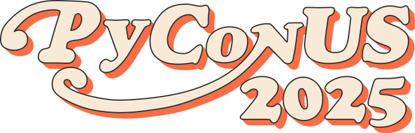

```{eval-rst}
:og:image: _images/20250516pyconus.png
:og:image:alt: How to learn Japanese with Python

.. |cover| image:: images/20250516pyconus.png
```

# How to learn **Japanese** w/ **Python**

Takanori Suzuki



PyCon US 2025 / 2025 May 16

## Agenda ✅

* Background and Motivation / Goal
* Japanese is Difficult
* Python supports Japanese leaning

```{revealjs-notes}
* The agenda for this talk is as follows.
* I will talk about Background, Motivation and goal of this talk.
* Next, I will introduce some of the difficulties of the Japanese language.
* In the last part, I will explain how Python supports Japanese language learning, with examples.
```

### PyCon US 2024

* PyCon US 2024のLightning Talkで同じアイデアのトークをしました
* 今日は、その内容をさらに詳細に語っています

## Background and Motivation 🏞️

```{revealjs-notes}
* Backgorund and Motivation of this talk...
```

### Background and Motivation

* Developing School **Textbook Web** at work
  * Japanese NLP to make it **Easier to Learn**
* Python libs could help people **Learn Japanese**

```{revealjs-notes}
* Backgorund and Motivation of this talk...
* I am developing web-based Textbook for jounior high school students at work.
* I am using Japanese NLP to make the textbook easier to learn.
* Based on this experience, I thought Python libraries could help people learn Japanese.
```

### Background and Motivation(cont.)

* [FSI language difficulty](https://www.fsi-language-courses.org/blog/fsi-language-difficulty/)
  * Japanese is "**super-hard languages**" for English speakers to learn
  * Mandarin, Cantonese, Korean and Arabic
  
```{revealjs-notes}
* "FSI language difficulty" reports Japanese is ...
* Others are Mandarin, ...
```

### Background and Motivation(cont.)


  
```{revealjs-notes}
This images is from Anthony Shaw's keynote at PyCon APAC 2024.
He said "If you are an English speaker - learn a new language!".
I hope my talk will help Pythonistas who want to learn Japanese.a
```

### Goal

* What is **difficult** about Japanese
* How to use **Japanese NLP** libs and APIs
* Python could support **learning Japanese**

```{revealjs-notes}
* The goals of this talk are
* You know what is difficult about the Japanese language,
* You know how to use the Japanese NLP libraries and APIs and
* You understand that Python could support Japanese language learning
```

## Photos 📷 Share 🐦 👍

`#pyconapac` / `@takanory`

### [`slides.takanory.net`](https://slides.takanory.net) 💻

```{image} images/slides-takanory-net.png
:alt: slides.takanory.net
:width: 75%
```

```{revealjs-notes}
This slide has been published.
Please visit slides.takanory.net or via QR code and click on the "Slides" link!
```

## Who am I? 👤

```{revealjs-break}
:notitle:
```

- Takanori Suzuki / 鈴木 たかのり ({fab}`twitter` [@takanory](https://twitter.com/takanory))
- [PyCon JP Association](https://www.pycon.jp/committee/english.html/): Chair
- [BeProud Inc.](https://www.beproud.jp/): Director / Python Climber
- [Python Boot Camp](https://www.pycon.jp/support/bootcamp.html), [Python mini Hack-a-thon](https://pyhack.connpass.com/), [Python Bouldering Club](https://kabepy.connpass.com/)
- Love: Ferrets, LEGO, 🍺 / Hobby: 🎺, 🧗‍♀️


```{revealjs-notes}
I'm Takanori Suzuki. My X(Twitter) is "takanory", please follow me.
I'm a Chair of PyCon JP Association.
And I'm a director of BeProud Inc and my title is "Python CLimber".
I'm also active in several Python related communities in Japan.
```

### PyCon JP Association

{fas}`globe` [`www.pycon.jp`](https://www.pycon.jp/committee/english.html)

**Nonprofit** organization for **Python users** in Japan, to **promote Python** and supports its development. Further it is **our goal** to hold an annual **PyCon JP**.

```{revealjs-notes}
PyCon JP Association is a nonprofit...
We hold PyCon JP every year.
Do you know PyCon JP?
```


### PyCon JP **2025**

* {fas}`globe` [`2025.pycon.jp`](https://2025.pycon.jp/)
* Date: 2025 **Sep 26**(Fri)-**27**(Sat)
* Place: **Hiroshima**, Japan
* There are **English talks**

```{image} images/pyconjp2025-in-hiroshima.jpg
:alt: PyCon JP 2025 in Hiroshima
:width: 60%
```

```{revealjs-notes}
PyCon JP 2025 will be held in Hiroshima at the end of September.
This is the first PyCon JP to be held outside of Tokyo.
Do you know Hiroshima?...
```

### Hiroshima? ⛩️

* Fukuoka - **Hiroshima** - Kyoto - Tokyo - Hokkaido
* [Direct flights to Hiroshima - HIJ, Japan](https://www.directflights.com/to/HIJ)
  * Seoul, Taipei, Shanghai, Hong Kong, Dalian, Hanoi

```{image} https://maps.directflights.com/directflights/800/HIJ.jpg
:alt: Direct flights to Hiroshima
:width: 40%
```

```{revealjs-notes}
Do you know Hiroshima?...
Hiroshima location is west of Tokyo and Kyoto.
Hiroshima has several direct flights from overseas, but sorry, no direct flights from Philippines.
```

## Questions {nekochan}`hai`

### Have you **learned** Japanese? {nekochan}`study`

### Are you **interested** in Japanese? {nekochan}`miru`

### Would you like to **visit** Japan? {nekochan}`travel`

```{revealjs-notes}
Almost everyone.
There is a very good opportunity for you...
```

### PyCon JP **2025** {nekochan}`yoshi`

* {fas}`globe` [`2025.pycon.jp`](https://2025.pycon.jp/)
* Date: 2025 **Sep 26**(Fri)-**27**(Sat)
* Place: **Hiroshima**, Japan
* There are **English talks**

```{image} images/pyconjp2025-in-hiroshima.jpg
:alt: PyCon JP 2025 in Hiroshima
:width: 60%
```

```{revealjs-notes}
PyCon JP 2025 will be held in Hiroshima in next September.
See you again at PyCon JP 2025.
```

## Multiple Readings of Kanji

* 人を使った熟語
* 日本人、
* 人気(にんき、ひとけ)
* 一人、二人、大人
