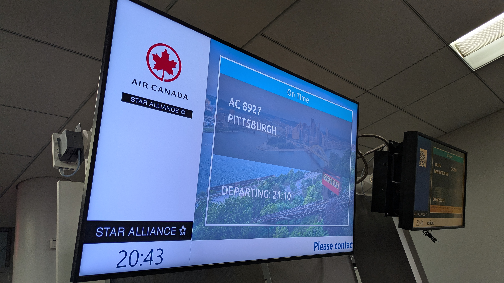
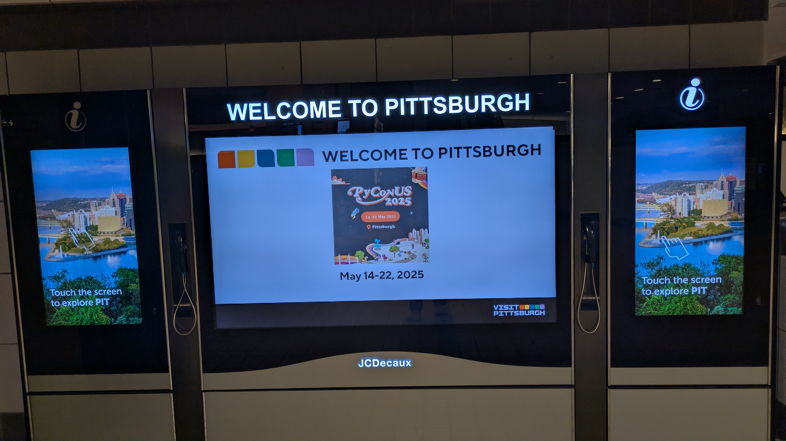
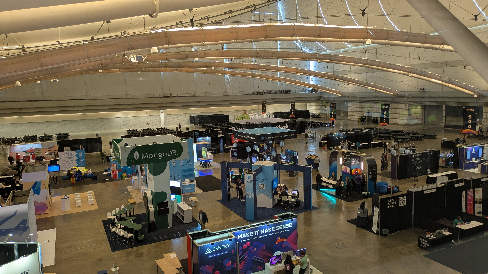
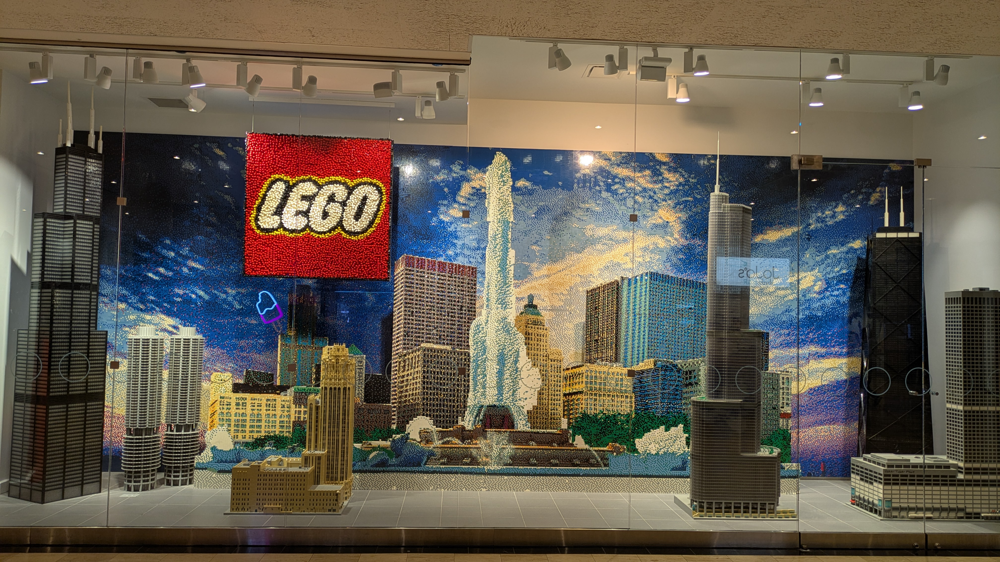

```{eval-rst}
:og:image: _images/20250703bpstyle.png
:og:image:alt: PyCon US Travelogue

.. |cover| image:: images/20250703bpstyle.png
```

# **PyCon US** 2025 Travelogue {nekochan}`travel`

Takanori Suzuki

```{image} /20250516pyconus/images/pyconus2025-logo.svg
:alt: PyCon US 2025 logo
:width: 50%
```

BPStyle 174 / 2025 Jul 3

## PyCon US 2025 {nekochan}`usagi`

* {fas}`globe` [`us.pycon.org/2025`](https://us.pycon.org/2025/)
* City: Pittsburgh, PA
* Venue: [David L. Lawrence Convention Center](https://www.pittsburghcc.com/)
* Date: 2025 May 14-22

### Schedule {nekochan}`calendar`

* May 14: ✈️ Haneda -> Toronto -> Pittsburgh
* May 15: 📛 **Opening Reception**
* May 16-18: 🎙️ **Conference**
* May 19: 💻 **Sprint**
* May 20: 🚗 Pittsburgh -> Chicago
* May 21: 🍺 Chicago
* May 22: ✈️ Chicago -> Toronto -> Haneda

## May 14: ✈️ Haneda -> Toronto -> Pittsburgh

### Haneda -> Toronto (12h25m)


### Toronto Ariport {nekochan}`beer`

```{image} images/toronto-beer.jpg
:width: 35%
```

### Toronto -> Pittsburgh (1h17m)



### Pittsburgh Airport



## May 15: 📛 **Opening Reception**

### Lunch {nekochan}`beer`

```{image} images/lunch-beer.jpg
:width: 35%
```

### Badge

```{image} images/badge.jpg
:width: 35%
```

### Booth



### [Python Asia Organization](https://pythonasia.org/) Booth


### Terada with Guido

```{image} images/terada-with-guido.jpg
:width: 50%
```

### Anaconda Happy Hour {nekochan}`beer`

```{image} images/anaconda.jpg
:width: 35%
```
## May 16: 🎙️ **Conference** Day 1

### Breakfast {nekochan}`gohan`


### Opening


```{revealjs-break}
```


### My Talk {nekochan}`doya`


```{revealjs-break}
```

<iframe width="800" height="450" src="https://www.youtube.com/embed/3wQxP-GfT-A?si=VTkrjDLAaL8YtyCQ" title="YouTube video player" frameborder="0" allow="accelerometer; autoplay; clipboard-write; encrypted-media; gyroscope; picture-in-picture; web-share" referrerpolicy="strict-origin-when-cross-origin" allowfullscreen></iframe>

### After my Talk {nekochan}`juutai`


### Lunch {nekochan}`gohan-taberu`


### Duolingo Party {nekochan}`beer`

```{image} images/duolingo.jpg
:width: 35%
```

```{revealjs-break}
```

```{image} images/duo.jpg
:width: 35%
```

## May 17: 🎙️ **Conference** Day 2

### Keynote: Lynn Root


### Conference Chair: Elaine


### Talk: Why `len("😶‍🌫️") == 4`


### PyLadies Auction


```{revealjs-break}
```


```{revealjs-break}
```


## May 18: 🎙️ **Conference** Day 3

### My Lightning Talk {nekochan}`doya`


```{revealjs-break}
```

<iframe width="800" height="450" src="https://www.youtube.com/embed/lXngPPRaqGg?si=rtXgnnal_ChukDRH&amp;start=1009" title="YouTube video player" frameborder="0" allow="accelerometer; autoplay; clipboard-write; encrypted-media; gyroscope; picture-in-picture; web-share" referrerpolicy="strict-origin-when-cross-origin" allowfullscreen></iframe>

### Job Fair

```{image} images/job-fair.jpg
:width: 35%
```

### Poster Session


### Steering Council Panel


```{revealjs-break}
```


### Awards


### PyCon US 2026


### [Penn Brewery](https://www.pennbrew.com/) {nekochan}`beer`


```{revealjs-break}
```

```{image} images/penn-brewery.jpg
:width: 35%
```

### [Church Brew Works](https://churchbrew.com/) {nekochan}`beer`


```{image} images/church-brew1.jpg
:width: 35%
```

```{revealjs-break}
```

```{image} images/church-brew2.jpg
:width: 35%
```

## May 19: 💻 **Sprint**

### Sprint Board 

```{image} images/sprint-board.jpg
:width: 35%
```

### Bridge


### [Coop de Ville](https://coopdevillepgh.com/) {nekochan}`beer`


```{revealjs-break}
```


## May 20: 🚗 Pittsburgh -> Chicago

### Drive


```{revealjs-break}
```


```{revealjs-break}
```


```{revealjs-break}
```

<iframe width="800" height="450" src="https://www.youtube.com/embed/rDjYzlPW7hM?si=0MGsd-deHxXSganP" title="YouTube video player" frameborder="0" allow="accelerometer; autoplay; clipboard-write; encrypted-media; gyroscope; picture-in-picture; web-share" referrerpolicy="strict-origin-when-cross-origin" allowfullscreen></iframe>

### Service Plaza


```{revealjs-break}
```


### [District Brew Yards](https://districtbrewyards.com/) {nekochan}`beer`


```{revealjs-break}
```


### [Lou Malnati's](https://www.loumalnatis.com/) {nekochan}`beer`


```{revealjs-break}
```


```{revealjs-break}
```


## May 21: 🍺 Chicago

### [Union Station](https://ja.wikipedia.org/wiki/%E3%83%A6%E3%83%8B%E3%82%AA%E3%83%B3%E9%A7%85_(%E3%82%B7%E3%82%AB%E3%82%B4)) {nekochan}`densha`


### [Flamingo](https://ja.wikipedia.org/wiki/%E3%83%95%E3%83%A9%E3%83%9F%E3%83%B3%E3%82%B4_(%E5%BD%AB%E5%83%8F)) {nekochan}`niwatori`


### [Industry Ales](https://www.industryales.com/) {nekochan}`beer`


```{revealjs-break}
```


### [The Bean (Cloud Gate)](https://www.choosechicago.com/articles/tours-and-attractions/the-bean-chicago/)


### [Chicago Tribune](https://www.chicagotribune.com/)

```{image} images/tribune1.jpg
:width: 35%
```

```{revealjs-break}
```


### [It'Sugar](https://itsugar.com/)


```{revealjs-break}
```


### LEGO Store



### [Off Color Brewing](https://www.offcolorbrewing.com/) {nekochan}`beer`


```{revealjs-break}
```

```{image} images/off-color2.jpg
:width: 35%
```

### [Half Acre Beer](https://halfacrebeer.com/) {nekochan}`beer`


```{revealjs-break}
```


```{revealjs-break}
```

```{image} images/half-acre3.jpg
:width: 35%
```

## May 22: ✈️ Chicago -> Toronto -> Haneda

### Delay 🚗


```{revealjs-break}
```


```{revealjs-break}
```


### Chicago Airport 🇺🇸

```{image} images/ord1.jpg
:width: 35%
```

```{revealjs-break}
```


### Toronto Airport 🇨🇦


```{revealjs-break}
```


```{revealjs-break}
```


### Haneda Airport 🇯🇵


```{revealjs-break}
```


## Laggage was **Broken** {nekochan}`mechanaki`


### New Suitcase {nekochan}`yoshi`

```{image} images/new-suitcase.jpg
:width: 35%
```

### See you in next **Travelogue** {nekochan}`byebye`


## References

* [PyCon US 2025参加レポート | gihyo.jp](https://gihyo.jp/list/group/PyCon-US-2025%E5%8F%82%E5%8A%A0%E3%83%AC%E3%83%9D%E3%83%BC%E3%83%88#rt:/article/2025/06/pycon-us-2025-03)
  * [Conference Day 1まで](https://gihyo.jp/article/2025/06/pycon-us-2025-01)
  * [Conference Day 2](https://gihyo.jp/article/2025/06/pycon-us-2025-02)
  * [Conference Day 3, Sprint](https://gihyo.jp/article/2025/06/pycon-us-2025-03)
* [#53: PyCon US 2025報告会 - 2025-06-13](https://tv.pycon.jp/episode/53.html)
