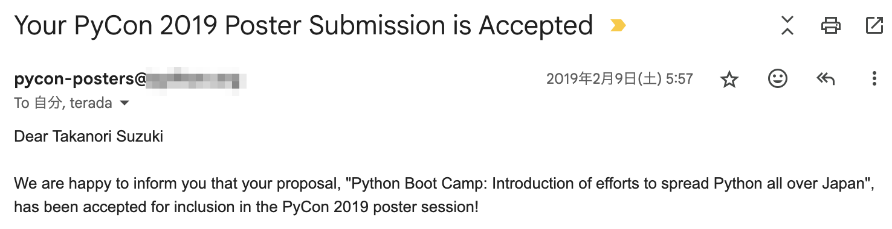
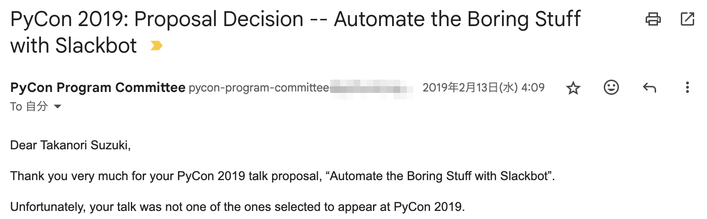
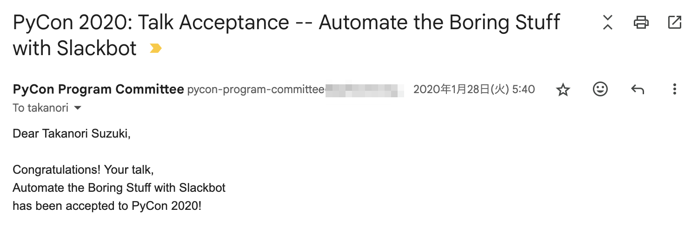
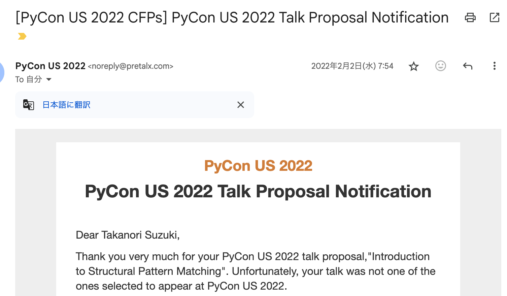
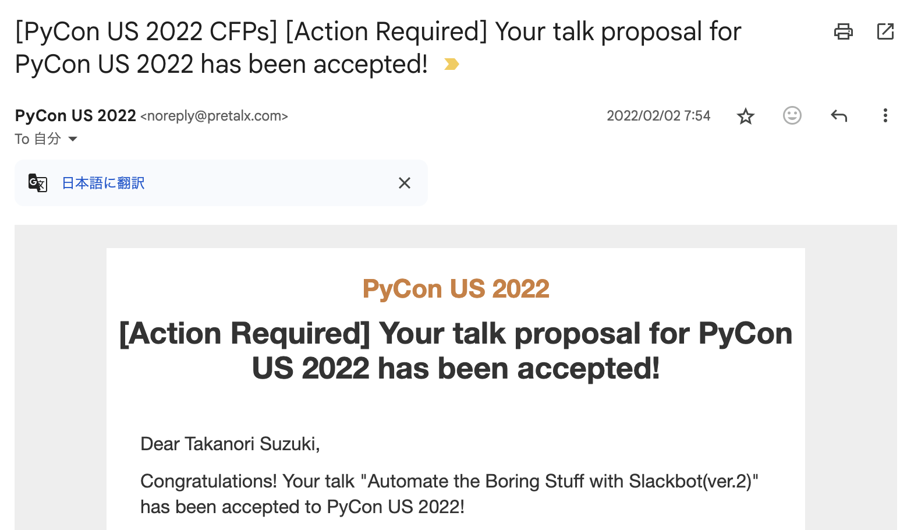
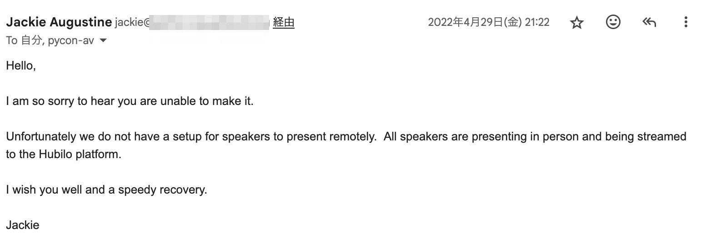
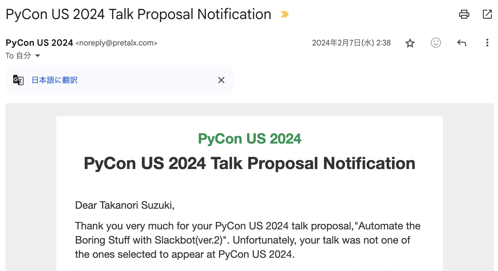
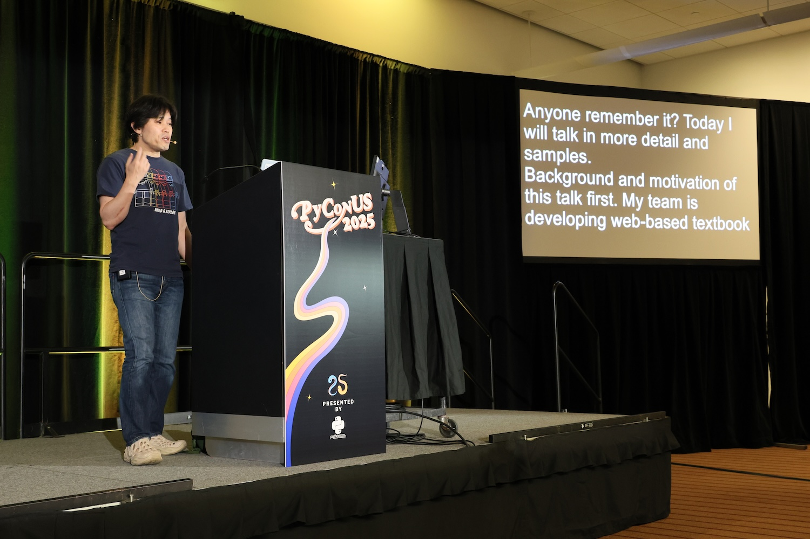
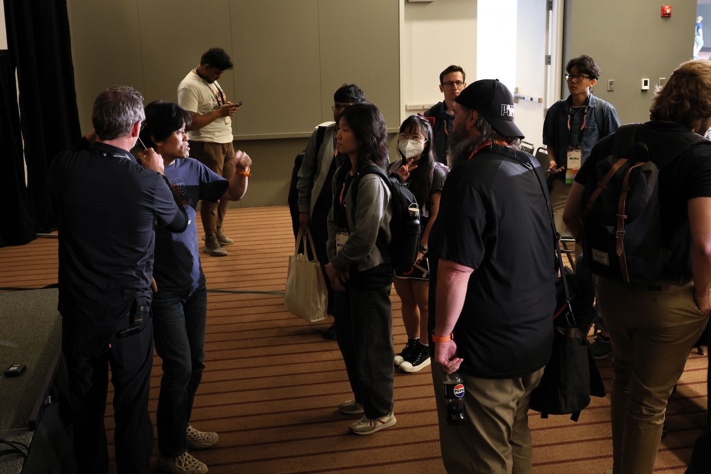
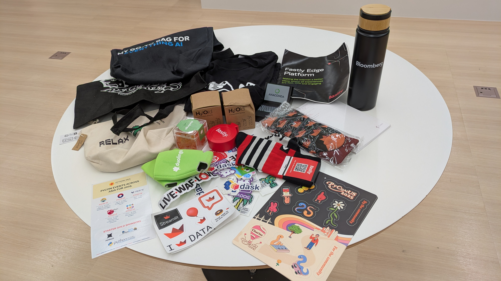

```{eval-rst}
:og:image: _images/20250710usreport.png
:og:image:alt: ついにPyCon USで現地登壇できた！！激闘と苦難の歴史

.. |cover| image:: images/20250710usreport.png
```

# ついに**PyCon US**で**現地登壇**できた‼{nekochan}`yatta`**激闘**と**苦難**の歴史

Takanori Suzuki

PyCOn US 2025参加報告会 / 2025 Jul 10

## **Who** am I? / お前 **誰よ** 👤

* Takanori Suzuki / 鈴木 たかのり ({fab}`twitter` [@takanory](https://twitter.com/takanory))
* [BeProud](https://www.beproud.jp/) 取締役 / Python Climber
* [PyCon JP Association](https://www.pycon.jp/) 代表理事
* [Python Boot Camp](https://www.pycon.jp/support/bootcamp.html) 講師、[Python mini Hack-a-thon](https://pyhack.connpass.com/) 主催、[Pythonボルダリング部](https://kabepy.connpass.com/) 部長


### 趣味(?)：**海外PyCon**登壇 {nekochan}`travel`

### **PyCon現地登壇**の記録[^talklog]

* 2019：🇵🇭🇹🇭🇲🇾🇯🇵🇹🇼🇸🇬🇮🇩
* 2020〜2021：オンライン開催
* 2022：🇮🇪🇯🇵
* 2023：🇰🇷🇹🇼🇯🇵🇭🇰
* 2024：🇹🇼🇯🇵🇮🇩

[^talklog]: <https://slides.takanory.net/> 調べ

### アメリカでは**現地登壇なし** {nekochan}`naki`

### 2019年 ポスター発表(Cleveland) [^2019poster]

```{image} images/guido-with-takanory.jpg
:width: 50%
:alt: Guido with takanory
```

[^2019poster]: [`us.pycon.org/2019`](https://us.pycon.org/2019/)、[レポート記事](https://gihyo.jp/news/report/01/us-pycon2019/0004)、[ポスター（PDF）](https://raw.githubusercontent.com/takanory/slides/master/slides/20190510pycon/pycon-poster-pythonbootcamp.pdf)

### 2023年 参加のみ(Salt Lake City) [^2023report]

```{image} images/takanory-with-friends.jpg
:width: 90%
:alt: takanory with friends
```

[^2023report]: [`us.pycon.org/2023`](https://us.pycon.org/2023/)、[レポート記事](https://gihyo.jp/list/group/PyCon-US-2023-%E5%8F%82%E5%8A%A0%E3%83%AC%E3%83%9D%E3%83%BC%E3%83%88#rt:/article/2023/05/pycon-us2023-001)

### 2024年 Lightning Talk(Pittsburgh) [^2024lt]

```{image} images/takanory-lt2024.jpg
:width: 80%
:alt: takanory LT
```

[^2024lt]: [`us.pycon.org/2024`](https://us.pycon.org/2024/)、[レポート記事](https://gihyo.jp/article/2024/07/pycon-us-2024)、[YouTube](https://www.youtube.com/watch?v=p_Vx3gDHeUI&t=506s)

## 2025年 Pittsburgh

[`us.pycon.org/2025`](https://us.pycon.org/2025/)

### ついに**現地登壇**できた‼[^2025talk] {nekochan}`medetai`

```{image} images/takanory-talk2025.jpg
:width: 80%
:alt: takanory talk
```

[^2025talk]: [レポート記事](https://gihyo.jp/list/group/PyCon-US-2025%E5%8F%82%E5%8A%A0%E3%83%AC%E3%83%9D%E3%83%BC%E3%83%88#rt:/article/2025/06/pycon-us-2025-01)、[YouTube](https://www.youtube.com/watch?v=3wQxP-GfT-A)

### さらに**ライトニングトーク**も‼[^2025lt] {nekochan}`cracker`

```{image} images/takanory-lt2025.jpg
:width: 80%
:alt: takanory lightning talk
```

[^2025lt]: [YouTube](https://www.youtube.com/watch?v=lXngPPRaqGg&t=1009s)

## その背景には**激闘**と**苦難**の歴史があった... {nekochan}`yabai`

### **登壇**までの道のり {nekochan}`walking`

```{revealjs-fragments}
* イベントが演題を**募集**（CfP） {nekochan}`kamon`
* トークネタを考えて**申し込み** {nekochan}`benkyou`
* イベント側で**レビュー** {nekochan}`docchidemo-ii`
* **採択**‼ {nekochan}`ok` または**不採択**‼ {nekochan}`ng`
* 採択されたら**登壇** {nekochan}`clap`
```

## PyCon US 2019

* ポスターが採択された！



```{revealjs-break}
```

* 実はトークは不採択だった...
* 来年こそは...



## PyCon US 2020

* トークが採択された！！！！ {nekochan}`medetai`



```{revealjs-break}
```

* あれ...2025が初登壇では...？ {nekochan}`hate`

### {nekochan}`virus;2em` COVID-19 {nekochan}`virus;2em`

### 3月6日：COVID-19の状況を注視（4月15日に開催予定）[^2020blog1]

```{image} images/pyconus2020blog1.png
:width: 70%
```

[^2020blog1]: <https://pycon.blogspot.com/2020/03/march-6-update-on-covid-19.html>

### 3月20日：イベントキャンセルを決定[^2020blog2]

```{image} images/pyconus2020blog2.png
:width: 70%
```

[^2020blog2]: <https://pycon.blogspot.com/2020/03/pycon-us-2020-in-pittsburgh.html>


### 3月28日：運営からメールが届く

```{image} images/pyconus2020email.png
:width: 70%
```

```{revealjs-break}
```

* Emily「プレゼンを録画して送ってね」
* takanory：Zoom録画で発表ビデオを作成

### 4月15日：オンラインイベントを開催[^2020blog3]

```{image} images/pyconus2020blog3.png
:width: 70%
```

[^2020blog3]: <https://pycon.blogspot.com/2020/04/pycon-2020-online-launch_15.html>

### [`us.pycon.org/2020/online/`](https://us.pycon.org/2020/online/)

```{image} images/pycon2020online.png
:width: 100%
```

### こうして**幻の初登壇**となりました... {nekochan}`naki`

## PyCon US 2021

* オンラインなのでプロポーザルは出さず

## PyCon US 2022

### Unfortunately...



### Congratulations!!!! {nekochan}`yatta`



### PyCon US 2022

* あれ...2022年...？（2回目） {nekochan}`hate`

### COVID-19にかかる {nekochan}`virus`

うそ、だろ...

### リモート発表を打診→NG



### 詰んだ... {nekochan}`tunda`

### こうして**幻の初登壇**となりました... {nekochan}`naki`

2年ぶり2回目

## PyCon US 2023

### Unfortunately x 2 {nekochan}`naki`{nekochan}`naki`

```{image} images/pyconus2023reject1.png
:width: 60%
```

```{image} images/pyconus2023reject2.png
:width: 60%
```

### 片方は去年通ったネタなのに！！！

### 社会は厳しい... {nekochan}`tobotobo`

## PyCon US 2024

### はいはい、Unfortunately {nekochan}`kyomu`



## そしてPyCon US 2025

### ついに**現地登壇**できた!! {nekochan}`big-love`



### **トーク後**にたくさん**質問**がきた!! {nekochan}`juutai`



## ついに**PyCon US**で**現地登壇**できた‼**激闘**と**苦難**の歴史<br />完

## PyCon USみやげあります！！



## 点滴石を穿つ {nekochan}`tuntun`🪨

## Thank You {nekochan}`pray`

{fas}`desktop` [slides.takanory.net](https://slides.takanory.net/)

{fab}`twitter` [takanory](https://twitter.com/takanory)
{fab}`github` [takanory](https://github.com/takanory/)
{fab}`linkedin` [takanory](https://www.linkedin.com/in/takanory/)
{fab}`untappd` [takanory](https://untappd.com/user/takanory/)


