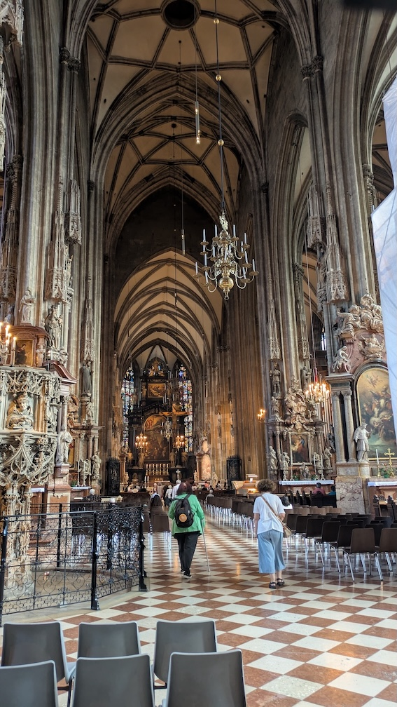

```{eval-rst}
:og:image: _images/20250807pstyle.png
:og:image:alt: EuroPython 2025 Travelogue

.. |cover| image:: images/20250807pstyle.png
```

# **EuroPython** 2025 Travelogue {nekochan}`travel`

Takanori Suzuki

```{image} images/europython2025-logo.svg
:alt: EuroPython 2025 logo
:width: 50%
```

BPStyle 175 / 2025 Aug 7

## EuroPython 2025 {nekochan}`beer`

* {fas}`globe` [`ep2025.europython.eu`](https://ep2025.europython.eu/)
* City: [Prague](https://ep2025.europython.eu/prague/), Czech Republic
* Venue: [The Prague Congress Centre](https://www.praguecc.cz/en/homepage)
* Date: 2025 Jul 14-20

### Schedule {nekochan}`calendar`

* Jul 12/13: ✈️ Haneda -> Vienna
* Jul 13: 🏰🎻 Sightseeing
* Jul 14: 🚞 Vienna -> Prague
* Jul 15: 🏰 Sightseeing
* Jul 16-18: 🎙️ **Conference**
* Jul 19: 💻 **Sprint**
* Jul 19/20: ✈️ Prague -> Warsaw -> Narita

### See also

* [EuroPython 2025への道 - posfie](https://posfie.com/@takanory/p/efSnDMG)

## Jul 12/13: ✈️ Haneda -> Vienna

### Haneda -> Vienna ([NH 205](https://www.flightaware.com/live/flight/ANA205) 14h35m)


### Seat

```{image} images/to-vienna-seat.jpg
:width: 35%
```

### Vienna Airport


### To Wien Hbf


### Wien Hbf


## Jul 13: 🏰🎻 Sightseeing

### Cashless Toilet(0.5 EUR)

```{image} images/toilet1.jpg
:width: 35%
```

```{image} images/toilet2.jpg
:width: 35%
```

### Schloss Schönbrunn [^schonbrunn]

[^schonbrunn]: [シェーンブルン宮殿 - Wikipedia](https://ja.wikipedia.org/wiki/%E3%82%B7%E3%82%A7%E3%83%BC%E3%83%B3%E3%83%96%E3%83%AB%E3%83%B3%E5%AE%AE%E6%AE%BF)


```{revealjs-break}
```

```{image} images/schonbrunn2.jpg
:width: 35%
```

```{revealjs-break}
```


```{revealjs-break}
```


```{revealjs-break}
```


```{revealjs-break}
```


```{revealjs-break}
```


```{revealjs-break}
```


```{revealjs-break}
```

```{image} images/schonbrunn9.jpg
:width: 35%
```

### Wiener Musikverein [^musikverein]

[^musikverein]: [ウィーン楽友協会 - Wikipedia](https://ja.wikipedia.org/wiki/%E3%82%A6%E3%82%A3%E3%83%BC%E3%83%B3%E6%A5%BD%E5%8F%8B%E5%8D%94%E4%BC%9A)


```{revealjs-break}
```


```{revealjs-break}
```

```{image} images/musikverein3.jpg
:width: 35%
```

```{revealjs-break}
```


### Stephansdom [^Stephansdom]

[^Stephansdom]: [シュテファン大聖堂 - Wikipedia](https://ja.wikipedia.org/wiki/%E3%82%B7%E3%83%A5%E3%83%86%E3%83%95%E3%82%A1%E3%83%B3%E5%A4%A7%E8%81%96%E5%A0%82)


```{revealjs-break}
```



### 1516 Brew Company [^1516beer]


[^1516beer]: [1516 Brewing Company Vienna – Beer brewing in the heart of Vienna](https://www.1516brewingcompany.com/)

```{revealjs-break}
```

```{image} images/1516beer2.jpg
:width: 35%
```

```{revealjs-break}
```


## Jul 14: 🚞 Vienna -> Prague

### Vienna -> Prague (4h) [^regiojet]


[^regiojet]: [RegioJet | Train & bus tickets](https://regiojet.com/)

```{revealjs-break}
```

```{image} images/regiojet-seat.jpg
:width: 35%
```

```{image} images/regiojet-power.jpg
:width: 35%
```

```{revealjs-break}
```


### Proud Ležák (0.8 EUR) [^proud]

```{image} images/regiojet-beer.jpg
:width: 35%
```

[^proud]: [Pivo Proud | Moderní český ležák z Prazdroje](https://www.pivoproud.cz/)

### Praha hlavní nádraží [^prague-station]

[^prague-station]: [プラハ本駅 - Wikipedia](https://ja.wikipedia.org/wiki/%E3%83%97%E3%83%A9%E3%83%8F%E6%9C%AC%E9%A7%85)


### Prague Main Station LEGO


### The Prague Congress Centre [^centre]


[^centre]: [Welcome to the Prague Congress Centre](https://www.praguecc.cz/en/homepage)

```{revealjs-break}
```


### Badge

```{image} images/nametag.jpg
:width: 35%
```

### Museum of Bricks [^bricks]

```{image} images/bricks1.jpg
:width: 35%
```

[^bricks]: [Museum of Bricks Czech Republic - THE LARGEST PRIVATE LEGO® COLLECTION IN THE WORLD](https://museumofbricks.cz/en)

```{revealjs-break}
```


```{revealjs-break}
```


```{revealjs-break}
```

```{image} images/bricks4.jpg
:width: 35%
```

### U Pinkasu [^pinkasu]


[^pinkasu]: [U Pinkasu Restaurant - The best Pilsner Urquell beer restaurant in Prague](http://www.upinkasu.com/)

```{revealjs-break}
```

```{image} images/pinkasu2.jpg
:width: 35%
```

```{revealjs-break}
```

```{image} images/pinkasu3.jpg
:width: 35%
```

## Jul 15: 🏰 Sightseeing

### Supermarket


```{revealjs-break}
```


```{revealjs-break}
```

2L Beer (39.90 CZK = 280 JPY)

```{image} images/penny3.jpg
:width: 35%
```

```{revealjs-break}
```


### Prašná brána [^powder]

```{image} images/powder-tower.jpg
:width: 35%
```

[^powder]: [火薬塔 - トリップアドバイザー](https://www.tripadvisor.jp/Attraction_Review-g274707-d318576-Reviews-Prasna_brana-Prague_Bohemia.html)

### Obecní dům [^dum]


[^dum]: [プラハ市民会館 (スメタナホール) - トリップアドバイザー](https://www.tripadvisor.jp/Attraction_Review-g274707-d539414-Reviews-Obecni_Dum-Prague_Bohemia.html)

### Kavárna obecní dům [^kavarna]


[^kavarna]: [カヴェールナ オベツニー ドゥーム - トリップアドバイザー](https://www.tripadvisor.jp/Restaurant_Review-g274707-d1095857-Reviews-Kavarna_Obecni_dum-Prague_Bohemia.html)

```{revealjs-break}
```


```{revealjs-break}
```


```{revealjs-break}
```


### Staroměstské náměstí [^square]

[^square]: [旧市街広場 (プラハ) - Wikipedia](https://ja.wikipedia.org/wiki/%E6%97%A7%E5%B8%82%E8%A1%97%E5%BA%83%E5%A0%B4_%28%E3%83%97%E3%83%A9%E3%83%8F%29)


```{revealjs-break}
```


```{revealjs-break}
```


```{revealjs-break}
```


### Pražský orloj [^orloj]

```{image} images/orloj1.jpg
:width: 35%
```

[^orloj]: [プラハの天文時計 - Wikipedia](https://ja.wikipedia.org/wiki/%E3%83%97%E3%83%A9%E3%83%8F%E3%81%AE%E5%A4%A9%E6%96%87%E6%99%82%E8%A8%88)

```{revealjs-break}
```

```{image} images/orloj2.jpg
:width: 35%
```

### Fat Cat Burgers & Craft Beer [^fatcat]

```{image} images/fatcat1.jpg
:width: 35%
```

[^fatcat]: [FAT CAT Burgers & Craft Beer](https://fat-cat.cz/)

```{revealjs-break}
```

```{image} images/fatcat2.jpg
:width: 35%
```

```{revealjs-break}
```


### Karlův most [^karluv]

```{image} images/karluv1.jpg
:width: 35%
```

[^karluv]: [カレル橋 - Wikipedia](https://ja.wikipedia.org/wiki/%E3%82%AB%E3%83%AC%E3%83%AB%E6%A9%8B)

```{revealjs-break}
```


```{revealjs-break}
```


```{revealjs-break}
```

```{image} images/karluv4.jpg
:width: 35%
```

### Katedrála svatého Víta [^vita]

[^vita]: [聖ヴィート大聖堂 - Wikipedia](https://ja.wikipedia.org/wiki/%E8%81%96%E3%83%B4%E3%82%A3%E3%83%BC%E3%83%88%E5%A4%A7%E8%81%96%E5%A0%82)


```{revealjs-break}
```


```{revealjs-break}
```

```{image} images/vita3.jpg
:width: 35%
```

### Zizkov Television Tower [^zizkov]

```{image} images/zizkov.jpg
:width: 35%
```

[^zizkov]: [Prague TV tower - Zizkov Television Tower - トリップアドバイザー](https://www.tripadvisor.jp/Attraction_Review-g274707-d24024849-Reviews-Prague_TV_tower_Zizkov_Television_Tower-Prague_Bohemia.html)

### BeerGeek Bar & Pivotéka [^beergeek]

[^beergeek]: [BeerGeek](https://beergeek.cz/en/#about)

```{image} images/beergeek1.jpg
:width: 35%
```

```{revealjs-break}
```

```{image} images/beergeek2.jpg
:width: 35%
```

```{revealjs-break}
```


## Jul 16-18: 🎙️ **Conference**
## Jul 19: 💻 **Sprint**
## Jul 19/20: ✈️ Prague -> Warsaw -> Narita

## May 15: 📛 **Opening Reception**

### Lunch {nekochan}`beer`

```{image} images/lunch-beer.jpg
:width: 35%
```

### Badge

```{image} images/badge.jpg
:width: 35%
```

### Booth


### [Python Asia Organization](https://pythonasia.org/) Booth


### Terada with Guido

```{image} images/terada-with-guido.jpg
:width: 50%
```

### Anaconda Happy Hour {nekochan}`beer`

```{image} images/anaconda.jpg
:width: 35%
```
## May 16: 🎙️ **Conference** Day 1

### Breakfast {nekochan}`gohan`


### Opening


```{revealjs-break}
```


### My Talk {nekochan}`doya`


```{revealjs-break}
```

<iframe width="800" height="450" src="https://www.youtube.com/embed/3wQxP-GfT-A?si=VTkrjDLAaL8YtyCQ" title="YouTube video player" frameborder="0" allow="accelerometer; autoplay; clipboard-write; encrypted-media; gyroscope; picture-in-picture; web-share" referrerpolicy="strict-origin-when-cross-origin" allowfullscreen></iframe>

### After my Talk {nekochan}`juutai`


### Lunch {nekochan}`gohan-taberu`


### Duolingo Party {nekochan}`beer`

```{image} images/duolingo.jpg
:width: 35%
```

```{revealjs-break}
```

```{image} images/duo.jpg
:width: 35%
```

## May 17: 🎙️ **Conference** Day 2

### Keynote: Lynn Root


### Conference Chair: Elaine


### Talk: Why `len("😶‍🌫️") == 4`


### PyLadies Auction


```{revealjs-break}
```


```{revealjs-break}
```


## May 18: 🎙️ **Conference** Day 3

### My Lightning Talk {nekochan}`doya`


```{revealjs-break}
```

<iframe width="800" height="450" src="https://www.youtube.com/embed/lXngPPRaqGg?si=rtXgnnal_ChukDRH&amp;start=1009" title="YouTube video player" frameborder="0" allow="accelerometer; autoplay; clipboard-write; encrypted-media; gyroscope; picture-in-picture; web-share" referrerpolicy="strict-origin-when-cross-origin" allowfullscreen></iframe>

### Job Fair

```{image} images/job-fair.jpg
:width: 35%
```

### Poster Session


### Steering Council Panel


```{revealjs-break}
```


### Awards


### PyCon US 2026


### [Penn Brewery](https://www.pennbrew.com/) {nekochan}`beer`


```{revealjs-break}
```

```{image} images/penn-brewery.jpg
:width: 35%
```

### [Church Brew Works](https://churchbrew.com/) {nekochan}`beer`


```{image} images/church-brew1.jpg
:width: 35%
```

```{revealjs-break}
```

```{image} images/church-brew2.jpg
:width: 35%
```

## May 19: 💻 **Sprint**

### Sprint Board 

```{image} images/sprint-board.jpg
:width: 35%
```

### Bridge


### [Coop de Ville](https://coopdevillepgh.com/) {nekochan}`beer`


```{revealjs-break}
```


## May 20: 🚗 Pittsburgh -> Chicago

### Drive


```{revealjs-break}
```


```{revealjs-break}
```


```{revealjs-break}
```

<iframe width="800" height="450" src="https://www.youtube.com/embed/rDjYzlPW7hM?si=0MGsd-deHxXSganP" title="YouTube video player" frameborder="0" allow="accelerometer; autoplay; clipboard-write; encrypted-media; gyroscope; picture-in-picture; web-share" referrerpolicy="strict-origin-when-cross-origin" allowfullscreen></iframe>

### Service Plaza


```{revealjs-break}
```


### [District Brew Yards](https://districtbrewyards.com/) {nekochan}`beer`


```{revealjs-break}
```


### [Lou Malnati's](https://www.loumalnatis.com/) {nekochan}`beer`


```{revealjs-break}
```


```{revealjs-break}
```


## May 21: 🍺 Chicago

### [Union Station](https://ja.wikipedia.org/wiki/%E3%83%A6%E3%83%8B%E3%82%AA%E3%83%B3%E9%A7%85_(%E3%82%B7%E3%82%AB%E3%82%B4)) {nekochan}`densha`


### [Flamingo](https://ja.wikipedia.org/wiki/%E3%83%95%E3%83%A9%E3%83%9F%E3%83%B3%E3%82%B4_(%E5%BD%AB%E5%83%8F)) {nekochan}`niwatori`


### [Industry Ales](https://www.industryales.com/) {nekochan}`beer`


```{revealjs-break}
```


### [The Bean (Cloud Gate)](https://www.choosechicago.com/articles/tours-and-attractions/the-bean-chicago/)


### [Chicago Tribune](https://www.chicagotribune.com/)

```{image} images/tribune1.jpg
:width: 35%
```

```{revealjs-break}
```


### [It'Sugar](https://itsugar.com/)


```{revealjs-break}
```


### LEGO Store


### [Off Color Brewing](https://www.offcolorbrewing.com/) {nekochan}`beer`


```{revealjs-break}
```

```{image} images/off-color2.jpg
:width: 35%
```

### [Half Acre Beer](https://halfacrebeer.com/) {nekochan}`beer`


```{revealjs-break}
```


```{revealjs-break}
```

```{image} images/half-acre3.jpg
:width: 35%
```

## May 22: ✈️ Chicago -> Toronto -> Haneda

### Delay 🚗


```{revealjs-break}
```


```{revealjs-break}
```


### Chicago Airport 🇺🇸

```{image} images/ord1.jpg
:width: 35%
```

```{revealjs-break}
```


### Toronto Airport 🇨🇦


```{revealjs-break}
```


```{revealjs-break}
```


### Haneda Airport 🇯🇵


```{revealjs-break}
```


## Laggage was **Broken** {nekochan}`mechanaki`


### [New Suitcase](https://store.ace.jp/shop/g/g01343-04/) {nekochan}`yoshi`

```{image} images/new-suitcase.jpg
:width: 35%
```

### See you in next **Travelogue** {nekochan}`byebye`


## References

* [PyCon US 2025参加レポート | gihyo.jp](https://gihyo.jp/list/group/PyCon-US-2025%E5%8F%82%E5%8A%A0%E3%83%AC%E3%83%9D%E3%83%BC%E3%83%88#rt:/article/2025/06/pycon-us-2025-03)
  * [Conference Day 1まで](https://gihyo.jp/article/2025/06/pycon-us-2025-01)
  * [Conference Day 2](https://gihyo.jp/article/2025/06/pycon-us-2025-02)
  * [Conference Day 3, Sprint](https://gihyo.jp/article/2025/06/pycon-us-2025-03)
* [#53: PyCon US 2025報告会 - 2025-06-13](https://tv.pycon.jp/episode/53.html)
