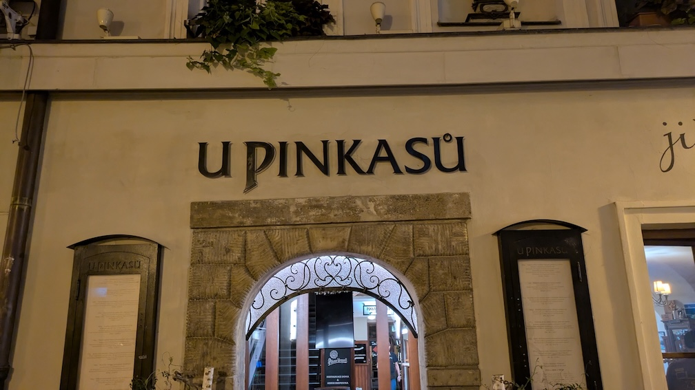
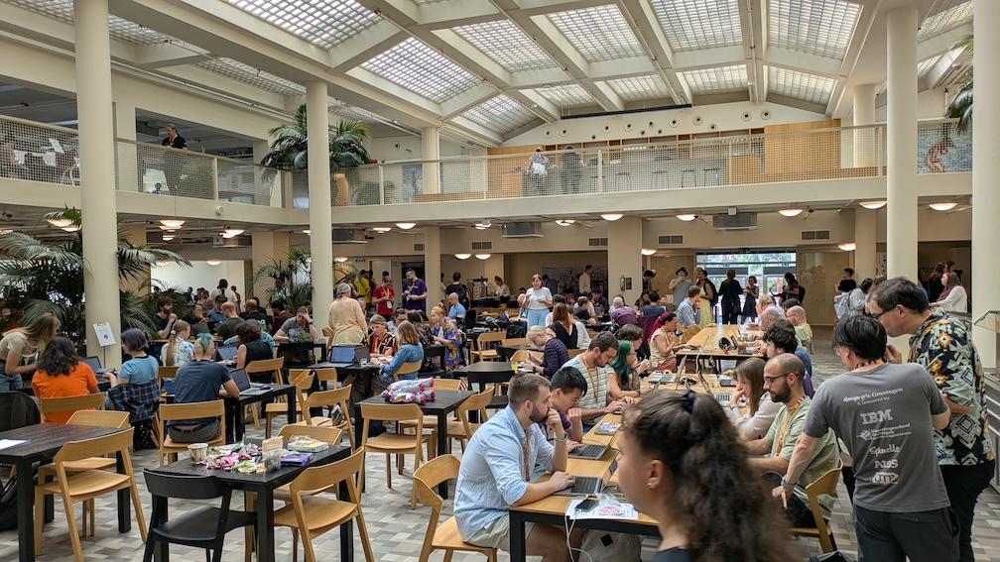

```{eval-rst}
:og:image: _images/20250807pstyle.png
:og:image:alt: EuroPython 2025 Travelogue

.. |cover| image:: images/20250807pstyle.png
```

# **EuroPython** 2025 Travelogue {nekochan}`travel`

Takanori Suzuki

```{image} images/europython2025-logo.svg
:alt: EuroPython 2025 logo
:width: 50%
```

BPStyle 175 / 2025 Aug 7

## EuroPython 2025 {nekochan}`beer`

* {fas}`globe` [`ep2025.europython.eu`](https://ep2025.europython.eu/)
* City: [Prague](https://ep2025.europython.eu/prague/), Czech Republic
* Venue: [The Prague Congress Centre](https://www.praguecc.cz/en/homepage)
* Date: 2025 Jul 14-20

### Schedule {nekochan}`calendar`

* Jul 12/13: ✈️ Haneda -> Vienna
* Jul 13: 🏰🎻 Sightseeing
* Jul 14: 🚞 Vienna -> Prague
* Jul 15: 🏰 Sightseeing
* Jul 16-18: 🎙️ **Conference**
* Jul 19: 💻 **Sprint**
* Jul 19/20: ✈️ Prague -> Warsaw -> Narita

### See also

* [EuroPython 2025への道 - posfie](https://posfie.com/@takanory/p/efSnDMG)

## Jul 12/13: ✈️ Haneda -> Vienna

### Haneda -> Vienna ([NH 205](https://www.flightaware.com/live/flight/ANA205) 14h35m)


### Seat

```{image} images/to-vienna-seat.jpg
:width: 35%
```

### Vienna Airport


### To Wien Hbf


### Wien Hbf


## Jul 13: 🏰🎻 Sightseeing

### Cashless Toilet(0.5 EUR)

```{image} images/toilet1.jpg
:width: 35%
```

```{image} images/toilet2.jpg
:width: 35%
```

### Schloss Schönbrunn [^schonbrunn]

[^schonbrunn]: [シェーンブルン宮殿 - Wikipedia](https://ja.wikipedia.org/wiki/%E3%82%B7%E3%82%A7%E3%83%BC%E3%83%B3%E3%83%96%E3%83%AB%E3%83%B3%E5%AE%AE%E6%AE%BF)


```{revealjs-break}
```

```{image} images/schonbrunn2.jpg
:width: 35%
```

```{revealjs-break}
```


```{revealjs-break}
```


```{revealjs-break}
```


```{revealjs-break}
```


```{revealjs-break}
```


```{revealjs-break}
```


```{revealjs-break}
```

```{image} images/schonbrunn9.jpg
:width: 35%
```

### Wiener Musikverein [^musikverein]

[^musikverein]: [ウィーン楽友協会 - Wikipedia](https://ja.wikipedia.org/wiki/%E3%82%A6%E3%82%A3%E3%83%BC%E3%83%B3%E6%A5%BD%E5%8F%8B%E5%8D%94%E4%BC%9A)


```{revealjs-break}
```


```{revealjs-break}
```

```{image} images/musikverein3.jpg
:width: 35%
```

```{revealjs-break}
```


### Stephansdom [^Stephansdom]

[^Stephansdom]: [シュテファン大聖堂 - Wikipedia](https://ja.wikipedia.org/wiki/%E3%82%B7%E3%83%A5%E3%83%86%E3%83%95%E3%82%A1%E3%83%B3%E5%A4%A7%E8%81%96%E5%A0%82)


```{revealjs-break}
```

```{image} images/stephansdom2.jpg
:width: 35%
```

### 1516 Brew Company [^1516beer]


[^1516beer]: [1516 Brewing Company Vienna – Beer brewing in the heart of Vienna](https://www.1516brewingcompany.com/)

```{revealjs-break}
```

```{image} images/1516beer2.jpg
:width: 35%
```

```{revealjs-break}
```


## Jul 14: 🚞 Vienna -> Prague

### Vienna -> Prague (4h) [^regiojet]


[^regiojet]: [RegioJet | Train & bus tickets](https://regiojet.com/)

```{revealjs-break}
```

```{image} images/regiojet-seat.jpg
:width: 35%
```

```{image} images/regiojet-power.jpg
:width: 35%
```

```{revealjs-break}
```


### Proud Ležák (0.8 EUR) [^proud]

```{image} images/regiojet-beer.jpg
:width: 35%
```

[^proud]: [Pivo Proud | Moderní český ležák z Prazdroje](https://www.pivoproud.cz/)

### Praha hlavní nádraží [^prague-station]

[^prague-station]: [プラハ本駅 - Wikipedia](https://ja.wikipedia.org/wiki/%E3%83%97%E3%83%A9%E3%83%8F%E6%9C%AC%E9%A7%85)


### Prague Main Station LEGO


### The Prague Congress Centre [^centre]


[^centre]: [Welcome to the Prague Congress Centre](https://www.praguecc.cz/en/homepage)

```{revealjs-break}
```


### Badge

```{image} images/nametag.jpg
:width: 35%
```

### Museum of Bricks [^bricks]

```{image} images/bricks1.jpg
:width: 35%
```

[^bricks]: [Museum of Bricks Czech Republic - THE LARGEST PRIVATE LEGO® COLLECTION IN THE WORLD](https://museumofbricks.cz/en)

```{revealjs-break}
```


```{revealjs-break}
```


```{revealjs-break}
```

```{image} images/bricks4.jpg
:width: 35%
```

### U Pinkasu [^pinkasu]



[^pinkasu]: [U Pinkasu Restaurant - The best Pilsner Urquell beer restaurant in Prague](http://www.upinkasu.com/)

```{revealjs-break}
```

```{image} images/pinkasu2.jpg
:width: 35%
```

```{revealjs-break}
```

```{image} images/pinkasu3.jpg
:width: 35%
```

## Jul 15: 🏰 Sightseeing

### Supermarket


```{revealjs-break}
```


```{revealjs-break}
```

2L Beer (39.90 CZK = 280 JPY)

```{image} images/penny3.jpg
:width: 35%
```

```{revealjs-break}
```


### Prašná brána [^powder]

```{image} images/powder-tower.jpg
:width: 35%
```

[^powder]: [火薬塔 - トリップアドバイザー](https://www.tripadvisor.jp/Attraction_Review-g274707-d318576-Reviews-Prasna_brana-Prague_Bohemia.html)

### Obecní dům [^dum]


[^dum]: [プラハ市民会館 (スメタナホール) - トリップアドバイザー](https://www.tripadvisor.jp/Attraction_Review-g274707-d539414-Reviews-Obecni_Dum-Prague_Bohemia.html)

### Kavárna obecní dům [^kavarna]


[^kavarna]: [カヴェールナ オベツニー ドゥーム - トリップアドバイザー](https://www.tripadvisor.jp/Restaurant_Review-g274707-d1095857-Reviews-Kavarna_Obecni_dum-Prague_Bohemia.html)

```{revealjs-break}
```


```{revealjs-break}
```


### Staroměstské náměstí [^square]

[^square]: [旧市街広場 (プラハ) - Wikipedia](https://ja.wikipedia.org/wiki/%E6%97%A7%E5%B8%82%E8%A1%97%E5%BA%83%E5%A0%B4_%28%E3%83%97%E3%83%A9%E3%83%8F%29)


```{revealjs-break}
```


```{revealjs-break}
```


```{revealjs-break}
```


### Pražský orloj [^orloj]

```{image} images/orloj1.jpg
:width: 35%
```

[^orloj]: [プラハの天文時計 - Wikipedia](https://ja.wikipedia.org/wiki/%E3%83%97%E3%83%A9%E3%83%8F%E3%81%AE%E5%A4%A9%E6%96%87%E6%99%82%E8%A8%88)

```{revealjs-break}
```

```{image} images/orloj2.jpg
:width: 35%
```

### Fat Cat Burgers & Craft Beer [^fatcat]

```{image} images/fatcat1.jpg
:width: 35%
```

[^fatcat]: [FAT CAT Burgers & Craft Beer](https://fat-cat.cz/)

```{revealjs-break}
```

```{image} images/fatcat2.jpg
:width: 35%
```

```{revealjs-break}
```


### Karlův most [^karluv]

```{image} images/karluv1.jpg
:width: 35%
```

[^karluv]: [カレル橋 - Wikipedia](https://ja.wikipedia.org/wiki/%E3%82%AB%E3%83%AC%E3%83%AB%E6%A9%8B)

```{revealjs-break}
```


```{revealjs-break}
```


```{revealjs-break}
```

```{image} images/karluv4.jpg
:width: 35%
```

### Katedrála svatého Víta [^vita]

[^vita]: [聖ヴィート大聖堂 - Wikipedia](https://ja.wikipedia.org/wiki/%E8%81%96%E3%83%B4%E3%82%A3%E3%83%BC%E3%83%88%E5%A4%A7%E8%81%96%E5%A0%82)


```{revealjs-break}
```


```{revealjs-break}
```

```{image} images/vita3.jpg
:width: 35%
```

### Zizkov Television Tower [^zizkov]

```{image} images/zizkov.jpg
:width: 35%
```

[^zizkov]: [Prague TV tower - Zizkov Television Tower - トリップアドバイザー](https://www.tripadvisor.jp/Attraction_Review-g274707-d24024849-Reviews-Prague_TV_tower_Zizkov_Television_Tower-Prague_Bohemia.html)

### BeerGeek Bar & Pivotéka [^beergeek]

[^beergeek]: [BeerGeek](https://beergeek.cz/en/#about)

```{image} images/beergeek1.jpg
:width: 35%
```

```{revealjs-break}
```

```{image} images/beergeek2.jpg
:width: 35%
```

```{revealjs-break}
```


## Jul 16: 🎙️ **Conference**

### Conference Opening


### Keynote: Savannah Bailey [^keynote1]


[^keynote1]: [You don’t have to be a compiler engineer to work on Python](https://ep2025.europython.eu/session/you-dont-have-to-be-a-compiler-engineer-to-work-on-python)

### Lunch


### Retro Game


```{revealjs-break}
```


### Yuichiro Tachibana(@whitphx) [^yuichiro]


[^yuichiro]: [Democratize serverless web AI apps for Python devs](https://ep2025.europython.eu/session/democratize-serverless-web-ai-apps-for-python-devs)

### Python quiz


```{revealjs-break}
```

```{image} images/quiz2.jpg
:width: 35%
```

### Pyvo [^pyvo1]

[^pyvo1]: [Wednesday Local Community Drinks | EuroPython 2025](https://ep2025.europython.eu/pyvo/)


```{revealjs-break}
```


```{revealjs-break}
```

```{image} images/pyvo3.jpg
:width: 35%
```

```{revealjs-break}
```


```{revealjs-break}
```

```{figure} images/pyvo5.mp4
:class: controls
```

## Jul 17: 🎙️ **Conference**

### Keynote: Brett Cannon [^keynote2]


[^keynote2]: [Why it took 4 years to get a lock files specification](https://ep2025.europython.eu/session/why-it-took-4-years-to-get-a-lock-files-specification)

### Pablo Galindo Salgado [^pablo]


[^pablo]: [A new safe external debugger interface for CPython](https://ep2025.europython.eu/session/a-new-safe-external-debugger-interface-for-cpython) 

### Mark Shannon [^shannon]


[^shannon]: [Performance improvements in 3.14 and maybe 3.15](https://ep2025.europython.eu/session/performance-improvements-in-3-14-and-maybe-3-15)

### Keynote: Sebastián Ramírez [^keynote3]


[^keynote3]: [Behind the scenes of FastAPI and friends for developers and builders](https://ep2025.europython.eu/session/behind-the-scenes-of-fastapi-and-friends-for-developers-and-builders)

### Lightning Talks


```{revealjs-break}
```


### Social Event [^social]


[^social]: [Thursday Social Event | EuroPython 2025](https://ep2025.europython.eu/social-event/)

```{revealjs-break}
```


### Sibeeria Tap Room [^sibeeria]


[^sibeeria]: [Sibeeria Brewery - nezávislý pivovar v Praze](https://sibeeria.cz/)

```{revealjs-break}
```


```{revealjs-break}
```

```{image} images/sibeeria3.jpg
:width: 35%
```

## Jul 18: 🎙️ **Conference**

### Community Organisers Open Space [^openspace]


[^openspace]: [Community Organisers Activities | EuroPython 2025](https://ep2025.europython.eu/community-activities/)

### Community Organisers Lunch


### Python: the Documentary [^documentary]


[^documentary]: ["Python: the Documentary" screening and Q&A](https://ep2025.europython.eu/session/python-the-documentary-screening-and-q-a)

```{revealjs-break}
```


### Lightning Talks


### Lightning Talks [^lt-takanory]

[^lt-takanory]: [Learn Japanese 🇯🇵 with Python](https://slides.takanory.net/slides/20250718euro/#/)


### Lightning Talks [^song]

```{figure} images/lt-song.mp4
:class: controls
```

[^song]: [Always Look on the Bright Side of Life - Wikipedia](https://ja.wikipedia.org/wiki/Always_Look_on_the_Bright_Side_of_Life)

### Conference Closing


### The Beer Spot [^beerspot]

[^beerspot]: [THE BEER SPOT - Craft Beer Restaurant & Garden in Prague](https://beerspotprague.cz/the-beer-spot/)

```{image} images/beerspot1.jpg
:width: 35%
```

```{revealjs-break}
```


```{revealjs-break}
```

```{image} images/beerspot3.jpg
:width: 35%
```

```{image} images/beerspot4.jpg
:width: 35%
```

### Klub Újezd [^ujezd]

[^ujezd]: [Klub Újezd](https://www.klubujezd.cz/)


```{revealjs-break}
```

```{image} images/ujezd2.jpg
:width: 35%
```

## Jul 19: 💻 **Sprint**

### Sprint Venue [^wpp]


[^wpp]: [WPP Prague](https://www.wpp.com/ja-jp)

### Sprint



### Free Snack Table


### with Rodrigo


### Sprint Lunch


### Adam Turner, Koxudaxi and Łukasz


## Jul 19/20: ✈️ Prague -> Warsaw -> Narita

### Prague Airport

```{image} images/prague-airport.jpg
:width: 35%
```
### Prague -> Warsaw ([LO 526](https://www.flightaware.com/live/flight/LOT526) 1h10m)


### Warsaw Airport


### Warsaw -> Narita ([LO 079](https://www.flightaware.com/live/flight/LOT79) 12h50m)


```{revealjs-break}
```


```{revealjs-break}
```


```{revealjs-break}
```


## EuroPython&PHPers Day報告会

* {fas}`globe` [pyconjp.connpass.com/event/364753](https://pyconjp.connpass.com/event/364753/)
* Date: 2025 Aug 26(Tue)
* Venue: HENNGE / Online

```{image} images/europython.jpg
:width: 60%
```

## See you in next **Travelogue** {nekochan}`byebye`

## References

* [EuroPython 2025 | July 14th-20th 2025 | Prague, Czech Republic & Remote](https://ep2025.europython.eu/)
* [EuroPython 2025への道 - posfie](https://posfie.com/@takanory/p/efSnDMG)
* [#55: EuroPython 2025 報告会 - 2025-08-01](https://tv.pycon.jp/episode/55.html)
