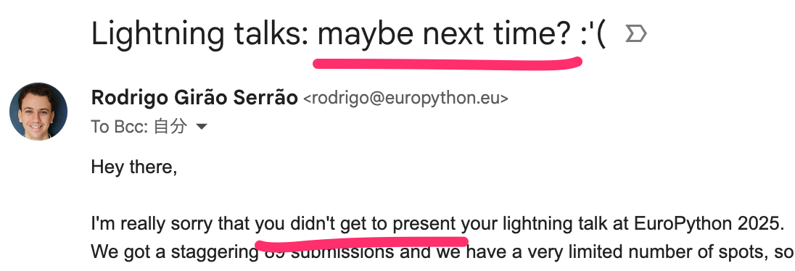
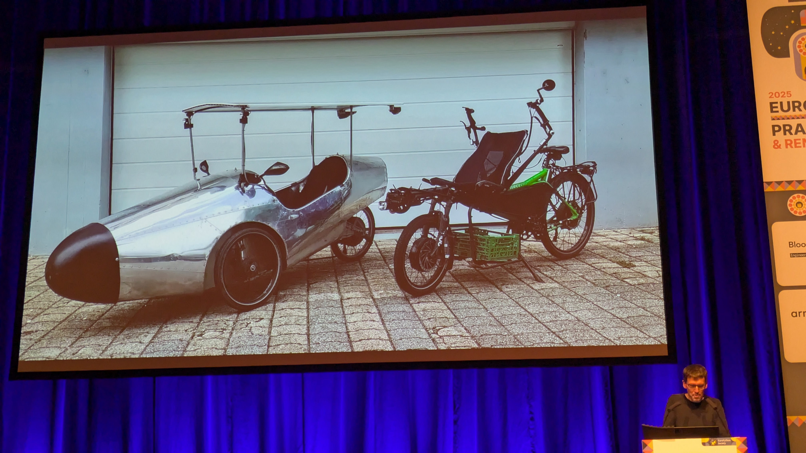
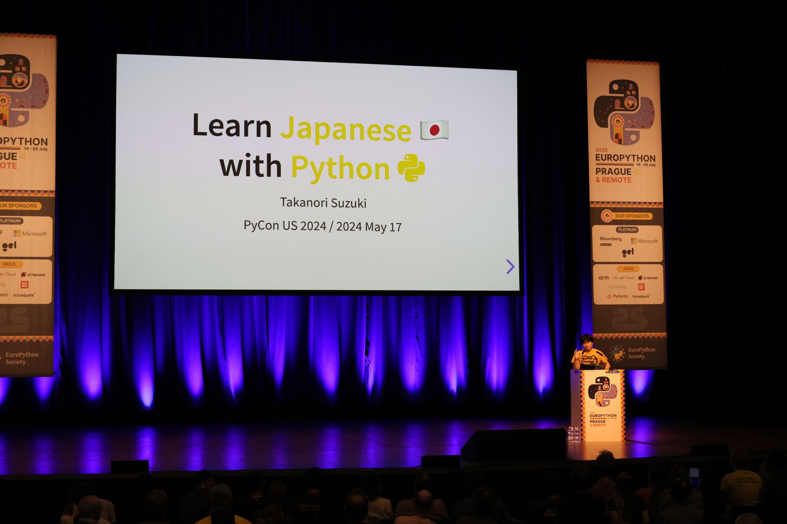
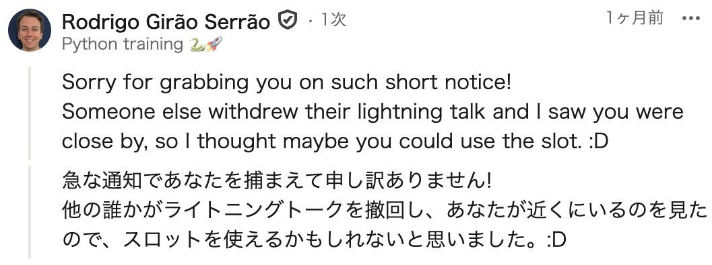

```{eval-rst}
:og:image: _images/202508926euroreport.png
:og:image:alt: 素振り（すぶり）のススメ

.. |cover| image:: images/202508926euroreport.png
```

# **素振り**（すぶり）のススメ {nekochan}`yakyu-nya`

Takanori Suzuki

EuroPython & PHPers Day 参加報告会 / 2025 Aug 26

## **Who** am I? / お前 **誰よ** 👤

* Takanori Suzuki / 鈴木 たかのり ({fab}`twitter` [@takanory](https://twitter.com/takanory))
* [BeProud](https://www.beproud.jp/) 取締役 / Python Climber
* [PyCon JP Association](https://www.pycon.jp/) 代表理事
* [Python Boot Camp](https://www.pycon.jp/support/bootcamp.html) 講師、[Python mini Hack-a-thon](https://pyhack.connpass.com/) 主催、[Pythonボルダリング部](https://kabepy.connpass.com/) 部長


## EuroPython 2025でLTした！ {nekochan}`yatta-nya`


### その裏には**幸運**と**素振り**があった {nekochan}`kami`

## EuroPython 2025 LT登壇の道 {nekochan}`tekuteku`

```{revealjs-fragments}
* LTは**毎日夕方**に実施（3回） {nekochan}`hai`
* Googleフォームで**申し込み** {nekochan}`yoshi`
* **採択**されると**連絡**が来る {nekochan}`mail`
* 不採択は次の日に**持ち越し** {nekochan}`donmai`
```

### 結果は... {nekochan}`pray`

### 3連敗... {nekochan}`chudoon`



### 完 {nekochan}`mu`

### オレ達の戦いはこれからだ！ {nekochan}`punch`

takanory先生の次回作にご期待ください

## EuroPython 3日目

### LTを聞いていた...すると



### 後ろから声をかけられた

```{revealjs-fragments}
* 🧑 「Takanori, Takanori」
* 🧑‍💻 「はい？」
* 🧑 「LTできる？」
* 🧑‍💻 「この後？まじで？」🧑 「そう」
* 🧑‍💻 （考え中……）
* 🧑‍💻 「やります！」
```

### その後

```{revealjs-fragments}
* LT待機席に移動 {nekochan}`tekuteku`
* 順番を確認→今の発表者の次とのこと {nekochan}`bikkuri`
* スライドを確認（[PyCon US 2024](https://slides.takanory.net/slides/20240517pyconus/)のもの） {nekochan}`nanimo-sitenainoni-kowareta`
* そして前の発表者が終わった {nekochan}`ase`
```

### なんとかLTをやりきった {nekochan}`mou-dounidemo-nare`



## その裏には<br />**幸運**と**素振り**があった {nekochan}`kami`

### LT申し込みで**アピール** {nekochan}`choo-choo-train`

* 「PyCon US 2024でLTやりました」とアピール
* スライドURLも付けておいた

### スライドは**公開済み** {nekochan}`lgtm`

* すぐに参照して発表できる状態

### **英語原稿なし**での発表 {nekochan}`pusupusu`

* PyCon US 2024で同じLTを原稿なしで発表済み
* 当時、時間を使って準備した
* →ぶっつけ本番でもなんとかなるだろう

### 主催者が声をかけてきた**幸運** {nekochan}`kitai`

* LTで1枠キャンセルがあった
* 私は前の方に座っていた
* LT担当のRodrigoが私を見つけた
* （多分）PyCon USのLTで顔を知っていた

### 後日Rodrigoからの**メッセージ** [^linkedin] {nekochan}`bow`



[^linkedin]: [(16) 投稿 | フィード | LinkedIn](https://www.linkedin.com/feed/update/urn:li:ugcPost:7352279607405940737/?commentUrn=urn%3Ali%3Acomment%3A%28ugcPost%3A7352279607405940737%2C7353015767895785472%29&amp;dashCommentUrn=urn%3Ali%3Afsd_comment%3A%287353015767895785472%2Curn%3Ali%3AugcPost%3A7352279607405940737%29)

### **2年前**の自分には**無理**だった {nekochan}`ng`

## しよう**素振り** {nekochan}`tennis`<br />掴もう**幸運** {nekochan}`yossha`

## Thank You {nekochan}`pray`

{fas}`desktop` [slides.takanory.net](https://slides.takanory.net/)

{fab}`twitter` [takanory](https://twitter.com/takanory)
{fab}`github` [takanory](https://github.com/takanory/)
{fab}`linkedin` [takanory](https://www.linkedin.com/in/takanory/)
{fab}`untappd` [takanory](https://untappd.com/user/takanory/)


