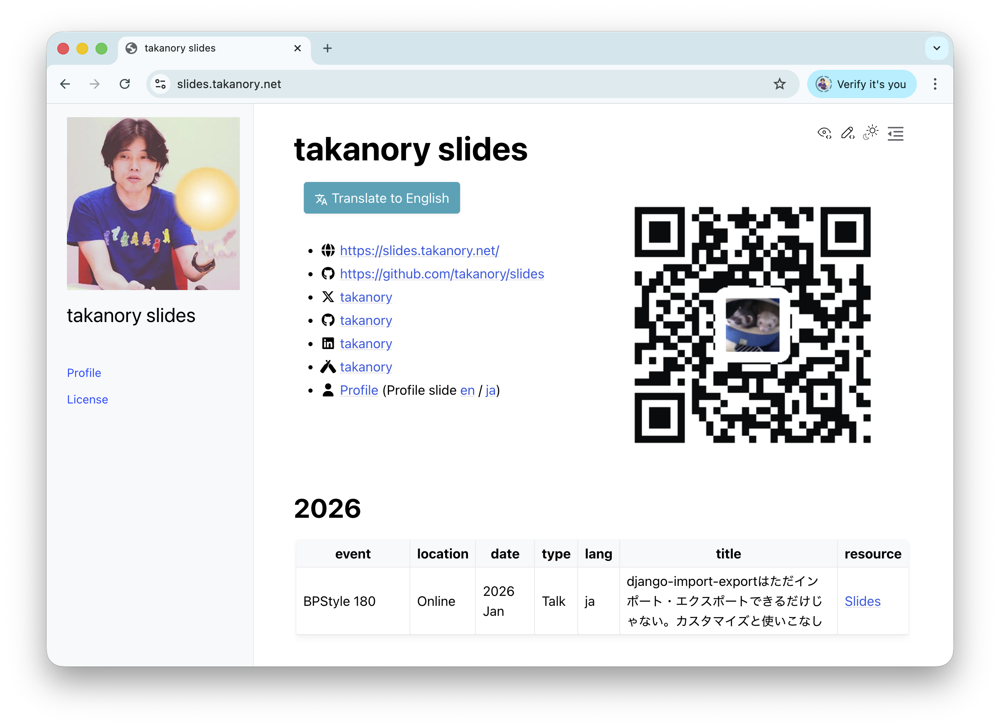

```{eval-rst}
:og:image: _images/20260221shizuoka.png
:og:image:alt: Pydanticで複雑なJSONを一発でValidation

.. |cover| image:: images/20260221shizuoka.png
```

# **Pydantic**で<br />複雑な**JSON**を<br />一発で**Validation**

```{image} images/pycon-mini-shizuoka-logo.png
:width: 50%
```

Takanori Suzuki

PyCon mini Shizuoka 2026 / 2026 Feb 21

## 今日話すこと {nekochan}`nesshou`

* **どんな課題**があったか {nekochan}`yabai`
* Pydanticの**基本** {nekochan}`benkyou`
* Pydanticで**複雑なJSON**を**Validation** {nekochan}`work-moeru`
* JSON SchemaからPydantic**コード生成** {nekochan}`kitai`
* さらなる**Validtionルール** {nekochan}`megane`

## Photos {nekochan}`camera` Tweets {nekochan}`niwatori` {nekochan}`come-on`

`#pyconshizu` / `@takanory`

### {fas}`globe` [`slides.takanory.net`](https://slides.takanory.net/) {nekochan}`miru`



## **Who** am I? / お前 **誰よ** {nekochan}`beer`

* Takanori Suzuki / 鈴木 たかのり ({fab}`twitter` [@takanory](https://twitter.com/takanory))
* [BeProud](https://www.beproud.jp/) 取締役 / Python Climber
* [PyCon JP Association](https://www.pycon.jp/) 代表理事
* [Python Boot Camp](https://www.pycon.jp/support/bootcamp.html) 講師、[Python mini Hack-a-thon](https://pyhack.connpass.com/) 主催、[Pythonボルダリング部](https://kabepy.connpass.com/) 部長


### PyCon JP 2026**共同座長** [^chairs] {nekochan}`nakayoshi`

* 日程：2026年8月21日（金）〜23日（日）
* 会場： 広島国際会議場
* 共同座長：佐野浩士、鈴木たかのり

```{image} images/pyconjp2026-chairs.png
:width: 60%
```

[^chairs]: [PyCon JP Blog: PyCon JP 2026 座長発表](https://pyconjp.blogspot.com/2025/10/pyconjp2026-co-chairs.html)

### 主催メンバー**募集中**！！ {nekochan}`kamon`

* **イベント企画の具体化**を進めてくれる方募集
* PyCon JP 2026主催メンバー申込フォーム [^form]


[^form]: <https://forms.gle/of8NjqkPmUaF8HGR7>

### **BeProud** Inc. {nekochan}`work`

* [BeProud](https://www.beproud.jp/): Pythonシステム開発、コンサル
* [connpass](https://connpass.com/): IT勉強会支援プラットフォーム
* [PyQ](https://pyq.jp/): Python独学プラットフォーム
* [TRACERY](https://tracery.jp/): システム開発ドキュメントサービス


### BeProud**メンバー募集中** {nekochan}`kamon`

```{image} /assets/images/qr-career.png
:width: 40%
:alt: Pythno求人のQRコード
:target: https://www.beproud.jp/careers/python/
```

```{image} /assets/images/qr-casual-interview.png
:width: 40%
:alt: カジュアル面談のQRコード
:target: https://forms.gle/tM4n2ufKf49MbXsH9
```

### **ブース出展**してます {nekochan}`banban`

```{image} images/beproud-booth.jpg
:width: 80%
```

## **どんな課題**があったか {nekochan}`yabai`

### **学習教材**のWebシステム [^manaviria] {nekochan}`benkyou`

```{image} https://www.meijitosho.co.jp/db/gakusan/manaviria/img/title-mv-manaviria-logo@2x.png
:alt: デジタル教材マナビリア
:width: 50%
```

* Webブラウザ上で副教材を使った勉強ができる

[^manaviria]: <https://www.meijitosho.co.jp/gakusan/manaviria/>

### さまざまな解答**フォーム形式** {nekochan}`good`

* 記述、選択式、並べ替え等

```{image} /20251204bpstyle/images/manaviria1.png
:alt: さまざまな解答形式
:width: 60%
```

### **さまざまな解答形式**の教材を作成 {nekochan}`work`

```{image} images/edit_quiz.gif
```

### フォーム形式ごとに異なる**設定項目** {nekochan}`guruguru`

* 記述式
  * 表紙形式：フォーム幅
  * 解答欄：正解、別解、プレースホルダー
* 選択式
  * 表示形式：ボタンorセレクトボックス、選択肢ラベル
  * 解答欄：選択肢リスト、正解リスト
* などなど...

### 設定項目は**JSON**をDBに保存 {nekochan}`mask`

```{code-block} json
{
    "question": "Python 3.14の新機能はどれ？（選択式）"
    "answer_format": "choices",
    "display": {"choices_selector": "button",
                "choices_label": "ABC"},
    "body": {
        "answers": [
            {"answer": "t-string",
             "is_correct": true},
            {"answer": "safe external debugger",
             "is_correct": true},
            {"answer": "lazy import",
             "is_correct": false},
    ]}
}
```

### DB保存時にJSONを**Validation** {nekochan}`ok`

* 目的：誤った形式のデータの混入を防ぐ
* 今までは**JSON Schema**でValidation

### **JSON Schema**とは {nekochan}`itabasami`

 [^json-schema]

* JSONデータの構造を**JSONで定義**する言語
* Pythonのライブラリ([jsonschema](https://python-jsonschema.readthedocs.io/en/stable/))あり

[^json-schema]: <https://json-schema.org/>

### JSON Schemaのサンプル [^json-schema-sample]

[^json-schema-sample]: [Creating your first schema](https://json-schema.org/learn/getting-started-step-by-step)

```{code-block} json
{"productId": 5, "productName": "MANAVIRIA"}
```

```{code-block} json
{
  "$schema": "https://json-schema.org/draft/2020-12/schema",
  "$id": "https://example.com/product.schema.json",
  "title": "Product",
  "description": "A product from Acme's catalog",
  "type": "object",
  "properties": {
    "productId": {
      "description": "The unique identifier for a product",
      "type": "integer"
    },
    "productName": {
      "description": "Name of the product",
      "type": "string"
    }
  }
}
```

### **JSON Schemaでいい**んじゃないの？ {nekochan}`hate`

### **マナビリアCBT**が爆誕[^cbt] {nekochan}`chudoon`

* ワークのみ→**CBT**(テスト)が追加(2026年4月)

```{image} https://www.meijitosho.co.jp/db/info/20250801_2.png
:width: 30%
```

[^cbt]: 全問自動採点のCBTサービス開始: <https://www.meijitosho.co.jp/info/?id=20250801>

### 似てるけど**微妙に異なる**JSON仕様 {nekochan}`ase`

* 点数：CBTのみ
* ヒント：ワークのみ
* 解答形式：共通
* ソート順：共通
* などなど

### JSON Schemaで**両方に対応**する？ {nekochan}`yabai`

* 共通の所は共通の処理にしたい
* コピペで似たJSON Schema管理はやりたくない

### JSON Schema実装のつらみ（私見） {nekochan}`pusupusu`

* Schemaが**長くて**見づらい
* 定義が**JSON**なので読みにくい
  * Pythonコード中に**長いdict**がある
* フォーム形式ごとにバリデーション切り替え
  * Pythonの`if`文とJSON Schemaの**混在**
  
### **Pydantic**に書き換えよう！！ {nekochan}`sore`

### PydanticでValidationの**結論** {nekochan}`doya`

* めっちゃ**いい感じ**にできた（自画自賛）

## Pydanticの**基本** {nekochan}`benkyou`

### **Pydantic**とは {nekochan}`mita`

 [^pydantic]

* Python用のデータValidationライブラリ
* dataclass、TypedDictなどをValidation可能
* **型ヒント**を使ってルールを定義 {nekochan}`yoshi`

[^pydantic]: <https://docs.pydantic.dev/>

### Pydanticを**インストール** {nekochan}`kochira`

```{code-block} bash
$ pip install "pydantic"
$ pip install "pydantic[email]"  # email Validationする場合
```

### JSONをValidation[^examples]

```{literalinclude} code/person.json
:language: json
```

```{literalinclude} code/example_model.py
:language: python
```

[^examples]: Validating File Data: <https://docs.pydantic.dev/latest/examples/files/>

### JSONをValidation

* 正しいJSONをValidation {nekochan}`yoshi`

```{literalinclude} code/example.py
:language: python
:lines: 1, 5-10
```

### JSONをValidation

* 正しくないJSONをValidation {nekochan}`ng`
  * `name`がない
  * `age`がマイナス
  * `email`がメールアドレスじゃない

```{literalinclude} code/person_wrong.json
```

### エラーがめちゃ親切 {nekochan}`dai-kansha`

```{literalinclude} code/example.py
:language: python
:lines: 3-4, 12-16
```

```{code-block} text
name
  Field required [type=missing, input_value={'age': -30, 'email': 'not-an-email-address'}, input_type=dict]
    For further information visit https://errors.pydantic.dev/2.12/v/missing
age
  Input should be greater than 0 [type=greater_than, input_value=-30, input_type=int]
    For further information visit https://errors.pydantic.dev/2.12/v/greater_than
email
  value is not a valid email address: An email address must have an @-sign. [type=value_error, input_value='not-an-email-address', input_type=str]
```

```{revealjs-break}
```

```{revealjs-code-block} text
:data-line-numbers: 2,5,8

name
  Field required [type=missing, input_value={'age': -30, 'email': 'not-an-email-address'}, input_type=dict]
    For further information visit https://errors.pydantic.dev/2.12/v/missing
age
  Input should be greater than 0 [type=greater_than, input_value=-30, input_type=int]
    For further information visit https://errors.pydantic.dev/2.12/v/greater_than
email
  value is not a valid email address: An email address must have an @-sign. [type=value_error, input_value='not-an-email-address', input_type=str]
```

* `name`は必須のフィールド
* `age`は0より大きい
* `email`の値がメールアドレス形式じゃない

## Pydanticで**複雑なJSON**を<br />**Validation** {nekochan}`work-moeru`

### 複数のモデルを**Unions**でまとめる {nekochan}`nakayoshi`

* 解答フォーム形式（記述、選択式等）ごとにPydanticモデルが必要
* **Unions**（`|`）[^unions]を使用すると「いずれかにマッチ」ができる

[^unions]: Unions: <https://docs.pydantic.dev/latest/concepts/unions/>

```{revealjs-break}
```

```{literalinclude} code/unions_sample.py
:language: python
```

### **複数の解答形式**のクラス構成 {nekochan}`purupuru`

```{mermaid} pydantic_models.mmd
```

```{revealjs-break}
```

* 解答の**ベースクラス**を定義

```{revealjs-literalinclude} code/unions_form.py
:language: python
:lines: 1-21
:data-line-numbers: 6-11|14-21
```

```{revealjs-break}
:notitle:
```

* **CBT記述式**と**ワーク記述式**のモデル定義

```{revealjs-literalinclude} code/unions_form.py
:language: python
:lines: 24-41
:data-line-numbers: 1-6|9-18|9,15
```

```{revealjs-break}
:notitle:
```

* **CBT選択式**と**ワーク選択式**のモデル定義

```{revealjs-literalinclude} code/unions_form.py
:language: python
:lines: 44-61
:data-line-numbers: 1-6|9-18
```

```{revealjs-break}
:notitle:
```

* **CBT並べ替え**と**ワーク並べ替え**のモデル定義

```{revealjs-literalinclude} code/unions_form.py
:language: python
:lines: 64-78
```

```{revealjs-break}
:notitle:
```

* **Unions**で複数の解答欄を1つに**まとめる**

```{revealjs-literalinclude} code/unions_form.py
:language: python
:lines: 81-90
```

```{revealjs-break}
:notitle:
```

* CBT記述式を**Validation**

```{revealjs-literalinclude} code/unions_form.py
:language: python
:lines: 92-107
```

```{revealjs-break}
:notitle:
```

* きちんと**Validationできてる**ーーーー {nekochan}`big-love`

```bash
$ python unions_form.py  # 見やすくするために改行を入れている
form=CBTWritten(
  question='Pythonの作者は？',
  sort_order=1,
  answer_format=1,
  body=WrittenBody(
    form_width=1,
    answer='Guido van Rossum',
    placeholder='作者名をアルファベットで書いてください',
    max_chars=100
  ),
  score=5
)
```

```{revealjs-break}
:notitle:
```

* ワーク選択式を**Validation**

```{revealjs-literalinclude} code/unions_form.py
:language: python
:lines: 110-124
```

### Pydanticで**一発でValidation**できる！ {nekochan}`kitakitakitakita-kitakitsune`

## JSON Schemaから<br />Pydantic**コード生成** {nekochan}`kitai`

### SchemaからPydantic**コード生成** {nekochan}`kitai`

* 実際のJSON Schemaはもっと**複雑**
* 解答形式も**6パターン**
* Pydanticのコード書くのは大変そう {nekochan}`ase`

### datamodel-code-generator [^codegen] {nekochan}`kami`

* 各種データ定義からPythonの**コードを生成**
* 入力：OpenAPI、**JSON Schema**、YAML、GraphQL、Python辞書など
* 出力：**Pydantic**、dataclass、TypedDictなど

[^codegen]: <https://koxudaxi.github.io/datamodel-code-generator/>

```{revealjs-break}
```

* 解答欄の形式ごとに**JSONファイル**を作成
* →Pydanticの**モデルコード**を生成

```{code-block} bash
$ pip install datamodel-code-generator
$ datamodel-codegen --input schema.json \
  --input-file-type jsonschema \
  --output-model-type pydantic_v2.BaseModel \
  --output model.py
```

### 解答欄の**Pydanticモデル**ができた！ {nekochan}`dai-kansha`

## さらなる**Validtionルール** {nekochan}`megane`

### さらなる**Validtionルール** {nekochan}`megane`

* データを**意味的に解釈**してValidationしたい
* 複数の項目の**組み合わせ**でValidationしたい
* →**Constraints**追加、**Validator**の**作成**

### **任意の値**のみ選択可能にする

* Enumで定義した値のみ指定可 [^enums]

```{code-block} python
from enum import Enum

class TextInputFormat(Enum):
    """記述式のテキスト入力形式"""
    HALF_WIDTH = 1  # 幅50%
    FULL_WIDTH = 2  # 幅100%（1行）
	
class WrittenBody(BaseModel):
    """記述式ボディ"""
    text_input_format: TextInputFormat
    ...
```

[^enums]: <https://docs.pydantic.dev/latest/api/standard_library_types/#enums>

### **数値の範囲**や**文字数**を指定

* `Field()`クラスの引数で条件を指定
* 文字数[^strings]、数値の範囲[^integers]など

```{code-block} python
class WrittenBody(BaseModel):
    """記述式ボディ"""
    # プーレースホルダーの文字数を指定
    placeholder: str = Field(..., min_length=10, max_length=50)
    # 解答の最大文字数を100以下に指定
    max_chars: PositiveInt = Field(..., le=100)
```

 [^strings]: <https://docs.pydantic.dev/latest/api/standard_library_types/#strings>
 [^integers]: <https://docs.pydantic.dev/latest/api/standard_library_types/#integers>

### 選択肢は**1つ以上の正解**が必要

* `@model_validator`でValidatorを定義 [^validators]

[^validators]: <https://docs.pydantic.dev/latest/concepts/validators/>

```{code-block} python
class ChoicesBody(BaseModel):
    "選択式ボディ"""
    is_collects: list[bool]  # 正解 or 不正解
	
    @model_validator(mode="after")
    def at_least_one_correct(self) -> Self:
        """is_collectsに1つ以上のTrueがあるか"""
        if not any(is_corrects):
            raise ValueError("正解の選択肢がありません")
        return self
```

### つらみは**解消**した？ {nekochan}`singi-chu`

* Schemaが**長くて**見づらい
  * **コンパクト**になった
* 定義が**JSON**なので読みにくい
  * **型ヒント**で読みやすく
* フォーム形式ごとにバリデーション切り替え
  * 1つのモデルに**集約**
  
### 他にもいろいろできるので<br />詳しくは**ドキュメント**読んでね {nekochan}`holiday-nya2`

{fas}`globe` [`docs.pydantic.dev`](https://docs.pydantic.dev/latest/)

## **複雑なデータ**をValidation<br />→**Pydantic**を検討しよう！ {nekochan}`kyapi`

## Thank You {nekochan}`pray`

{fas}`desktop` [slides.takanory.net](https://slides.takanory.net/)
{fas}`code` [20260221shizuoka/code](https://github.com/takanory/slides/tree/master/slides/20260221shizuoka/code)

{fab}`twitter` [takanory](https://twitter.com/takanory)
{fab}`github` [takanory](https://github.com/takanory/)
{fab}`linkedin` [takanory](https://www.linkedin.com/in/takanory/)
{fab}`untappd` [takanory](https://untappd.com/user/takanory/)


