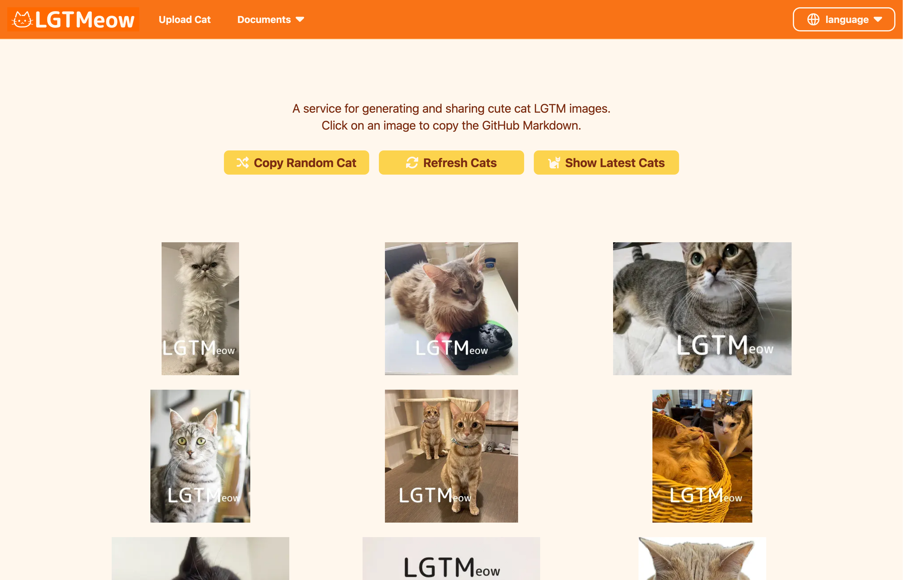

```{eval-rst}
:og:image: _images/20260322pythonasia.png
:og:image:alt: Put 🐱 Cat Emojis in your Documents!

.. |cover| image:: images/20260322pythonasia.png
```

# Put 🐱 **Cat Emojis**<br />in your Documents!

```{image} images/python-asia-branding.png
:width: 40%
```

Takanori Suzuki

PythonAsia 2026 / 2026 Mar 22

## [PR] PyCon **JP** 2026

* {fas}`globe` [2026.pycon.jp](https://2026.pycon.jp/)
* 📅 Date: 2026 **Aug 21-23**
* ⛩️ Place: **Hiroshima**, Japan
* 🎙️ Call for Proposals / Sponsor: TBA

```{image} images/pyconjp-logo.png
:width: 40%
```

## Do you **like cats**? 🐱

### IMO, **Many programmers** like Cats <br /> 🧑‍💻 👩‍💻 ❤️ 🐱

### For example: [LGTMeow](https://lgtmeow.com/en)



### I **like cats** too 🐈

### But I like **Ferrets** even more! 😍

```{image} images/fchan.jpg
:alt: f-chan
:width: 32%
```

```{image} images/nia-and-seven.jpg
:alt: nia-chan and seven-chan
:width: 32%
```

```{image} images/seven.jpg
:alt: seven-chan
:width: 32%
```

## About **Cat Emojis** 🐱

### Cat Emojis for **Slack** & **Discord** 💬

* Cat Emojis are **Created** and **Distributed** by **Shikamatsu-san**([@shi_ka_ma_tsu](https://x.com/shi_ka_ma_tsu))

```{image} https://assets.st-note.com/production/uploads/images/111036040/rectangle_large_type_2_8d02bf693e68eb6eefb92eb427a577d2.png?width=2000&height=2000&fit=bounds&quality=85
:width: 60%
```

```{revealjs-break}
```

* I **use** it **every day** in company / community Slack

```{image} images/nekochan-react1.png
:width: 48%
```

```{image} images/nekochan-react2.png
:width: 30%
```

```{revealjs-break}
```

* You **can download** Cat Emojis!!
* [note.com/shikamatsu/n/nd217dc0617db](https://note.com/shikamatsu/n/nd217dc0617db) [^guide]

```{image} images/download-nekochan-emojis.png
:alt: Download Nekochan emojis
:width: 60%
```

[^guide]: [Guidelines for Using Cat Emojis](https://note.com/shikamatsu/n/n8818bb5ebea1#8b38f78f-1883-46c6-a596-63d9bf4c69da)

## Cat Emojis in **Documents** 🐱 📄

### Motivation 💪

* Use Cat Emojis on **My Slides**
* Can do it by **Copy & Paste** Emoji image

```{image} images/emoji-copy-paste.gif
:alt: Copy and Paste Cat Emoji
:width: 75%
```

### **Programmer is Lazy** 🫠

Copy & Paste lots of Emojis is **Boring**

### We have **Python** {fab}`python`

**Simplify** the Boring Stuff with Python

## **sphinx-nekochan** 🔧

("Nekochan" is Cat in Japanese)

### **sphinx-nekochan** 🔧

* **Sphinx extension** for adding **Cat emoji** to docs
* {fas}`globe` [sphinx-nekochan.readthedocs.io](https://sphinx-nekochan.readthedocs.io/)

```{image} images/sphinx-nekochan-web.png
:alt: sphinx-nekochan web page
:width: 60%
```

### Sphinx 👁️‍🗨️

* {fas}`globe` [www.sphinx-doc.org](https://www.sphinx-doc.org/)
* Easy to create intelligent and beautiful docs
* [docs.python.org](https://docs.python.org/3/) using Sphinx

```{image} images/docs-python-org.png
:alt: docs.python.org
:width: 50%
```

### Get Started 🏃

* install, generate Sphinx base files

```bash
$ pip install sphinx-nekochan
$ sphinx-quickstart
```

* add `sphinx_nekochan` extension in **conf.py**

```{code-block} python
extensions = [
    ...
    "sphinx_nekochan",
]
```

```{revealjs-break}
```

* Use **`nekochan`** role in the document

````{tab-set-code}
```markdown
I love {nekochan}`beer`
```

```rst
I love :nekochan:`beer`
```
````

* **Build** html documents

```bash
$ make html
$ open build/html/index.html
```

```{revealjs-break}
```

* Cat Emoji **displayed** in the document!! 🎉

```{image} images/sphinx-nekochan-sample.png
:alt: sphinx-nekochan sample document
:width: 130%
```

### **Find** the **Name** of Cat Emoji 🔎

* [List of Nekochan emoji](https://sphinx-nekochan.readthedocs.io/nekochan_emojis.html)
* [List of Nekochan emoji without text](https://sphinx-nekochan.readthedocs.io/nekochan_emojis_without_text.html)

```{image} https://sphinx-nekochan.readthedocs.io/_images/nekochan-search.gif
:width: 70%
```

## sphinx-nekochan on **slides** 💻

### sphinx-revealjs 

* {fas}`globe` [sphinx-revealjs.readthedocs.io](https://sphinx-revealjs.readthedocs.io/)
* Sphinx extension to generate [Reveal.js](https://revealjs.com/) slides

<iframe height="400" src="https://attakei.github.io/sphinx-revealjs/en/index.html" title="Introduction of sphinx-revealjs" width="600"></iframe>

### sphinx-revealjs with sphinx-nekochan

* **Same code** will display Cat Emoji in slides

````{tab-set-code}
```markdown
* I love {nekochan}`beer`
* See you in Japan {nekochan}`come-on`
```

```rst
* I love :nekochan:`beer`
* See you in Japan :nekochan:`come-on`
```
````

* I love {nekochan}`beer`
* See you in Japan {nekochan}`come-on`

## **Customize** emoji {nekochan}`memo`

### Customize emoji **Height** {nekochan}`nobita` [^height]

````{tab-set-code}
```markdown
* Big bear {nekochan}`bear;1.5em` default {nekochan}`bear`
* Huge hot-sprint nekochan {nekochan}`hot-spring;100px`
```

```rst
* Big bear :nekochan:`bear;1.5em` default :nekochan:`bear`
* Huge hot-sprint nekochan :nekochan:`hot-spring;100px`
```
````

* Big bear {nekochan}`bear;1.5em` default {nekochan}`bear`
* Huge hot-sprint nekochan {nekochan}`hot-spring;100px`

[^height]: <https://sphinx-nekochan.readthedocs.io/#customize-emoji-height-and-alt-text>

### **Transform** emoji {nekochan}`goron-goron` [^transform]

````{tab-set-code}
```markdown
* {nekochan}`skip` rotate {nekochan}`skip;;;rotate-90`
* {nekochan}`yoshi` flip horizontal
{nekochan}`yoshi;;;flip-horizontal`
```

```rst
* :nekochan:`skip` rotate :nekochan:`skip;;;rotate-90`
* :nekochan:`yoshi` flip horizontal
:nekochan:`yoshi;;;flip-horizontal`
```
````

* {nekochan}`skip` rotate {nekochan}`skip;;;rotate-90`
* {nekochan}`yoshi` flip horizontal
{nekochan}`yoshi;;;flip-horizontal`

[^transform]: <https://sphinx-nekochan.readthedocs.io/#transform-emoji>

## **Enjoy** sphinx-nekochan {nekochan}`yatta`

* {nekochan}`work` [sphinx-nekochan.readthedocs.io](https://sphinx-nekochan.readthedocs.io)
* {nekochan}`octpus` [takanory/sphinx-nekochan](https://github.com/takanory/sphinx-nekochan)
  * Please **GitHub star** if you like it! {nekochan}`kitai`
* {nekochan}`snake` [pypi.org/project/sphinx-nekochan](https://pypi.org/project/sphinx-nekochan/)

```{revealjs-break}
:notitle:
```

{nekochan}`akeome-nya`
{nekochan}`ame-nya`
{nekochan}`amefoot-nya`
{nekochan}`angel-nya`
{nekochan}`ase-nya`
{nekochan}`atsui-nya`
{nekochan}`autumn-nya`
{nekochan}`azarashi-nya`
{nekochan}`badminton-nya`
{nekochan}`bakushou-nya`
{nekochan}`banban-nya`
{nekochan}`banya-nya`
{nekochan}`banzai-nya`
{nekochan}`barista-nya`
{nekochan}`barrier-nya`
{nekochan}`basketball-nya`
{nekochan}`beam-nya`
{nekochan}`beer-nya`
{nekochan}`benkyou`
{nekochan}`big-love-nya`
{nekochan}`bikkuri-nya`
{nekochan}`bow-nya`
{nekochan}`bow-nya2`
{nekochan}`buriburiburiburi-muchaburi-nya`
{nekochan}`buttobu-nya`
{nekochan}`byebye-nya`
{nekochan}`calendar-nya`
{nekochan}`camera-nya`
{nekochan}`cat-rareta-nya`
{nekochan}`chira-nya`
{nekochan}`choo-choo-train-nya`
{nekochan}`chudoon-nya`
{nekochan}`clap-nya`
{nekochan}`css-kanzen-ni-rikai-sita-nya`
{nekochan}`dai-kansha-nya`
{nekochan}`daijoubu-nya`
{nekochan}`dancing-nya`
{nekochan}`densha-nya`
{nekochan}`docchidemo-ii-nya`
{nekochan}`donburako-nya`
{nekochan}`done-nya`
{nekochan}`donmai-nya`
{nekochan}`doron-nya`
{nekochan}`doya-nya`
{nekochan}`drum-nya`
{nekochan}`eiei-o-nya`
{nekochan}`fire-nya`
{nekochan}`freeze-nya`
{nekochan}`gattai-nya`
{nekochan}`gerokowa-nya`
{nekochan}`gessori-nya`
{nekochan}`gohan-nya`
{nekochan}`gohan-taberu-nya`
{nekochan}`good-nya`
{nekochan}`goron-goron-nya`
{nekochan}`gorua-nya`
{nekochan}`guiter-nya`
{nekochan}`guruguru-nya`
{nekochan}`ha-nya`
{nekochan}`hachi-nya`
{nekochan}`hai-nya`
{nekochan}`haniwa-nya`
{nekochan}`haniwa-nya-noroi`
{nekochan}`haniwa-nya-purupuru`
{nekochan}`haniwa-nya-shousei`
{nekochan}`haniwa-nya-shutudo`
{nekochan}`haniwa-nya-spin`
{nekochan}`haniwa-nya-yatta`
{nekochan}`hansei-nya`
{nekochan}`hare-nya`
{nekochan}`hate-nya`
{nekochan}`hebi-nya`
{nekochan}`help-nya`
{nekochan}`hige-nya`
{nekochan}`hirameita-nya`
{nekochan}`hituji-nya`
{nekochan}`hiza-ni-ya-wo-ukete-simatte-nya`
{nekochan}`ho-nya`
{nekochan}`hokkori-nya`
{nekochan}`holiday-nya2`
{nekochan}`holiday-nya3`
{nekochan}`hospital-nya`
{nekochan}`hotcake-nya`
{nekochan}`hueta-nya`
{nekochan}`hug-nya`
{nekochan}`hyoui-nya`
{nekochan}`hyun-nya`
{nekochan}`ie-nya`
{nekochan}`ika-nya`
{nekochan}`inai-nya`
{nekochan}`inosisi-nya`
{nekochan}`inu-nya`
{nekochan}`isogu-nya`
{nekochan}`issue-mada-nai-nya`
{nekochan}`itabasami-nya`
{nekochan}`itsumo-sumanai-nya`
{nekochan}`ittari-kitari-nya`
{nekochan}`ji-nya`
{nekochan}`jii-nya2`
{nekochan}`jikan-nya`
{nekochan}`jiken-nya`
{nekochan}`jinrou-nya`
{nekochan}`jito-nya`
{nekochan}`juutai-nya`
{nekochan}`kahun-nya`
{nekochan}`kaisan-nya`
{nekochan}`kami-nya`
{nekochan}`kaminari-nya`
{nekochan}`kamon-nya`
{nekochan}`karai-nya`
{nekochan}`kata-koru-nya`
{nekochan}`kaze-tuyoi-nya`
{nekochan}`kenkou-shindan-nya`
{nekochan}`kick-nya`
{nekochan}`kiku-nya`
{nekochan}`kiriri-nya`
{nekochan}`kitaeru-nya`
{nekochan}`kitai-nya`
{nekochan}`kitakitakitakita-kitakitsune-nya`
{nekochan}`kito-nya`
{nekochan}`kochira-nya`
{nekochan}`komata-nya`
{nekochan}`kosame-nya`
{nekochan}`kossori-nya`
{nekochan}`kouji-nya`
{nekochan}`kuchibue-nya`
{nekochan}`kuma-nya`
{nekochan}`kuro-bow-nya`
{nekochan}`kuro-juutai-nya`
{nekochan}`kuro_ng`
{nekochan}`kuro_ok`
{nekochan}`kusa-nya`
{nekochan}`kyapi-nya`

```{revealjs-break}
:notitle:
```

{nekochan}`kyomu-nya`
{nekochan}`kyomu-nya2`
{nekochan}`kyun-desu-nya`
{nekochan}`lgtm-nya`
{nekochan}`lion-nya`
{nekochan}`love-nya`
{nekochan}`maccho-nya`
{nekochan}`mada-nya`
{nekochan}`magic-nya`
{nekochan}`maguro-no-osushi-nya`
{nekochan}`mail-nya`
{nekochan}`manpuku-nya`
{nekochan}`mask-nya`
{nekochan}`massage-nya`
{nekochan}`maturi-nya`
{nekochan}`mawaru-nya`
{nekochan}`mechanaki-nya`
{nekochan}`medetai-nya`
{nekochan}`melty-nya`
{nekochan}`memo-nya`
{nekochan}`merry-chri-nya2`
{nekochan}`mesareta-nya`
{nekochan}`mi-nyai-nya`
{nekochan}`miru-nya`
{nekochan}`mita-nya`
{nekochan}`momo-nya`
{nekochan}`mosamosa-nya`
{nekochan}`mou-dounidemo-nare-nya`
{nekochan}`mu-nya`
{nekochan}`mukiau-nya`
{nekochan}`murabito-nya`
{nekochan}`murimurimurimurikatatsumuri-nya`
{nekochan}`nadenade-nya`
{nekochan}`nagameru-nya`
{nekochan}`nageta-nya`
{nekochan}`naisho-nya`
{nekochan}`nakayoshi-nya`
{nekochan}`naki-nya`
{nekochan}`namae-ha-mada-nai-nya`
{nekochan}`nanimo-sitenainoni-kowareta-nya`
{nekochan}`naosu-nya`
{nekochan}`naruhodo-nya`
{nekochan}`nasi-nya`
{nekochan}`nasu-nya`
{nekochan}`neko-nya`
{nekochan}`neko-on-rails-nya`
{nekochan}`nemui-nya`
{nekochan}`neru-nya`
{nekochan}`nesshou-nya`
{nekochan}`netenai-nya`
{nekochan}`netsu-nya`
{nekochan}`nezumi-nya`
{nekochan}`ng-nya`
{nekochan}`nice-nya`
{nekochan}`nigawarai-nya`
{nekochan}`nihonshu-nya`
{nekochan}`nikai-kara-megusuri-nya`
{nekochan}`niko-nya`
{nekochan}`niwatori-nya`
{nekochan}`niyari-nya`
{nekochan}`nobita-ashi-nya`
{nekochan}`nobita-nya`
{nekochan}`nobita-tubo-nya`
{nekochan}`nyaan-nya`
{nekochan}`oblate-nya`
{nekochan}`oblate-nya2`
{nekochan}`ocha-nya`
{nekochan}`ocha-sinpai-nya`
{nekochan}`ochita-nya`
{nekochan}`odaijini-nya`
{nekochan}`ok-nya`
{nekochan}`ok-nya2`
{nekochan}`okita-nya`
{nekochan}`oko-nya`
{nekochan}`okusuri-nya`
{nekochan}`omoi-nya`
{nekochan}`onaka-suita-nya`
{nekochan}`onashasu-nya`
{nekochan}`oni-nya`
{nekochan}`onsen-nya`
{nekochan}`ooame-nya`
{nekochan}`orz-nya`
{nekochan}`osirase-nya`
{nekochan}`ota-gei-nya`
{nekochan}`otodoke-nya`
{nekochan}`ouen-nya`
{nekochan}`ouen-nya2`
{nekochan}`paaan-nya`
{nekochan}`panda-nya`
{nekochan}`patari-nya`
{nekochan}`peace-nya`
{nekochan}`piano-nya`
{nekochan}`pien-nya`
{nekochan}`pizza-nya`
{nekochan}`pokan-nya`
{nekochan}`pool-nya`
{nekochan}`pray-nya`
{nekochan}`puka-puka-nya`
{nekochan}`punch-nya`
{nekochan}`purupuru-nya`
{nekochan}`pusupusu-nya`
{nekochan}`ra-nya`
{nekochan}`raja-nya`
{nekochan}`ringo-nya`
{nekochan}`robot-nya`
{nekochan}`rubber-duck-nya`
{nekochan}`ryu-nya`
{nekochan}`salmon-no-osushi-nya`
{nekochan}`samui-nya`
{nekochan}`santa-nya`
{nekochan}`sarasara-nya`
{nekochan}`saru-nya`
{nekochan}`sayonara-nya`
{nekochan}`scream-nya`
{nekochan}`seiza-taiki-nya`
{nekochan}`seki-nya`
{nekochan}`seya-nya`
{nekochan}`shoudan-nya`
{nekochan}`shouka-nya`
{nekochan}`simasima-nya`
{nekochan}`singi-chu-nya`
{nekochan}`sirome-nya`
{nekochan}`skip-nya`
{nekochan}`slot-nya`
{nekochan}`soccer-nya`
{nekochan}`sodateru-nya`
{nekochan}`sore-nya`
{nekochan}`souji-nya`
{nekochan}`spring-nya`
{nekochan}`stretch-nya`
{nekochan}`subeteno-cookie-wo-ukeireru-nya`
{nekochan}`suit-nya`
{nekochan}`suki-nya`

```{revealjs-break}
:notitle:
```

{nekochan}`summer-nya`
{nekochan}`suteru-nya`
{nekochan}`suzusi-nya`
{nekochan}`taifu-nya`
{nekochan}`takkyu-nya`
{nekochan}`tako-nya`
{nekochan}`tamago-no-osushi-nya`
{nekochan}`tambourine-nya`
{nekochan}`tanuki-nya`
{nekochan}`tasikani-nya`
{nekochan}`tehe-nya`
{nekochan}`tekuteku-nya`
{nekochan}`tel-nya`
{nekochan}`tennis-nya`
{nekochan}`tere-nya`
{nekochan}`teruteru-nya`
{nekochan}`test-mada-nai-nya`
{nekochan}`thanks-nya`
{nekochan}`think-nya`
{nekochan}`thinking-nya`
{nekochan}`tobotobo-nya`
{nekochan}`togetoge-nya`
{nekochan}`tora-nya`
{nekochan}`toratoratoratora-trouble-nya`
{nekochan}`totugeki-nya`
{nekochan}`travel-nya`
{nekochan}`trick-or-treat-nya`
{nekochan}`trick-or-treat-nya2`
{nekochan}`trumpet-nya`
{nekochan}`tunda-nya`
{nekochan}`tuntun-nya`
{nekochan}`uchu-neko-nya`
{nekochan}`uma-nya`
{nekochan}`umasou-nya`
{nekochan}`unun-nya`
{nekochan}`unun2-nya`
{nekochan}`uparupa-nya`
{nekochan}`usagi-nya`
{nekochan}`usi-nya`
{nekochan}`utatane-nya`
{nekochan}`uum-nya`
{nekochan}`uwame-nya`
{nekochan}`virus-nya`
{nekochan}`wairo-nya`
{nekochan}`wani-nya`
{nekochan}`wao-nya`
{nekochan}`waru-nya`
{nekochan}`wine-nya`
{nekochan}`wink-nya`
{nekochan}`winter-nya`
{nekochan}`work-moeru-nya`
{nekochan}`work-nya`
{nekochan}`work-yabai-nya`
{nekochan}`yabai-nya`
{nekochan}`yadayada-nya`
{nekochan}`yakyu-nya`
{nekochan}`yama-nobori-nya`
{nekochan}`yareyare-nya`
{nekochan}`yatta-nya`
{nekochan}`yoga-nya`
{nekochan}`yoku-dekimasita-nya`
{nekochan}`yoru-nya`
{nekochan}`yoshi-nya`
{nekochan}`yossha-nya`
{nekochan}`youkoso-nya`
{nekochan}`younasi-nya`
{nekochan}`yukidaru-nya`
{nekochan}`yusayusa-nya`
{nekochan}`yutai-ridatsu-nya`
{nekochan}`zombie-nya`
{nekochan}`zoom-nya`
{nekochan}`zou-nya`
{nekochan}`zuko-nya`
{nekochan}`zutsu-nya`
{nekochan}`ヴィーnyaス誕生`
{nekochan}`ショパン-nya`
{nekochan}`バッハ-nya`
{nekochan}`フェルメール-nya`
{nekochan}`ベートーベン-nya`
{nekochan}`モニャリザの微笑み-nya`
{nekochan}`モーツァルト-nya`
{nekochan}`我が子を食らうサトゥルヌス-nya`
{nekochan}`牛乳-long`
{nekochan}`牛乳-so-long`
{nekochan}`牛乳を注ぐおんnya`
{nekochan}`空也上人-nya`

## Thank you {nekochan}`pray`

{fas}`desktop` [slides.takanory.net](https://slides.takanory.net/)

{fas}`globe` [sphinx-nekochan.readthedocs.io](https://sphinx-nekochan.readthedocs.io/)

{fab}`twitter` [takanory](https://twitter.com/takanory)
{fab}`github` [takanory](https://github.com/takanory/)
{fab}`linkedin` [takanory](https://www.linkedin.com/in/takanory/)
{fab}`untappd` [takanory](https://untappd.com/user/takanory/)


