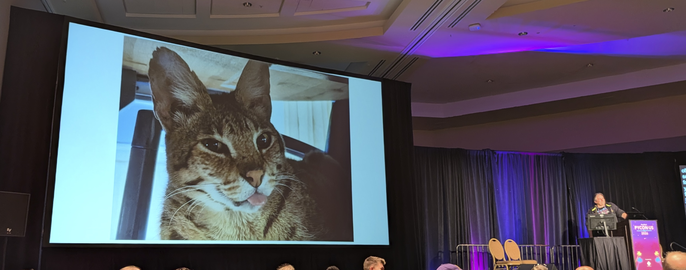
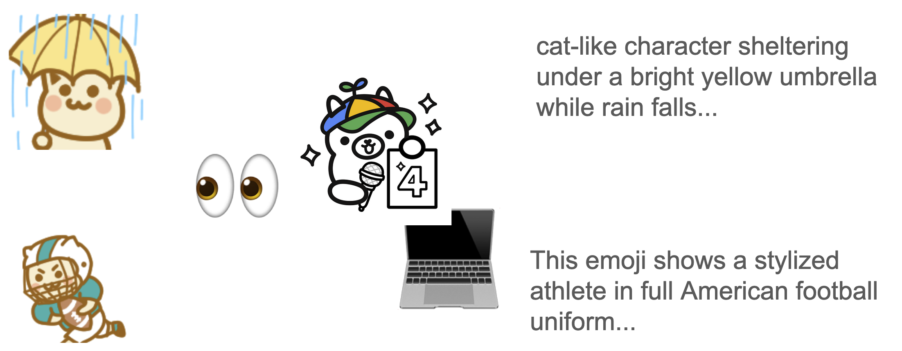
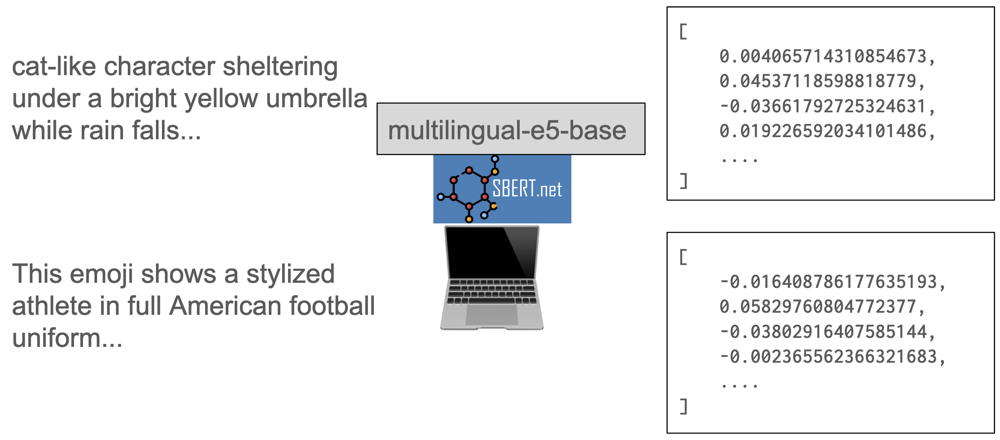
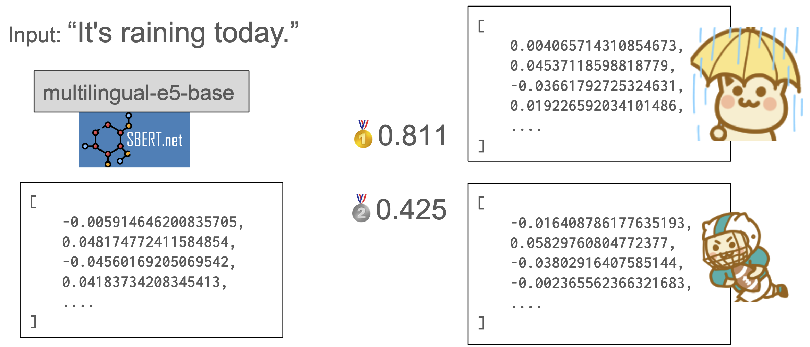
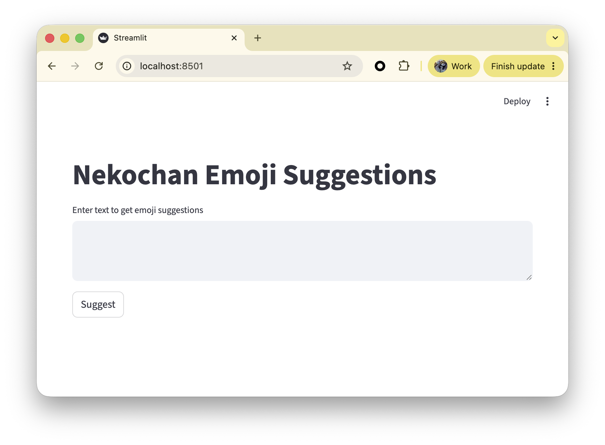
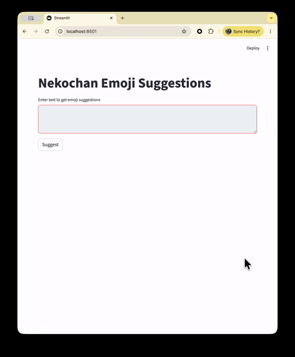

```{eval-rst}
:og:image: _images/20260517pyconus.png
:og:image:alt: Find Better 🐱 Cat Emojis with your text!

.. |cover| image:: images/20260517pyconus.png
```

# Find **Better** 🐱 Cat Emojis with your text!

Takanori Suzuki

```{image} images/pyconus2026logo.svg
:alt: PyCon US 2026 logo
:width: 10%
```

PyCon US 2026 / 2026 May 17

## [AD] **PyCon JP** 2026 🇯🇵

* {fas}`globe` [2026.pycon.jp](https://2026.pycon.jp/)
* 📅 2026 **Aug 21**(Fr)-**23**(Su)
* ⛩️ Hiroshima, Japan
* 📣 Call for **Proposals**, Call for **Sponsors**, <br />**Tickets** on sale!!

```{image} images/pyconjp-qrcode.png
:width: 20%
```

## Do you **like Cats**? 🐱

### IMO, **Many programmers** like Cats <br /> 🧑‍💻 👩‍💻 ❤️ 🐱

### **A Council Member** also likes Cats 😍



## In PyCon US 2025 ⚡️️ [^youtube][^slides]

```{image} images/pyconus2025lt.jpg
:alt: Put 🐱 Cat Emojis in your Documents!
:width: 68%
```

[^youtube]: {fab}`youtube` [Lightning Talks - Sunday, May 18th, 2025 AM](https://www.youtube.com/watch?v=lXngPPRaqGg&t=1009s)
[^slides]: Slides: [slides.takanory.net/slides/20250518pyconus/](https://slides.takanory.net/slides/20250518pyconus/)

```{revealjs-notes}
Last year, I introduced a library called sphinx-nekochan.
It's a fun tool that lets you insert cute cat emojis into your Sphinx documentation.
If you're interested, please check out YouTube or slides.
```

## The Problem {nekochan}`nanimo-sitenainoni-kowareta-nya`

```{revealjs-notes}
But, we now face a new problem.
```

### The Problem {nekochan}`nanimo-sitenainoni-kowareta-nya`

```{revealjs-section}
:data-background-image: images/many-nekochan-emojis.png
:data-background-size: contain
```

* LOTS of CAT EMOJIS!!(378 emojis)
* Hard to find the right emoji

```{revealjs-notes}
There are lots of cat emojis!!
That makes it really hard to find the right one for the context.
But...
```

## We have **Python** {fab}`python` and **AI** {nekochan}`robot`

### Solution: `nekochan-suggest` {nekochan}`hirameita`

* Find the **purr-fect** cat emoji using AI
* {fab}`github` [`takanory/nekochan-suggest`](https://github.com/takanory/nekochan-suggest/)

```{revealjs-notes}
To solve the problem, I created a new tool called nekochan-suggest.
It helps you find the purr-fect cat emoji using the power of AI!
```

## `nekochan-suggest`:<br>How it works {nekochan}`work-moeru`

### `nekochan-suggest`: How it works {nekochan}`work-moeru`

* **Captioning**: [Ollama](https://ollama.com/) + [gemma4:e4b](https://ollama.com/library/gemma4:e4b)
* **Embedding**: [SentenceTransformers](https://www.sbert.net/) + [multilingual-e5-base](https://huggingface.co/intfloat/multilingual-e5-base)
* **Search**: Vector Nearest Neighbor

```{revealjs-notes}
The mechanism of nekocha-suggest can be divided into the following three parts:
```

### Captioning: [Ollama](https://ollama.com/) + [gemma4:e4b](https://ollama.com/library/gemma4:e4b) {nekochan}`memo`



 
```{revealjs-notes}
I used Gemma4 to generate annotation text from cat emoji images.
Gemma4 can handle image inputs.
```

### Embedding: [SentenceTransformers](https://www.sbert.net/) + [multilingual-e5-base](https://huggingface.co/intfloat/multilingual-e5-base) {nekochan}`itabasami`



```{revealjs-notes}
I used multilingual-e5-base model to vectorize the annotation text.
This model can embed multilingual text.
```

### Search: Vector Nearest Neighbor {nekochan}`miru`



```{revealjs-notes}
During a search, the input text is embedded using the same model.
Then, the similarity between the resulting vector and the vectors for each emoji is calculated.
In this case, the emoji of umbrella cat has a higher score, so it is displayed as a search result.
```

## Demo {nekochan}`work`

### `nekochan-suggest` CLI {nekochan}`work`

```{code-block} console
% nekochan-suggest "I love beer"
1. beer-nya  0.78
2. wine-nya  0.78
3. barista-nya  0.77
```

```{revealjs-break}
```

```{code-block} console
% nekochan-suggest build-anotations --help
usage: nekochan-suggest [-h] [--count N] [--json] [TEXT]

Suggest nekochan emoji filenames for a given text.

positional arguments:
  TEXT           Text to suggest emojis for. Reads from stdin if omitted.

options:
  -h, --help     show this help message and exit
  --count, -n N  Number of suggestions to return (1-10). Default: 3.
  --json         Output results in JSON format to stdout.
```

### `nekochan-suggest-ui` {nekochan}`work`



```{revealjs-break}
:notitle:
```



### **Easier** to find **Right Cat Emoji**!! {nekochan}`paaan`

```{revealjs-notes}
Now it's easier to find the right cat emoji!!
```

## Thank you {nekochan}`pray`

{fas}`desktop` [slides.takanory.net](https://slides.takanory.net/)

{fab}`github` [takanory/nekochan-suggest](https://github.com/takanory/nekochan-suggest/)

{fab}`twitter` [takanory](https://twitter.com/takanory)
{fab}`github` [takanory](https://github.com/takanory/)
{fab}`linkedin` [takanory](https://www.linkedin.com/in/takanory/)
{fab}`untappd` [takanory](https://untappd.com/user/takanory/)


