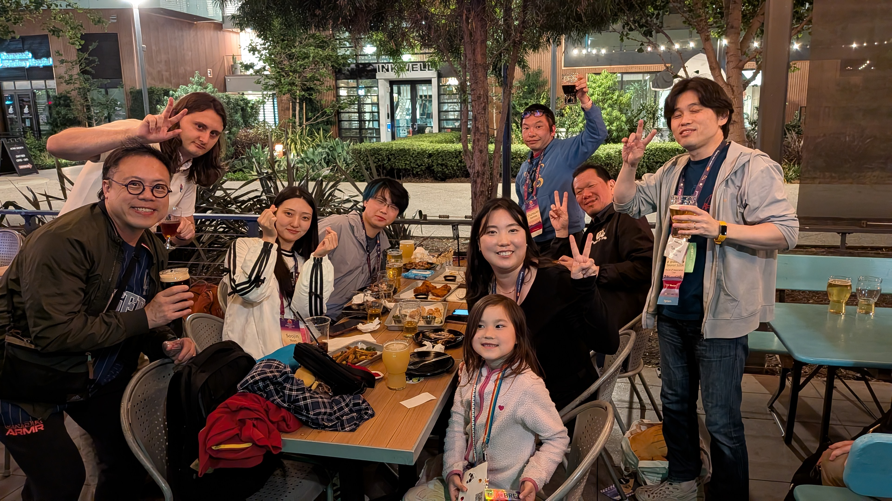
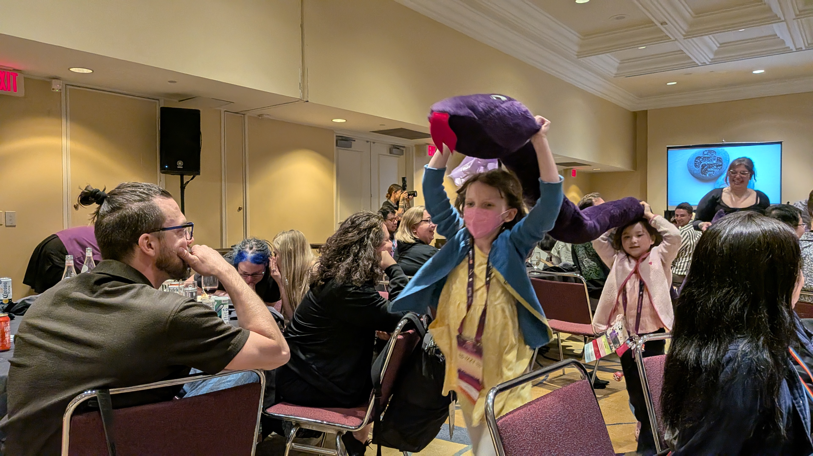
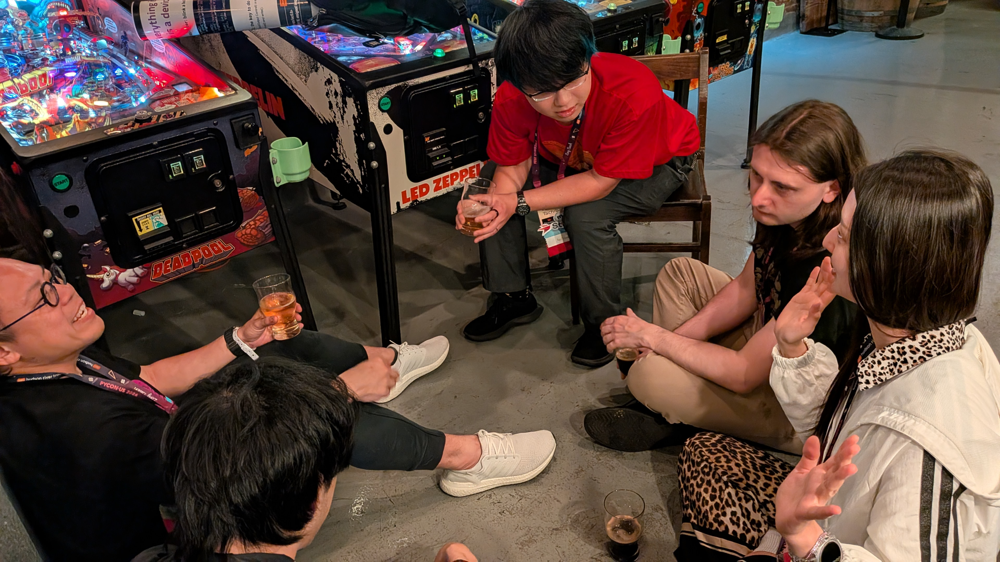

```{eval-rst}
:og:image: _images/20260629usreport.png
:og:image:alt: おもしろトーク紹介

.. |cover| image:: images/20260629usreport.png
```

# **おもしろ**トーク紹介

Takanori Suzuki

```{image} /20260517pyconus/images/pyconus2026logo.svg
:alt: PyCon US 2026 logo
:width: 30%
```

[PyCon US 2026参加報告会](https://pyconjp.connpass.com/event/395452/) / 2026 Jun 29

## **PyCon US 2026**に参加した

* **興味深かった**トークを紹介する {nekochan}`kossori`

```{image} images/pyconus.jpg
:alt: オープニング
:width: 70%
```

### PyCon US 2026タイムテーブル[^timetable]

[^timetable]: [us.pycon.org/2026/schedule/talks/](https://us.pycon.org/2026/schedule/talks/)

```{image} images/timetable.png
:alt: PyCon US 2026タイムテーブル
:width: 80%
```

### PyCon US 2026タイムテーブル

* カンファレンスは3日間
  * 5月15日(金)〜17日(日)
* 5トラックまたは4トラック
  * 1トラックはスペイン語(Charlas)
  * AI(15日)、セキュリティ(16日)トラックがあった

## カンファレンス **Day 1**



### [The Bakery: How **PEP810** sped up my bread operations business](https://us.pycon.org/2026/schedule/presentation/30/)

* スピーカー：[Jacob Coffee](https://us.pycon.org/2026/speaker/profile/31/)

```{image} images/jacob.jpg
:alt: Jacob Coffee氏
:width: 70%
```

```{revealjs-break}
```

* Python 3.15の新機能 **lazy import（遅延インポート）** のトーク
* サンプルスクリプトを例にパフォーマンスの違いを説明
  * [JacobCoffee/breadctl: Bread Operations Inc.](https://github.com/JacobCoffee/breadctl)

### [**Free-threaded Python**: past, present and future](https://us.pycon.org/2026/schedule/presentation/63/)

* スピーカー：[Thomas Wouters](https://us.pycon.org/2026/speaker/profile/67/)

```{image} images/thomas.jpg
:alt: Thomas Wouters氏
:width: 70%
```

```{revealjs-break}
```

* Python 3.14でexperimental(実験的)ではなくなったフリースレッドの話
* 各並行処理のメリットとデメリットを整理
* フリースレッドに至るまでの歴史を紹介
  * [PyParallel](https://github.com/pyparallel/pyparallel)(2013)、[Gilectomy](https://github.com/larryhastings/gilectomy)(2015)
  * [NoGIL Python 3.9](https://github.com/colesbury/nogil)(2021)、[PEP 703](https://peps.python.org/pep-0703/)(2023)

## カンファレンス **Day 2**



### [**Tachyon**: Python 3.15's sampling profiler is faster than your code](https://us.pycon.org/2026/schedule/presentation/31/)

* スピーカー：[Pablo Galindo Salgado](https://us.pycon.org/2026/speaker/profile/32/)、[Laszlo Kiss Kollar](https://us.pycon.org/2026/speaker/profile/33/)

```{image} images/tachyon.jpg
:alt: Pablo Galindo Salgado氏、Laszlo Kiss Kollar氏
:width: 70%
```

```{revealjs-break}
```

* Python 3.15の新機能、**Tachyon** という高速なプロファイラーの紹介
  * モジュール名：[profiling.sampling](https://docs.python.org/3.15/library/profiling.sampling.html#module-profiling.sampling)
* アーキテクチャーの説明
* 実際の使い方の説明
  * pstats、famegraph、geckoなどさまざまなアウトプット形式

## カンファレンス **Day 3**



### **Lightning** Talks

* 朝のライトニングトークで登壇しました

```{image} images/takanory-lt.jpg
:alt: 私のライトニングトーク
:width: 70%
```

```{revealjs-break}
```

* スライド：[Find Better 🐱 Cat Emojis with your text!](https://slides.takanory.net/slides/20260517pyconus/)
* 自然言語から適切な[ネコチャン絵文字](https://note.com/shikamatsu/n/nd217dc0617db)を検索して返すプログラムを紹介
* {fab}`github` [takanory/nekochan-suggest](https://github.com/takanory/nekochan-suggest/)

```{revealjs-break}
:notitle:
```

```{image} https://raw.githubusercontent.com/takanory/nekochan-suggest/refs/heads/main/nekochan-suggest-ui.gif
:alt: nekochan-suggest-ui demo
:width: 55%
```

### Update from our **Security Engineers**

* スピーカー：Seth Michael Larson、Mike Fiedler

```{image} images/security.jpg
:alt: 私のライトニングトーク
:width: 70%
```

```{revealjs-break}
```

* PSFのセキュリティエンジニアからの共有
* PyPIを標的とした **攻撃の増加**
* [Trusted Publisher](https://docs.pypi.org/trusted-publishers/)設定の呼びかけ
* [PEP 811](https://peps.python.org/pep-0811/): Python Security Response Teamの紹介
* セキュリティは**無料ではない**
  * Alpha-Omega、Ahthropoc、Google、Sovereign Tech Agencyなどのサポート

### **Poster** Sessions

* Speak Python with Devices 

```{image} images/peter.jpg
:alt: petertc
:width: 80%
```

```{revealjs-break}
```

* 台湾の[petertc](https://us.pycon.org/2026/speaker/profile/66/)のポスター発表
* PythonからIOCTLを叩いてデバイスを直接制御する
* 実際に仕事で使っているらしい
* 来ているシャツは**ドジャースの山本**

### [Learning Computer Science with Python and Music(21)](https://us.pycon.org/2026/schedule/presentation/127/)

* スピーカー：[Michael Scott Asato Cuthbert](https://us.pycon.org/2026/speaker/profile/137/)

```{image} images/music.jpg
:alt: Music(21)
:width: 80%
```

```{revealjs-break}
```

* [music21](https://music21.org/music21docs/)という音楽の勉強用ライブラリの紹介
* 楽譜を書いたり、音を鳴らしたり、音楽データセットの分析などができる
* 個人的に音楽をやっているので使ってみたいかも

### [Steering Council Panel](https://us.pycon.org/2026/about/keynote-speakers/#keynote-steering-council)

```{image} images/steering.jpg
:alt: Steering Council Panel
:width: 80%
```

```{revealjs-break}
```

* Pythonの言語仕様を決めるSteering Councilによるパネル
* Steering Councilの役割紹介
* Python 3.15の**新機能**の紹介
  * lazy imports、frozen dict、Tachyonなど
* Packaging Councilが新設された
* **Rust** の導入が検討されている

## まとめ

### トーク以外もおもしろいけど {nekochan}`beer`<br />**トーク** も当然 **おもしろい**

### 来年も**ロングビーチ**で開催 {nekochan}`donburako`

### 行こう！**PyCon US** {nekochan}`travel`
