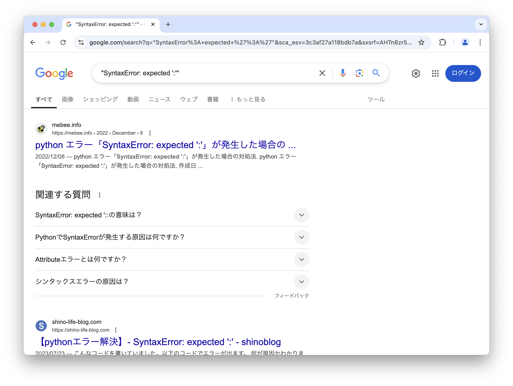
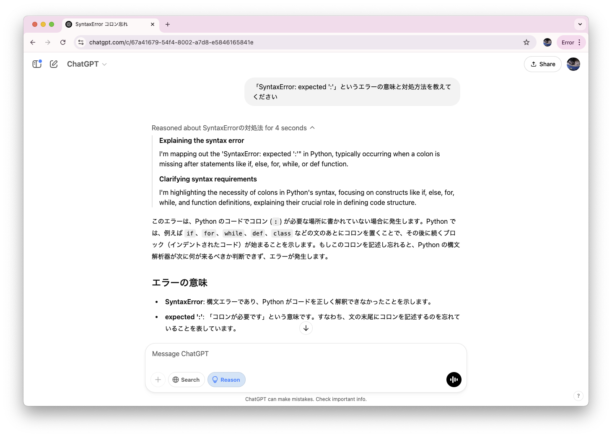

```{eval-rst}
:og:image: _images/20260801osckyoto.png
:og:image:alt: エラーはともだちこわくないよ

.. |cover| image:: images/20260801osckyoto.png
```

# **エラー**は**ともだち**{nekochan}`nakayoshi` こわくないよ

Takanori Suzuki

[OSC 2026 Kyoto](https://event.ospn.jp/osc2026-kyoto/) / 2026 Aug 1

## 今日**はなすこと** {nekochan}`osirase`

* Pythonの**エラー**ってなに？
* よくあるエラーの**パターン**
* **例外処理**
* おまけ：better error messages

### 今日の**ゴール** {nekochan}`soccer`

* Pythonのエラーが**嫌いじゃなく**なる
* エラーと**仲良く**なれる

## Photos 📷 Tweets 🐦 👍

`#osckyoto` / `@takanory`

### [`slides.takanory.net`](https://slides.takanory.net/) 💻

```{image} images/slides-takanory-net.png
:alt: slides.takanory.net
:width: 80%
```

## **Who** am I? / お前 **誰よ** 👤

* Takanori Suzuki / 鈴木 たかのり ({fab}`twitter` [@takanory](https://twitter.com/takanory))
* [BeProud](https://www.beproud.jp/) 取締役 / Python Climber
* [PyCon JP Association](https://www.pycon.jp/) 代表理事
* [Python Boot Camp](https://www.pycon.jp/support/bootcamp.html) 講師、[Python mini Hack-a-thon](https://pyhack.connpass.com/) 主催、[Pythonボルダリング部](https://kabepy.connpass.com/) 部長


### 久しぶりの京都（OSCは**初めて**）


### PyCon JP **Association** 🐍

日本国内のPythonユーザのために、**Pythonの普及及び開発支援**を行うために、継続的にカンファレンス(**PyCon**)を開くことを目的とした **非営利組織**

[`www.pycon.jp`](https://www.pycon.jp)


### PyCon JP **2026**

```{image} images/pyconjp2026logo.png
:width: 20%
```

* {fas}`globe` [`2026.pycon.jp`](https://2026.pycon.jp/)
* 🗓️ 2025年**8月21日(金)-23日(日)**
* ⛩️ [広島国際会議場](https://www.pcf.city.hiroshima.jp/icch/)
* 🎫 [pyconjp.connpass.com/.../391006](https://pyconjp.connpass.com/event/391006/)

### 京都から広島 🚅

<iframe src="https://www.google.com/maps/embed?pb=!1m28!1m12!1m3!1d1680073.5767133639!2d132.78714241173216!3d34.67001171361337!2m3!1f0!2f0!3f0!3m2!1i1024!2i768!4f13.1!4m13!3e3!4m5!1s0x6001a8d6cd3cc3f1%3A0xc0961d366bbb1d3d!2z5Lqs6YO95biC44CB5Lqs6YO95bqc!3m2!1d35.011564!2d135.7681489!4m5!1s0x355aa26d05555dd5%3A0x4e72455df571cd7a!2z5bqD5bO25Zu96Zqb5Lya6K2w5aC044CB44CSNzMwLTA4MTEg5bqD5bO255yM5bqD5bO25biC5Lit5Yy65Lit5bO255S677yR4oiS77yVIDPpmo4!3m2!1d34.392088!2d132.45099299999998!5e0!3m2!1sja!2sjp!4v1785147620102!5m2!1sja!2sjp" width="600" height="450" style="border:0;" allowfullscreen="" loading="lazy" referrerpolicy="strict-origin-when-cross-origin"></iframe>

### PyCon JP Associationブース

```{image} images/pyconjp-booth.jpg
:alt: PyCon JP Associationブース
:width: 70%
```

### **BeProud** Inc. 🏢

* [BeProud](https://www.beproud.jp/): Pythonシステム開発、コンサル
* [connpass](https://connpass.com/): IT勉強会支援プラットフォーム
* [PyQ](https://pyq.jp/): Python独学プラットフォーム
* [TRACERY](https://tracery.jp/): システム開発ドキュメントサービス


## Pythonの**エラーってなに**？ {nekochan}`hate-nya`

### エラー好きな人？ {nekochan}`ok`

### エラー嫌いな人？ {nekochan}`ng`

### Pythonには**2種類のエラー**

* 構文エラー（Syntax Error）
* 例外（Exception）
* 参考：[8. エラーと例外 — Python公式ドキュメント](https://docs.python.org/ja/3/tutorial/errors.html)

### 構文エラー（Syntax Error）

* Pythonの**構文**として**正しくない**
* **構文解析時**にエラーが発生

```python
>>> for i in range(10)
  File "<python-input-1>", line 1
    for i in range(10)
                      ^
SyntaxError: expected ':'
```

### 例外（Exception）

* 構文は正しい
* **実行時**にエラーが発生

```{code-block} python
>>> 1 / 0
Traceback (most recent call last):
  File "<python-input-0>", line 1, in <module>
    1 / 0
    ~~^~~
ZeroDivisionError: division by zero
```

### エラーが怖い？ {nekochan}`purupuru`

### エラーは**怒っていない** {nekochan}`ho`

* **ここが問題だよ**と教えてくれている
* 問題を修正するための**案内役**

```{revealjs-break}
```

* エラーメッセージの例

```{literalinclude} code/error_example.py
:caption: error_example.py
:language: python
```

```{code-block} python
% python3.14 error_example.py 
  File ".../error_example.py", line 1  # このファイルの1行目の
    for i in range(10)
                      ^  # この場所で
SyntaxError: expected ':'  # 構文エラーが発生：`:`がここに必要
```

### エラーの意味が**わからない**？ {nekochan}`hate`

### Googleで検索 {nekochan}`miru`



### AIに質問 {nekochan}`mita`



### **長いエラー**が出たらうわってなる？ {nekochan}`guruguru`

### 大事なのは**一番最後** {nekochan}`yoshi`

```{revealjs-code-block} python
:data-line-numbers: 1-22|20-22

>>> from urllib import request
>>> request.urlopen("https://httpbin.org/status/403")
Traceback (most recent call last):
  File "<python-input-1>", line 1, in <module>
    request.urlopen("https://httpbin.org/status/403")
    ~~~~~~~~~~~~~~~^^^^^^^^^^^^^^^^^^^^^^^^^^^^^^^^^^
  File "/Library/Frameworks/Python.framework/Versions/3.14/lib/python3.14/urllib/request.py", line 187, in urlopen
    return opener.open(url, data, timeout)
           ~~~~~~~~~~~^^^^^^^^^^^^^^^^^^^^
  File "/Library/Frameworks/Python.framework/Versions/3.14/lib/python3.14/urllib/request.py", line 493, in open
    response = meth(req, response)
  File "/Library/Frameworks/Python.framework/Versions/3.14/lib/python3.14/urllib/request.py", line 602, in http_response
    response = self.parent.error(
        'http', request, response, code, msg, hdrs)
  File "/Library/Frameworks/Python.framework/Versions/3.14/lib/python3.14/urllib/request.py", line 531, in error
    return self._call_chain(*args)
           ~~~~~~~~~~~~~~~~^^^^^^^
  File "/Library/Frameworks/Python.framework/Versions/3.14/lib/python3.14/urllib/request.py", line 464, in _call_chain
    result = func(*args)
  File "/Library/Frameworks/Python.framework/Versions/3.14/lib/python3.14/urllib/request.py", line 611, in http_error_default
    raise HTTPError(req.full_url, code, msg, hdrs, fp)
urllib.error.HTTPError: HTTP Error 403: FORBIDDEN
```

### そのうち**自分**で**エラーに対処**できる {nekochan}`benkyou` （ようになるはず）

## よくあるエラーの**パターン** {nekochan}`naruhodo`

### 書籍から**エラーの例**を引用【AD】

```{image} images/pycrash2-hisshu.jpg
:alt: 改訂新版 最短距離でゼロからしっかり学ぶ Python入門 必修編
:width: 350px
```

```{revealjs-break}
```

* [改訂新版「最短距離でゼロからしっかり学ぶ Python入門」必修編](https://gihyo.jp/book/2024/978-4-297-14528-6)
* 2024年10月31日発売、価格：3,630円
* Eric Matthes著
* **鈴木たかのり**、安田善一郎翻訳
* **絶賛発売中！！**

### どんなエラーが出る？(p18)

```{literalinclude} code/message.py
:caption: message.py
:language: python
```

```{revealjs-break}
```

```bash
Traceback (most recent call last):
  File ".../message.py", line 2, in <module>
    print(mesage)
          ^^^^^^
NameError: name 'mesage' is not defined. \
    Did you mean: 'message'?
```

* [`NameError`](https://docs.python.org/ja/3/library/exceptions.html#NameError)：名前が見つからないエラー
* `'mesage'`という名前は定義されていません
* `'message'` と間違えてませんか？

```{revealjs-break}
```

* 変数名を修正して解決

```{literalinclude} code/message_fixed.py
:language: python
```

### どんなエラーが出る？(p27)

```{literalinclude} code/message2.py
:caption: message2.py
:language: python
```

```{revealjs-break}
```

```bash
  File ".../message2.py", line 1
    message = 'OSC's member'
                           ^
SyntaxError: unterminated string literal (detected at line 1)
```

* [`SyntaxError`](https://docs.python.org/ja/3/library/exceptions.html#SyntaxError)：構文エラー
* 文字列リテラルが終了していません

```{revealjs-break}
```

* クォーテーションを変更して解決

```{literalinclude} code/message2_fixed.py
:language: python
```

### どんなエラーが出る？(p52)

```{literalinclude} code/beers.py
:caption: beers.py
:language: python
```

```{revealjs-break}
```

```python
  File ".../beers.py", line 2, in <module>
    print(beers[3])
          ~~~~~^^^
IndexError: list index out of range
```

* [`IndexError`](https://docs.python.org/ja/3/library/exceptions.html#IndexError)：インデックスエラー
* インデックスが範囲外です

```{revealjs-break}
```

* 正しい範囲を指定して解決

```{literalinclude} code/beers_fixed.py
:language: python
```

### どんなエラーが出る？(p60)

```{literalinclude} code/beers2.py
:caption: beers2.py
:language: python
```

```{revealjs-break}
```

```python
  File ".../beers2.py", line 3
    print(beer)
    ^^^^^
IndentationError: expected an indented block after \
    'for' statement on line 2
```

* [`IndentationError`](https://docs.python.org/ja/3/library/exceptions.html#IndentationError)：正しくないインデントのエラー
* 2行目の`for`文のあとにインデントが必要

```{revealjs-break}
```

* インデントを追加して解決

```{literalinclude} code/beers2_fixed.py
:language: python
```

### どんなエラーが出る？(p61)

```{literalinclude} code/beers3.py
:caption: beers3.py
:language: python
```

```{revealjs-break}
```

```python
  File ".../beers3.py", line 2
    for beer in beers
                     ^
SyntaxError: expected ':'
```

* [`SyntaxError`](https://docs.python.org/ja/3/library/exceptions.html#SyntaxError)：構文エラー
* `:` が必要です

```{revealjs-break}
```

* 末尾に`:`を追加して解決

```{literalinclude} code/beers3_fixed.py
:language: python
```

### どんなエラーが出る？(p76)

```{literalinclude} code/sizes.py
:caption: sizes.py
:language: python
```

```{revealjs-break}
```

```python
Traceback (most recent call last):
  File ".../sizes.py", line 2, in <module>
    sizes[0] = "UK Pint"
    ~~~~~^^^
TypeError: 'tuple' object does not support item assignment
```

* [`TypeError`](https://docs.python.org/ja/3/library/exceptions.html#TypeError)：データ型に関するエラー
* タプルは要素の代入に対応していません

```{revealjs-break}
```

* タプル全体を上書きは可能

```{literalinclude} code/sizes_fixed.py
:language: python
```

### どんなエラーが出る？(p113)

```{literalinclude} code/beer_dict.py
:caption: beer_dict.py
:language: python
```

```{revealjs-break}
```

```python
Traceback (most recent call last):
  File ".../beer_dict.py", line 2, in <module>
    beer["style"]
    ~~~~^^^^^^^^^
KeyError: 'style'
```

* [`KeyError`](https://docs.python.org/ja/3/library/exceptions.html#KeyError)：辞書のキーが存在しないエラー

```{revealjs-break}
```

* `get()`メソッドを使用する

```{literalinclude} code/beer_dict_fixed.py
:language: python
```

### どんなエラーが出る？(p134)

```{literalinclude} code/age.py
:caption: age.py
:language: python
```

```bash
% python3.14 age.py
何歳ですか？21
```

```{revealjs-break}
```

```python
% python3.14 age.py
何歳ですか？21
Traceback (most recent call last):
  File ".../age.py", line 2, in <module>
    if age >= 20:
       ^^^^^^^^^
TypeError: '>=' not supported between instances of \
    'str' and 'int'
```

* [`TypeError`](https://docs.python.org/ja/3/library/exceptions.html#TypeError)：データ型に関するエラー
* strとintの間で`>=`はサポートされていません

```{revealjs-break}
```

* `int()`で整数に変換する

```{literalinclude} code/age_fixed.py
:language: python
```

```
% python3.14 age.py
何歳ですか？21
お酒が飲める年齢です
```

### どんなエラーが出る？(p157)

```{literalinclude} code/beer_func.py
:caption: beer_func.py
:language: python
```

```{revealjs-break}
```

```python
Traceback (most recent call last):
  File ".../beer_func.py", line 5, in <module>
    describe_beer()
    ~~~~~~~~~~~~~^^
TypeError: describe_beer() missing 2 required positional \
    arguments: 'beer_name' and 'brewery'
```

* [`TypeError`](https://docs.python.org/ja/3/library/exceptions.html#TypeError)：データ型に関するエラー
* 2つの位置引数beer_nameとbreweryがありません

```{revealjs-break}
```

* 引数を正しく指定する

```{literalinclude} code/beer_func_fixed.py
:language: python
```

### 何個わかりました？

### エラーの一覧

* [組み込み例外 — Python公式ドキュメント](https://docs.python.org/ja/3/library/exceptions.html)
* **初めて見る**例外があったら調べてみよう！

### さまざまな**例外が発生**する {nekochan}`hiza-ni-ya-wo-ukete-simatte`

### 例外が発生しても**正しく動作**させたい {nekochan}`kochira`

## 例外を処理する {nekochan}`kamon`

### 例外処理の基本

* 数値以外を指定すると[`ValueError`](https://docs.python.org/ja/3/library/exceptions.html#ValueError)が発生

```{literalinclude} code/age_fixed.py
:language: python
```

```bash
% python3.14 age.py
何歳ですか？二十歳
Traceback (most recent call last):
  File "...//age.py", line 2, in <module>
    if int(age) >= 20:
       ~~~^^^^^
ValueError: invalid literal for int() with base 10: '二十歳'
```

```{revealjs-break}
```

* `try` と `except` で例外処理

```bash
% python3.14 age2.py
何歳ですか？二十歳
数値を入力してください
```

```{revealjs-literalinclude} code/age2.py
:language: python
:data-line-numbers: 1-8|1-3,7-8
```

```{revealjs-break}
```

* 例外がなければ `except` 節は**実行されない**

```bash
% python3.14 age2.py
何歳ですか？21
お酒が飲める年齢です
```

```{revealjs-literalinclude} code/age2.py
:data-line-numbers: 1-8|1-4
:language: python
```

### 複数の例外に対応する

* 1つの処理で異なる種類の例外が発生する場合がある
* ファイルからテキストを読み込む場合
* **どんな例外**が考えられますか？

```{revealjs-literalinclude} code/read_text.py
:language: python
```

```{revealjs-break}
```

* 例外の種類によってメッセージを**出し分け**

```{revealjs-literalinclude} code/read_text2.py
:language: python
```

### **事前チェック**と例外処理

* 事前にチェックして例外を防げる場合もある
* どちらを使うかはお好みで

```python
from pathlib import Path

p = Path("beer.txt")
if not p.exists():  # ファイルの存在チェック
    print("ファイルが存在しません")
else:
    ...
	
if key in beer_dict:  # キーの存在チェック
    beer_dict[key]
else:
    ...
```

```{revealjs-break}
```

* 事前チェック：**LBYL**[^lbyl]
  * ころばぬ先の杖 (Look Before You Leap)
* 例外処理：**EAFP**[^eafp]
  * 認可をとるより許しを請う方が容易 (Easier to Ask for Forgiveness than Permission、マーフィーの法則)

[^lbyl]: <https://docs.python.org/ja/3.14/glossary.html#term-LBYL>
[^eafp]: <https://docs.python.org/ja/3.14/glossary.html#term-EAFP>

### **辞書のget**は適切に使おう

* キー名をtypoしているのに気づかないことも
* `[]`なら例外で気づける
* 型ヒントで[`TypedDict`](https://docs.python.org/ja/3/library/typing.html#typing.TypedDict)を使うのもあり

```python
style = beer.get("stlye")  # typoに気づかない

class Beer(TypedDict):
    name: str
    style: str

beer: Beer = {"name": "縁結麦酒スタウト", "style": "Stout"}
```

### 例外を**握りつぶさない**

* 例外を隠蔽すると**エラーの原因**がわからなくなる [^jiso64]

```{revealjs-literalinclude} code/hide_exception.py
:language: python
```

[^jiso64]: [64:例外を握り潰さない — 自走プログラマー【抜粋版】](https://jisou-programmer.beproud.jp/%E3%82%A8%E3%83%A9%E3%83%BC%E3%83%8F%E3%83%B3%E3%83%89%E3%83%AA%E3%83%B3%E3%82%B0/64-%E4%BE%8B%E5%A4%96%E3%82%92%E6%8F%A1%E3%82%8A%E6%BD%B0%E3%81%95%E3%81%AA%E3%81%84.html)

### **try節は短く**書く

* エラー発生時に問題を切り分けられない [^jiso65]

```{revealjs-literalinclude} code/long_try.py
:language: python
```

[^jiso65]: [65:try節は短く書く — 自走プログラマー【抜粋版】](https://jisou-programmer.beproud.jp/%E3%82%A8%E3%83%A9%E3%83%BC%E3%83%8F%E3%83%B3%E3%83%89%E3%83%AA%E3%83%B3%E3%82%B0/65-try%E7%AF%80%E3%81%AF%E7%9F%AD%E3%81%8F%E6%9B%B8%E3%81%8F.html)

```{revealjs-break}
```

* tryの範囲を短く

```{revealjs-literalinclude} code/long_try_fixed.py
:language: python
```

```{revealjs-break}
```

* `{e}`で例外を見分ける

```{revealjs-literalinclude} code/long_try_fixed.py
:lines: 9-14
:language: python
```

```python
# "aaaa" などカンマがない場合
データ変換エラーが発生: not enough values to unpack (expected 2, got 1)
# "aaaa,bbbb" など2番目の要素が数字じゃない
データ変換エラーが発生: invalid literal for int() with base 10: 'b'
```

### 適切な例外処理をしよう！ {nekochan}`nageta`

## おまけ：better error messages {nekochan}`wao`

### **better error messages**とは

* Python 3.10から追加
* エラーメッセージを**よりわかりやすく**
* 参考：[Python 3.10から導入されたBetter error messagesの深掘り | gihyo.jp](https://gihyo.jp/article/2022/12/monthly-python-2212)

### **閉じカッコ**忘れ

```{revealjs-literalinclude} code/unclosed.py
:language: python
```

* Python 3.9だとエラーが**意味不明** {nekochan}`yabai`

```{revealjs-code-block} python
:data-line-numbers: 3-5

% Python 3.9 unclosed.py
  File ".../unclosed.py", line 2
    beer = beers[0]
         ^
SyntaxError: invalid syntax
```

```{revealjs-break}
```

```{revealjs-literalinclude} code/unclosed.py
:language: python
```

* Python 3.10だと**わかりやすい**！ {nekochan}`medetai`

```{revealjs-code-block} python
:data-line-numbers: 3-5

% Python 3.10 unclosed.py
  File ".../unclosed.py", line 1
    beers = ["Punk IPA", "よなよなエール",
            ^
SyntaxError: '[' was never closed
```

### **末尾の:** 忘れ

```{revealjs-literalinclude} code/beers3.py
:language: python
```

```{revealjs-code-block} python
:data-line-numbers: 3-5

% python3.9 beers3.py
  File ".../beers3.py", line 2
    for beer in beers
                     ^
SyntaxError: invalid syntax  # 無効なシンタックス
```

```{revealjs-code-block} python
:data-line-numbers: 3-5

% python3.10 beers3.py
  File ".../beers3.py", line 2
    for beer in beers
                     ^
SyntaxError: expected ':'  # ':'を忘れてません？
```

### **インデント**忘れ

```{revealjs-literalinclude} code/beers2.py
:language: python
```

```{revealjs-code-block} python
:data-line-numbers: 3-5

% python3.9 beers2.py
  File ".../beers2.py", line 3
    print(beer)
    ^
IndentationError: expected an indented block
```

```{revealjs-code-block} python
:data-line-numbers: 3-6

% python3.10 beers2.py
  File ".../beers2.py", line 3
    print(beer)
    ^
IndentationError: expected an indented block after \
  'for' statement on line 2
```

### `NameError`の**Did you mean**

```{revealjs-literalinclude} code/message.py
:language: python
```

```{revealjs-code-block} python
:data-line-numbers: 3-4

% python3.9 message.py
  File ".../message.py", line 3
    print(mesage)
NameError: name 'mesage' is not defined
```

```{revealjs-code-block} python
:data-line-numbers: 3-5

% python3.10 message.py
  File ".../message.py", line 3
    print(mesage)
NameError: name 'mesage' is not defined. \
    Did you mean: 'message'?
```

### Python 3.11での改善

* Python 3.11: [PEP 657: トレースバックのエラー位置の詳細化](https://docs.python.org/ja/3/whatsnew/3.11.html#pep-657-fine-grained-error-locations-in-tracebacks)
* 例外の発生箇所がわかりやすい！！

```{revealjs-code-block} python
:data-line-numbers: 1-2,5-7

>>> x, y, z = 1, 1, 0
>>> x / y / z
Traceback (most recent call last):
  File "<python-input-1>", line 1, in <module>
    x / y / z
    ~~~~~~^~~
ZeroDivisionError: float division by zero
```

### Python 3.12での改善

* Python 3.12: [Improved Error Messages](https://docs.python.org/ja/3/whatsnew/3.12.html#improved-error-messages)
* 関数、`ImportError`などでも提案が追加
  
```{revealjs-code-block} python
:data-line-numbers: 1,4-6,9-11

>>> random.randint()
Traceback (most recent call last):
  File "<stdin>", line 1, in <module>
NameError: name 'random' is not defined. \
    Did you forget to import 'random'?
>>> from datetime import datatime
Traceback (most recent call last):
  File "<python-input-6>", line 1, in <module>
    from datetime import data
ImportError: cannot import name 'data' from 'datetime' (...). \
    Did you mean: 'date'?
```

### Python 3.13での改善

* Python 3.13: [Improved error messages](https://docs.python.org/ja/3/whatsnew/3.13.html#whatsnew313-improved-error-messages)
* 引数もDid you meanで提案

```{revealjs-code-block} python
:data-line-numbers: 1,4-6

>>> f = open("beer.txt", encodeng="utf-8")
Traceback (most recent call last):
  File "<python-input-7>", line 1, in <module>
    f = open("beer.txt", encodeng="utf-8")
TypeError: open() got an unexpected keyword argument 'encodeng'. \
    Did you mean 'encoding'?
```

### Python 3.14での改善

* Python 3.14: [Improved error messages](https://docs.python.org/ja/3/whatsnew/3.14.html#improved-error-messages)
* キーワードもDid you meanで提案

```{revealjs-code-block} python
:data-line-numbers: 1-2, 4-6

>>> whille True:
...     pass
  File "<python-input-0>", line 1
    whille True:
    ^^^^^^
SyntaxError: invalid syntax. Did you mean 'while'?
```

### Python 3.15での改善

* Python 3.15: [Improved error messages](https://docs.python.org/ja/3.15/whatsnew/3.15.html#improved-error-messages)
* 属性のネスト時にもDid you meanを表示

```{revealjs-code-block} python
@dataclass
class Circle:
   radius: float

   @property
   def area(self) -> float:
      return pi * self.radius**2

class Container:
   def __init__(self, inner: Circle) -> None:
      self.inner = inner

circle = Circle(radius=4.0)
container = Container(circle)
print(container.area)
```

```{revealjs-break}
```

```{revealjs-code-block} python
Traceback (most recent call last):
  File "/home/pablogsal/github/python/main/lel.py", line 42, in <module>
    print(container.area)
          ^^^^^^^^^^^^^^
AttributeError: 'Container' object has no attribute 'area'.
  Did you mean '.inner.area' instead of '.area'?
```

### Python 3.15での改善

* 他言語のメソッド名使用時に提案を表示

```{revealjs-code-block} python
>>> [1, 2, 3].push(4)
Traceback (most recent call last):
...
AttributeError: 'list' object has no attribute 'push'.
  Did you mean '.append'?

>>> 'hello'.toUpperCase()
Traceback (most recent call last):
...
AttributeError: 'str' object has no attribute 'toUpperCase'.
  Did you mean '.upper'?
```

### エラーメッセージが**改善**されている<br />**新しいバージョン**を使おう {nekochan}`isogu`

## まとめ {nekochan}`good`

* エラーが出たら**調べる**
  * そのうち読めるようになる
* **よくあるエラー**を紹介
  * `NameError`、`SyntaxError`、`IndexError`、`IndentationError`、`TypeError`、`KeyError`
* **例外処理**の基本と気をつける**ポイント**

### エラーと**ともだち**になれそう？ {nekochan}`nakayoshi`

## お知らせ {nekochan}`osirase`

* Sphinxドキュメントにネコチャン絵文字を簡単に入れられる拡張sphinx-nekochanを公開 {nekochan}`banzai`
  * {fab}`github` [`takanory/sphinx-nekochan`](https://github.com/takanory/sphinx-nekochan)
* 気に入ったらGitHub Starしてね {nekochan}`big-love`
* ネコチャン絵文字[^nekochan]はしかまつさんが作成・配布しています

[^nekochan]: <https://note.com/shikamatsu/n/nd217dc0617db>

## See you at **PyCon JP 2026**!! {nekochan}`yatta`


## Thank You {nekochan}`pray`

{fas}`desktop` [slides.takanory.net](https://slides.takanory.net/)

{fab}`twitter` [takanory](https://twitter.com/takanory)
{fab}`github` [takanory](https://github.com/takanory/)
{fab}`linkedin` [takanory](https://www.linkedin.com/in/takanory/)
{fab}`untappd` [takanory](https://untappd.com/user/takanory/)


