```{eval-rst}
:og:image: _images/20260903bpstyle.png
:og:image:alt: PyCon Korea珍道中

.. |cover| image:: images/20260903bpstyle.png
```

# PyCon Korea**珍道中** {nekochan}`travel`

〜Road to Hiroshima〜

Takanori Suzuki

BPStyle 188 / 2026 Sep 3

## **急遽**PyCon Koreaに行くことに {nekochan}`bikkuri`

### 日程が**だいぶ近い**な... {nekochan}`think`

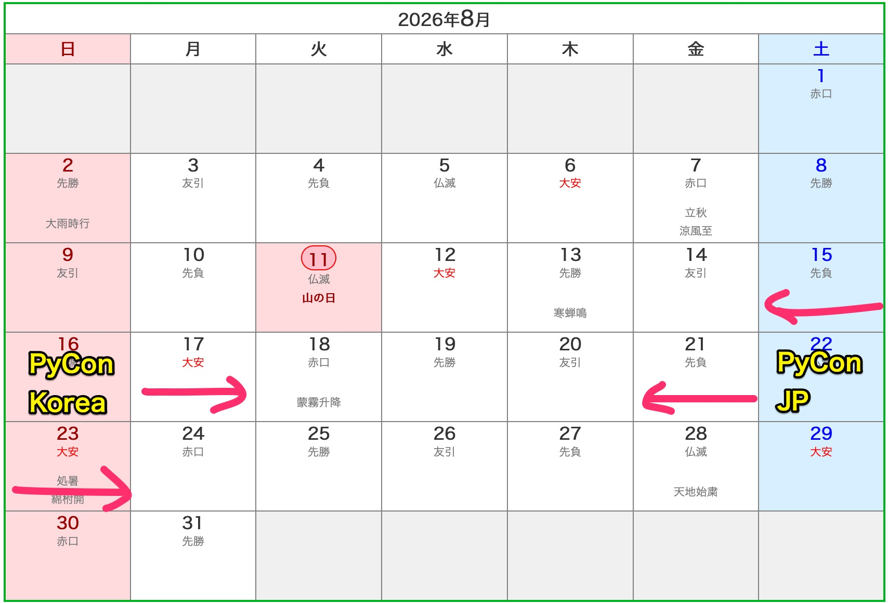

### そうだ！！<br />ソウルから**直接広島**に向かおう！！ {nekochan}`hirameita`

### 今回の**ルート** {nekochan}`totugeki`

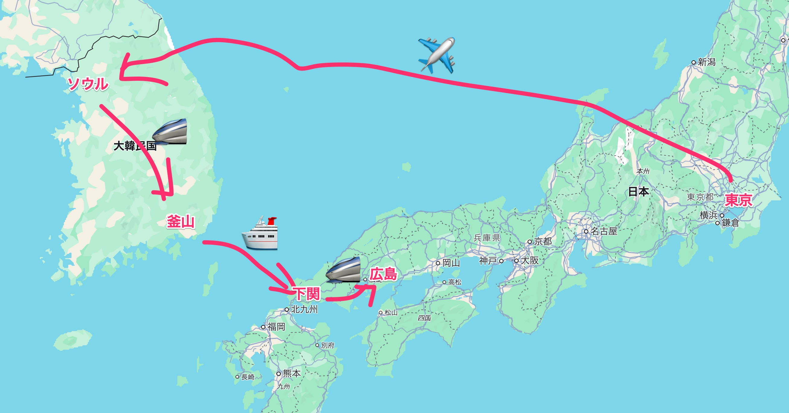

### スケジュール {nekochan}`calendar`

* 8月14日(金) **羽田空港→金浦空港**(✈️)
* 8月15日(土)、16日(日) PyCon Korea
* 8月17日(月) PyCon Korea、**ソウル→釜山**（🚄）
* 8月18日(火) 夜**釜山**出発(🛳️)→
* 8月19日(水) 朝**下関**到着(🛳️)、**下関→広島**（🚄）
* 8月20日(木) 仕事、PyCon JP Day 0
* 8月21日(金)〜23(日) PyCon JP

## 8月14日(金) **羽田空港→金浦空港**(✈️)

### Welcome Seoul {nekochan}`youkoso`

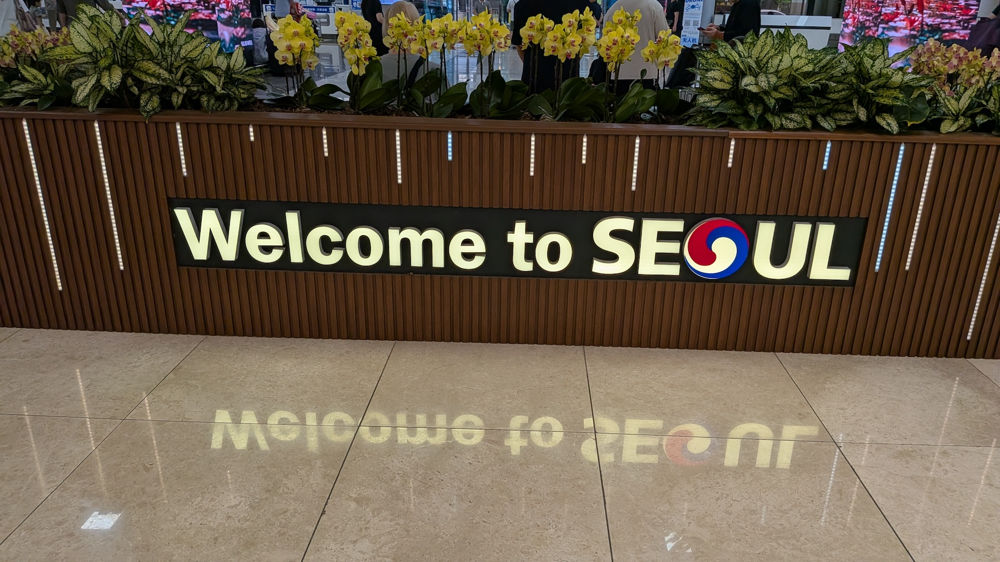

### Day 0 Party {nekochan}`beer`

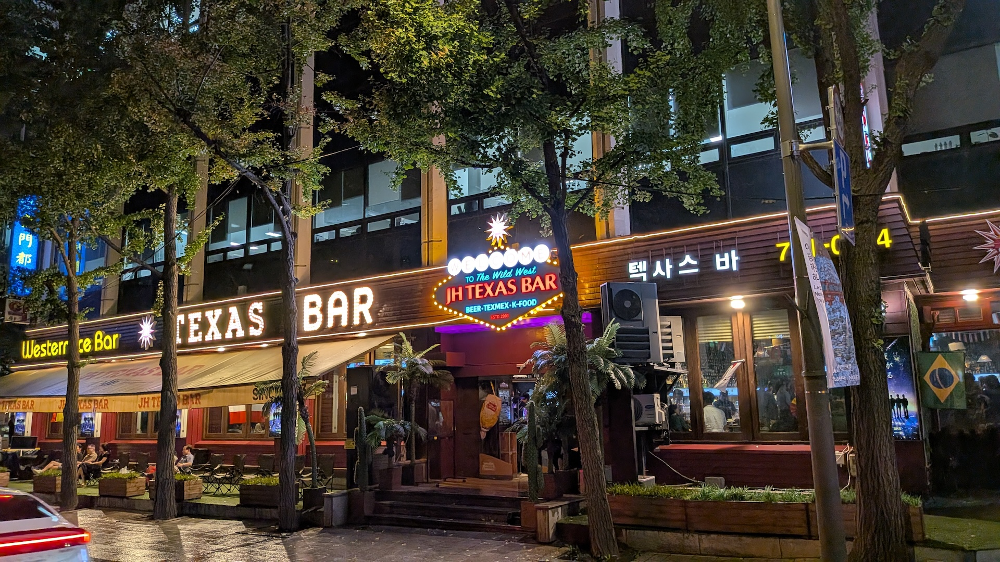

## 8月15日(土)、16日(日) PyCon Korea

### Keynote: Deb Nicholson

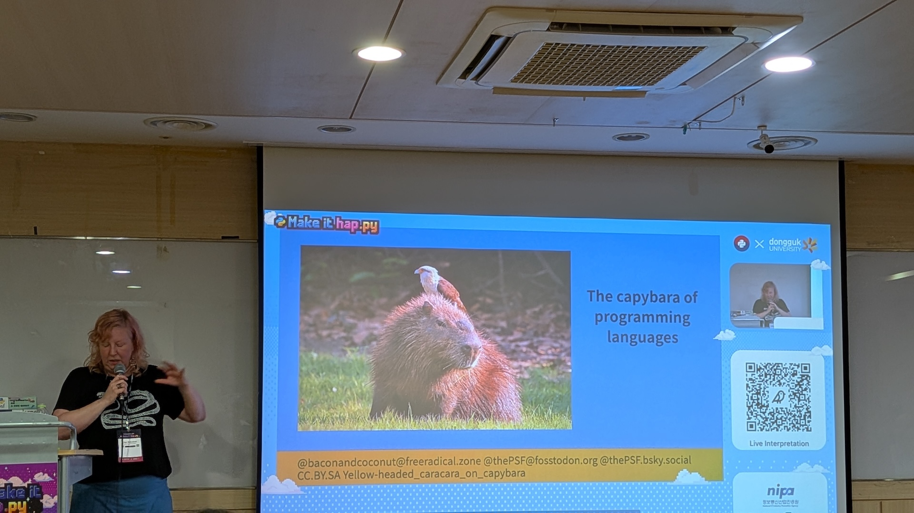

### Korean BBQ {nekochan}`gohan`

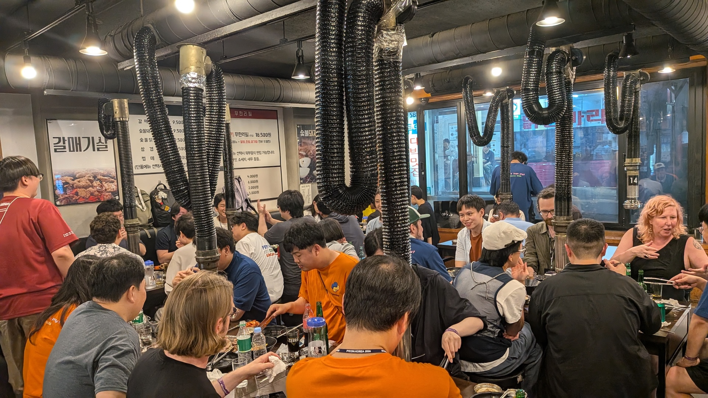

### Keynote: Hugo van Kemenade

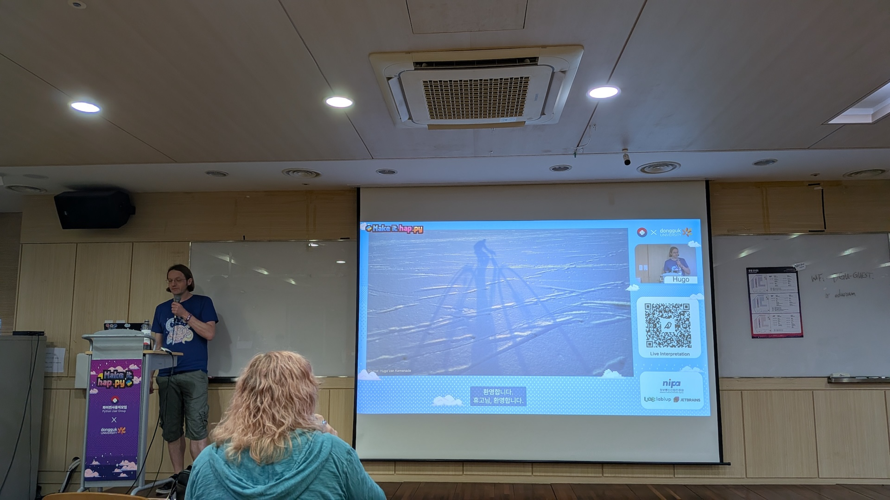

## 8月17日(月) PyCon Korea、**ソウル→釜山**（🚄）

### Sprints {nekochan}`banban`

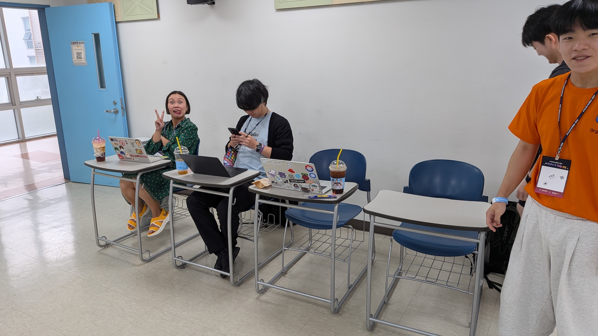

## ここからさまざまな**誤算**が... {nekochan}`ase`

### 8月15日は韓国の**祝日** {nekochan}`yatta`

* 8月17日(月)は**振替休日** (3連休)
* そのためPyCon Koreaは毎年この時期

### 夕方ちょい早くソウルを出るかー {nekochan}`kuchibue`

### Sold Out!! {nekochan}`yabai`

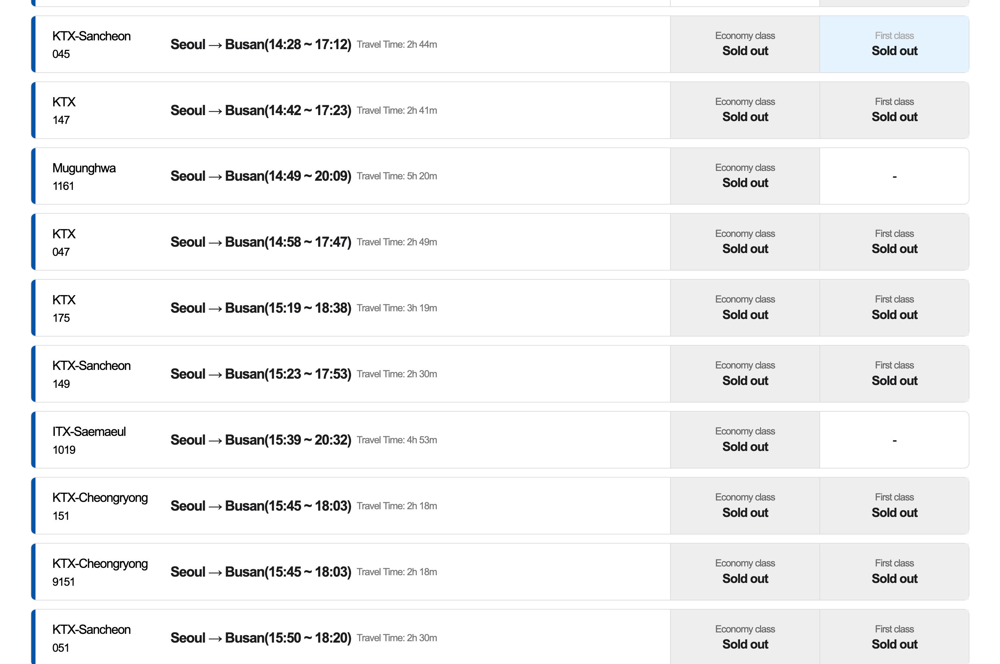

### えっ... {nekochan}`yabai`

### その後、検索するとたまにキャンセルが出るが、予約のPC操作をしている間に埋まってしまう。なんとか取れたのは**21時**ソウル発(0時過ぎ釜山着) {nekochan}`yabai`

### これはやばい、と**ソウル駅**に移動して窓口で相談。少し早い電車を確保する {nekochan}`ho`

### **乗り換え**あり、そして... {nekochan}`densha`

```{image} images/train-ticket.jpg
:width: 35%
```

### Standing room... {nekochan}`uchu-neko`

```{image} images/standing-room-ticket.jpg
:width: 60%
```

### これが**Standing room**！(2時間ここ) {nekochan}`scream`

```{image} images/standing-room.jpg
:width: 32%
```

### Daejeon(大田)で乗り換え！！ {nekochan}`yoshi`

```{image} images/daejeon.jpg
:width: 32%
```

### KTXに乗車！！ {nekochan}`yoshi`

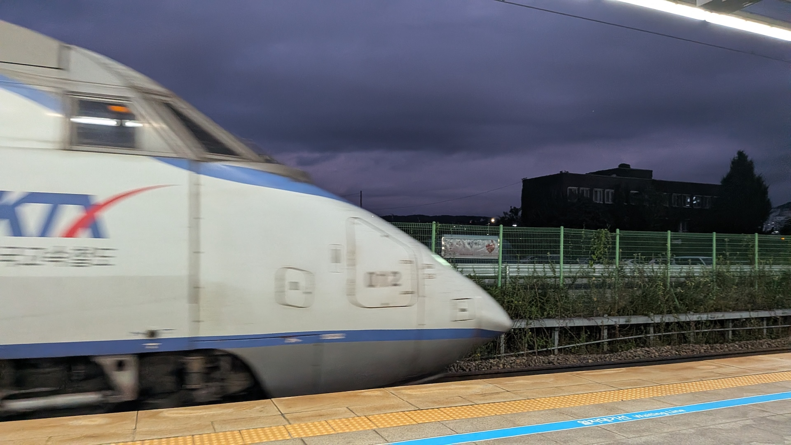

### 背もたれのある席って楽だなー {nekochan}`daijoubu`

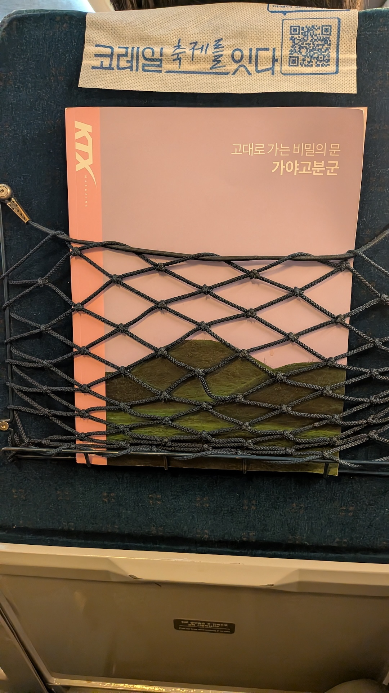

### Busan(釜山)に到着(21:18)！！ {nekochan}`mechanaki`

```{image} images/busan.jpg
:width: 32%
```

### 一杯だけビール飲んで終了 {nekochan}`beer`

```{image} images/busan-beer.jpg
:width: 32%
```
## 8月18日(火) 夜**釜山**出発(🛳️)→

### [Busan Workation Center](https://www.busaness.com/)でお仕事 {nekochan}`work`

```{image} images/busan-workation.jpg
:width: 32%
```

### [Busan Workation Center](https://www.busaness.com/) {nekochan}`good`

* メールアドレス登録するだけ
* 無料で使える
* 14日間まで無料
* 駅からも近い

### 釜山港国際旅客ターミナルへ {nekochan}`donburako`

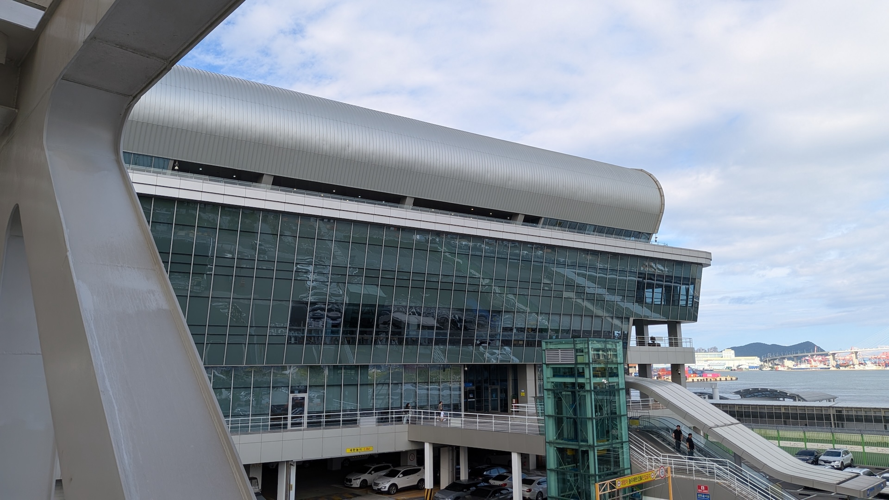
	
### 出国して**搭乗待ち** {nekochan}`seiza-taiki`

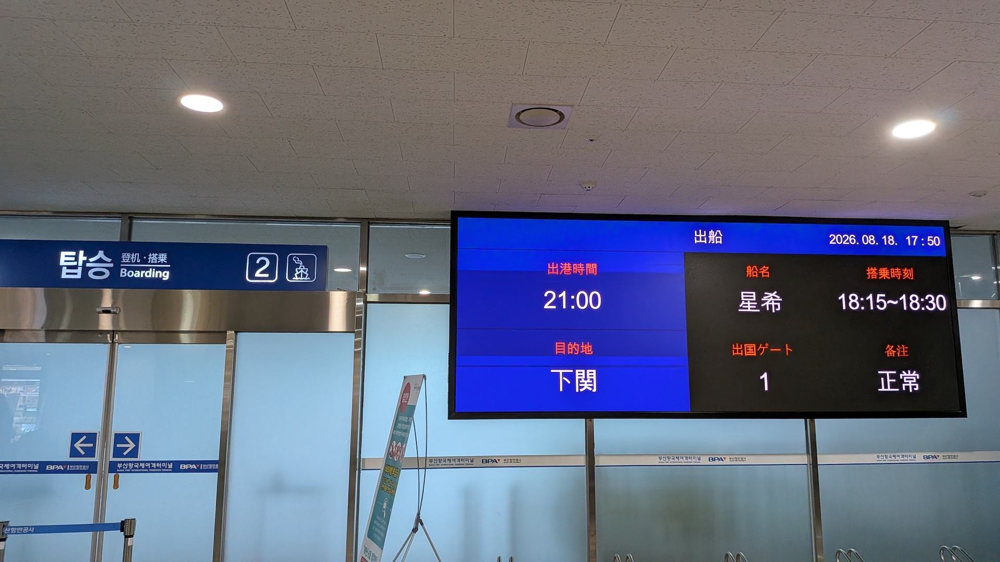
	
### フェリー

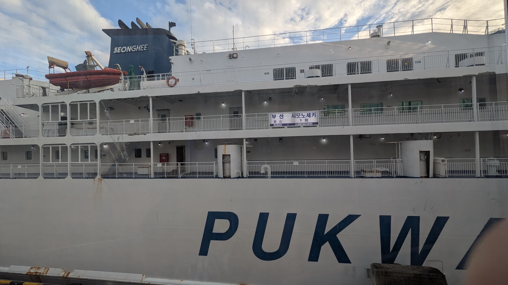
	
### 部屋(一等船室) {nekochan}`kyukei`

```{image} images/room.jpg
:width: 32%
```

### フェリーってWiFiないんですね... {nekochan}`mu`

* **はまゆう**だったら[au Starlink フェリーWi-Fi](https://www.kampuferry.co.jp/service/starlink.html)があったのに...
  * はまゆうは同じ釜山と下関間のもう1つの船

### 夕食は**プルコギ**と**ビール**(15,000 KRW)

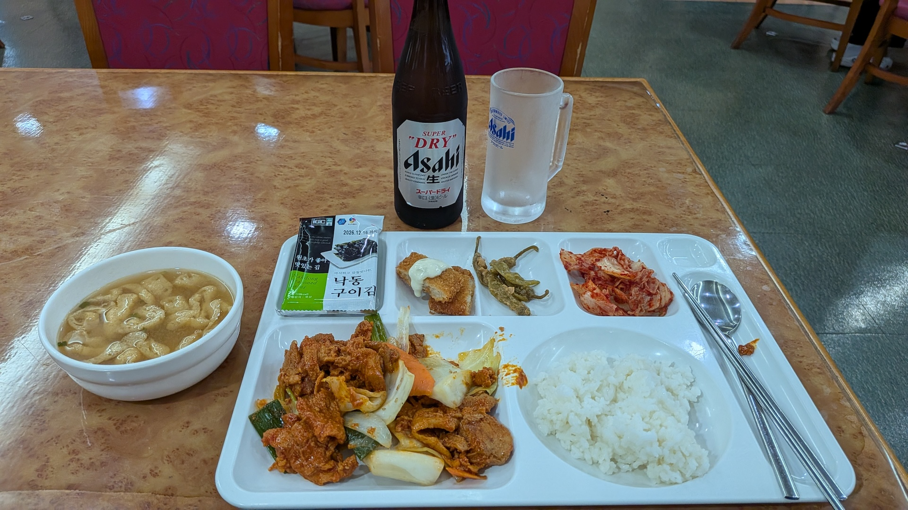

### 風呂入ってさくっと**就寝** {nekochan}`neru`

デジタルデトックスだー

### ...

### 3時に目が覚めて眠れず...辛い {nekochan}`netenai`

```{image} images/sleeping.png
:width: 28%
```

## 8月19日(水) 朝**下関**到着(🛳️)、**下関→広島**（🚄）

### 下関港で入国(7:45頃) {nekochan}`travel`

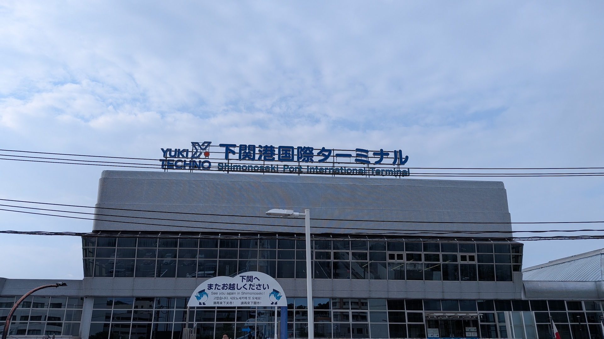

### スタンプは**KANMON** {nekochan}`kamon`

```{image} images/kanmon.jpg
:width: 40%
```

### 新下関駅で**朝食**と**お土産**を購入 {nekochan}`gohan-taberu`

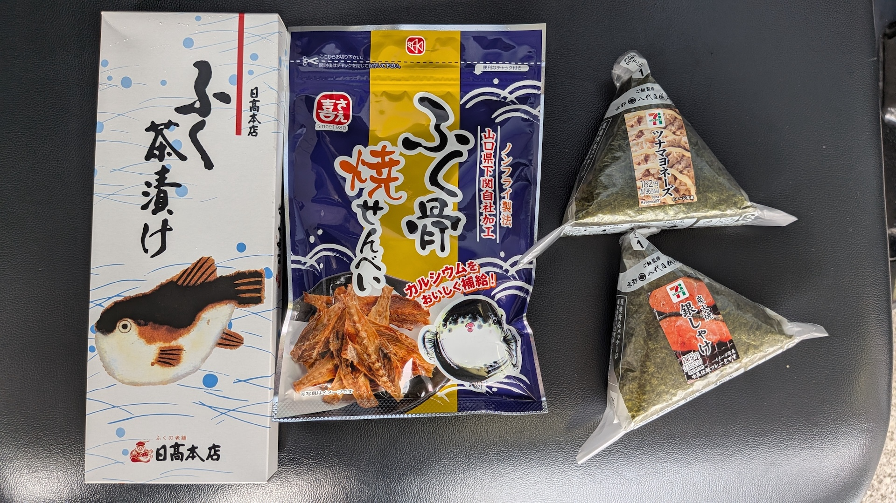

### 新幹線で無事広島に到着(9:36) {nekochan}`ho`

```{image} images/hiroshima.jpg
:width: 35%
```

## まとめ {nekochan}`work-yabai`

* 特急列車は**早めに予約**しよう
* フェリーに**WiFi**があるか調べよう
* フェリーで**寝れるか**は...対策不明

### いい**経験**になったけど、もういいかな... {nekochan}`mou-dounidemo-nare`


