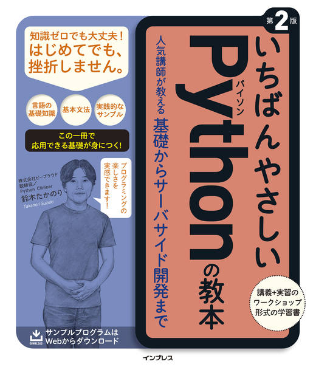
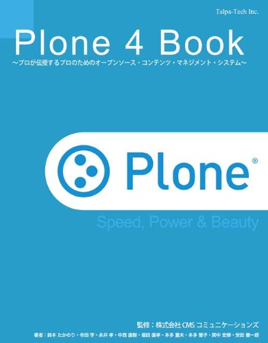
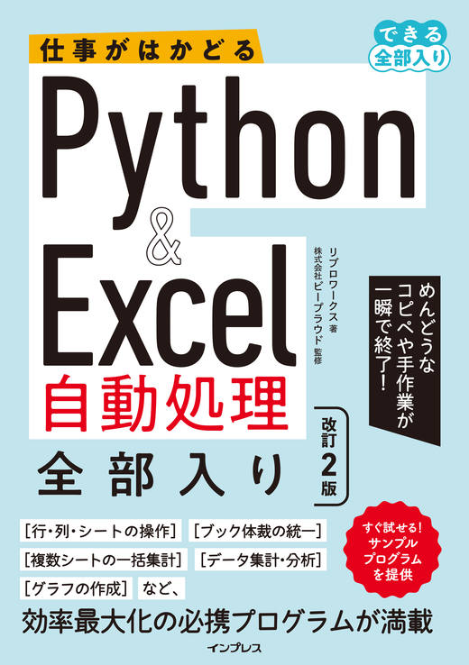

# Profile

```{button-link} https://translate.google.com/translate?sl=auto&tl=en&u=https%3A%2F%2Fslides.takanory.net%2Fprofile
:color: info
:shadow:

{material-regular}`translate` Translate to English
```

```{image} /_static/takanory.jpg
:width: 200
:alt: takanory
```

```{image} /_static/kurokuri.jpg
:width: 200
:alt: kuri-chan and kuri-chan
```

{fab}`x-twitter` [takanory](https://twitter.com/takanory) /
{fab}`github` [takanory](https://github.com/takanory/) /
{fab}`linkedin` [takanory](https://www.linkedin.com/in/takanory/) /
{fab}`untappd` [takanory](https://untappd.com/user/takanory/)

## Takanori Suzuki / 鈴木たかのり

[PyCon JP Association](https://www.pycon.jp/committee/english.html) Chair, [BeProud Inc. (株式会社ビープラウド)](https://www.beproud.jp/) Director / Python Climber.

Discovered Zope/Plone while building an internal website and ever since used Python where needed. Worked as PyCon JP staff since PyCon mini JP in January 2011 and has been the Co-Chair of PyCon JP 2024.

Founder of the [Python Bouldering Club (Pythonボルダリング部, #kabepy)](https://kabepy.connpass.com/) and organizer of [Python mini Hack-a-thon (#pyhack)](https://pyhack.connpass.com/).

Recently started to travel to rural Japan to teach at Python Boot Camps and enjoy their local craft beers. Since 2019 he has started to present at international Python conferences around the world.

His hobbies are playing the trumpet, bouldering, Lego and puzzles.

---

[一般社団法人PyCon JP Association](https://www.pycon.jp/)代表理事、[株式会社ビープラウド](https://www.beproud.jp/) 取締役 / Python Climber

部内のサイトを作るためにZope/Ploneと出会い、その後必要にかられてPythonを使い始める。PyCon JPでは2011年1月のPyCon mini JPからスタッフとして活動。PyCon JP 2024共同座長。
他の主な活動は、[Pythonボルダリング部(#kabepy)](https://kabepy.connpass.com/) 部長、[Python mini Hack-a-thon(#pyhack)](https://pyhack.connpass.com/) 主催など。

各国PyConやPython Boot Campで訪れた土地で、現地のクラフトビールを飲むことが楽しみ。
フェレットとビールとレゴが好き。趣味は吹奏楽(トランペット)とボルダリング。

## Books

* {fab}`amazon` Amazon Author page: [Amazon.co.jp: Books by Takanori Suzuki](https://www.amazon.co.jp/stores/%E9%88%B4%E6%9C%A8-%E3%81%9F%E3%81%8B%E3%81%AE%E3%82%8A/author/B00W95A036?ref=ap_rdr&isDramIntegrated=true&shoppingPortalEnabled=true)

### Authored

Cover | Title | Year| Publisher
--- | --- | --- | ---
{w=75px} | [Pythonによるあたらしいデータ分析の教科書 第3版](https://www.seshop.com/product/detail/26879) | 2025 | 翔泳社
{w=75px} | [現場のPython](https://gihyo.jp/book/2024/978-4-297-14401-2) | 2024 | 技術評論社
{w=75px} | [Pythonプロフェッショナルプログラミング 第4版](https://www.shuwasystem.co.jp/book/9784798070544.html) | 2024 | 秀和システム
{w=75px} | [いちばんやさしいPython機械学習の教本 第2版](https://book.impress.co.jp/books/1122101123) | 2023 | インプレス
{w=75px} | [Pythonによるあたらしいデータ分析の教科書 第2版](https://www.seshop.com/product/detail/25331) | 2022 | 翔泳社
{w=75px} | [ワンランク上を目指す人のためのPython実践活用ガイド](https://gihyo.jp/book/2022/978-4-297-12639-1) | 2022 | 技術評論社
{w=75px} | [Python実践レシピ](https://gihyo.jp/book/2022/978-4-297-12576-9) | 2022 | 技術評論社
{w=75px} | [いちばんやさしいPythonの教本 第2版](https://book.impress.co.jp/books/1119101162) | 2020 | インプレス
{w=75px} | [いちばんやさしいPython機械学習の教本](https://book.impress.co.jp/books/1118101072) | 2019 | インプレス
{w=75px} | [やってみよう！機械学習](https://gihyo.jp/book/2019/978-4-297-10396-5) | 2019 | 技術評論社
{w=75px} | [Pythonによるあたらしいデータ分析の教科書](https://www.seshop.com/product/detail/22028) | 2018 | 翔泳社
{w=75px} | [Pythonプロフェッショナルプログラミング 第3版](https://www.shuwasystem.co.jp/book/9784798053820.html) | 2018 | 秀和システム
{w=75px} | [Pythonエンジニア ファーストブック](https://gihyo.jp/book/2017/978-4-7741-9222-2) | 2017 | 技術評論社
{w=75px} | [いちばんやさしいPythonの教本](https://book.impress.co.jp/books/1116101151) | 2017 | インプレス
{w=75px} | [Python ライブラリ厳選レシピ](https://gihyo.jp/book/2015/978-4-7741-7707-6) | 2015 | 技術評論社
{w=75px} | [Pythonエンジニア養成読本](https://gihyo.jp/book/2015/978-4-7741-7320-7) | 2015 | 技術評論社
{w=75px} | [Pythonプロフェッショナルプログラミング 第2版](https://www.shuwasystem.co.jp/book/9784798043159.html) | 2015 | 秀和システム
{w=75px} | [Plone 4 Book](https://www.amazon.co.jp/dp/4903408027) | 2011 | Talpa-Tech
{w=75px} | [Plone完全活用ガイド](https://gihyo.jp/book/2008/978-4-7741-3501-4) | 2008 | 技術評論社

### Translated

Cover | Title | Year| Publisher
--- | --- | --- | ---
{w=75px} | [改訂新版 最短距離でゼロからしっかり学ぶ Python入門 必修編](https://gihyo.jp/book/2024/978-4-297-14528-6) | 2024 | 技術評論社
{w=75px} | [改訂新版 最短距離でゼロからしっかり学ぶ Python入門 実践編](https://gihyo.jp/book/2024/978-4-297-14526-2) | 2024 | 技術評論社
{w=75px} | [最短距離でゼロからしっかり学ぶ Python入門 必修編](https://gihyo.jp/book/2020/978-4-297-11570-8) | 2020 | 技術評論社
{w=75px} | [最短距離でゼロからしっかり学ぶ Python入門 実践編](https://gihyo.jp/book/2020/978-4-297-11572-2) | 2020 | 技術評論社

### Supervised

Cover | Title | Year| Publisher
--- | --- | --- | ---
{w=75px} | [Python&Excel自動処理 全部入り 改訂2版](https://book.impress.co.jp/books/1123101155) | 2024 | インプレス
{w=75px} | [Web Designing 2021年12月号：Python ライブラリ・フレームワークの基本](https://book.mynavi.jp/wdonline/samp/detail/id=126681) | 2021 | マイナビ出版
{w=75px} | [Pythonふりがなプログラミング スクレイピング入門](https://book.impress.co.jp/books/1120101182) | 2021 | インプレス
{w=75px} | [Pythonふりがなプログラミング 増補改訂版](https://book.impress.co.jp/books/1120101181) | 2021 | インプレス
{w=75px} | [解きながら学ぶ Pythonつみあげトレーニングブック](https://book.mynavi.jp/ec/products/detail/id=123041) | 2021 | マイナビ出版
{w=75px} | [やさしくわかるPythonの教室](https://gihyo.jp/book/2021/978-4-297-12117-4) | 2021 | 技術評論社
{w=75px} | [Python＆Excel自動処理 全部入り](https://book.impress.co.jp/books/1119101179) | 2020 | インプレス
{w=75px} | [Pythonふりがなプログラミング パターン文例80](https://book.impress.co.jp/books/1119101161) | 2020 | インプレス
{w=75px} | [Pythonふりがなプログラミング](https://book.impress.co.jp/books/1117101140) | 2018 | インプレス

## Magazines

* [WEB+DB PRESS Vol.131](https://gihyo.jp/magazine/wdpress/archive/2022/vol131):
  現場のPython【第15回】JanomeとSudachiPyによる日本語処理
* [Software Design 2017年6月号](https://gihyo.jp/magazine/SD/archive/2017/201706):
  第2特集 今すぐはじめるPython

## Writings

### [gihyo.jp](https://gihyo.jp/)

* [GitHub Actionsでデジタル証明書付きPythonパッケージをリリースする方法](https://gihyo.jp/article/2025/05/monthly-python-2505)
* [Python型ヒントの動向と新しい機能の紹介](https://gihyo.jp/article/2024/11/monthly-python-2411)
* [PyCon US 2024参加レポート](https://gihyo.jp/list/group/PyCon-US-2024%E5%8F%82%E5%8A%A0%E3%83%AC%E3%83%9D%E3%83%BC%E3%83%88#rt:/article/2024/07/pycon-us-2024)
* [Python製静的サイトジェネレーターSphinxでWebサイトを構築して公開](https://gihyo.jp/article/2024/06/monthly-python-2406)
* [Pythonの構造的パターンマッチングのさらに便利なパターン紹介](https://gihyo.jp/article/2024/01/monthly-python-2401)
* [Python作者 Guido氏インタラクティブ記念講演会レポート](https://gihyo.jp/article/2023/12/guido-talkshow)
* [PyCon Hong Kong 2023 カンファレンスレポート](https://gihyo.jp/article/2023/11/pycon-hk2023)
* [PyCon Korea 2023 カンファレンスレポート](https://gihyo.jp/article/2023/08/pycon-korea-2023)
* [Python公式ドキュメントを翻訳しよう](https://gihyo.jp/article/2023/08/monthly-python-2308)
* [PyCon US 2023 参加レポート](https://gihyo.jp/list/group/PyCon-US-2023-%E5%8F%82%E5%8A%A0%E3%83%AC%E3%83%9D%E3%83%BC%E3%83%88#rt:/article/2023/05/pycon-us2023-002)
* [WebブラウザでPythonが動作する！PyScriptの詳解](https://gihyo.jp/article/2023/04/monthly-python-2304)
* [Python 3.10から導入されたBetter error messagesの深掘り](https://gihyo.jp/article/2022/12/monthly-python-2212)
* [アイルランドで開催-EuroPython-2022レポート](https://gihyo.jp/list/group/%E3%82%A2%E3%82%A4%E3%83%AB%E3%83%A9%E3%83%B3%E3%83%89%E3%81%A7%E9%96%8B%E5%82%AC-EuroPython-2022%E3%83%AC%E3%83%9D%E3%83%BC%E3%83%88)
* [Python 3.10の新機能：構造化パターンマッチング](https://gihyo.jp/article/2022/07/monthly-python-2207)
* [人生を変えたPythonとの出会い ―「PyCon Indonesia 2019」レポート](https://gihyo.jp/news/report/2019/12/1701)
* [Zappa作者が語る"何でも作ってみよう！"―「PyCon Singapore 2019」レポート](https://gihyo.jp/news/report/2019/10/2901)
* [日本と台湾のPythonコミュニティの架け橋に ―「PyCon Taiwan 2019」レポート](https://gihyo.jp/news/report/01/pycon-tw2019)
* [データサイエンスの実践に必要な4つの柱とは？ ―「PyCon Malaysia 2019」レポート](https://gihyo.jp/news/report/2019/09/0901)
* [ヨーロッパのPythonコミュニティと交流できる3日間「EuroPython 2019」参加レポート](https://gihyo.jp/news/report/01/europython2019)
* [日本をはじめ各国のスピーカーが語るPythonのいま ―「PyCon Thailand 2019」レポート](https://gihyo.jp/news/report/2019/07/0501)
* [世界最大のPythonカンファレンス「US PyCon 2019」レポート](https://gihyo.jp/news/report/01/us-pycon2019)
* [アジアパシフィックのPyConユーザのつながりを感じた2日間「PyCon APAC 2019」レポート](https://gihyo.jp/news/report/2019/03/1201)
* [『Pythonエンジニア養成読本』読書会便り ～基礎やTipsから質疑応答の内容まで～](https://gihyo.jp/news/report/01/python-training-book-reading-club)
* Author profile: [鈴木たかのり（すずきたかのり） | gihyo.jp](https://gihyo.jp/author/%E9%88%B4%E6%9C%A8%E3%81%9F%E3%81%8B%E3%81%AE%E3%82%8A)

### [CodeZine](https://codezine.jp/)

* [「PyCon JP 2016」レポート一覧](https://codezine.jp/article/corner/659)
* [「PyCon JP 2015」レポート一覧](https://codezine.jp/article/corner/600)
* [「PyCon JP 2014」レポート一覧](https://codezine.jp/article/corner/550)
* [「PyCon Taiwan 2013」レポート一覧](https://codezine.jp/article/corner/491)
* [「PyCon JP 2012」レポート一覧](https://codezine.jp/article/corner/462)
* [「PyCon JP 2011」レポート一覧](https://codezine.jp/article/corner/430)
* Author profile: [鈴木 たかのりについて|CodeZine（コードジン）](https://codezine.jp/author/1238)

### [Think IT](https://thinkit.co.jp/)

* [第6回 Slackを独自アプリケーションで拡張する](https://thinkit.co.jp/article/5893)
* [第5回 Slackと外部アプリケーションを連携させる](https://thinkit.co.jp/article/5880)
* [第4回 Slackの管理設定](https://thinkit.co.jp/article/5879)
* [第3回 Slackをカスタマイズしてとことん使いこなす](https://thinkit.co.jp/article/5878)
* [第2回 Slackの基本的な使い方を学んで、コミュニケーションが捗る！](https://thinkit.co.jp/article/5877)
* [第1回 Slackを始めよう](https://thinkit.co.jp/article/5876)
* Author profile: [鈴木 たかのり | Think IT（シンクイット）](https://thinkit.co.jp/author/11618)

## Inteviews

* [PyCon APAC 2025 のインタビューレポート！登壇者にお話を聞いてきました - Python学習チャンネル by PyQ](https://blog.pyq.jp/entry/python_events_250410)
* [PyCon APAC 2024 参加レポート【takanory編】 - Python学習チャンネル by PyQ](https://blog.pyq.jp/entry/python_events_241113)
* [PyCon US 2024 参加レポート　イベントに参加した鈴木たかのりさんに、現地での発表や思い出についてインタビューしました - Python学習チャンネル by PyQ](https://blog.pyq.jp/entry/python_events_240605)
* [Python Kansai 参加レポート　イベントに参加した鈴木たかのりさんに、現地での発表したことや思い出をインタビューしました - Python学習チャンネル by PyQ](https://blog.pyq.jp/entry/python_events_240529)
* [PyCon Taiwan 2024 参加レポート - Python学習チャンネル by PyQ](https://blog.pyq.jp/entry/python_events_241018)
* [海外PyConのススメ - Python学習チャンネル by PyQ](https://blog.pyq.jp/entry/python_info_240403)
* [PyCon HK 2023に参加した鈴木たかのりさんに、現地での発表したことや思い出をインタビューしました - Python学習チャンネル by PyQ](https://blog.pyq.jp/entry/python_events_231121)
* [PyCon Korea 2023 に参加した鈴木たかのりさんに、現地で発表したことや思い出をインタビューしました - Python学習チャンネル by PyQ](https://blog.pyq.jp/entry/python_events_230907)
* [PyCon US 2023に参加した鈴木たかのりさんにイベントの様子をお聞きしました - Python学習チャンネル by PyQ](https://blog.pyq.jp/entry/python_events_230601)
* [EuroPython 2022 発表レポート！鈴木たかのりさんに、現地で発表したことや見どころをインタビューしました - Python学習チャンネル by PyQ](https://blog.pyq.jp/entry/python_events_220824)
* [PyCon Thailand 2019 レポートインタビュー！鈴木たかのりさんに、現地で発表したことや見所、プライベートで盛り上がったことを聞きました。 - Python学習チャンネル by PyQ](https://blog.pyq.jp/entry/python_event_20190711)
* [自分が知らないすごい人に出会いたい！ 〜 Pythonエンジニア列伝 Vol.2 鈴木たかのり氏（後編） - Python学習チャンネル by PyQ](https://blog.pyq.jp/entry/lives_of_engineer_002_2)
* [Pythonの人たちが集まって何かが生まれるといいな　〜　Pythonエンジニア列伝 Vol.2 鈴木たかのり氏（前編） - Python学習チャンネル by PyQ](https://blog.pyq.jp/entry/lives_of_engineer_002_1)
* [PyCon JP 2016開催直前！ 今年の見どころを探る― 運営メンバーのコメントを添えて | Think IT（シンクイット）](https://thinkit.co.jp/article/10646)
* [「PyCon JP 2015」がやってくる！！ 見どころ満載、楽しみ方は無限大 | Think IT（シンクイット）](https://thinkit.co.jp/story/2015/08/11/6289)
* [エンジニア的ではない『Pythonボルダリング部』の楽しみ方【対談:法林浩之×鈴木たかのり】 - エンジニアtype | 転職type](https://type.jp/et/feature/7450/)
